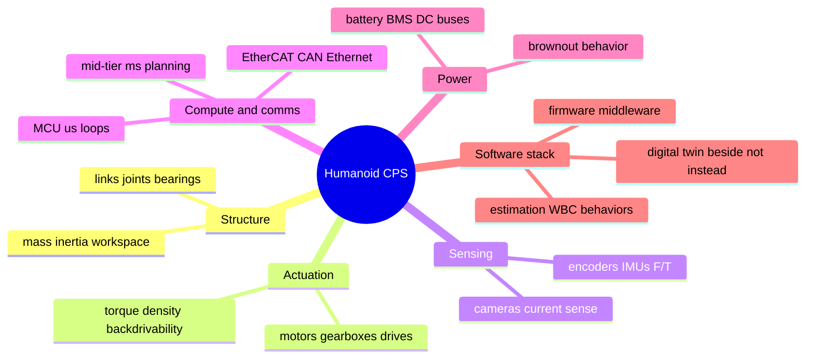
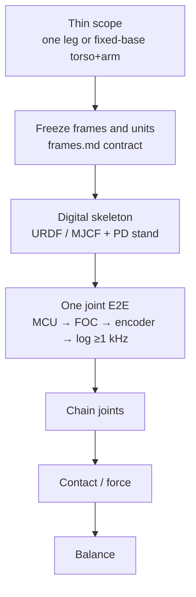
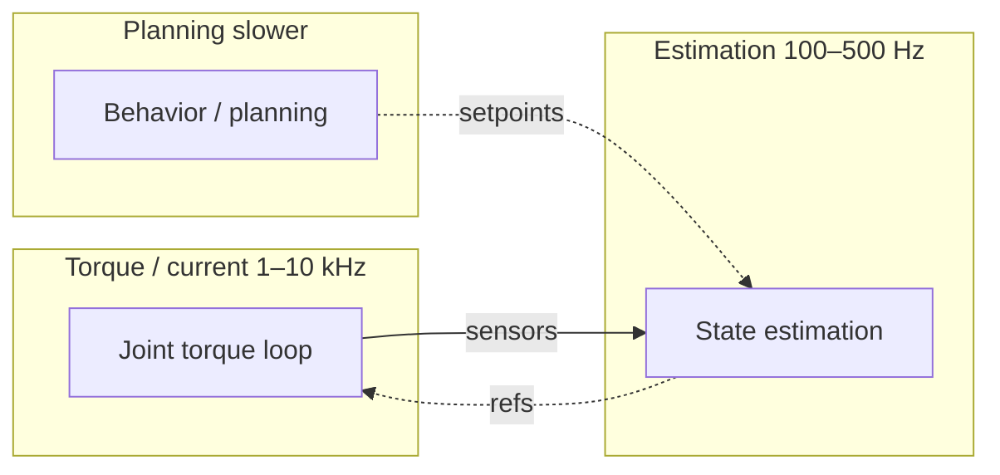

# Day 01 — Cold start: think before you buy

A humanoid is not “a robot that looks like a person.” It is a **multi-rate cyber-physical system**: motors and sensors on hard real-time loops, a body that must stay upright under gravity, and software that turns goals into joint torques. Skip that framing and you buy hardware too early.

**The only useful first question:** what closed loops must stay alive for the machine to not fall over or cook itself?

Those loops define the architecture. Everything else hangs off them.

## Six subsystems

1. **Structure** — links, joints, bearings, fasteners. Defines mass, inertia, and reachable workspace. Wrong here and every control gain fights the body.
2. **Actuation** — motors, gearboxes, drives, brakes. Torque density + backdrivability decide whether you can do force control or only position bang-bang.
3. **Sensing** — joint encoders, IMUs, force/torque, cameras, current sense. You control what you measure; everything else is open-loop hope.
4. **Compute & comms** — MCUs for µs loops, a mid-tier board for ms planning, Ethernet / CAN / EtherCAT between them. Bandwidth and determinism matter more than “AI chips.”
5. **Power** — battery chemistry, BMS, DC buses, brownout behavior. A humanoid dies when voltage sags mid-step, not when the model is “wrong.”
6. **Software stack** — boot → RTOS / firmware → middleware (ROS 2 or custom) → state estimation → whole-body control → behaviors. The digital twin / sim sits **beside** this, not instead of it.

Physical build and digital backing are the **same design**, two embodiments. Design interfaces first (joint frames, message rates, units), then implement them in metal and in code.

## Cold-start order (do not skip)

1. **Pick a scope thinner than “full humanoid.”** Day-0 target: one leg, or a torso+arm on a fixed base. Walking bipeds are a graduate course in balance; earn them after you can track a joint trajectory under load.
2. **Freeze coordinates and units.** Name every link, joint axis (right-hand rule), encoder zero, and SI units. Write them in [frames](/frames) before CAD. This is the contract between CAD, firmware, and sim.
3. **Build the digital skeleton first.** URDF / MJCF of links + joint limits + approximate inertias. If the model cannot stand in sim with PD joint control, the physical one will not either.
4. **One joint, end-to-end.** MCU → PWM / FOC → motor → encoder → current sense → logged torque / position at ≥1 kHz. That pipeline is the atom of every limb.
5. **Then chain joints, then contact, then balance.** Contact and balance are where most “AI humanoid” projects quietly fail — they never instrumented force or CoM carefully.

## Embedded mindset

The robot is a **graph of hard deadlines**.

| Loop | Typical rate |
|------|----------------|
| Joint torque / current | ~1–10 kHz |
| State estimation | ~100–500 Hz |
| Behavior planning | slower |

Never put a neural net inside a microsecond loop until you have measured jitter.

## Next

**[Day 02](/lessons/day-02-joint-foc)** — Joint-level embedded: FOC, encoder types, and why current control is the real muscle.
