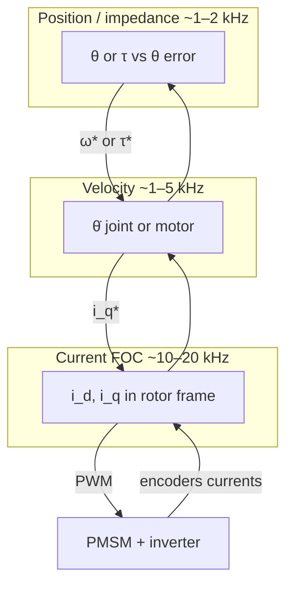
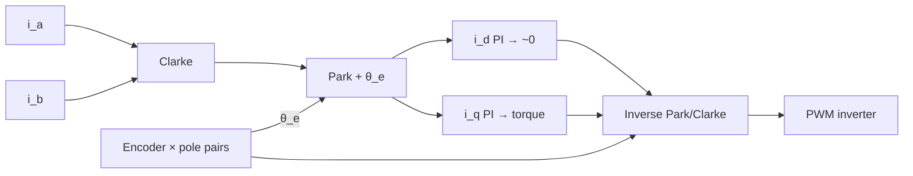
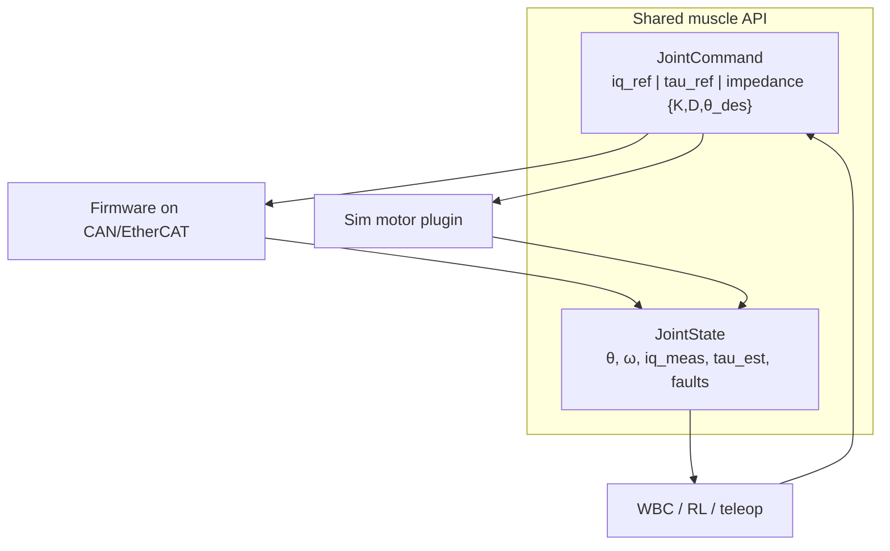
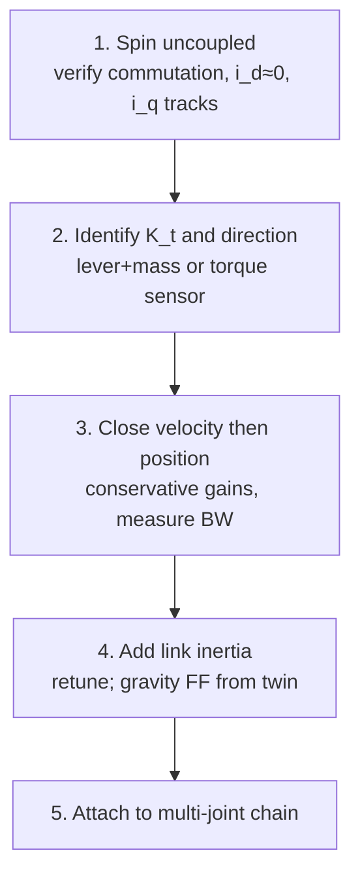

# Day 02 — Joint-level embedded: FOC, encoders, current as muscle


Day 01 left you with one rule: **one joint, end-to-end**, before you chain limbs. Today is what that joint *is* electrically and digitally. The muscle of a humanoid is not the motor casing. It is **regulated stator current**, transformed into torque through geometry you must know and measure.

If you skip this layer and jump to “impedance control” or “RL walking,” you are commanding a ghost. The physical plant only hears voltage and current.

## Mental model: three nested loops

A modern joint drive is three feedback loops nested by speed. Outer loops are only as honest as the inner ones.



| Loop | What it regulates | Typical rate | Sensor |
|------|-------------------|--------------|--------|
| Current (FOC) | $i_d$, $i_q$ in the rotor frame | 10–20 kHz | Phase current shunts / hall sensors |
| Velocity | $\dot{\theta}$ (joint or motor) | 1–5 kHz | Encoder (differentiated or observer) |
| Position / impedance | $\theta$, or $\tau$ vs $\theta$ error | 1–2 kHz | Encoder + (optional) torque sensor |

**Rule:** never close an outer loop until the inner one is flat, stable, and logged. A beautiful trajectory planner on a humming, unstable current loop is theater.

Physical build and digital twin share this same nesting. In firmware you tune PI gains on $i_q$. In sim you need an equivalent: either a first-order current lag + torque constant, or a full electrical model. If sim torque appears *instantly* when you set a command, your digital twin is lying about bandwidth.

## Why FOC (and what it actually does)

A brushless PMSM (permanent-magnet synchronous motor) does not have a single “torque wire.” Three phase voltages create a rotating magnetic field. **Field-oriented control** rotates your control frame with the rotor so that:

- $i_q$ (quadrature) produces torque (roughly $\tau \approx \frac{3}{2} p \lambda_{pm} i_q$ for a surface PMSM — $p$ pole pairs, $\lambda_{pm}$ flux linkage)
- $i_d$ (direct) is held near zero for max torque-per-amp (or set negative for field weakening at high speed)



You measure two phase currents (the third is $i_a + i_b + i_c = 0$ if the winding is balanced), transform them with a Park/Clarke transform using **electrical angle**, run PI on $i_d$ and $i_q$, inverse-transform, and PWM the inverter.

**Embedded consequences that bite humanoid builders:**

1. **Electrical angle ≠ mechanical encoder angle.** Multiply by pole pairs. Get this wrong and FOC becomes a heater that randomly produces torque.
2. **Current sense must be fast and calibrated.** Offset error in a shunt amp becomes a DC torque bias. At a knee or ankle, that bias is a constant push into the ground or into the air.
3. **PWM frequency and dead-time** matter. Dead-time distortion looks like torque ripple at low speed — exactly where a humanoid stands and shifts weight.
4. **The MCU owns this loop.** Do not stream FOC over Wi-Fi. EtherCAT / CAN-FD can carry *torque or current setpoints*; the 20 kHz loop stays on the drive.

### Physical ↔ digital pairing for FOC

| Physical | Digital twin / backing |
|----------|------------------------|
| Motor datasheet: $K_t$, pole pairs, $L_d/L_q$, resistance | Same constants in plant model; log identification runs |
| Shunt / hall current sense + ADC timing | Sample-and-hold delay in sim; noise model optional but offsets matter |
| Inverter DC bus voltage | Bus voltage as a state (brownouts change available voltage → current bandwidth) |
| FOC firmware (same gains you flash) | Mirror bandwidth: $\tau_{cmd}$ filtered by ~1/(2π·f_c) where f_c ≈ current-loop crossover |

**Exercise:** command a step in $i_q^*$, log measured $i_q$ at ≥10 kHz. Fit rise time. Put that same rise time in sim. If walking later “works in MuJoCo but not on hardware,” check here first.

## Encoders: you control what you measure

Joint control quality is dominated by **angle sensing**, not by how clever the outer controller is.

### Common choices on humanoids

| Type | Where | Strengths | Failure modes |
|------|-------|-----------|---------------|
| Magnetic absolute (on-axis / off-axis) | Joint output | Absolute on boot; compact | Soft-iron distortion; eccentricity → harmonic error |
| Optical incremental + index | Motor or joint | High resolution, low noise | Needs homing; dust/oil; cable flex |
| Dual encoder (motor + joint) | Both sides of gearbox | Estimates torque via twist; catches backlash | Two calibrations; more wiring |
| Resolver | Harsh environments | Robust | Analog front-end; lower resolution unless careful |

**Output-side absolute** is what whole-body control wants: joint angle in the URDF frame after power cycle. **Motor-side incremental** is what FOC commutation and high-bandwidth velocity want. Serious limbs often use **both** — motor encoder for FOC, joint absolute for kinematics and safety.

### Encoder zero is a contract

Day 01’s [frames](/frames) already reserved a row for encoder zero. Fill it per joint:

- Mechanical stop? Mid-range? Calibrated fixture?
- Sign: does increasing encoder count match the right-hand rule on the named joint axis?
- Gear ratio and direction between motor encoder and joint angle

Firmware, CAD, and URDF must agree on that sentence. One flipped sign and your “impedance” joint injects energy.

### Digital twin side

- Publish the **same** joint angle the controller uses (after gearing and zero), not a raw count.
- Model backlash and compliance if you have dual encoders — or at least a deadband — or sim will be stiffer than reality.
- Never differentiate raw counts without thinking: velocity estimates need filtering or an observer; naive $\Delta\theta/\Delta t$ at 1 kHz amplifies quantization into torque chatter.

## Current as muscle

Torque is what moves the body. For a well-modeled PMSM, **$i_q$ is your muscle activation**. Thinking in voltage or in “duty cycle” is thinking in open-loop hope.

Practical chain on a geared joint:

```math
\tau_{joint} \approx N \cdot \eta \cdot K_t \cdot i_q
```

where $N$ is gear ratio, $\eta$ efficiency (direction-dependent!), $K_t$ torque constant.

**Why humanoids care more than robot arms:**

- Gravity bias is always present. Standing is continuous torque, not a move-and-hold.
- Contact: when the foot hits, you want **force**, not a position bang into the floor. Force comes from current (or a torque sensor outer loop around current).
- Thermal: continuous $i_q$ heats windings. Muscle has a duty cycle. Log motor temperature or estimate $I^2R$; thermal foldback is a first-class behavior, not an afterthought.

### What to log on day-zero joint bring-up

Minimum viable instrumentation for one joint:

1. $i_q^*$, $i_q$ (command vs measured)
2. Bus voltage
3. Motor and/or joint angle
4. Estimated $\tau_{joint}$ from current × $K_t$ × $N$
5. MCU loop timing (max / jitter of the FOC tick)

If you cannot plot those five, you do not yet have a joint — you have a motor that spins.

### Physical ↔ digital: same “muscle API”



Define one interface both worlds obey:

```text
JointCommand:  iq_ref | tau_ref | (later) impedance {K, D, theta_des}
JointState:    theta, omega, iq_meas, tau_est, fault_flags
```

Firmware implements it on CAN/EtherCAT. Sim implements it as a motor plugin. Higher layers (WBC, RL policy, teleop) should not know whether the plant is metal or MuJoCo.

## Bring-up sequence (do this on the bench)



1. **Spin uncoupled.** No link mass. Verify commutation: smooth torque, no cogging from bad angle. Check $i_d \approx 0$, $i_q$ tracks steps.
2. **Identify $K_t$ and direction.** Hang a known lever + mass or use a torque sensor. Sign must match `frames.md`.
3. **Close velocity, then position** with conservative gains. Measure tracking bandwidth.
4. **Add the link inertia** (or a dummy mass). Retune. Note how gravity feedforward from the digital model helps — this is the first real payoff of the twin.
5. **Only then** attach to a multi-joint chain.

Skip steps and you will debug “walking” while a single drive is thermally folding back or losing encoder sync.

## Failure gallery (memorize these)

| Symptom | Likely layer |
|---------|----------------|
| Motor hums, no smooth torque | Electrical angle / pole pairs / encoder alignment |
| Constant drift force at “zero torque” | Current sense offset or $i_d/i_q$ bias |
| Fine at no load, oscillates under gravity | Gains / bandwidth; missing gravity FF from model |
| Works until warm | Thermal derating, resistance rise, magnet temp |
| Sim tracks; hardware lags then overshoots | Current-loop lag not in twin; or gearbox backlash |

## What to freeze this week

Update [frames](/frames) for your first joint:

- Motor type, pole pairs, gear ratio $N$, assumed $\eta$
- Encoder type(s), counts/rev, zero definition, sign
- Current loop rate and where it runs (which MCU)
- The `JointCommand` / `JointState` fields your bus will carry

Physical CAD and digital URDF both reference that row. The lesson is not “buy a better FOC chip.” It is **make current, angle, and torque the same story in copper and in code**.

## Next

**Day 03** — Sensing beyond the joint: IMU placement, contact/force, and why estimation rate is a first-class design choice.
