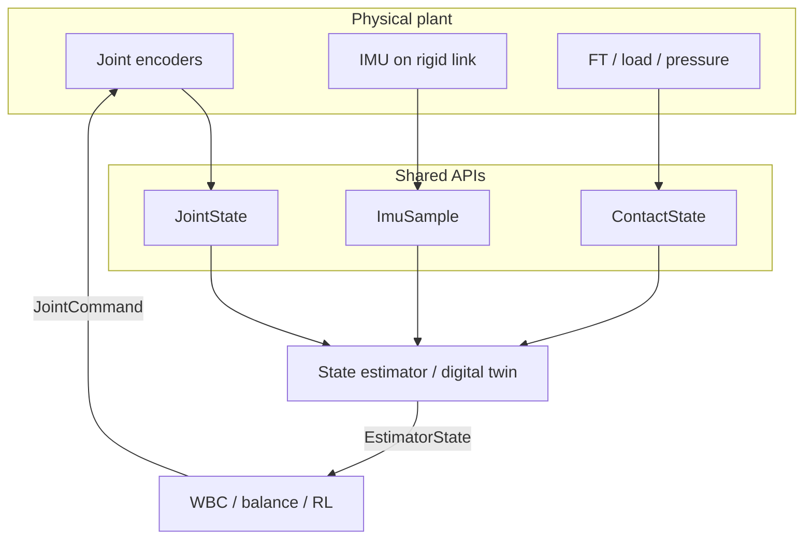
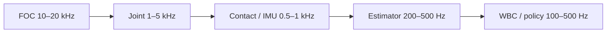
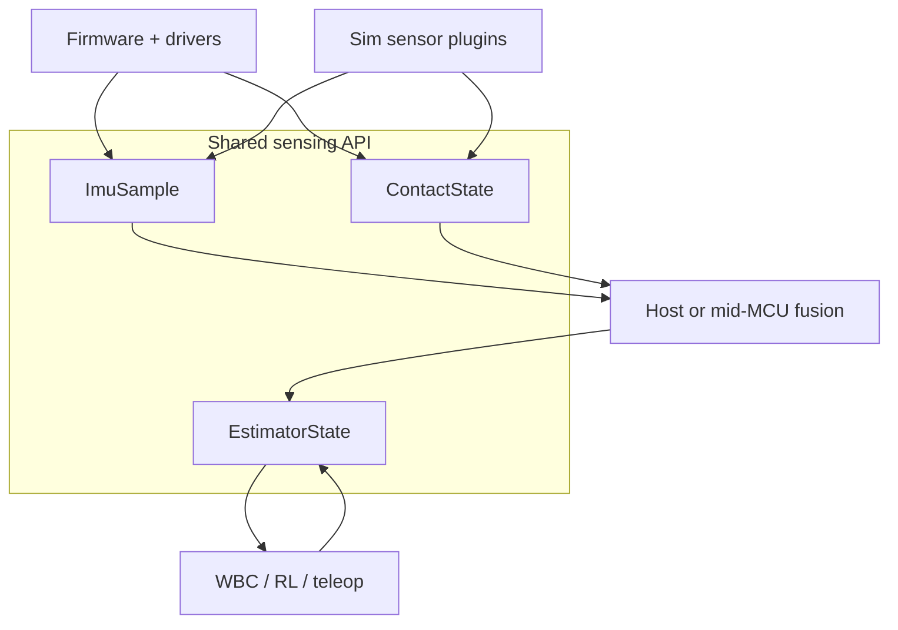
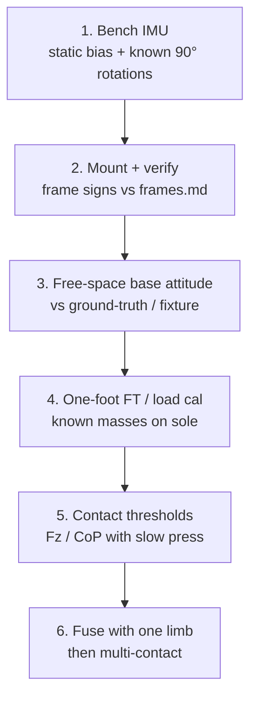

# Day 03 — Sensing beyond the joint: IMU, contact, estimation rates


[Day 02](/lessons/day-02-joint-foc) made **current** the muscle and **encoders** the joint eyes. Standing, balancing, and touching the world need two more senses: **body** (where is up, how is the base accelerating) and **contact** (is this foot loaded, and with what wrench). Without them, whole-body control is kinematics theater — you know every $\theta$, but not whether the robot is falling or whether the sole is still on the ground.

Today freezes those layers the same way Day 02 froze FOC: physical sensors and the digital twin publish the **same** samples, frames, and rates.

## Three sensing layers

Think in layers, not in a pile of ROS topics.

| Layer | What you measure | Typical rate | Job |
|-------|------------------|--------------|-----|
| Joint (Day 02) | $\theta$, $\omega$, $i_q$ | 1–5 kHz (FOC faster) | Proprioception / muscle |
| Body | specific force + angular rate → orientation / base twist | 200–1000 Hz | Gravity, balance, inertial |
| Contact | $F$, $\tau$ or CoP / pressure | 0.5–2 kHz | Support polygon, impact, compliance |



**Rule:** outer balance and contact policies are only as honest as the slowest, noisiest, most delayed sensor they treat as truth. An estimator at 400 Hz fed by a 50 Hz IMU with unknown transport lag is a fiction generator.

Physical build and digital twin share this graph. In firmware you DMA the IMU and FT. In sim you subscribe to the same `ImuSample` / `ContactState` structs from a plugin — not from a secret MuJoCo-only path the real robot will never see.

## IMU placement is a design choice, not a checkbox

An IMU does **not** hand you “orientation.” It hands you:

- **Specific force** (accelerometer): $\mathbf{a}_{\text{meas}} \approx R^\top(\mathbf{a}_{\text{inertial}} - \mathbf{g}) + \mathbf{b}_a + \nu$
- **Angular rate** (gyro): $\boldsymbol{\omega}_{\text{meas}} \approx \boldsymbol{\omega} + \mathbf{b}_g + \nu$

Orientation (AHRS / EKF / complementary filter) is an **estimate**. Indoors, magnetometers lie near steel and motors — prefer gravity+gyro for roll/pitch; treat yaw as weakly observable until you have vision, a good map, or an external reference.

### Mount frame vs body frame

Name the IMU frame in [frames](/frames) the same way you named joint zeros:

- Which link? Pelvis / torso is the usual humanoid choice for “base” attitude. Shin IMUs are useful for contact and swing, but they are not your world attitude by themselves.
- Rigid vs soft mount: elastomer kills vibration and **adds** phase lag. For control, rigid + software filter often beats soft foam you cannot model.
- Lever arm to CoM / contact points: linear acceleration at the IMU is not CoM acceleration. If the twin assumes they are the same, balance residuals will not match hardware.

### Rates and delay

| Choice | Typical | Failure if wrong |
|--------|---------|------------------|
| Raw IMU stream | 200–1000 Hz | Aliasing of vibration into “tilt” |
| Orientation filter | 100–500 Hz | Soft lag → balance overshoots |
| Transport (CAN / SPI / USB) | declare max age | Estimator uses stale $\mathbf{g}$ direction |

**Physical ↔ digital pairing for IMU**

| Physical | Digital twin / backing |
|----------|------------------------|
| Mount link + extrinsic $T_{\text{imu}}^{\text{link}}$ | Same transform in URDF / MJCF / pinocchio |
| Full-scale, bias, temp coeffs | Bias states or logged calibration table |
| Sample timestamp (MCU clock) | Same timebase as joints/contact, or explicit offset |
| Filter cutoff / AHRS gains | Identical filter in twin **or** twin publishes raw and host filters once |

**Exercise:** hold the robot (or a rigid fixture with the same IMU) still for 30 s. Log mean $\mathbf{a}$ and $\boldsymbol{\omega}$. Rotate 90° about a known axis. Confirm the gravity vector in the named body frame matches [frames](/frames). If sign or axis swap is wrong here, every later “upright” controller will fight you.

## Contact and force: “on ground” is an estimate

A GPIO “foot switch” is a training wheel. Real contact is a **wrench** (or a pressure field) evolving through impact, slip, and soft tissue / rubber.

### Sensor options on humanoids

| Approach | Strengths | Costs / failure modes |
|----------|-----------|------------------------|
| 6-axis FT at ankle / wrist | Full wrench; clean for CoP | Mass, cable, overload on impact; calibration drift |
| Sole pressure / taxels | Spatial CoP, local slip cues | Wiring, wear, nonlinear rubber |
| Current-based $\tau_{\text{est}}$ + kinematics | Free with Day 02 muscle API | Model error, friction, no true external Fz alone |
| Combined (FT + current + threshold) | Redundant; safe defaults | Needs fusion policy and quality flags |

Contact events are **sparse but high-stakes**. Sample fast enough to catch heel-strike transitions — often 0.5–2 kHz on the wrench — even if your WBC only runs at 200 Hz. Downsample with a defined anti-alias filter; do not peek at a random latest sample from a slow USB poll.

Soft contact from Day 02’s impedance / $i_q$ muscle meets measured $F_z$ (or CoP) as a **guardrail**: torque commands that would drive $F_z$ through the floor are lies you can catch.

### Digital twin side

Penalty, soft-constraint, or complementarity contacts are all fine — **if** they expose the same `ContactState` the firmware publishes:

- `in_contact` with a documented threshold (not a silent engine flag)
- wrench or $F_z$ + CoP in a **named contact frame** from [frames](/frames)
- a quality / confidence field when the model is soft or the FT is near saturation

If sim reports Boolean contacts from the physics engine while hardware reports filtered $F_z$, your RL policy will learn the wrong event timing.

## Estimation rate is first-class

Day 01 already said the machine is multi-rate. Sensing makes that concrete.



**Never upsample lies.** Repeating a 100 Hz IMU sample into a 1 kHz control tick without declaring age makes the controller think it has fresh inertial data. Prefer:

1. Sensor timestamp + max-age check
2. Hold last sample with `stale=true`, or propagate with a process model
3. One estimator that owns fusion; many consumers read `EstimatorState`

Clocks matter. CAN, EtherCAT DC, and free-running MCU timers drift. Freeze a timebase story in [frames](/frames) / bus docs: who is master, how joints and IMU share $t$, what happens on dropout.

### Minimum log set for Day-03 bring-up

1. Raw IMU: $\mathbf{a}$, $\boldsymbol{\omega}$, $t$
2. Filter output: quat or RPY + bias estimates
3. Per-foot: $F_z$ (or full wrench), `in_contact`, CoP if available
4. Joint $\theta$ (same as Day 02)
5. Estimator latency (in → out) and packet age

If you cannot plot those on one time axis, you do not yet have a base state — you have disconnected sensors.

## Shared APIs: firmware and twin obey the same structs

Mirror Day 02’s `JointCommand` / `JointState` pattern:

```text
ImuSample:
  t, a_lin_body[3], omega_body[3], quat_wxyz[4]? , temp, faults, age_ms

ContactState:
  t, frame_id, wrench[6] | (Fz, cop_x, cop_y), in_contact, quality, faults

EstimatorState:
  t, base_pose, base_twist, contact_set[], cov_or_confidence, faults
```

Higher layers (WBC, teleop, RL) should not know whether `ImuSample` came from SPI or from a MuJoCo sensor plugin.



## Bring-up sequence (do this before “balance”)



1. **Bench the IMU** unmounted: bias, noise, axis map.
2. **Mount** and re-check signs against [frames](/frames).
3. **Free-space** attitude vs a fixture or motion-capture snippet — not vs hope.
4. **Calibrate contact** with known masses / a calibrated load cell.
5. **Threshold** `in_contact` on slow presses and on light taps (impact path).
6. **Only then** close a balance or multi-contact loop on hardware that matches the twin’s API.

Skip ahead and you will debug “walking” while the estimator is integrating a flipped accel axis or a contact flag that never clears.

## Failure gallery

| Symptom | Likely layer |
|---------|----------------|
| Robot “leans” constantly in software while standing level | IMU axis / mount extrinsic / gravity sign |
| Balance OK until motors spin up | Magnetic yaw or vibration coupling into accel |
| Heel-strike always late in logs | Contact rate too low, USB poll, or sim Boolean vs Fz threshold mismatch |
| Works in twin, hardware tips | Estimator delay not in twin; or FT saturation clipped silently |
| CoP chatters at stance | Unfiltered pressure / FT; rubber modes; missing low-pass before WBC |
| Joints fine, base pose drifts in yaw | Expected without mag/vision — do not trust yaw for closed-loop heading yet |

## What to freeze this week

Extend [frames](/frames):

- IMU mount link, extrinsic, units ($m/s^2$, $rad/s$), target rate, who timestamps
- Contact frame(s) per foot/hand; wrench units; `in_contact` threshold policy
- Estimator output rate and max sensor age
- The `ImuSample` / `ContactState` / `EstimatorState` fields your bus and sim will carry

Also fill the message-rate table already on that page: state estimation stays 100–500 Hz unless you have measured jitter and delay that justify otherwise.

The lesson is not “buy a better IMU.” It is **make body and contact the same story in silicon and in the twin**, at rates you can defend.

## Next

**Day 04** — Bus topology and time sync: CAN-FD / EtherCAT, who owns the clock, and how JointState + ImuSample share one timeline without silent lag.
