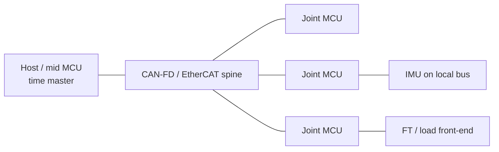
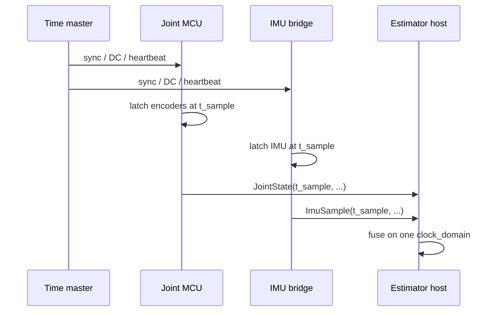
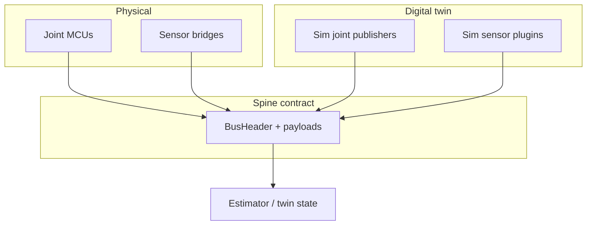
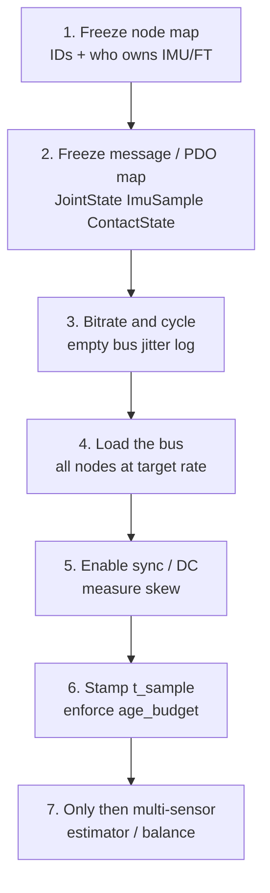

# Day 04 — Bus topology & time sync: who owns the clock


[Day 02](/lessons/day-02-joint-foc) froze `JointState` / `JointCommand`. [Day 03](/lessons/day-03-sensing-beyond-joint) added `ImuSample`, `ContactState`, and `EstimatorState`. Those structs are **theater** if joints and the IMU are stamped on different clocks, or if “latest packet” quietly replaces sample time.

Today freezes the **wire** and the **timeline**: which bus topology you run, who owns the master clock, and how the physical plant and the digital twin share one timebase without silent lag.

## The bus is a control surface

Bandwidth is the brochure number. What balance and contact actually need:

| Property | Why it matters |
|----------|----------------|
| Cycle / jitter | Estimator and WBC assume a period; jitter becomes phase noise in fusion |
| Max age | Stale $F_z$ or $\boldsymbol{\omega}$ is worse than a dropped frame you detect |
| Ordering | Joint vs IMU vs contact must be mergeable on one timeline |
| Fault visibility | Bus-off, missed sync, CRC — publish them, don’t swallow |

A 1 Mb/s bus with known 200 µs jitter and stamped samples beats a “fast” USB poll that delivers whatever arrived last with no age field.

**Rule:** higher layers consume **sample time in a named clock domain**, never “the freshest buffer.” If you cannot defend age and domain, you cannot defend multi-rate fusion.

Physical firmware and the twin publish the same message map. In sim you may inject ideal time — but then you must **document the lie** and add the measured delay budget before you claim transfer.

## Topology: pick a spine, then hang limbs

Humanoids are graphs of nodes (joint MCUs, IMU bridges, FT front-ends, host / mid MCU). Three common spines:

| Spine | Strengths | Costs / traps |
|-------|-----------|---------------|
| **CAN / CAN-FD** | Multi-drop, cheap, many joint nodes; FD helps payload | Arbitration jitter under load; need a clear ID / rate plan |
| **EtherCAT** | Cyclic determinism, distributed clocks (DC), high PDO rates | Topology/cabling discipline; tooling; DC setup is not optional |
| **Hybrid** | EtherCAT spine + CAN/SPI on a limb board; IMU local to a joint MCU | Two clock domains unless you bridge time carefully |



**Physical ↔ digital pairing for topology**

| Physical | Digital twin / backing |
|----------|------------------------|
| Node IDs / station aliases | Same IDs in message map and URDF-adjacent config |
| Bitrate / cycle time ($T_c$) | Twin step or bus model uses $T_c$ (or documents ideal) |
| Who bridges IMU/FT | Same attachment: “IMU via joint 2 node,” not a magic host topic |
| Redundancy / ring break | Fault flags the twin can inject for policy tests |

**Exercise:** draw your real wiring once. Count hops from IMU to estimator. If the path is “SPI → joint MCU → CAN → USB gadget → ROS → Python,” write the **budgeted age** for that path before you tune balance gains.

## Time sync: sample ≠ transmit ≠ receive

Three times show up in every packet path:

1. **$t_{\text{sample}}$** — when the ADC / encoder latch happened (what control wants)
2. **$t_{\text{tx}}$** — when the node put the frame on the wire (optional)
3. **$t_{\text{rx}}$** — when the host saw it (easy to log, dangerous to treat as truth)

If nodes free-run, $t_{\text{rx}}$ differences include transport **and** clock drift. Estimators that subtract “IMU time” from “joint time” using receive stamps invent phase.

### Who owns the clock

Pick **one** master clock domain and name it in [frames](/frames) (e.g. `host_mono`, `ec_dc`, `mcu0_tim2`).

| Mechanism | Idea | Use when |
|-----------|------|----------|
| EtherCAT DC | Slaves align to a distributed clock; latch near SYNC | EtherCAT spine; you need sub-cycle alignment |
| Sync / heartbeat frame | Master broadcasts time or a pulse; slaves discipline local timers | CAN-FD with a clear master |
| Host-stamped + max age | No shared sync; host records $t_{\text{rx}}$ and enforces age budgets | Early bring-up only — graduate out before multi-contact |
| Explicit offset table | Rare offline measure of fixed delays | Static pipelines you cannot retime |



**Do not** mix “IMU on USB wall time” with “joints on MCU tick” and call it fused. Convert into one domain or keep separate estimators until you can.

## Shared wire header (extend Day 02 / 03 APIs)

Mirror the muscle and sensing APIs with an explicit header every cyclic sample carries:

```text
BusHeader:
  node_id, seq
  t_sample          # in clock_domain
  t_tx?             # optional
  clock_domain      # e.g. "ec_dc" | "host_mono"
  age_budget_ms     # contract: drop/flag if exceeded
  faults            # sync_lost, bus_off, crc, seq_gap, ...

JointState  ⊇ BusHeader
ImuSample   ⊇ BusHeader
ContactState ⊇ BusHeader
```

Higher layers (WBC, RL, teleop) should not care whether the frame arrived on EtherCAT PDO or CAN-FD — only that `t_sample` and `clock_domain` are honest.



If the twin publishes perfect `JointState` at step $k$ and hardware delivers the same fields 3 ms late with jitter, policies trained in the twin will hate the real bus. Either model the age budget in sim or keep a **bus replay** layer that both sides can feed.

## Rates that fit a humanoid spine

Illustrative starting points (measure yours; do not worship the table):

| Stream | Typical cyclic rate | Notes |
|--------|---------------------|-------|
| FOC current (local) | 10–20 kHz | Stays **on** the joint MCU — not on the spine |
| JointState on spine | 1–5 kHz | Position/velocity/$i_q$ for mid-tier |
| ImuSample | 200–1000 Hz | Often local SPI → joint node → spine |
| ContactState | 0.5–2 kHz | Impact path needs the high end |
| Estimator in | matches slowest honest input | Age flags beat interpolated fiction |

Spine cycle $T_c$ should be an integer multiple story: e.g. EtherCAT 1 kHz with local FOC at 20 kHz, or CAN-FD joint frames at 2 kHz with IMU every other cycle — **written down**, not accidental.

## Bring-up sequence (before you trust fusion)



1. **Node map** — every MCU and sensor bridge named; matches wiring and [frames](/frames).
2. **Message map** — IDs/PDOs for Day 02/03 structs; no anonymous “debug CAN.”
3. **Empty-bus jitter** — master cycle alone; log period histogram.
4. **Loaded bus** — all nodes at target rate; watch arbitration stalls / lost frames.
5. **Sync on** — DC or heartbeat; measure skew between nodes (scope or hardware timestamp).
6. **Contracts** — `t_sample`, `clock_domain`, `age_budget_ms`, fault bits live in CI logs.
7. **Then** close estimator / balance loops that consume multiple sensors.

Skip to step 7 and you will debug “IMU lag” for a week when the real bug is an unsynced free-running node.

## Failure gallery

| Symptom | Likely bus / time cause |
|---------|-------------------------|
| Balance OK in twin, tips on hardware | Twin used ideal time; hardware age never modeled |
| CoP / IMU events always “late” in plots | Using $t_{\text{rx}}$ as $t_{\text{sample}}$; USB or non-RT bridge |
| Joints smooth, attitude chatters after motors spin | CAN load / priority; IMU frames starved under arbitration |
| Seq gaps only on one node | Bad termination, stub length, or that node’s TX queue |
| Works until EtherCAT cable nudge | Ring/line topology break; missing link-down fault handling |
| Estimator diverges after hours | Clock drift between domains; no sync discipline |
| “Latest” joint + old IMU looks fine until impact | Age budget not enforced; impact needs aligned stamps |

## What to freeze this week

Extend [frames](/frames) (and your bus config repo) with:

- Spine choice: CAN-FD / EtherCAT / hybrid — and why
- Node ID map; which node bridges each IMU / FT
- Named `clock_domain` and who is time master
- Cycle time $T_c$, per-stream rates, and `age_budget_ms` per message class
- `BusHeader` fields your firmware **and** sim will carry
- Fault bits that force a safe torque policy (bus-off ≠ “hold last $i_q$ forever”)

The lesson is not “buy EtherCAT because humanoids are fancy.” It is **make the wire and the clock the same story in silicon and in the twin**, so Day 03’s sensing APIs stay honest under load.

## Next

**Day 05** — Power domain and BMS: brownout under peak torque, DC bus sag on the same spine, and how voltage faults must cut torque before the estimator invents a new reality.
