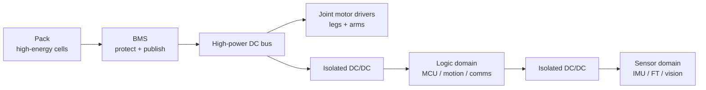
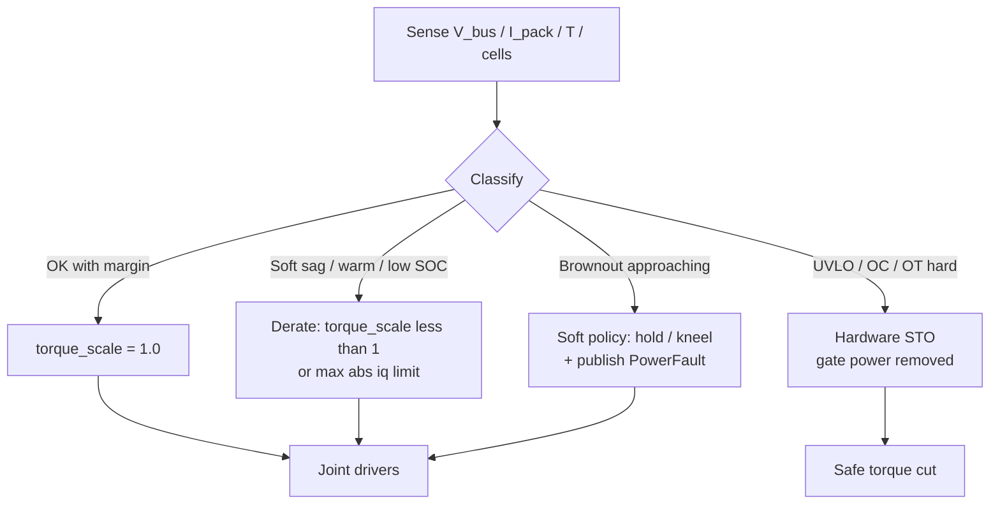
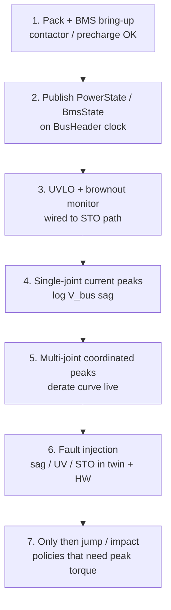
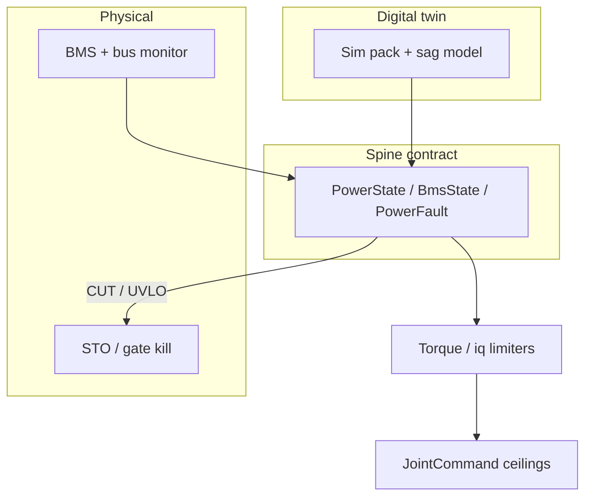

# Day 05 — Power domain & BMS: brownout, bus sag, safe torque


[Day 02](/lessons/day-02-joint-foc) treated $i_q$ as muscle — the current that makes torque. [Day 04](/lessons/day-04-bus-time-sync) froze `BusHeader`: `t_sample`, `clock_domain`, `age_budget_ms`, and fault bits that force a safe torque policy. None of that survives a silent voltage collapse.

Today freezes the **power domain**: pack → BMS → high-power DC bus → actuators on the raw rail, logic and sensors behind isolation — and how brownout / bus sag must **derate or cut torque** before the estimator invents a new reality.

## Power is a control surface

Peak torque without bus headroom is not “strong.” It is a race between the legs and the logic rails.

| Failure mode | What actually happens |
|--------------|----------------------|
| **Bus sag** | Simultaneous hip/knee peaks drop $V_{\text{bus}}$; FOC still commands $i_q$ but voltage headroom for the inverter vanishes |
| **Soft brownout** | Logic / MCU rails dip; clocks glitch, ADCs lie, comms drop — often **before** you notice torque loss |
| **Silent $i_q$ collapse** | Current loop saturates or PWM duty hits the rail; commanded torque ≠ delivered; twin still thinks the joint obeyed |
| **Hard UVLO cut** | Undervoltage lockout trips gate power — safer than a half-alive MCU, worse if it is your first and only policy |

**Rule:** higher layers consume **usable power state** the same way they consume sample age. If you cannot defend bus voltage, SOC headroom, and a torque scale, you cannot defend multi-joint peaks.

Physical firmware and the twin publish the same power messages. In sim you may inject ideal infinite bus — but then you must **document the lie** and add a sag / derate model before you claim transfer of jump or impact policies.

## Domains: pack, bus, logic, actuators, sensors

Humanoid power is not one rail with pretty stickers. Separate domains, sequence them, isolate what must stay clean.



| Domain | What lives there | Isolation / notes |
|--------|------------------|-------------------|
| **Pack** | Cells, contactor / precharge, pack fuse | Energy source; never assume “full” means peak-capable |
| **High-power DC bus** | Direct pack (or pack-converted) voltage to drivers | Actuators ride this rail; sag shows up here first |
| **Actuator / driver** | Inverters, gate drive, STO / torque-cut path | Hardware interlock must remove gate power, not “ask nicely” |
| **Logic** | MCUs, motion, communications, UI | Galvanically isolated DC/DC; clean 5 V / 3.3 V |
| **Sensors** | IMUs, encoders, FT, vision / LiDAR | Often further isolated / filtered; noise here poisons Day 03 fusion |

**Physical ↔ digital pairing for domains**

| Physical | Digital twin / backing |
|----------|------------------------|
| Pack capacity, series count, max continuous / peak current | Twin energy model + peak current limits |
| Bus capacitance, cable inductance, sag under N-leg peaks | Optional bus dynamics or lookup derate curve |
| Isolated DC/DC rails and UVLO thresholds | Publish `PowerState` / faults the same as hardware |
| STO / safe-torque-cut wiring | Twin must honor `torque_scale` / hard cut — not ignore faults |

**Exercise:** sketch your real pack → bus → limb power tree once. Mark which rails brown out first under a jump. If logic shares a noisy path with drivers, fix that before you tune balance gains.

## BMS: protect, publish, trip vs degrade

A BMS that only opens a contactor is a fuse with a microcontroller. Useful humanoid BMS work is three jobs:

1. **Protect** — OV / UV / OC / OT (and often cell imbalance); hardware paths beat “software will notice.”
2. **Publish usable state** — SOC, SOH, pack / cell voltages, current, temperature, fault bits — stamped like Day 04 samples.
3. **Trip vs degrade** — derate available torque **before** hard cut whenever physics allows; reserve hard cut for irreversible risk.



| Mode | Intent | Example (illustrative) |
|------|--------|------------------------|
| Full | Headroom OK | $V_{\text{bus}}$ above soft floor; SOC and $T$ in band |
| Derate | Stay upright with less muscle | Scale max $\lvert i_q \rvert$ as $V_{\text{bus}}$ approaches soft limit |
| Soft cut / limp | Preserve logic and structure | Stop peak commands; controlled kneel / freeze posture |
| Hard STO | Protect pack / silicon / humans | UVLO, hard OC, thermal runaway path — gate drive off |

Illustrative numbers only — measure your pack and drivers:

| Region | Illustrative $V_{\text{bus}}$ story (e.g. ~48 V class) | Policy sketch |
|--------|------------------------------------------------------|---------------|
| Nominal | Near pack OCV under light load | Full torque envelope |
| Soft sag | Brief dip under simultaneous leg peaks | Temporary derate; log age of sag |
| Soft UV | Approaching logic / driver comfort floor | Aggressive derate + fault bit |
| UVLO | Hardware lockout | STO — do not “retry FOC” in software alone |

Label every threshold **illustrative** in docs and configs until you have your own characterization.

## Brownout vs UVLO vs soft sag under leg peaks

Three different animals; treat them differently.

| Term | Meaning | Typical response |
|------|---------|------------------|
| **Soft sag** | Transient $V_{\text{bus}}$ dip from $I \cdot R$ + inductance under peak torque (jump, catch, impact) | Expect it; size bus caps / cable; derate peaks; do not panic-trip if within budget |
| **Brownout** | Rails (especially logic) leave the guaranteed operating region — weird MCU / ADC / PHY behavior | Detect early on the **bus monitor**; cut torque **before** logic lies |
| **UVLO** | Undervoltage lockout — chip or board hardware removes operation below a hard floor | Last line; wire it to STO / gate-power kill |

**Day 02 link:** when $V_{\text{bus}}$ sags, the inverter cannot realize the voltage vector FOC wants. Commanded $i_q$ and delivered torque diverge. The twin that assumes infinite bus will train policies that demand impossible simultaneous peaks.

**Day 04 link:** power faults ride the same honesty rules as bus faults — publish them with `t_sample` and age; never “hold last $i_q$ forever” after `PowerFault`.



## Shared power API (extend Day 04 BusHeader)

Mirror muscle and sensing: every cyclic power sample carries the wire header, then usable state.

```text
BusHeader:
  node_id, seq
  t_sample, clock_domain, age_budget_ms
  faults            # include power bits or parallel PowerFault

BmsState ⊇ BusHeader:
  v_pack, v_cell_min, v_cell_max
  i_pack
  soc, soh?         # publish what you trust
  t_pack_max
  bal_active?
  protect_flags     # OV UV OC OT imbalance ...

PowerState ⊇ BusHeader:
  v_bus
  i_bus?            # if measured on the rail
  torque_scale      # 0..1 — multiply |iq| / torque commands
  max_iq_abs?       # optional absolute ceiling (A)
  domain_ok         # logic / sensor rails healthy
  mode              # FULL | DERATE | LIMP | STO

PowerFault ⊇ BusHeader:
  kind              # SAG | BROWNOUT | UVLO | OC | OT | CONTACTOR | STO
  severity          # WARN | DERATE | CUT
  v_bus_at_fault?
```

Higher layers (WBC, RL, teleop) should not invent their own “battery percentage UI.” They consume `torque_scale` / `max_iq_abs` and treat `PowerFault` like `bus_off`: **policy must change**, not hope.



If the twin publishes `torque_scale = 1` forever and hardware sags to 0.4 under a jump, policies will hate the real pack. Either model sag / derate in sim or keep a **power replay** layer both sides can feed.

## Bring-up sequence (before multi-joint peak torque)

1. **Pack + BMS** — contactor / precharge sequence documented; protect flags visible.
2. **Publish contracts** — `BmsState` / `PowerState` on the same `clock_domain` as Day 04; age budgets set.
3. **STO path** — brownout / UVLO monitor → hardware torque cut verified with a bench load (gate power actually dies).
4. **Single-joint peaks** — log $V_{\text{bus}}$ vs $i_q$; learn soft-sag budget on **one** limb.
5. **Multi-joint peaks** — coordinated leg currents; freeze a derate curve (`torque_scale` vs $V_{\text{bus}}$ / SOC).
6. **Fault injection** — twin and hardware: force sag, WARN, DERATE, STO; confirm policy does not “hold last torque.”
7. **Then** enable jump / impact / high-CoM maneuvers that need simultaneous peaks.

Skip to step 7 and you will debug “estimator diverged on landing” when the real bug was logic brownout or silent $i_q$ collapse.

## Failure gallery

| Symptom | Likely power cause |
|---------|-------------------|
| Jump OK in twin, collapses on hardware | Twin infinite bus; no `torque_scale` / sag model |
| Joints “weak” only when all legs peak | Soft sag; voltage headroom gone; FOC saturates |
| Random MCU resets at impact | Brownout on shared / poorly isolated logic rail |
| STO never fires, FETs smoke | UVLO / OC not wired to gate-power kill — software-only “safe” |
| Contactor opens mid-walk | Hard UV / OC with no prior derate; thresholds too tight or sensing wrong |
| SOC UI fine, robot dies under load | SOC ≠ power capability; missing current / sag headroom in `PowerState` |
| Estimator diverges when bus dips | ADC / IMU rail noise or MCU glitch; power fault not fused into policy |
| Teleop still commands full $i_q$ after WARN | Higher layer ignores `torque_scale` / `PowerFault` |

## What to freeze this week

Extend [frames](/frames) (and your power config) with:

- Pack class (nominal voltage, series count), bus architecture, isolation boundaries
- Soft-sag / soft-UV / UVLO thresholds — labeled measured vs illustrative
- `BmsState`, `PowerState`, `PowerFault` fields firmware **and** sim will carry
- `torque_scale` / `max_iq_abs` contract consumed by Day 02 joint commands
- STO / safe-torque-cut path: what removes gate drive, who may clear it
- Bring-up rule: no multi-joint peak maneuvers until steps 1–6 above are green

The lesson is not “buy a fancier BMS because humanoids are scary.” It is **make voltage and torque limits the same story in silicon and in the twin**, so Day 02’s muscle and Day 04’s fault bits stay honest when all six legs ask for current at once.

## Next

**Day 06** — Estimation deep-dive: contact-rich balance, fusing JointState / ImuSample / ContactState on one clock — and respecting `PowerState` so a sag does not look like a new dynamics model.
