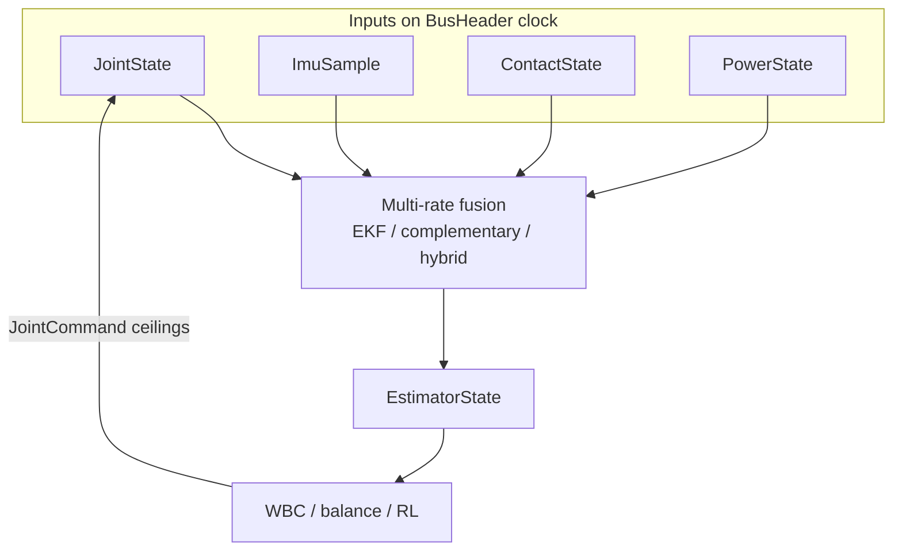
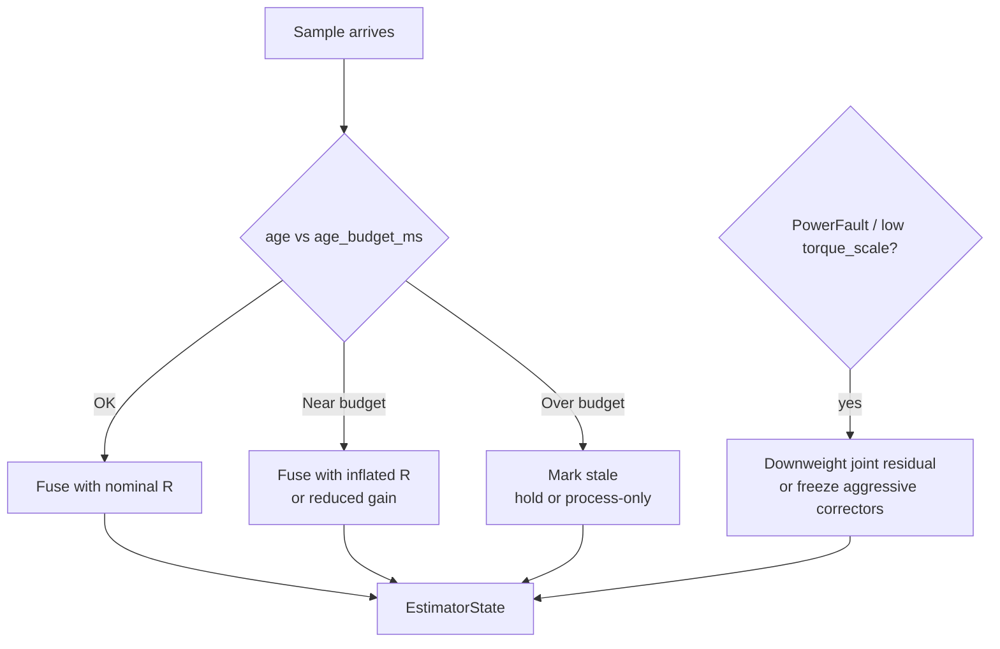
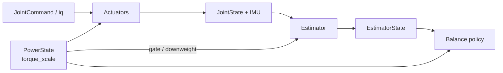
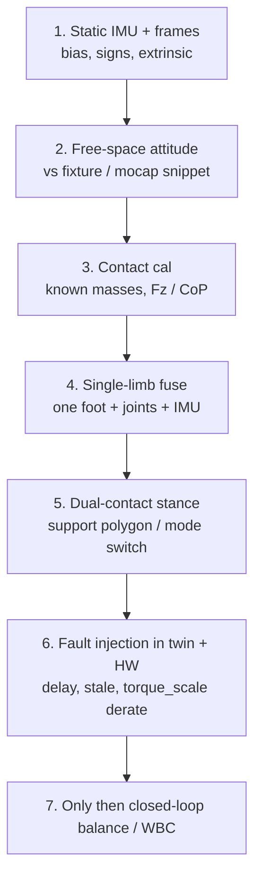

# Day 06 — Estimation deep-dive: contact-rich balance & multi-rate fusion


[Day 03](/lessons/day-03-sensing-beyond-joint) published `ImuSample`, `ContactState`, and a thin `EstimatorState`. [Day 04](/lessons/day-04-bus-time-sync) froze the shared clock and age budgets. [Day 05](/lessons/day-05-power-bms) added `PowerState` / `torque_scale` so muscle commands stay honest under sag.

Today owns the **fusion** those pieces were waiting for: how JointState, IMU, contact, and power become one balance-ready base state — without treating a brownout as a new dynamics model.

## Balance needs estimates, not sensor piles

Standing and contact-rich motion ask four questions every tick. Raw topics do not answer them.

| Question | What you need | Not enough alone |
|----------|---------------|------------------|
| Where is up / how is the base tipping? | Attitude (at least roll/pitch) + angular rate | A single accel sample, or yaw from a noisy mag |
| Where is the mass going? | Base / CoM-related twist (and often a CoM proxy) | Joint $\theta$ without a kinematic model + IMU |
| What is supporting me? | Contact set, wrench or $F_z$ + CoP, quality | Boolean “foot switch” with no threshold story |
| Can I trust this enough to push? | Confidence / faults / ages — including power | Holding last IMU forever after a dropout |

**Measured vs estimated.** Gyro rate is measured. Orientation is estimated. `in_contact` from an $F_z$ threshold is a policy, not ground truth. CoM from kinematics + mass properties is a model. Write that distinction into the API (`quality`, `cov_or_confidence`, fault bits) so WBC and RL do not treat fiction as SPI truth.

**Yaw is weakly observable** indoors without vision, a map, or a trustworthy external reference. Prefer gravity + gyro for roll/pitch; do not close heading loops on magnetometer near steel and motors until you have proven otherwise.

**Rule:** one estimator owns fusion. Many consumers read `EstimatorState`. Parallel “AHRS in teleop” and “EKF in WBC” with different delays is how twins and hardware diverge.

## Multi-rate fusion on one clock

Rates from [frames](/frames) are not decoration — they are the fusion schedule.

| Stream | Typical rate | Role in fusion |
|--------|--------------|----------------|
| `JointState` | 1–5 kHz (FOC faster) | Kinematics, joint residuals, torque / $i_q$ honesty |
| `ImuSample` | 200–1000 Hz | Attitude / inertial; process propagation between contacts |
| `ContactState` | 0.5–2 kHz | Mode switches, support polygon, impact timing |
| `PowerState` | 10–100 Hz (faster under fault) | `torque_scale` / faults — **not** optional telemetry |



**Never upsample lies.** Repeating a 100 Hz IMU into a 1 kHz tick without declaring age makes the controller believe it has fresh gravity. Prefer, in order:

1. Timestamp + `age_budget_ms` check per source (Day 04).
2. Hold last sample with `stale=true`, **or** propagate with an explicit process model.
3. Downweight or gate residuals when age or power faults say the measurement is no longer about the plant you modeled.



Physical firmware and the twin must share this graph. In sim, sensor plugins publish the same structs with deliberate delay and dropout — not a secret “perfect state” bus the real robot will never see.

## Contact-rich: modes change the filter

Contact events are **sparse but high-stakes**. When a foot lands or lifts, the process model and the noise story change.

| Mode sketch | Process / measurement idea | Failure if ignored |
|-------------|----------------------------|--------------------|
| Flight / swing | Weaker contact residuals; IMU + joints dominate | False “floor” pulls the base down |
| Single support | One wrench / CoP anchors; other foot near-zero | Wrong support foot → lean into empty air |
| Double support | Both contacts; CoP in support polygon | Over-constrained FT fights kinematics |
| Impact / heel-strike | Brief high innovation; wider $R$ or event gate | Treating spike as steady bias corrupts attitude |

Soft contact (rubber, penalty models in sim) and hard Boolean contacts are both fine **if** they expose the same `ContactState`: named frame, wrench or $F_z$+CoP, `in_contact` threshold policy, quality. If sim flips Booleans from the physics engine while hardware thresholds filtered $F_z$, policies learn the wrong event timing.

**Physical ↔ digital pairing for estimation**

| Physical | Digital twin / backing |
|----------|------------------------|
| IMU extrinsic $T_{\text{imu}}^{\text{link}}$, joint zeros | Same URDF / MJCF / pinocchio transforms |
| FT / pressure cal, `in_contact` threshold | Identical threshold + units in sim plugins |
| Transport delay + bus age budgets | Injected delay / jitter model; same `age_budget_ms` |
| Noise, bias, vibration coupling | Process / measurement noise you can defend — or logged tables |
| Bus sag → `torque_scale` | Sag / derate model or power replay (Day 05) — not infinite bus |

**Exercise:** log heel-strike on one foot: $F_z$, `in_contact`, estimator `contact_set`, and base pitch on one time axis. If the flag lags the wrench by tens of milliseconds only on hardware, your twin’s Boolean contacts are lying about timing.

## Power honesty: sag ≠ new dynamics

[Day 02](/lessons/day-02-joint-foc) made $i_q$ the muscle. [Day 05](/lessons/day-05-power-bms) made usable power a control surface. Fusion sits in the middle.

When `torque_scale` drops or `PowerFault` fires, commanded torque and delivered torque diverge. The base accelerates less than the joint command residual expects. A naive estimator “explains” that with **more mass**, **more friction**, or a **tilted gravity** — and then balance fights a ghost plant.



**Prefer documented honesty over clever adaptation:**

| Approach | Intent |
|----------|--------|
| Downweight joint / torque residuals while derated | Do not invent mass to explain missing accel |
| Raise `EstimatorState` fault / lower confidence | Let WBC soften or freeze peaks |
| Gate aggressive correctors on `PowerFault` | Same spirit as Day 04 `bus_off` policies |
| Twin mirrors `torque_scale` under load | Policies transfer; infinite-bus twins do not |

Label the choice in config. Silent “online inertia ID” during brownout is how you ship a robot that only balances when the pack is full.

## Shared API: deepen EstimatorState

Mirror Day 04–05 honesty: cyclic estimates carry the wire header, then usable state.

```text
BusHeader:
  node_id, seq
  t_sample, clock_domain, age_budget_ms
  faults

# Inputs (Day 03–05) — still first-class
JointState, ImuSample, ContactState, PowerState  ⊇ BusHeader

EstimatorState ⊇ BusHeader:
  base_pose          # at least attitude; position if observable
  base_twist
  com_pos? / com_vel?  # if you publish a CoM proxy
  contact_set[]      # frame_ids in support + quality
  cop_world? / wrench_summary?
  cov_or_confidence  # scalar or block — be honest
  source_age_ms      # per Joint / IMU / Contact / Power
  stale_mask
  power_aware        # e.g. last torque_scale, power_fault_latched
  mode               # STANCE_DS | STANCE_SS | FLIGHT | ...
  faults             # EST_DIVERGED | INPUT_STALE | POWER_GATED | ...
```

Higher layers should not re-implement AHRS. They consume `EstimatorState` and treat `INPUT_STALE` / `POWER_GATED` like other safe-torque policies: **behavior must change**, not hope.

## Bring-up sequence (before closing balance)



1. **Static IMU + frames** — bias, axis map, extrinsic vs [frames](/frames).
2. **Free-space attitude** — known rotations; roll/pitch error bounded before you trust gravity in stance.
3. **Contact calibration** — known masses on the sole; threshold `in_contact` on slow press and light tap.
4. **Single-limb fusion** — one support foot; plot innovations and ages.
5. **Dual-contact stance** — mode switches clean; CoP stays in the polygon you claim.
6. **Inject lies on purpose** — delay IMU, drop FT, force `torque_scale < 1` in twin and on hardware; confirm confidence and policy react.
7. **Then** close balance / WBC loops that assume the estimate is about the real plant.

Skip to step 7 and you will debug “balance gains” while the filter is integrating a flipped accel axis or explaining sag as weight.

## Failure gallery

| Symptom | Likely cause |
|---------|----------------|
| Twin balances, hardware tips | Delay / age not in twin; or perfect-state cheat bus |
| Heel-strike always late in logs | Contact rate, USB poll, or Boolean sim vs $F_z$ threshold mismatch |
| CoP chatters in quiet stance | Unfiltered FT/pressure; rubber modes; missing pre-WBC low-pass |
| Robot “gets heavier” when legs peak | Estimator absorbing `torque_scale` sag as mass / friction |
| Attitude OK until motors spin | Vibration into accel; mag yaw; soft mount phase lag |
| Works until one foot unloads | Mode switch / contact_set wrong; still trusting swing-foot wrench |
| Yaw drifts, heading loop fights | Expected without vision — do not close yaw on wishful mag |
| Estimator fine, WBC violent | Consumers ignore `stale_mask` / confidence / `POWER_GATED` |
| Innovations blow up only on impact | No impact gate / inflated $R$; treating strike as steady bias |

## What to freeze this week

Extend [frames](/frames) and your estimator config with:

- Estimator output rate, process model class (EKF / complementary / hybrid), and who may write `EstimatorState`
- Per-source `age_budget_ms` and stale policy (hold vs propagate)
- Contact mode list and how `contact_set` is derived from `ContactState`
- Power-aware rule: what `torque_scale` / `PowerFault` does to residuals and confidence
- Twin delay / dropout / sag hooks that match hardware budgets
- Bring-up rule: no closed-loop balance until steps 1–6 above are green

The lesson is not “pick a fancier filter.” It is **make contact-rich base state the same story in silicon and in the twin**, on one clock, with ages and power honesty the policy can see.

## Next

**Day 07** — Contact-rich balance policies and whole-body control: consuming `EstimatorState` + `torque_scale` without hiding residual physics inside a black-box net.
