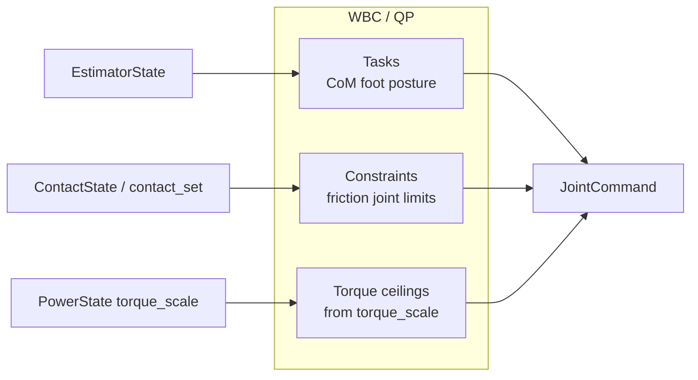
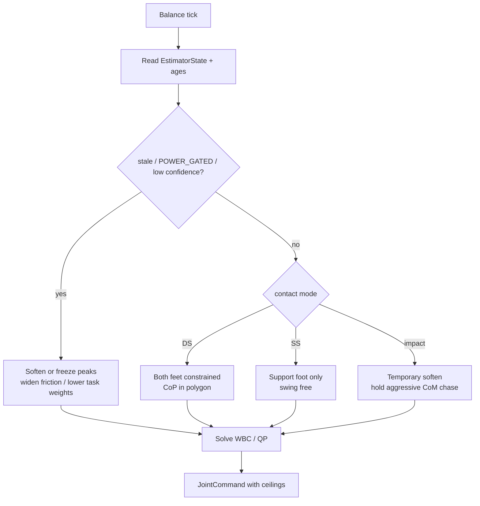
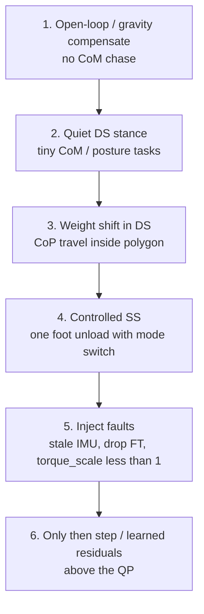

# Day 07 — Contact-rich balance policies & whole-body control


[Day 06](/lessons/day-06-estimation-balance) gave you one balance-ready `EstimatorState` on a shared clock, with ages, contact modes, and power honesty. [Day 05](/lessons/day-05-power-bms) already made `torque_scale` a control surface. [Day 02](/lessons/day-02-joint-foc) made $i_q$ the muscle.

Today owns the **consumer**: how contact-rich balance and whole-body control (WBC) turn that estimate into `JointCommand` without inventing a second plant — and without stuffing residual physics into a black-box net that runs inside a microsecond loop.

## Policy consumes estimates; it does not re-fuse them

Balance and WBC answer a different question than the estimator:

| Layer | Question | Owns |
|-------|----------|------|
| Estimator | What is true enough about the plant *right now*? | `EstimatorState` (+ faults / ages) |
| Balance / WBC | What should the joints do *given* that story and power ceilings? | Tasks, constraints, `JointCommand` |
| RL / high-level net | Which task set / footstep / gait mode next? | Sparse decisions *above* the rate loops |

**Rule:** one writer for fusion (Day 06). Many readers. If teleop, WBC, and a learned policy each run their own AHRS or “quick CoM fix,” twins and hardware diverge on day one.

Treat `INPUT_STALE`, `POWER_GATED`, low `cov_or_confidence`, and empty / wrong `contact_set` the way Day 05 treats brownout: **behavior must change**. Soften peaks, freeze aggressive tasks, widen friction margins, or open a safe torque path — do not hope the QP will “average it out.”

## Tasks vs constraints (and where power sits)

A practical WBC / QP sketch (hierarchical or weighted — the contract matters more than the brand):

| Kind | Examples | If violated / ignored |
|------|----------|------------------------|
| Tasks (soft / prioritized) | Keep CoM / capture-point in support; track foot pose; posture / arm bias | Soft failure → tip or flail, but solver still returns something |
| Hard constraints | Friction cone, unilaterality ($F_z \ge 0$), joint limits, collision margins | Infeasible QP → you need an explicit fallback, not NaN torque |
| Power ceilings | `abs(tau) ≤ torque_scale * tau_max`, or abs $i_q$ caps from BMS | Ignoring sag → commanded muscle the bus cannot deliver |



Put `torque_scale` on the **constraint / ceiling** side, not as a silent gain inside a learned residual. When the pack sags, the feasible set shrinks; the policy that pretends otherwise only balances on a full pack.

**Neural nets:** fine for gait mode, footstep choice, or residual correction **above** measured-jitter rate loops. The site principle still holds — never put a net inside a microsecond current or torque loop until you have measured jitter and proven the plant contract. Prefer nets that read the same `EstimatorState` the QP reads.

## Contact-rich: the support story changes the program

Contact events are sparse; the QP’s geometry is not optional flavor text.

| Mode | What the solver should see | Typical failure |
|------|----------------------------|-----------------|
| Double support | Both feet in `contact_set`; CoP inside support polygon | Over-trusting a lifting foot’s wrench |
| Single support | One support frame; swing foot near-zero / free | Still constraining the swing sole → lean into air |
| Impact / settle | Brief soften of contact tasks; trust estimator impact gate | Treating heel-strike spike as steady CoP target |
| Flight / jump (if ever) | No unilaterality from feet; IMU-heavy estimate | Floor constraints left enabled |



Physical and twin must agree on **when** `contact_set` flips relative to $F_z$ / CoP (Day 06 exercise). A policy that learned Boolean contacts from a perfect physics engine will heel-strike late on hardware every time.

## Shared API: command the muscle honestly

Keep Day 02 / 04 wire honesty. Cyclic commands still carry `BusHeader`. A thin balance / WBC face looks like this:

```text
BusHeader:
  node_id, seq
  t_sample, clock_domain, age_budget_ms
  faults

# Upstream (read-only here)
EstimatorState, ContactState, PowerState  ⊇ BusHeader

# Optional task face (host / mid-rate)
WbcTaskSet ⊇ BusHeader:
  mode                 # STANCE_DS | STANCE_SS | STEP | ...
  com_ref / cop_ref?   # in named frames from frames contract
  foot_refs[]          # support vs swing tagged
  posture_bias?
  priority_order[]     # or weights — pick one story and freeze it
  relax_on_fault       # what to drop when POWER_GATED / INPUT_STALE

# Downstream muscle (Day 02)
JointCommand ⊇ BusHeader:
  q_des? / qd_des? / tau_ff?
  iq_ceiling? / tau_ceiling?   # must reflect torque_scale
  flags                        # STO / soften / hold
```

Higher layers should not re-implement FOC or AHRS. They publish tasks or setpoints; the rate loops enforce ceilings the BMS already declared.

**Physical ↔ digital pairing for balance / WBC**

| Physical | Digital twin / backing |
|----------|------------------------|
| Same `EstimatorState` consumer API | Same structs in sim — no perfect-state cheat bus |
| Friction / sole model you can defend | Matching cone / rubber params or logged tables |
| `torque_scale` under peak legs | Sag / derate replay so QP feasibility matches |
| Contact flip timing vs $F_z$ | Injected delay + same threshold policy |
| Measured loop rates + jitter | Scheduler that cannot magically beat hardware |

## Bring-up sequence (before trusting closed-loop balance)

Day 06 steps 1–6 stay green. Then:



1. **Gravity compensate / hold** — joint-level honesty with estimator watched, balance tasks off or weight≈0.
2. **Quiet double support** — small posture + CoM regulation; plot CoP vs polygon and `contact_set`.
3. **Slow weight shift** — CoP travels; solver stays feasible; no swing-foot constraints left on.
4. **Single-support unload** — mode switch matches hardware; swing foot free.
5. **Fault injection** — force stale / `POWER_GATED` / low `torque_scale` in twin **and** on hardware; confirm soften / freeze paths.
6. **Then** add steps or learned residuals that consume the same state — never replace the QP’s friction and power ceilings.

Skip to “just stand with the net” and you will tune “balance gains” while fighting a flipped contact bit or an infinite bus in sim.

## Failure gallery

| Symptom | Likely cause |
|---------|----------------|
| Twin stands forever, hardware tips in 2 s | Cheat state bus, missing delay, or infinite `torque_scale` in sim |
| QP infeasible every heel-strike | Contact mode / unilaterality wrong; impact not softened |
| Legs “want more” as pack sags | Ceilings ignore `torque_scale`; policy treats sag as weak gains |
| Works in DS, dies on first SS | Swing foot still constrained; `contact_set` lag |
| Estimator calm, torque chatters | Task weights too hot; no low-pass / rate limit on CoM error |
| Net “fixes” tip only when plugged in | Residual learned against perfect plant; not reading faults |
| Current loop starved by inference | Net inside / coupled to μs path — measure jitter, move net up |
| Perfect sim transfer, wrong CoP on rubber | Friction / sole model mismatch; threshold policy drift |

## What to freeze this week

Extend [frames](/frames) and your control config with:

- Who may write `JointCommand` during stance (WBC only vs teleop overlay rules)
- Task list + priority / weight story for DS vs SS (and impact soften)
- How `torque_scale` / `PowerFault` maps to tau or abs $i_q$ ceilings every tick
- Fallback when QP is infeasible or `EstimatorState` is stale / gated
- Twin hooks: delay, contact timing, sag — same budgets as hardware
- Bring-up gate: no free stepping / learned residuals until steps 1–5 above are green

The lesson is not “pick OSQP vs a hierarchy.” It is **make contact-rich balance the same feasible program in silicon and in the twin**, reading one estimate, honoring power, and keeping black-box residuals above the loops you can measure.

## Next

**Day 08** — Contact-rich stepping & locomotion: footstep timing, swing trajectories, and gait modes that still consume `EstimatorState` + WBC ceilings instead of bypassing them.
