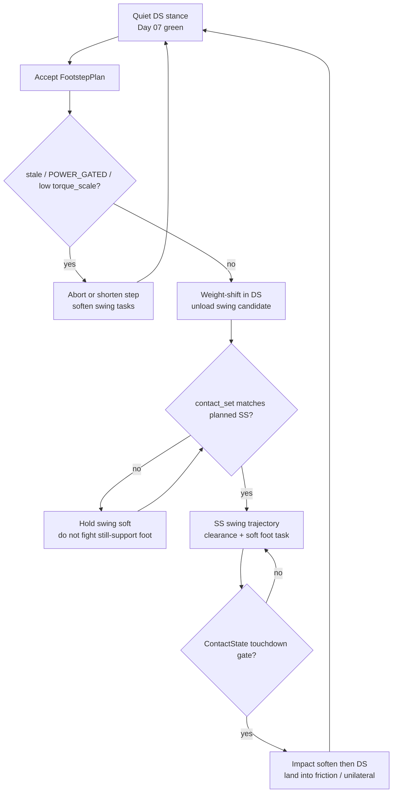
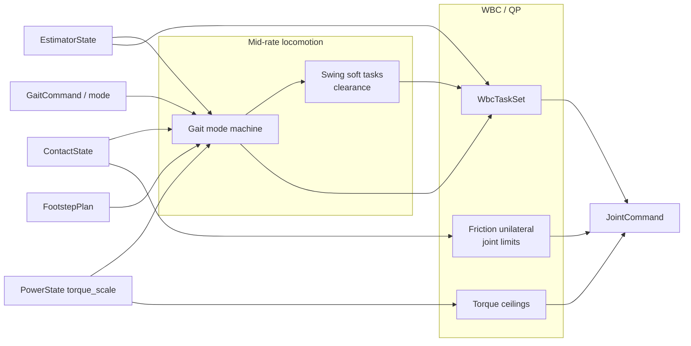
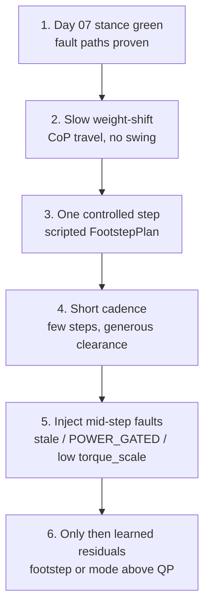

# Day 08 — Contact-rich stepping & locomotion


[Day 07](/lessons/day-07-wbc-balance) made contact-rich balance a feasible program: tasks vs constraints, friction / unilaterality, and `torque_scale` as a ceiling — not a silent gain. [Day 06](/lessons/day-06-estimation-balance) owned the estimate. [Day 05](/lessons/day-05-power-bms) owned sag honesty.

Today owns **motion that still respects that program**: footstep timing, swing trajectories, and gait modes that consume `EstimatorState` + WBC ceilings instead of inventing a second plant that “just walks.”

## Locomotion is a mode machine on top of stance

Walking is not “balance with a sine wave on the feet.” It is a sparse schedule of contact geometries the QP already knows how to treat:

| Phase | Contact story | Who must agree |
|-------|---------------|----------------|
| Double support (DS) | Both feet in `contact_set`; CoP travels inside the polygon | Estimator + gait clock |
| Single support (SS) | One support frame; swing sole near-zero / free | Mode flip before swing tasks harden |
| Impact / settle | Brief soften; trust Day 06 impact gate | Do not chase CoP spike as a foothold |
| Abort / shorten | Planned SS cancelled or early touchdown | Stale / `POWER_GATED` / low `torque_scale` |



**Ownership rule:** pick one writer for *intended* mode (gait phase clock / `GaitCommand`) and one writer for *measured* support (`contact_set` from Day 06). The swing foot must not receive hard support constraints while it is still in `contact_set`, and the support foot must not be “freed” because a clock said so if the sole is still loaded. When they disagree, **measured contact wins for constraints**; the gait layer aborts, holds, or re-plans.

If teleop, a learned gait net, and a scripted clock each flip mode independently, the QP spends heel-strike fighting a foot that is still a support — or leaning into air.

## Footstep timing, capture, and honest abort

A foothold is a promise about future support geometry. Capture-point / Divergent Component of Motion intuition still applies at the planning layer:

- Desired next contact should be reachable given CoM / capture-point state in `EstimatorState`, not a video-game waypoint.
- Step duration and length shrink when `cov_or_confidence` is poor, IMU / FT ages are near budget, or `torque_scale` is already derating the stance leg.
- **Abort and shorten are first-class behaviors**, not shame states. A robot that always completes a planned swing into a sagging bus is not “brave” — it is ignoring Day 05.

| Signal | Planning response |
|--------|-------------------|
| `INPUT_STALE` / low confidence | Freeze new footsteps; hold DS or shorten in-flight swing |
| `POWER_GATED` / low `torque_scale` | Reduce step length / cadence; raise friction margins; prefer DS |
| Empty / wrong `contact_set` | No SS commit; swing tasks stay soft or off |
| Capture-point drifting out | Re-target foothold or abort to DS recovery posture |

Do not let a high-level net “push through” a step the ceilings already declared infeasible. The net may **choose** a shorter step or a mode change; it may not replace friction cones or FOC.

## Swing as soft tasks + clearance; land into Day 07 constraints

Swing is a **task**, not a second constraint world:

| Piece | Role |
|-------|------|
| Clearance / toe height | Soft Cartesian (or joint) task — miss → scuff, not NaN |
| Foot orientation / yaw | Soft; respect joint limits as hard |
| Touchdown gate | `ContactState` ($F_z$, CoP settle) — not only kinematic “z = 0” |
| Post-impact | Soften contact tasks briefly; enable unilateral + friction on the new support |
| Swing vs support tagging | `foot_refs[]` must match `contact_set` every tick |



**Touchdown:** kinematic sole height crossing zero is a hint, not a contact event. Gate landing with the same `ContactState` / impact policy Day 06 froze. Then hand the new support to Day 07’s friction cone and $F_z \ge 0$ — do not keep treating the foot as a free end-effector after the sole is loaded.

**RL / learned residuals:** choose footsteps, cadence, or residual CoM bias **above** the QP. Never train a net that outputs joint torque while pretending cones and `torque_scale` do not exist. Prefer policies that read the same `EstimatorState` and fault bits the gait layer reads.

## Shared API: thin gait face, honest muscle

Keep Day 02 / 04 wire honesty. Cyclic commands still carry `BusHeader`. Extend the Day 07 task face rather than inventing a parallel “walk bus”:

```text
BusHeader:
  node_id, seq
  t_sample, clock_domain, age_budget_ms
  faults

# Upstream (read-only here)
EstimatorState, ContactState, PowerState  ⊇ BusHeader

# Thin locomotion face (host / mid-rate)
GaitCommand ⊇ BusHeader:
  mode                 # DS | SS_L | SS_R | STEP | ABORT | HOLD
  phase_or_clock?      # who owns intended timing — document it
  cadence_hz?
  relax_on_fault       # stale / POWER_GATED / low torque_scale → abort/shorten

FootstepPlan ⊇ BusHeader:
  footholds[]          # frame + pose + earliest/latest touchdown window
  swing_clearance?
  capture_ref?         # optional planning hint in named frames
  abort_policy         # shorten | freeze_ds | recover

# Extended Day 07 task face
WbcTaskSet ⊇ BusHeader:
  mode                 # STANCE_DS | STANCE_SS | SWING | IMPACT | ...
  com_ref / capture_ref?
  foot_refs[]          # each tagged support | swing | settling
  posture_bias?
  priority_order[]     # or weights — same story as Day 07
  relax_on_fault

# Downstream muscle (Day 02) — ceilings still reflect torque_scale
JointCommand ⊇ BusHeader:
  q_des? / qd_des? / tau_ff?
  iq_ceiling? / tau_ceiling?
  flags                # STO / soften / hold
```

Higher layers publish mode + footholds + tasks. Rate loops enforce BMS ceilings. Nobody re-implements FOC or AHRS inside the swing interpolator.

**Physical ↔ digital pairing for stepping**

| Physical | Digital twin / backing |
|----------|------------------------|
| Same `EstimatorState` / `ContactState` consumers | No perfect-state cheat bus for “easy walking” |
| Contact flip timing vs $F_z$ / CoP | Injected delay + same threshold / impact gate |
| Swing duration + clearance scuff | Matching sole thickness / early-contact noise |
| Friction / rubber under heel-strike | Same cone params or logged tables as Day 07 |
| `torque_scale` under push-off / landing peaks | Sag / derate replay — no infinite-torque stance leg |
| Measured mid-rate gait tick + jitter | Scheduler that cannot beat hardware cadence |

If the twin walks with perfect Boolean contacts and a full pack while hardware sees delayed `contact_set` and sag, you will tune swing gains forever and never ship a step.

## Bring-up sequence (before free walking)

Day 07 steps 1–5 stay green (gravity hold → quiet DS → weight shift → controlled SS unload → fault injection). Then:



1. **Stance green** — DS/SS unload, friction, and ceilings behave under Day 07 fault injection.
2. **Weight-shift only** — CoP travels; no swing tasks; confirm `contact_set` tracking.
3. **One controlled step** — single `FootstepPlan`; mode flip tied to measured contact; land into cones.
4. **Short cadence** — a few steps at low speed; plot abort/shorten paths even if unused.
5. **Mid-step faults** — force stale / gated / derate in twin **and** on hardware during swing; confirm abort or soften, not a heroic completion.
6. **Then** add learned footstep / mode residuals that consume the same state — never replace QP cones or FOC.

Skip to “RL walks in sim” and you will discover that hardware’s first free walk is an unplanned impact experiment.

## Failure gallery

| Symptom | Likely cause |
|---------|----------------|
| Swing digs / tips while “in air” | Support constraints left on swing foot; `contact_set` lag ignored |
| Lands, then QP infeasible | Impact not softened; unilaterality / friction enabled late or wrong foot |
| Twin trots, hardware aborts every step | Perfect contacts / infinite `torque_scale` in sim |
| Completes swing into brownout | Abort policy missing; ceilings not consulted mid-step |
| Capture-point chase chatters feet | Footstep rate too hot; no shorten/freeze on low confidence |
| Net “walks” only on full pack | Residual learned without `torque_scale` / faults in the observation |
| Heel scuff every touchdown | Clearance task weak **or** kinematic gate without `ContactState` |
| Mode clock frees loaded sole | Gait clock owns constraints instead of measured `contact_set` |

## What to freeze this week

Extend [frames](/frames) and your control config with:

- Who owns **intended** gait mode vs **measured** `contact_set` (and the disagree → abort/hold rule)
- `GaitCommand` / `FootstepPlan` fields + mid-rate tick budget
- How swing feet are tagged in `WbcTaskSet` every sample relative to `contact_set`
- Abort / shorten policy for stale, `POWER_GATED`, and low `torque_scale`
- Touchdown gate: `ContactState` thresholds aligned with Day 06 impact policy
- Twin hooks: contact delay, swing early-contact, sag under push-off — same as hardware
- Bring-up gate: no free walking / learned locomotion residuals until steps 1–5 above are green

The lesson is not “implement Raibert vs DCM vs a walking transformer.” It is **make stepping the same contact-rich program in silicon and in the twin**: one estimate, honest power ceilings, swing that does not fight support, and landings that inherit Day 07’s cones.

## Next

**Day 09** — Push recovery & disturbance rejection on the same `EstimatorState` + WBC ceilings: detect CoM / capture-point escapes, choose recover-in-place vs emergency step, and keep abort / soften paths when power or contact confidence collapses mid-recovery.
