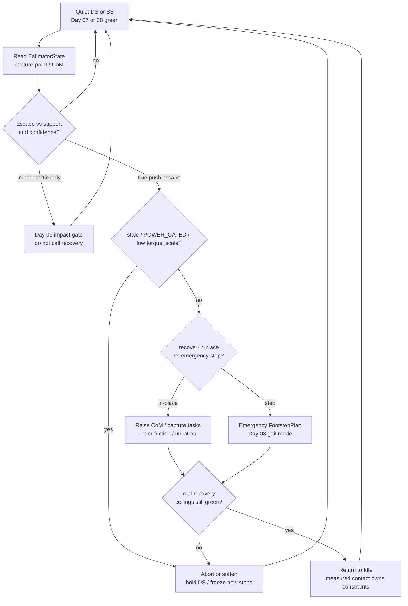
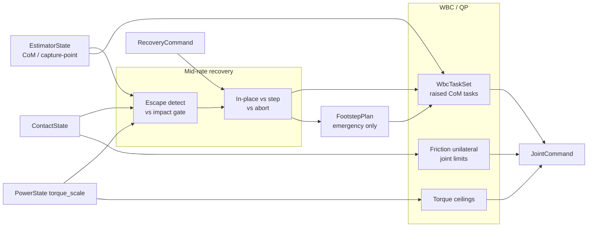
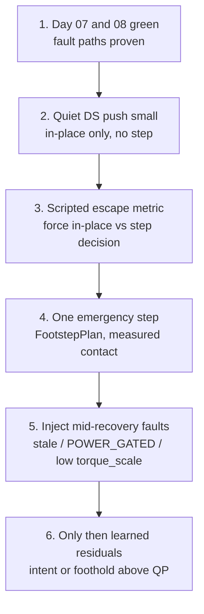

# Day 09 — Push recovery & disturbance rejection


[Day 08](/lessons/day-08-stepping-locomotion) made stepping a mode machine on top of stance: intended gait clock vs measured `contact_set`, swing as soft tasks, landings into Day 07 friction / unilaterality, abort when `torque_scale` or confidence collapses. [Day 07](/lessons/day-07-wbc-balance) owned the feasible program. [Day 06](/lessons/day-06-estimation-balance) owned the estimate and impact settle. [Day 05](/lessons/day-05-power-bms) owned sag honesty.

Today owns **disturbance rejection on that same stack**: detect CoM / capture-point escapes, choose recover-in-place vs emergency step, and keep abort / soften paths when power or contact confidence collapses mid-recovery — without inventing a second torque plant that “just catches pushes.”

## Recovery is a decision layer, not a second plant

A push is not a new dynamics model. It is an escape of the capture-point / CoM relative to the current support polygon, under the same `EstimatorState`, contact quality, and `torque_scale` ceilings the stance and gait layers already trust.

| Layer | Owns | Must not own |
|-------|------|--------------|
| Detection | CoM / capture-point excursion vs support; rate of escape | Joint FOC / AHRS |
| Decision | Recover-in-place vs emergency step vs abort/soften | Friction cones / BMS ceilings |
| Execution | Soft/hard tasks + Day 08 `FootstepPlan` when stepping | A parallel “recovery torque bus” |
| Honesty | Mid-recovery stale / `POWER_GATED` / low `torque_scale` | Heroic completion into brownout |

**Core thesis:** push recovery consumes capture-point / CoM escape + contact quality + `torque_scale`. It publishes tasks and (when needed) footsteps into the Day 07 / 08 faces. It does **not** replace QP constraints, FOC, or the BMS derate path.



**Ownership rule:** one writer for *recovery intent* (`RecoveryCommand` / recovery fields on `GaitCommand`) and one writer for *measured* support (`contact_set`). When they disagree mid-recovery, **measured contact wins for constraints**; the recovery layer aborts, softens, or re-plans — it does not fight a still-loaded sole or lean into air because a capture-point heuristic said so.

## Detecting disturbance vs Day 06 impact settle

Not every CoP spike or CoM jolt is a push that needs a step.

| Event | Signature | Correct response |
|-------|-----------|------------------|
| Heel-strike / touchdown settle | Brief $F_z$ / CoP transient; planned impact window | Day 06 impact soften; do **not** open recovery |
| Quiet stance noise | Capture-point inside margin; confidence healthy | Ignore; no mode flip |
| True push / disturbance | Capture-point escaping support; sustained CoM rate; not inside impact gate | Open recovery decision |
| Sensor lies | Stale IMU / FT; empty / wrong `contact_set`; low confidence | Soften / abort — never “recover” on garbage |

**Do not confuse** impact settle with disturbance rejection. Chasing a touchdown CoP spike as an escape will chatter feet and invent emergency steps on every heel-strike. Gate recovery behind: (1) not inside Day 06 impact window, (2) capture-point / CoM excursion past a frozen margin, (3) estimate age and confidence inside budget.

Capture-point intuition at the decision layer (planning, not a new plant):

- If the extrapolated capture-point stays inside an enlarged support with healthy `torque_scale` and `contact_set`, prefer **recover-in-place**.
- If it leaves the recoverable region, or in-place tasks would demand infeasible wrench under current cones / ceilings, prefer an **emergency step** that reuses Day 08’s `FootstepPlan` + gait mode machine.
- If confidence or power already collapsed, prefer **abort / soften** over either.

## Decision table: in-place vs emergency step vs abort

| Condition | Choice | Notes |
|-----------|--------|-------|
| Escape small; DS polygon healthy; `torque_scale` ok | Recover-in-place | Soft → harden CoM / capture / posture tasks under Day 07 cones |
| Escape large; in-place wrench infeasible; contact green | Emergency step | Single (or few) `FootstepPlan`; SS mode flip tied to measured `contact_set` |
| `INPUT_STALE` / low confidence | Abort / soften | Freeze new recovery steps; hold DS or soft tasks |
| `POWER_GATED` / low `torque_scale` | Abort / soften or shorten | Raise friction margins; prefer DS; no heroic SS |
| Empty / wrong `contact_set` | Soften; no SS commit | Do not free a loaded sole or trust a free foot as support |
| Mid-recovery ceilings collapse | Abort / soften | Same honesty as Day 08 mid-step faults |

Do not let a high-level net “push through” a recovery the ceilings already declared infeasible. The net may **choose** in-place vs step or a shorter foothold; it may not replace friction cones, unilaterality, or FOC.

## In-place recovery under Day 07 ceilings

Recover-in-place is still the Day 07 program with **raised priorities**, not a special torque mode:

| Piece | Role |
|-------|------|
| CoM / capture-point task | Soft → temporarily higher weight; miss → residual, not NaN |
| Posture / angular momentum bias | Soft; dump excess into arms/torso only within joint limits |
| Support feet | Hard friction + $F_z \ge 0$; tagged from measured `contact_set` |
| Swing candidate (if any) | Stay soft or off until SS is honestly committed |
| Ceilings | `torque_scale` / `iq_ceiling` still bind every tick |



**Hard vs soft:** support constraints stay hard. Recovery authority lives in task weights and foothold choice. If the QP goes infeasible, the honest answer is soften / abort / step — not silently dropping friction.

## Emergency step reuses Day 08

When in-place cannot contain the escape, recovery **does not invent a parallel walker**. It issues a short-horizon `FootstepPlan` and rides the Day 08 gait mode machine:

- Mode: DS → weight-shift → SS → impact settle → DS, same ownership rules.
- Swing: soft clearance + foot tasks; **measured `contact_set` owns constraints**.
- Touchdown: Day 06 `ContactState` gate, then Day 07 cones on the new support.
- Abort / shorten: first-class if stale / gated / derate hits mid-step — same as locomotion.

| Recovery need | Day 08 reuse |
|---------------|--------------|
| Next foothold pose / window | `FootstepPlan.footholds[]` + `abort_policy` |
| Intended mode | `GaitCommand.mode` (`STEP` / `ABORT` / `HOLD`) |
| Swing tagging | `WbcTaskSet.foot_refs[]` vs `contact_set` every tick |
| Capture hint | `capture_ref` as planning input — not a torque override |

If teleop, a learned recovery net, and a scripted capture heuristic each flip mode independently, the QP will fight a still-support foot or plant into sag. One writer for recovery intent; measured contact wins for constraints.

## Mid-recovery abort / soften honesty

Recovery is where teams love to disable safety “just this once.” Do not.

| Signal mid-recovery | Required behavior |
|---------------------|-------------------|
| `INPUT_STALE` / confidence cliff | Soften tasks; cancel pending emergency step; hold safest DS posture available |
| `POWER_GATED` / falling `torque_scale` | Shorten or abort step; raise margins; never complete SS into brownout |
| `contact_set` disagrees with intended SS | Hold swing soft; do not free loaded sole |
| QP infeasible under cones | Drop task weights / abort — do not drop unilaterality |
| Impact window on emergency touchdown | Soften briefly; then enable friction on new support |

Abort and soften are **success paths** when the world lied or the pack sagged. A robot that always finishes the planned recovery step into a collapsing bus is ignoring Day 05 with nicer branding.

## Shared API: recovery face on the same stack

Keep Day 02 / 04 wire honesty. Cyclic commands still carry `BusHeader`. Extend Day 07 / 08 faces rather than inventing a parallel “push bus”:

```text
BusHeader:
  node_id, seq
  t_sample, clock_domain, age_budget_ms
  faults

# Upstream (read-only here)
EstimatorState, ContactState, PowerState  ⊇ BusHeader

# Thin recovery face (host / mid-rate)
RecoveryCommand ⊇ BusHeader:
  intent               # IDLE | RECOVER_IN_PLACE | EMERGENCY_STEP | ABORT | HOLD
  escape_metric?       # capture / CoM excursion in named frames — document units
  prefer_step          # bool hint; ceilings may still force abort/soften
  relax_on_fault       # stale / POWER_GATED / low torque_scale → abort/soften

# Reuse / extend Day 08 locomotion face
GaitCommand ⊇ BusHeader:
  mode                 # DS | SS_L | SS_R | STEP | ABORT | HOLD | RECOVER
  phase_or_clock?
  cadence_hz?
  recovery_intent?     # optional mirror of RecoveryCommand.intent
  relax_on_fault

FootstepPlan ⊇ BusHeader:
  footholds[]
  swing_clearance?
  capture_ref?
  abort_policy         # shorten | freeze_ds | recover_in_place | abort
  urgency?             # nominal | emergency — same cones, tighter windows

# Extended Day 07 task face
WbcTaskSet ⊇ BusHeader:
  mode                 # STANCE_DS | STANCE_SS | SWING | IMPACT | RECOVER_IP | ...
  com_ref / capture_ref?
  foot_refs[]          # each tagged support | swing | settling
  posture_bias?
  priority_order[]     # temporarily raise CoM / capture during RECOVER_IP
  relax_on_fault

# Downstream muscle (Day 02) — ceilings still reflect torque_scale
JointCommand ⊇ BusHeader:
  q_des? / qd_des? / tau_ff?
  iq_ceiling? / tau_ceiling?
  flags                # STO / soften / hold
```

Higher layers publish recovery intent + optional emergency footholds + task priorities. Rate loops enforce BMS ceilings. Nobody re-implements FOC or AHRS inside the capture-point detector.

**Physical ↔ digital pairing for push recovery**

| Physical | Digital twin / backing |
|----------|------------------------|
| Same `EstimatorState` / capture-point consumers | No perfect-state cheat bus for “easy recoveries” |
| Push impulse timing vs CoM / capture escape | Matched impulse profiles + same escape thresholds |
| In-place wrench vs friction / rubber | Same cone params or logged tables as Day 07 |
| Emergency step contact flip vs $F_z$ / CoP | Injected delay + Day 06 impact gate |
| `torque_scale` under recovery peaks | Sag / derate replay — no infinite-torque catch |
| Mid-recovery stale / gated injection | Scheduler that can fail the same way as hardware |
| Measured mid-rate recovery tick + jitter | Cannot beat hardware cadence or hide age faults |

If the twin always recovers with perfect Boolean contacts and a full pack while hardware sees delayed `contact_set` and sag, you will tune recovery gains forever and never ship a catch that survives a real shove on a tired bus.

## Bring-up sequence (before free push tests)

Day 07 stance green and Day 08 steps 1–5 stay green (controlled step + mid-step faults). Then:



1. **Stance + step green** — Day 07 fault injection and Day 08 one controlled step + mid-step abort still behave.
2. **Small in-place only** — gentle disturbance in DS; raised CoM / capture tasks; no emergency `FootstepPlan`; confirm impact settle is **not** classified as recovery.
3. **Scripted decision** — force escape metric across the in-place vs step threshold in twin; confirm mode and task priorities flip cleanly.
4. **One emergency step** — single recovery `FootstepPlan`; mode flip tied to measured `contact_set`; land into cones.
5. **Mid-recovery faults** — force stale / gated / derate in twin **and** on hardware during in-place and during emergency swing; confirm abort or soften, not heroic completion.
6. **Then** add learned residuals that choose intent or foothold above the QP — never replace cones, FOC, or `torque_scale`.

Skip to “RL recovers in sim” and hardware’s first real shove becomes an unplanned brownout experiment with better video.

## Failure gallery

| Symptom | Likely cause |
|---------|----------------|
| Recovers on every heel-strike | Impact settle misclassified as push; Day 06 gate unused |
| In-place chatters then tips | Task weights raised without friction margins; ceilings ignored |
| Emergency step digs / tips “in air” | Support constraints left on swing foot; `contact_set` lag ignored |
| Twin catches, hardware faceplants | Perfect contacts / infinite `torque_scale` in sim |
| Completes recovery into brownout | Mid-recovery abort missing; ceilings not consulted |
| Capture chase pumps feet | Escape threshold too tight; no freeze on low confidence |
| Net recovers only on full pack | Residual learned without `torque_scale` / faults in observation |
| Mode clock frees loaded sole mid-catch | Recovery intent owns constraints instead of measured `contact_set` |
| QP infeasible → silent cone drop | Soften/abort path missing; “make it feasible” anti-pattern |

## What to freeze this week

Extend [frames](/frames) and your control config with:

- Escape metric: capture-point / CoM margins, frames, and **impact-settle exclusion** aligned with Day 06
- Who owns **recovery intent** vs **measured** `contact_set` (disagree → abort/hold)
- `RecoveryCommand` fields (or recovery fields on `GaitCommand`) + mid-rate tick budget
- In-place task priority policy under Day 07 friction / unilaterality
- Emergency step: reuse `FootstepPlan` / gait mode; same abort/shorten as Day 08
- Mid-recovery abort / soften for stale, `POWER_GATED`, and low `torque_scale`
- Twin hooks: matched push impulses, contact delay, sag under recovery peaks — same as hardware
- Bring-up gate: no free push testing / learned recovery residuals until steps 1–5 above are green

The lesson is not “implement ankle strategy vs hip strategy vs a recovery transformer.” It is **make disturbance rejection the same contact-rich program in silicon and in the twin**: one estimate, honest power ceilings, in-place tasks that do not fight cones, emergency steps that inherit Day 08, and abort paths that stay honest when the world or the pack lies mid-catch.

## Next

**Day 10** — Upper-body / manipulation on shared balance ceilings: reach and grasp as soft tasks under the same `EstimatorState` + friction / unilaterality + `torque_scale`, without a second “arm plant” that steals support wrench or ignores mid-reach power and contact honesty.
