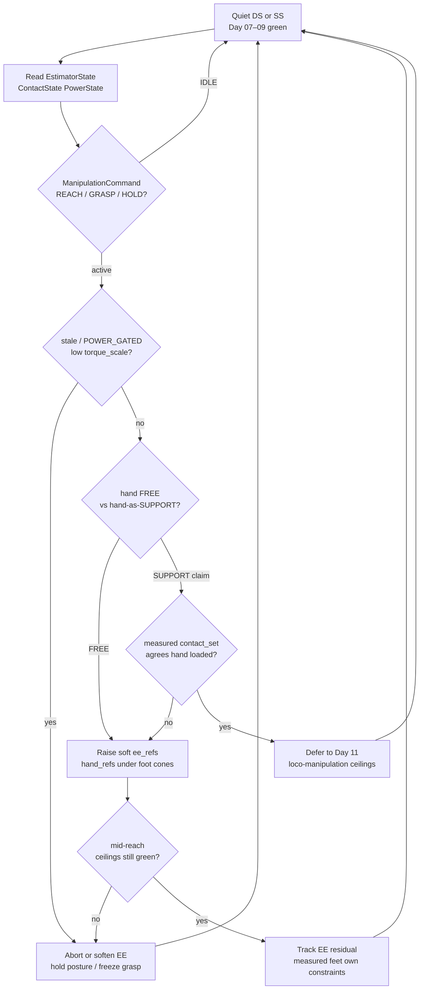
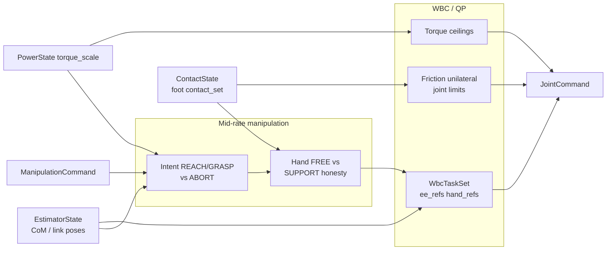
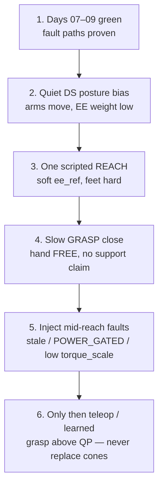

# Day 10 — Upper-body / manipulation on shared balance ceilings


[Day 09](/lessons/day-09-push-recovery) made disturbance rejection a **decision layer** on the same stack: capture-point / CoM escape, recover-in-place vs emergency step, abort / soften when power or contact confidence collapses. [Day 08](/lessons/day-08-stepping-locomotion) owned gait modes and swing as soft tasks. [Day 07](/lessons/day-07-wbc-balance) owned the feasible program. [Day 06](/lessons/day-06-estimation-balance) owned the estimate. [Day 05](/lessons/day-05-power-bms) owned sag honesty.

Today owns **reach and grasp as soft tasks on those same ceilings**: end-effector and hand references under measured foot `contact_set`, Day 07 friction / unilaterality, and `torque_scale` — without inventing a second “arm plant” that steals support wrench or finishes a mid-reach teleop into brownout.

## Manipulation is a task layer, not a second plant

A reach is not a new dynamics model for the arms. It is a set of **soft EE / grasp tasks** competing for residual authority inside the same QP that already balances on feet. The arms do not get a parallel torque bus, a private FOC path, or permission to ignore foot cones because a grasp heuristic “really wants it.”

| Layer | Owns | Must not own |
|-------|------|--------------|
| Intent | Reach / grasp / hold / abort; EE and hand refs in named frames | Friction cones / BMS ceilings / FOC |
| Task layer | Soft `ee_refs` / `hand_refs` + posture bias into `WbcTaskSet` | Hard support constraints on feet |
| Support honesty | Tag hands FREE vs SUPPORT; never free a loaded sole for a prettier EE | A parallel “arm balance” plant |
| Honesty | Mid-reach stale / `POWER_GATED` / low `torque_scale` → abort/soften | Heroic completion into brownout |

**Core thesis:** manipulation consumes `EstimatorState` + Day 07 friction / unilaterality + `torque_scale`. It publishes soft EE / grasp tasks (and optional hand-contact tags) into the existing WBC face. It does **not** replace QP constraints, FOC, or the BMS derate path — and it must not steal wrench the feet still need.



**Ownership rule:** one writer for *manipulation intent* (`ManipulationCommand` / EE fields on `WbcTaskSet`) and one writer for *measured* support (`contact_set` on feet — and later hands). When they disagree mid-reach, **measured contact wins for constraints**; the manipulation layer aborts, softens, or re-plans — it does not yank a still-loaded sole or lean the CoM into air because an EE heuristic said so.

## How today fits the Days 05–09 stack

| Day | What you already froze | What Day 10 reuses |
|-----|------------------------|--------------------|
| 05 | `torque_scale`, `POWER_GATED`, sag honesty | Same ceilings bind **arm and leg** joints every tick |
| 06 | `EstimatorState`, age / stale, contact modes | EE tasks consume the same estimate; no perfect-state arm cheat bus |
| 07 | Tasks vs hard friction / unilaterality | EE / grasp stay **soft**; feet stay **hard** |
| 08 | Measured `contact_set` owns swing vs support | Same rule: intended EE never owns foot constraints |
| 09 | Mid-event abort / soften | Mid-reach abort on stale / gated / low scale |

Do not bolt a Cartesian arm controller that writes `JointCommand` beside the QP. That is a second plant with nicer branding — and it will fight support wrench the first time the pack sags or a foot slips.

## Soft EE / grasp under hard foot support

Reach and grasp authority lives in **task weights**, not in dropping cones:

| Piece | Role |
|-------|------|
| `ee_refs[]` | Soft Cartesian / SE(3) tasks; miss → residual, not NaN |
| `hand_refs[]` | Soft grasp / finger / wrench bias when the hand is FREE |
| CoM / posture bias | Soft; dump excess into torso / free arms only within limits |
| Support feet | Hard friction + $F_z \ge 0$; tagged from measured `contact_set` |
| Ceilings | `torque_scale` / `iq_ceiling` still bind every joint every tick |



**Hard vs soft:** support constraints on feet stay hard. Manipulation authority lives in EE / hand task weights and priority order. If the QP goes infeasible, the honest answer is soften / abort / shorten the reach — not silently dropping friction so the hand can “make it.”

## Hand FREE vs hand-as-support honesty

Until Day 11, treat hands as **FREE end-effectors** unless measured contact honestly says otherwise.

| Hand tag | Meaning | Allowed today |
|----------|---------|---------------|
| FREE | No trusted hand load in `contact_set` | Soft EE / grasp tasks only |
| CLAIMED_SUPPORT (teleop / planner wish) | Intent wants the hand to take weight | **Do not** enable hand friction cones yet — keep soft; log the claim |
| MEASURED_SUPPORT | Hand appears in measured `contact_set` with healthy confidence | Day 11 loco-manipulation — same ceilings, new contact set |

**Do not** let a grasp net or teleop stick “borrow” foot wrench by raising arm tasks until cones break. If the planner wants hand-as-support, that is a **contact-mode change**, not a bigger EE weight. Claiming support without measured contact is how you tip while looking busy.

## Mid-reach abort / soften honesty

Manipulation is where teams love to disable safety “just until the grasp closes.” Do not.

| Signal mid-reach | Required behavior |
|------------------|-------------------|
| `INPUT_STALE` / confidence cliff | Soften or freeze EE tasks; hold safest DS posture available |
| `POWER_GATED` / falling `torque_scale` | Abort or soften grasp close; raise margins; never finish a heavy lift into brownout |
| Foot `contact_set` disagrees with intended DS/SS | Hold EE soft; do not free a loaded sole for reach clearance |
| QP infeasible under cones | Drop EE / grasp weights / abort — do not drop unilaterality |
| Hand contact flicker while FREE | Keep soft; do not flip to SUPPORT on noise |

Abort and soften are **success paths** when the world lied or the pack sagged. A robot that always finishes the planned grasp into a collapsing bus is ignoring Day 05 with a prettier end-effector demo.

## Shared API: manipulation face on the same stack

Keep Day 02 / 04 wire honesty. Cyclic commands still carry `BusHeader`. Extend Day 07’s `WbcTaskSet` rather than inventing a parallel “arm bus”:

```text
BusHeader:
  node_id, seq
  t_sample, clock_domain, age_budget_ms
  faults

# Upstream (read-only here)
EstimatorState, ContactState, PowerState  ⊇ BusHeader

# Thin manipulation face (host / mid-rate)
ManipulationCommand ⊇ BusHeader:
  intent               # IDLE | REACH | GRASP | HOLD | ABORT
  ee_refs[]            # frame, pose/twist targets, weight hints — document units
  hand_refs[]          # grasp aperture / finger bias / optional wrench bias
  hand_role[]          # FREE | CLAIM_SUPPORT — measured contact still owns truth
  priority_hint[]      # soft ordering vs CoM / posture; ceilings may still force soften
  relax_on_fault       # stale / POWER_GATED / low torque_scale → abort/soften

# Extended Day 07 task face
WbcTaskSet ⊇ BusHeader:
  mode                 # STANCE_DS | STANCE_SS | SWING | IMPACT | RECOVER_IP | MANIP | ...
  com_ref / capture_ref?
  foot_refs[]          # each tagged support | swing | settling
  ee_refs[]            # soft end-effector tasks (Day 10)
  hand_refs[]          # soft grasp / hand tasks (Day 10)
  posture_bias?
  priority_order[]     # EE may rise during REACH/GRASP — never above hard constraints
  relax_on_fault

# Downstream muscle (Day 02) — ceilings still reflect torque_scale
JointCommand ⊇ BusHeader:
  q_des? / qd_des? / tau_ff?
  iq_ceiling? / tau_ceiling?
  flags                # STO / soften / hold
```

Higher layers publish manipulation intent + soft EE / hand refs. Rate loops enforce BMS ceilings. Nobody re-implements FOC or AHRS inside the grasp planner.

**Physical ↔ digital pairing for upper-body manipulation**

| Physical | Digital twin / backing |
|----------|------------------------|
| Same `EstimatorState` consumers for EE tasks | No perfect-state cheat bus for “easy reaches” |
| Reach kinematics vs measured link poses | Matched frame names + same EE miss metric |
| Grasp close vs finger / aperture feedback | Same aperture units; injected sensor delay |
| Foot friction / rubber under arm load | Same cone params or logged tables as Day 07 |
| `torque_scale` under reach / lift peaks | Sag / derate replay — no infinite-torque grasp |
| Mid-reach stale / gated injection | Scheduler that can fail the same way as hardware |
| Measured mid-rate manip tick + jitter | Cannot beat hardware cadence or hide age faults |
| Hand FREE vs accidental table touch | Twin must not auto-promote hand to SUPPORT without measured contact |

If the twin always grasps with perfect Boolean contacts and a full pack while hardware sees delayed `contact_set` and sag, you will tune EE gains forever and never ship a reach that survives a tired bus.

## Bring-up sequence (before free teleop / learned grasp)

Day 07 stance green, Day 08 steps 1–5 green, and Day 09 recovery steps 1–5 green. Then:



1. **Stance + step + recovery green** — Day 07–09 fault injection still behaves; no open recovery or gait fights.
2. **Quiet DS posture only** — move arms with low EE weights; confirm foot cones and `torque_scale` still bind; CoM stays inside support.
3. **One scripted REACH** — single soft `ee_ref` to a known pose; miss is residual; feet remain hard support from measured `contact_set`.
4. **Slow GRASP close** — aperture / `hand_refs` while hand stays FREE; no hand friction cones; no weight transfer onto the palm.
5. **Mid-reach faults** — force stale / gated / derate in twin **and** on hardware during reach and during grasp close; confirm abort or soften, not heroic completion.
6. **Then** add teleop or learned residuals that choose EE / grasp above the QP — never replace cones, FOC, or `torque_scale`. Hand-as-support waits for Day 11.

Skip to “RL grasps in sim” and hardware’s first real reach becomes an unplanned tip / brownout experiment with better video.

## Failure gallery

| Symptom | Likely cause |
|---------|----------------|
| Reaches then tips in place | EE weights raised without foot friction margins; ceilings ignored |
| Twin grasps, hardware faceplants | Perfect contacts / infinite `torque_scale` in sim |
| Completes grasp into brownout | Mid-reach abort missing; ceilings not consulted |
| Arm “wins,” foot slips | Soft EE treated as hard; unilaterality dropped to make QP feasible |
| Hand claimed as support, robot leans on air | Intent owns constraints instead of measured `contact_set` |
| Teleop fights recovery / gait | Multiple writers on `WbcTaskSet` / mode; no single manip intent owner |
| Grasp chatters on every table brush | Accidental hand contact promoted to SUPPORT without confidence gate |
| Net grasps only on full pack | Residual learned without `torque_scale` / faults in observation |
| QP infeasible → silent cone drop | Soften/abort path missing; “make it feasible” anti-pattern |
| Cartesian arm controller beside QP | Second plant writing `JointCommand`; fights Day 07 program |

## What to freeze this week

Extend [frames](/frames) and your control config with:

- EE / hand frame names, units, and miss metrics aligned with `EstimatorState` link poses
- Who owns **manipulation intent** vs **measured** foot `contact_set` (disagree → abort/hold)
- `ManipulationCommand` fields + mid-rate tick budget
- `WbcTaskSet.ee_refs[]` / `hand_refs[]` and priority policy under Day 07 friction / unilaterality
- Hand role: FREE vs CLAIM_SUPPORT vs measured SUPPORT (Day 11 enables the last)
- Mid-reach abort / soften for stale, `POWER_GATED`, and low `torque_scale`
- Twin hooks: matched reach loads, contact delay, sag under arm peaks — same as hardware
- Bring-up gate: no free teleop / learned grasp until steps 1–5 above are green

The lesson is not “implement inverse kinematics vs an EE transformer.” It is **make upper-body manipulation the same contact-rich program in silicon and in the twin**: one estimate, honest power ceilings, soft EE / grasp that do not fight foot cones, and abort paths that stay honest when the world or the pack lies mid-reach.

## Next

**Day 11** — Hand contact as support / loco-manipulation on the same ceilings: promote measured hand contact into the support set, share friction / unilaterality with feet, and keep mid-contact abort / soften when power or confidence collapses — still one plant, not a bolted “arm balancer.”
