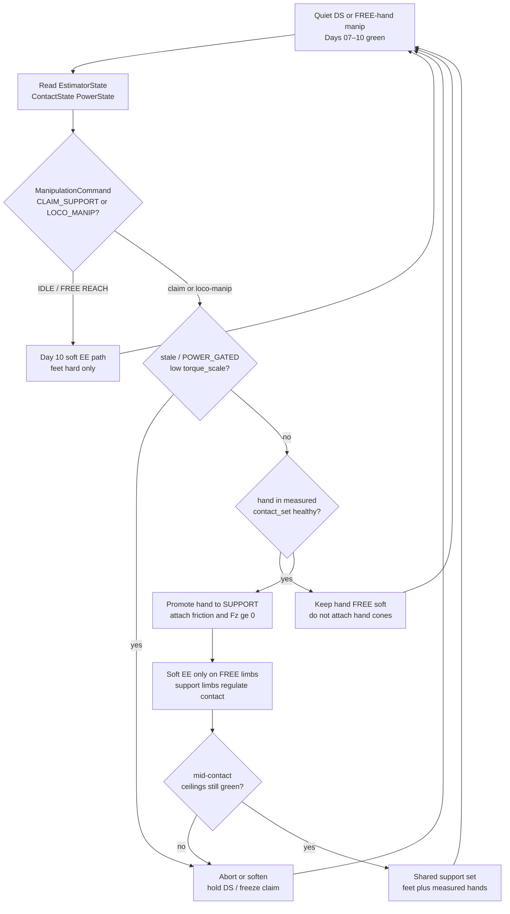
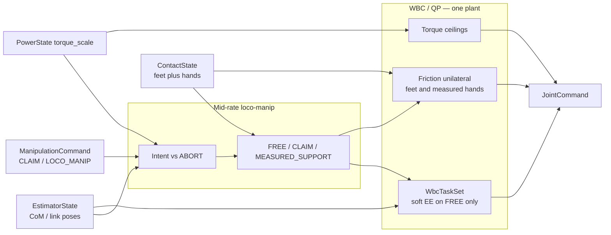
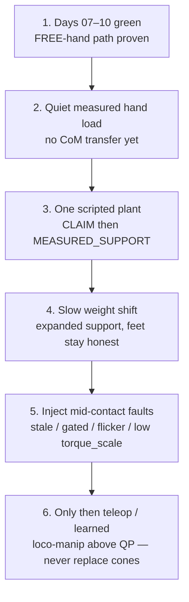

# Day 11 — Hand-as-support / loco-manipulation on the same ceilings


[Day 10](/lessons/day-10-upper-body-manipulation) owned reach and grasp as **soft** EE / hand tasks under measured foot `contact_set`, Day 07 friction / unilaterality, and `torque_scale` — hands stayed FREE unless measured contact honestly said otherwise; claiming SUPPORT without measurement was forbidden. [Day 09](/lessons/day-09-push-recovery) owned mid-event abort / soften. [Day 08](/lessons/day-08-stepping-locomotion) owned gait modes vs measured contact. [Day 07](/lessons/day-07-wbc-balance) owned the feasible program. [Day 06](/lessons/day-06-estimation-balance) owned the estimate. [Day 05](/lessons/day-05-power-bms) owned sag honesty.

Today owns the **contact-mode change**: promote *measured* hand contact into the Day 07 hard support set beside the feet — same friction cones, same $F_z \ge 0$, same `torque_scale` — so loco-manipulation (wall plant, table brace, handrail, crawl transition) is still **one WBC/QP plant**, not a bolted “arm balancer.”

## Hand-as-support is contact mode, not a bigger EE weight

A palm on a wall is not “raise arm task weight until the QP tips the CoM onto the hand.” It is a **support membership change**: the hand enters measured `contact_set`, hard constraints attach, soft EE on that limb goes away or softens to residual contact regulation, and free limbs keep soft tasks under the expanded support polygon.

| Layer | Owns | Must not own |
|-------|------|--------------|
| Intent | LOCO_MANIP / HAND_SUPPORT claim; which limb should take load | Friction cones / FOC / BMS ceilings |
| Measured contact | Hand + foot membership in `contact_set` with confidence | Teleop wish as constraint truth |
| Support set | Hard friction + unilaterality on **measured** support limbs | Soft EE weights pretending to be cones |
| Soft tasks | EE / grasp / posture on **FREE** limbs only | Parallel arm torque bus or second plant |
| Honesty | Mid-contact stale / `POWER_GATED` / low `torque_scale` / contact flicker → abort/soften | Heroic weight transfer onto flickering palm |

**Core thesis:** loco-manipulation consumes the same `EstimatorState` + Day 07 friction / unilaterality + `torque_scale`. Measured `contact_set` owns which hands and feet are SUPPORT. Soft EE / grasp remain for FREE limbs. There is still **one** QP face — not a second arm plant that steals wrench or finishes a wall plant into brownout.



**Ownership rule:** one writer for *loco-manip / support claim intent* and one writer for *measured* `contact_set` (feet **and** hands). When they disagree mid-plant, **measured contact wins for constraints**. Intent aborts, softens, or waits — it does not attach hand friction because a teleop stick said “lean now.”

## How today fits the Days 05–10 stack

| Day | What you already froze | What Day 11 reuses |
|-----|------------------------|--------------------|
| 05 | `torque_scale`, `POWER_GATED`, sag honesty | Same ceilings bind **every** joint — support hands included |
| 06 | `EstimatorState`, age / stale, contact modes | Hand SUPPORT consumes the same estimate; no perfect-state palm cheat |
| 07 | Tasks vs hard friction / unilaterality | Hands join the **hard** set only when measured; FREE hands stay soft |
| 08 | Measured `contact_set` owns swing vs support | Same rule extended: intended hand SUPPORT never owns constraints alone |
| 09 | Mid-event abort / soften | Mid-contact abort on stale / gated / low scale / contact flicker |
| 10 | Soft EE / grasp; FREE vs CLAIM honesty | CLAIM without measure still forbidden; MEASURED_SUPPORT unlocks today |

Do not bolt a Cartesian “arm balancer” that writes `JointCommand` beside the QP when a hand touches a surface. That is Day 10’s second-plant anti-pattern wearing a wall-plant demo.

## Promoting measured hand into the support set

Day 10’s honesty table becomes an enable gate:

| Hand tag | Meaning | Allowed today |
|----------|---------|---------------|
| FREE | No trusted hand load in `contact_set` | Soft EE / grasp only (Day 10 path) |
| CLAIM_SUPPORT | Intent wants the hand to take weight | Wait / approach / soft contact seek — **no** hand cones yet |
| MEASURED_SUPPORT | Hand in measured `contact_set` with healthy confidence + wrench agreement | Attach hard friction + $F_z \ge 0$; drop or soften that limb’s EE task to contact residual |
| LOCO_MANIP mode | Feet + ≥1 measured hand in shared support | Weight transfer / brace under expanded support; soft EE only on FREE limbs |

**Promotion checklist (all required):**

1. Intent allows CLAIM_SUPPORT or LOCO_MANIP (not a surprise bump).
2. Measured contact confidence above gate; contact age inside budget.
3. Hand wrench / normal agrees with expected surface (not a finger brush).
4. `torque_scale` and power path green enough to hold the new cone set.
5. QP remains feasible after attaching hand constraints — else abort claim, keep FREE.

**Demotion is mandatory** when any of those fail mid-contact: hand leaves hard set, soft EE may return only if intentionally FREE again, CoM bias retreats toward remaining measured support (usually feet).

## Loco-manipulation under shared ceilings

Loco-manipulation here means **using an expanded measured support set** while still walking intent, bracing, or transferring weight — not a separate locomotion stack for arms.

| Piece | Role |
|-------|------|
| Measured feet | Hard friction + $F_z \ge 0$ as before |
| Measured hands (SUPPORT) | Same hard cone family; frame / mu / normal documented |
| FREE limbs | Soft `ee_refs` / `hand_refs` / posture bias only |
| CoM / capture bias | Soft toward interior of **expanded** support; dump excess into FREE limbs within limits |
| Gait / recovery | Day 08–09 still own modes; hand SUPPORT is extra contact, not a second gait clock |
| Ceilings | `torque_scale` / `iq_ceiling` still bind every joint every tick |



**Hard vs soft:** support constraints on **measured** feet and hands stay hard. Soft EE authority lives only on FREE limbs. If the QP goes infeasible under the expanded set, the honest answer is demote / abort / soften — not silently dropping a hand cone so the teleop lean “makes it.”

**Weight transfer honesty:** moving CoM toward a hand is allowed only after MEASURED_SUPPORT. Scripted plants before free lean. Never free a still-loaded sole solely to clear a prettier palm pose.

## Mid-contact abort / soften honesty

Hand-as-support is where teams disable safety “just until the lean settles.” Do not.

| Signal mid-contact | Required behavior |
|--------------------|-------------------|
| `INPUT_STALE` / confidence cliff | Demote hand from hard set; soften CoM toward feet; hold safest DS available |
| `POWER_GATED` / falling `torque_scale` | Abort weight transfer; raise margins; never finish a wall lean into brownout |
| Hand contact flicker / wrench disagree | Demote to FREE; do not keep hand cones on noise |
| Foot `contact_set` collapses while hand claimed | Treat as recovery / abort plant — measured feet still dominate escape options |
| QP infeasible under expanded cones | Demote hand and/or drop soft EE — do not drop unilaterality |
| CLAIM without measure | Remain FREE soft; log claim; never attach cones |

Abort, demote, and soften are **success paths** when the palm lied, the wall was grease, or the pack sagged. A robot that always finishes the planned lean into a collapsing bus is ignoring Day 05 with a prettier multi-contact demo.

## Shared API: hand support on the same stack

Keep Day 02 / 04 wire honesty. Cyclic commands still carry `BusHeader`. Extend Day 10’s `ManipulationCommand` / `WbcTaskSet` and Day 06–08 `ContactState` — do not invent a parallel “arm balance bus”:

```text
BusHeader:
  node_id, seq
  t_sample, clock_domain, age_budget_ms
  faults

# Upstream (read-only here)
EstimatorState, PowerState  ⊇ BusHeader

ContactState ⊇ BusHeader:
  contact_set[]        # feet AND hands when measured — each SupportContact
  SupportContact:
    link_id / frame    # e.g. left_foot, right_palm
    kind               # FOOT | HAND
    mu, normal, wrench_est?
    confidence, age_ms
    flags              # settling / flicker / gated

# Thin loco-manip face (host / mid-rate) — extends Day 10
ManipulationCommand ⊇ BusHeader:
  intent               # IDLE | REACH | GRASP | HOLD | ABORT
                       # | CLAIM_SUPPORT | LOCO_MANIP
  ee_refs[]            # soft tasks — only meaningful for FREE limbs
  hand_refs[]          # soft grasp / residual contact regulation hints
  hand_role[]          # FREE | CLAIM_SUPPORT | MEASURED_SUPPORT (mirror of truth)
  support_claim[]      # which hand frames intent wants loaded — measured still owns truth
  priority_hint[]
  relax_on_fault       # stale / POWER_GATED / low torque_scale / flicker → abort/demote

# Extended Day 07–10 task face
WbcTaskSet ⊇ BusHeader:
  mode                 # STANCE_DS | STANCE_SS | SWING | IMPACT | RECOVER_IP
                       # | MANIP | HAND_SUPPORT | LOCO_MANIP | ...
  com_ref / capture_ref?
  foot_refs[]          # support | swing | settling
  hand_support_refs[]? # residual contact / unload bias for MEASURED_SUPPORT hands
  ee_refs[]            # soft EE — FREE limbs only
  hand_refs[]          # soft grasp — FREE hands only
  posture_bias?
  priority_order[]
  relax_on_fault

# Downstream muscle (Day 02) — ceilings still reflect torque_scale
JointCommand ⊇ BusHeader:
  q_des? / qd_des? / tau_ff?
  iq_ceiling? / tau_ceiling?
  flags                # STO / soften / hold
```

Higher layers publish claim / loco-manip intent. Measured `ContactState` owns support membership. Rate loops enforce BMS ceilings. Nobody re-implements FOC or AHRS inside the wall-plant planner.

**Physical ↔ digital pairing for hand-as-support / loco-manipulation**

| Physical | Digital twin / backing |
|----------|------------------------|
| Same `EstimatorState` for CoM under expanded support | No perfect-state palm that always sticks |
| Hand frame normals / mu vs real surface | Matched cone params or logged tables as Day 07 feet |
| Measured hand wrench vs teleop claim | Twin must delay / drop contact; claim alone never enables cones |
| Weight transfer onto palm under sag | `torque_scale` replay — no infinite-torque brace |
| Mid-contact flicker / grease slip | Injected contact dropout mid-lean; demote path proven |
| Foot + hand support polygon geometry | Same support membership rules as hardware |
| Mid-rate loco-manip tick + jitter | Cannot beat hardware cadence or hide age faults |
| Accidental table brush vs intentional plant | Confidence / wrench gate; no auto-SUPPORT on noise |

If the twin always plants with perfect Boolean palms and a full pack while hardware sees delayed `contact_set` and sag, you will tune lean gains forever and never ship a brace that survives a tired bus.

## Bring-up sequence (before free loco-manip / teleop lean)

Days 07–10 green (stance, step, recovery, FREE-hand reach/grasp with mid-reach faults proven). Then:



1. **Days 07–10 green** — FREE-hand manipulation abort paths still behave; no open recovery or gait fights.
2. **Quiet measured hand load** — palm against a known surface at low normal; confirm contact enters `contact_set` with confidence; **no** CoM transfer yet; feet remain primary support.
3. **One scripted plant** — CLAIM → wait for MEASURED_SUPPORT → attach hand cones; soft EE on that hand drops to residual; confirm QP feasible.
4. **Slow weight shift** — scripted CoM bias toward expanded support; feet stay in measured set; monitor wrench share and `torque_scale`.
5. **Mid-contact faults** — force stale / gated / derate / hand flicker in twin **and** on hardware during plant and during lean; confirm demote / abort / soften, not heroic completion.
6. **Then** add teleop or learned residuals that choose claim / lean / loco-manip above the QP — never replace cones, FOC, or `torque_scale`. Multi-contact transitions and object-as-support wait for Day 12+.

Skip to “RL wall plants in sim” and hardware’s first real lean becomes an unplanned tip / brownout experiment with better video.

## Failure gallery

| Symptom | Likely cause |
|---------|----------------|
| Leans on air, tips | CLAIM treated as MEASURED; cones attached without `contact_set` |
| Twin braces, hardware faceplants | Perfect palm contacts / infinite `torque_scale` in sim |
| Completes wall lean into brownout | Mid-contact abort missing; ceilings not consulted |
| Hand “wins,” foot slips | Soft EE or teleop treated as hard; unilaterality dropped |
| Chatters on every table brush | Accidental contact promoted to SUPPORT without confidence / wrench gate |
| Arm balancer beside QP | Second plant writing `JointCommand`; fights Day 07 program |
| Weight transfer frees loaded sole | Intent owns foot constraints instead of measured feet |
| QP infeasible → silent cone drop | Demote/abort path missing; “make it feasible” anti-pattern |
| Recovery fights hand plant | Multiple writers on `WbcTaskSet` / mode; no single loco-manip owner |
| Net learns only on sticky palms | Residual learned without flicker / sag / delayed contact in observation |

## What to freeze this week

Extend [frames](/frames) and your control config with:

- Hand support frames, normals, mu, and wrench / confidence gates aligned with feet
- Who owns **support claim intent** vs **measured** hand+foot `contact_set` (disagree → demote/hold)
- `ContactState.SupportContact` for HAND kind + age / flicker flags
- `ManipulationCommand` CLAIM_SUPPORT / LOCO_MANIP + `hand_role` / `support_claim` fields
- `WbcTaskSet` modes `HAND_SUPPORT` / `LOCO_MANIP`; soft EE only on FREE limbs
- Mid-contact abort / demote for stale, `POWER_GATED`, low `torque_scale`, and contact flicker
- Twin hooks: matched palm loads, contact delay/dropout, sag under brace peaks — same as hardware
- Bring-up gate: no free teleop lean / learned loco-manip until steps 1–5 above are green

The lesson is not “add more end-effector gains until the robot can lean.” It is **make hand-as-support the same contact-rich program in silicon and in the twin**: one estimate, honest power ceilings, measured hands in the hard support set beside feet, soft tasks only on FREE limbs, and abort / demote paths that stay honest when the palm or the pack lies mid-contact.

## Next

**Day 12** — Multi-contact transitions / object-as-support / whole-body loco-manip scheduling: sequenced promote–demote across feet, hands, and grasped objects; contact schedules that do not fight Day 08 gait or Day 09 recovery; still one plant, still measured contact owns the hard set.