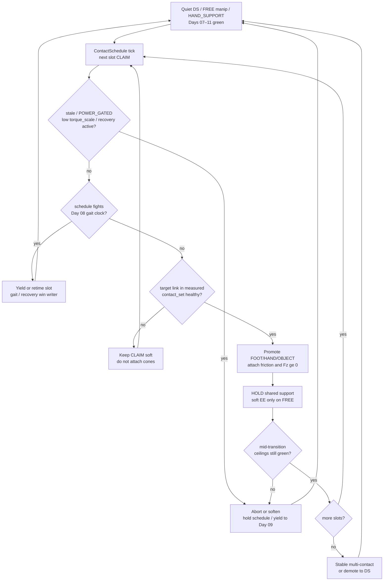
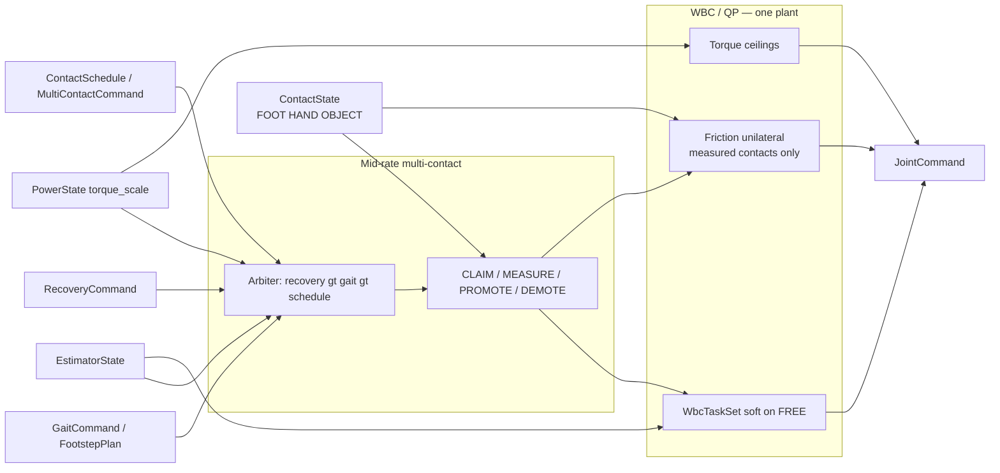
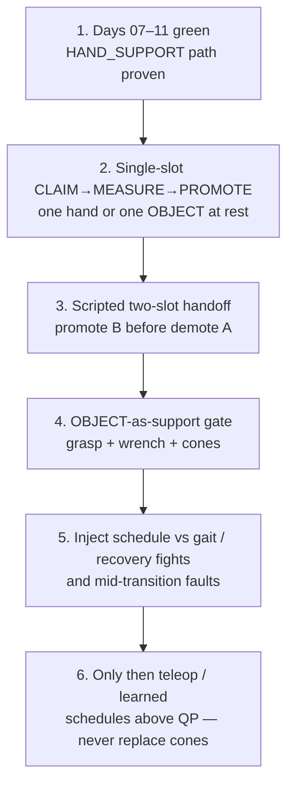

# Day 12 — Multi-contact transitions / object-as-support / loco-manip scheduling


[Day 11](/lessons/day-11-hand-support-loco-manipulation) owned promoting *measured* hand contact into the Day 07 hard support set beside the feet — CLAIM without measure forbidden, mid-contact demote on flicker / stale / `POWER_GATED`, still one plant. [Day 10](/lessons/day-10-upper-body-manipulation) owned soft EE / grasp on FREE limbs. [Day 09](/lessons/day-09-push-recovery) owned mid-event abort and `RecoveryCommand`. [Day 08](/lessons/day-08-stepping-locomotion) owned gait modes vs measured `contact_set`. [Day 07](/lessons/day-07-wbc-balance) owned the feasible program. [Day 06](/lessons/day-06-estimation-balance) owned the estimate. [Day 05](/lessons/day-05-power-bms) owned sag honesty.

Today owns the **contact schedule**: sequenced promote–demote across feet, hands, *and* grasped objects (object-as-support when measured), without a second plant and without fighting Day 08 gait clocks or Day 09 recovery. Schedules are **intent that wait for measurement**. Measured contact still owns the hard set.

## Contact schedule is ownership of transitions, not a prettier constraint clock

A multi-contact “choreography” that attaches hand and object cones because the schedule clock said $t = 1.2\,\mathrm{s}$ is just CLAIM-as-truth with more limbs. The schedule proposes *who should take load next*; measurement admits them; demotion is mandatory when confidence, wrench agreement, or ceilings fail mid-transition.

| Layer | Owns | Must not own |
|-------|------|--------------|
| Contact schedule | Ordered promote / hold / demote intent across feet, hands, OBJECT slots | Friction cones / FOC / BMS / gait truth |
| Measured contact | Membership in hard `contact_set` (FOOT \| HAND \| OBJECT) with confidence | Teleop or schedule wish as constraint truth |
| Gait (Day 08) | Intended DS/SS/swing clock vs measured feet | Being overridden by object-plant timing |
| Recovery (Day 09) | Mid-disturbance abort / emergency step | Losing the writer fight to a stuck OBJECT_SUPPORT hold |
| Soft tasks | EE / grasp / posture on **FREE** limbs only | Parallel “object balancer” plant |
| Honesty | Mid-transition stale / `POWER_GATED` / flicker / wrench disagree → abort/soften/demote | Heroic completion of the next schedule phase into brownout |

**Core thesis:** multi-contact transitions consume the same `EstimatorState` + Day 07 friction / unilaterality + `torque_scale`. A `ContactSchedule` (or thin `MultiContactCommand`) sequences CLAIM → wait-for-measure → PROMOTE → HOLD → DEMOTE across limbs and grasped objects. `SupportContact.kind = OBJECT` joins the hard set **only when measured and wrench-agreed**. Soft EE remains for FREE limbs. There is still **one** QP face — not a schedule-driven second plant that finishes a crate brace into a collapsing bus.



**Ownership rule:** one writer for *schedule / multi-contact intent* and one writer for *measured* `contact_set`. When they disagree mid-transition, **measured contact wins for constraints**. Intent aborts, softens, retimes, or waits — it does not attach OBJECT cones because the choreography said “lean on the crate now.” Day 08 gait and Day 09 recovery outrank a stuck schedule hold.

## How today fits the Days 05–11 stack

| Day | What you already froze | What Day 12 reuses |
|-----|------------------------|--------------------|
| 05 | `torque_scale`, `POWER_GATED`, sag honesty | Same ceilings bind **every** joint through every promote/demote |
| 06 | `EstimatorState`, age / stale, contact modes | OBJECT / hand / foot SUPPORT consume the same estimate |
| 07 | Tasks vs hard friction / unilaterality | New contacts join the **hard** set only when measured |
| 08 | Gait modes vs measured `contact_set` | Schedule must **not fight** gait clocks; feet stay honest |
| 09 | Mid-event abort / soften; `RecoveryCommand` | Mid-transition abort; recovery preempts schedule holds |
| 10 | Soft EE / grasp; FREE vs CLAIM honesty | CLAIM without measure still forbidden for every slot |
| 11 | MEASURED_SUPPORT hands; LOCO_MANIP | Hands remain first-class; OBJECT is the new measured kind |

Do not bolt a “multi-contact optimizer” that writes `JointCommand` beside the QP when the schedule advances. That is Day 10’s second-plant anti-pattern wearing a crate-brace demo.

## Promote–demote sequencing across feet, hands, and objects

Day 11’s hand honesty table generalizes to a **per-slot** lifecycle:

| Slot phase | Meaning | Allowed today |
|------------|---------|---------------|
| FREE | No trusted load for this link / object frame | Soft EE / grasp only |
| CLAIM | Schedule wants this slot to take weight next | Approach / soft contact seek — **no** hard cones yet |
| MEASURED | Link (or grasped object contact) in measured `contact_set` with healthy confidence + wrench agreement | Eligible to promote |
| PROMOTE / HOLD | Hard friction + $F_z \ge 0$ attached; soft EE on that limb dropped to residual | Weight transfer under expanded support |
| DEMOTE | Leave hard set on flicker / stale / gated / schedule unload | Soft EE may return only if intentionally FREE again |

**Sequencing rules (all required):**

1. **One promote at a time** (or a documented simultaneous pair) — no “attach every cone the schedule listed this tick.”
2. Intent CLAIMs the next slot; measurement must confirm before cones attach.
3. Demote the *unloading* contact only after the *loading* contact is MEASURED and the QP stays feasible — never free a still-loaded sole or palm to clear a prettier pose.
4. OBJECT slots require grasp integrity **and** object–world wrench agreement (not just “fingers closed”).
5. Mid-sequence `POWER_GATED` / stale / recovery → freeze or abort the schedule; do not advance phases.

Demotion is success when the crate slipped, the palm flickered, or the pack sagged. A robot that always finishes the next schedule beat into a collapsing bus is ignoring Day 05 with a prettier multi-contact demo.

## Object-as-support honesty

A grasped crate, handrail, or table edge is **not** an end-effector weight. It is a candidate `SupportContact` with `kind = OBJECT` that joins the hard set only when:

| Gate | Required |
|------|----------|
| Grasp integrity | Fingers / clamp still measured closed; grasp age inside budget |
| Object contact | Object–world (or object–robot) contact in measured set with confidence |
| Wrench agreement | Estimated object wrench consistent with expected support normal / mu |
| Schedule CLAIM | Intent allowed OBJECT_SUPPORT or MULTI_CONTACT for that slot |
| Feasibility | QP remains feasible after attaching object cones under current `torque_scale` |

**Forbidden:** treating “we are holding something” as object-as-support; attaching object cones from grasp alone; using a second Cartesian plant to “balance through the crate”; promoting OBJECT while Day 09 recovery owns the mode.

Object frames, mu, and normals belong in the same documented cone family as feet and hands (Day 07 honesty). If you cannot name the contact frame and friction model, you are not ready to promote OBJECT.

## Schedule vs gait / recovery — non-fight rules

Multi-contact scheduling is where teams accidentally create three writers on `WbcTaskSet.mode`. Freeze a priority:

| Conflict | Winner | Schedule behavior |
|----------|--------|-------------------|
| Active `RecoveryCommand` (Day 09) | Recovery | Abort / hold schedule; demote non-essential OBJECT/HAND supports if recovery needs feet-first escape |
| Gait swing / touchdown commit (Day 08) | Measured feet + gait owner | Retime or pause OBJECT/HAND promote; never steal swing constraints mid-step |
| `POWER_GATED` / low `torque_scale` | Power honesty | Soften / abort transition; no new promotes |
| Schedule CLAIM vs missing measure | Measured contact | Wait; soft seek only |
| Two schedule slots disagree | Single schedule owner | One writer; explicit priority_hint — no peer planners |



**Hard vs soft:** support constraints on **measured** FOOT / HAND / OBJECT stay hard. Soft EE authority lives only on FREE limbs. If the QP goes infeasible under the expanded set, demote / abort / soften — do not silently drop an object cone so the choreography “makes it.”

## Mid-transition abort / soften honesty

Transitions are where teams disable safety “just until the handoff settles.” Do not.

| Signal mid-transition | Required behavior |
|-----------------------|-------------------|
| `INPUT_STALE` / confidence cliff | Freeze schedule; demote newly promoted contacts that lost confidence; hold safest measured support |
| `POWER_GATED` / falling `torque_scale` | Abort remaining promotes; raise margins; never finish crate lean into brownout |
| Contact flicker / wrench disagree | Demote that slot to FREE/CLAIM; do not keep cones on noise |
| Grasp integrity lost on OBJECT | Immediate OBJECT demote; treat as drop / recovery if CoM was biased onto it |
| Foot `contact_set` collapses mid-handoff | Yield to Day 09 recovery; schedule is not the escape owner |
| QP infeasible under expanded cones | Demote newest promote and/or drop soft EE — do not drop unilaterality |
| Recovery asserts | Preempt schedule writer; clear or soften MULTI_CONTACT hold |

Abort, demote, and soften are **success paths** when the object lied, the wall was grease, or the pack sagged mid-handoff.

## Shared API: schedule + OBJECT on the same stack

Keep Day 02 / 04 wire honesty. Cyclic commands still carry `BusHeader`. Extend Day 10–11 `ManipulationCommand` / `WbcTaskSet` and Day 06–08 `ContactState` — do not invent a parallel “multi-contact bus”:

```text
BusHeader:
  node_id, seq
  t_sample, clock_domain, age_budget_ms
  faults

# Upstream (read-only here)
EstimatorState, PowerState  ⊇ BusHeader

ContactState ⊇ BusHeader:
  contact_set[]        # feet, hands, AND objects when measured
  SupportContact:
    link_id / frame    # e.g. left_foot, right_palm, crate_top
    kind               # FOOT | HAND | OBJECT
    mu, normal, wrench_est?
    confidence, age_ms
    flags              # settling / flicker / gated / grasp_lost
    parent_grasp_id?   # for OBJECT: which grasp frames this support

# Thin multi-contact face (host / mid-rate)
ContactSchedule ⊇ BusHeader:          # or MultiContactCommand
  intent               # IDLE | MULTI_CONTACT | OBJECT_SUPPORT | ABORT
  slots[]:
    target_frame       # FOOT / HAND / OBJECT frame
    phase              # FREE | CLAIM | PROMOTE | HOLD | DEMOTE
    earliest_t / latest_t?   # soft timing hints — NOT constraint truth
    priority_hint
  yield_to             # GAIT | RECOVERY | POWER   # explicit non-fight
  relax_on_fault       # stale / POWER_GATED / flicker / grasp_lost → abort/demote

# Extends Day 10–11 manipulation face (optional merge)
ManipulationCommand ⊇ BusHeader:
  intent               # … | CLAIM_SUPPORT | LOCO_MANIP
                       # | OBJECT_SUPPORT | MULTI_CONTACT | ABORT
  ee_refs[] / hand_refs[]
  hand_role[] / support_claim[]
  object_claim[]       # which OBJECT frames intent wants loaded
  schedule_ref?        # link to active ContactSchedule id
  relax_on_fault

# Extended Day 07–11 task face
WbcTaskSet ⊇ BusHeader:
  mode                 # STANCE_DS | STANCE_SS | SWING | IMPACT | RECOVER_IP
                       # | MANIP | HAND_SUPPORT | LOCO_MANIP
                       # | OBJECT_SUPPORT | MULTI_CONTACT | ...
  com_ref / capture_ref?
  foot_refs[]
  hand_support_refs[]?
  object_support_refs[]?  # residual contact / unload bias for MEASURED OBJECT
  ee_refs[]               # soft EE — FREE limbs only
  hand_refs[]
  posture_bias?
  priority_order[]
  relax_on_fault

# Downstream muscle (Day 02) — ceilings still reflect torque_scale
JointCommand ⊇ BusHeader:
  q_des? / qd_des? / tau_ff?
  iq_ceiling? / tau_ceiling?
  flags                # STO / soften / hold
```

Higher layers publish schedule / object-support intent. Measured `ContactState` owns support membership. Gait and recovery keep their writers. Rate loops enforce BMS ceilings. Nobody re-implements FOC or AHRS inside the multi-contact choreographer.

**Physical ↔ digital pairing for multi-contact transitions**

| Physical | Digital twin / backing |
|----------|------------------------|
| Same `EstimatorState` under changing support membership | No perfect-state schedule that always promotes on time |
| OBJECT frame normals / mu vs real crate / rail | Matched cone params or logged tables as Day 07 feet |
| Grasp integrity + object wrench vs schedule CLAIM | Twin must delay / drop object contact; claim alone never enables cones |
| Promote then demote handoff under sag | `torque_scale` replay — no infinite-torque brace through the crate |
| Mid-transition flicker / grease slip / grasp pop | Injected contact dropout mid-handoff; demote path proven |
| Schedule vs gait collision (plant during swing) | Twin must show yield/retime — not silent gait override |
| Recovery preempt during OBJECT hold | Injected push mid-HOLD; schedule aborts, recovery owns mode |
| Mid-rate schedule tick + jitter | Cannot beat hardware cadence or hide age faults |

If the twin always promotes on the schedule clock with sticky OBJECT contacts and a full pack while hardware sees delayed `contact_set` and sag, you will tune handoff gains forever and never ship a transition that survives a tired bus.

## Bring-up sequence (before free multi-contact choreography)

Days 07–11 green (stance, step, recovery, FREE-hand reach, measured hand SUPPORT / loco-manip with mid-contact faults proven). Then:



1. **Days 07–11 green** — hand SUPPORT abort paths still behave; no open recovery or gait fights.
2. **Single-slot script** — CLAIM → wait for MEASURED → PROMOTE → HOLD → DEMOTE on one known surface or fixed object; feet remain primary; confirm QP feasible.
3. **Two-slot handoff** — scripted promote of B only after A is healthy; demote A only after B holds load share; monitor wrench share and `torque_scale`.
4. **OBJECT-as-support** — grasped object with documented frame/mu; confirm grasp_lost and wrench-disagree demote; no CoM bias onto OBJECT until MEASURED.
5. **Non-fight + mid-transition faults** — force schedule-during-swing, recovery-during-HOLD, stale / gated / flicker / grasp pop in twin **and** on hardware; confirm yield / abort / demote, not heroic completion.
6. **Then** add teleop or learned residuals that choose schedule slots / timing above the QP — never replace cones, FOC, `torque_scale`, gait, or recovery writers. Perception-driven affordances and richer schedule discovery wait for Day 13+.

Skip to “RL multi-contact dances in sim” and hardware’s first real crate handoff becomes an unplanned tip / brownout experiment with better video.

## Failure gallery

| Symptom | Likely cause |
|---------|----------------|
| Promotes on air / tips mid-handoff | Schedule phase treated as MEASURED; cones without `contact_set` |
| Twin handoffs, hardware faceplants | Perfect OBJECT contacts / infinite `torque_scale` in sim |
| Completes crate lean into brownout | Mid-transition abort missing; ceilings not consulted |
| Object “wins,” foot slips | Soft EE or schedule treated as hard; unilaterality dropped |
| Grasp-only “object support” | OBJECT promoted without object–world wrench / contact gate |
| Chatters on every brush | Accidental contact promoted without confidence / wrench gate |
| Second plant for object brace | Parallel optimizer writing `JointCommand`; fights Day 07 program |
| Schedule freezes loaded sole for pose | Intent owns foot constraints instead of measured feet |
| QP infeasible → silent cone drop | Demote/abort path missing; “make it feasible” anti-pattern |
| Gait / recovery fights schedule | Multiple writers on `WbcTaskSet` / mode; no arbiter |
| Swing stolen by OBJECT promote | Schedule did not yield to Day 08 gait commit |
| Net learns only on sticky crates | Residual learned without flicker / sag / delayed contact / grasp pop |

## What to freeze this week

Extend [frames](/frames) and your control config with:

- OBJECT support frames, normals, mu, grasp_id linkage, and wrench / confidence gates aligned with feet and hands
- Who owns **ContactSchedule intent** vs **measured** `contact_set` vs **gait** vs **recovery** (disagree → wait/yield/demote; recovery and gait outrank schedule holds)
- `SupportContact.kind = OBJECT` + grasp_lost / flicker flags
- `ContactSchedule` / `MultiContactCommand` phases FREE → CLAIM → PROMOTE → HOLD → DEMOTE with `yield_to`
- `WbcTaskSet` modes `OBJECT_SUPPORT` / `MULTI_CONTACT`; soft EE only on FREE limbs
- Mid-transition abort / demote for stale, `POWER_GATED`, low `torque_scale`, flicker, and grasp integrity loss
- Twin hooks: matched object loads, contact delay/dropout, grasp pop, schedule-vs-gait collisions, sag under handoff peaks — same as hardware
- Bring-up gate: no free multi-contact choreography / learned schedules until steps 1–5 above are green

The lesson is not “play a contact MIDI file until the robot looks busy.” It is **make multi-contact transitions the same contact-rich program in silicon and in the twin**: one estimate, honest power ceilings, measured FOOT/HAND/OBJECT in the hard support set, schedules that wait for measurement and yield to gait/recovery, soft tasks only on FREE limbs, and abort / demote paths that stay honest when the object or the pack lies mid-handoff.

## Next

**Day 13** — Perception-driven support affordances / contact discovery feeding schedules: vision and tactile proposals become *schedule candidates* only; measured contact still owns the hard set; no detector-as-constraint-truth; affordance confidence gates CLAIM, not cones.
