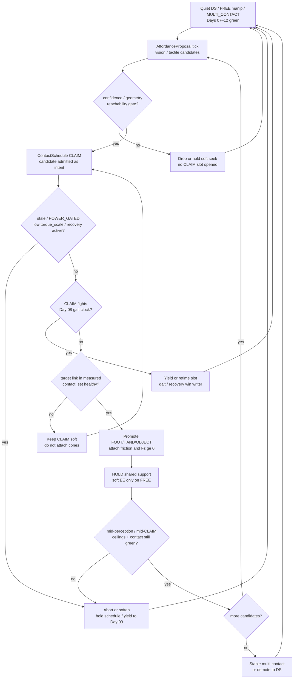
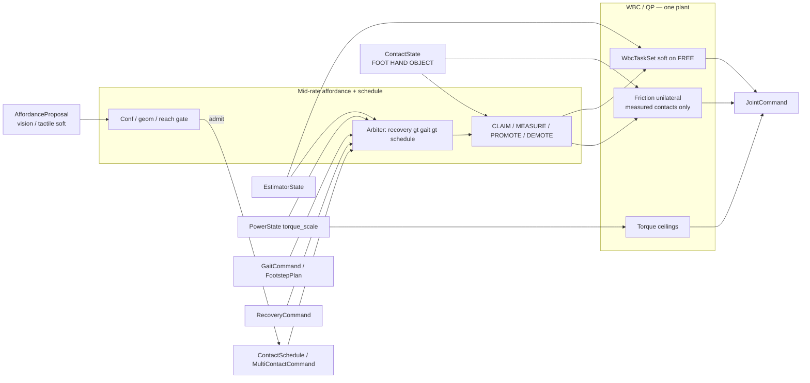
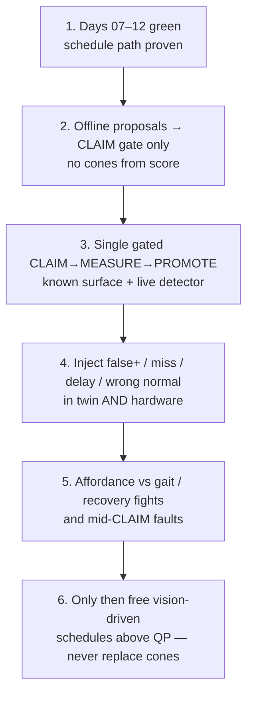

# Day 13 — Perception-driven support affordances / contact discovery


[Day 12](/lessons/day-12-multicontact-transitions) owned the `ContactSchedule`: CLAIM → MEASURE → PROMOTE → HOLD → DEMOTE across FOOT / HAND / OBJECT; schedules are intent that wait for measurement; measured `ContactState` owns the hard set; one WBC/QP; yield to Day 08 gait and Day 09 recovery. [Day 11](/lessons/day-11-hand-support-loco-manipulation) owned promoting *measured* hand contact into the Day 07 hard support set. [Day 10](/lessons/day-10-upper-body-manipulation) owned soft EE / grasp on FREE limbs. [Day 09](/lessons/day-09-push-recovery) owned mid-event abort and `RecoveryCommand`. [Day 08](/lessons/day-08-stepping-locomotion) owned gait modes vs measured `contact_set`. [Day 07](/lessons/day-07-wbc-balance) owned the feasible program. [Day 06](/lessons/day-06-estimation-balance) owned the estimate. [Day 05](/lessons/day-05-power-bms) owned sag honesty.

Today owns **support affordance proposals** from vision, tactile, and related detectors as **schedule candidates only**. Affordance detectors propose *WHERE / WHAT* to CLAIM next. Affordance confidence gates **CLAIM** (entry into the schedule) — **not** friction cones. Measured contact still owns the hard set. **No detector-as-constraint-truth.** Perception never attaches cones, never replaces `ContactState`, never writes `JointCommand`, never fights gait or recovery.

## Affordance proposals are candidates, not constraint truth

A detector that attaches hand or object cones because the vision score crossed $0.9$ is just CLAIM-as-truth wearing a neural net. Proposals feed *schedule slots*; measurement still admits them; demotion is still mandatory when confidence, wrench agreement, or ceilings fail — including when the detector still “believes” the rail is there.

| Layer | Owns | Must not own |
|-------|------|--------------|
| Affordance / perception | Soft `AffordanceProposal` / `ContactAffordance` candidates (WHERE / WHAT / confidence / geometry) | Friction cones / `ContactState` / FOC / BMS / gait / recovery truth |
| Contact schedule | Whether a CLAIM slot is *allowed* given gated proposals; ordered promote / hold / demote intent | Treating detector score as MEASURED; attaching cones from vision alone |
| Measured contact | Membership in hard `contact_set` (FOOT \| HAND \| OBJECT) with confidence + wrench agreement | Teleop, schedule, or detector wish as constraint truth |
| Gait (Day 08) | Intended DS/SS/swing clock vs measured feet | Being overridden by a high-confidence false-positive rail CLAIM |
| Recovery (Day 09) | Mid-disturbance abort / emergency step | Losing the writer fight to a stuck affordance-driven HOLD |
| Soft tasks | EE / grasp / posture on **FREE** limbs only | Parallel “perception plant” writing `JointCommand` |
| Honesty | Mid-CLAIM stale / `POWER_GATED` / flicker / missed detection / wrong normal → abort/soften/demote | Heroic completion of a vision-driven handoff into brownout or grease |

**Core thesis:** perception-driven affordances consume the same `EstimatorState` + Day 07 friction / unilaterality + `torque_scale` stack. An `AffordanceProposal` (or thin `ContactAffordance` feed) is a **soft candidate** into `ContactSchedule` CLAIM slots. Confidence / geometry / reachability gates whether a CLAIM is **allowed** — not whether cones attach. MEASURE is still required before PROMOTE; detector score $\neq$ MEASURED. Soft EE remains for FREE limbs. There is still **one** QP face — not a vision-driven second plant that finishes a wall brace because the detector looked sure.



**Ownership rule:** one writer for *affordance candidates*, one writer for *schedule intent*, one writer for *measured* `contact_set`. When they disagree, **measured contact wins for constraints**. Affordance confidence never attaches cones. Intent aborts, softens, retimes, or waits — it does not promote OBJECT because the detector said “rail at $(x,y,z)$.” Day 08 gait and Day 09 recovery still outrank a stuck schedule hold, even when perception is loud.

## How today fits the Days 05–12 stack

| Day | What you already froze | What Day 13 reuses |
|-----|------------------------|--------------------|
| 05 | `torque_scale`, `POWER_GATED`, sag honesty | Same ceilings bind every joint through every perception-driven CLAIM |
| 06 | `EstimatorState`, age / stale, contact modes | Affordance proposals consume the same estimate; they do not replace it |
| 07 | Tasks vs hard friction / unilaterality | New contacts join the **hard** set only when measured — never from detector score |
| 08 | Gait modes vs measured `contact_set` | Affordance CLAIMs must **not fight** gait clocks; feet stay honest |
| 09 | Mid-event abort / soften; `RecoveryCommand` | Mid-CLAIM / mid-perception abort; recovery preempts affordance-driven holds |
| 10 | Soft EE / grasp; FREE vs CLAIM honesty | CLAIM without measure still forbidden — vision CLAIM included |
| 11 | MEASURED_SUPPORT hands; LOCO_MANIP | Hands remain first-class; detector may *propose* hand CLAIM only |
| 12 | `ContactSchedule` phases; OBJECT kind | Affordance feed fills CLAIM slots; schedule lifecycle unchanged |

Do not bolt a “perception optimizer” that writes `JointCommand` or attaches cones beside the QP when a detector fires. That is Day 10’s second-plant anti-pattern wearing a depth camera.

## Affordance honesty / confidence gates

Day 12’s per-slot lifecycle still holds. Day 13 adds a **pre-CLAIM** gate: proposals must earn the right to open a CLAIM slot.

| Gate | Meaning | Allowed today |
|------|---------|---------------|
| DETECT | Vision / tactile / related publishes `AffordanceProposal` | Soft candidate only — **no** schedule phase change yet |
| CONF / GEOM / REACH | Confidence, surface geometry, normal plausibility, and reachability pass thresholds | Eligible to open a CLAIM slot |
| CLAIM | Schedule wants this slot to take weight next | Approach / soft contact seek — **no** hard cones yet |
| MEASURED | Link (or grasped object contact) in measured `contact_set` with healthy confidence + wrench agreement | Eligible to promote — **detector score does not count** |
| PROMOTE / HOLD | Hard friction + $F_z \ge 0$ attached; soft EE on that limb dropped to residual | Weight transfer under expanded support |
| DEMOTE | Leave hard set on flicker / stale / gated / schedule unload / perception retract | Soft EE may return only if intentionally FREE again |

**Sequencing rules (all required):**

1. Affordance confidence gates **CLAIM entry**, not cone attach — a high score without MEASURE still cannot promote.
2. One CLAIM admission at a time (or a documented simultaneous pair) — no “CLAIM every rail the detector listed this tick.”
3. MEASURE still required before PROMOTE; detector score $\neq$ MEASURED.
4. Wrong normal / flipped geometry in the proposal must fail the gate or fail MEASURE / wrench agreement — never silently attach inverted cones.
5. Mid-sequence `POWER_GATED` / stale / recovery / perception dropout → freeze or abort the schedule; do not advance phases on stale pixels.

Demotion is success when the detector hallucinated a rail, the tactile spike was grease, or the pack sagged. A robot that always finishes the vision-driven handoff into a collapsing bus is ignoring Day 05 with a prettier depth demo.

## Detector vs measure vs schedule vs QP ownership

Perception is where teams accidentally create a fourth writer on support constraints. Freeze the split:

| Conflict | Winner | Affordance / schedule behavior |
|----------|--------|--------------------------------|
| Detector score vs missing measure | Measured contact | Wait; soft CLAIM seek only — **no cones** |
| False-positive high confidence | Measured contact (absence) | Drop CLAIM or never promote; log proposal for twin |
| Missed detection mid-HOLD | Measured contact (still present or gone) | Demote only if `contact_set` / wrench fails — not because vision blinked |
| Delayed perception | Schedule timing | Soft `earliest_t` / `latest_t` hints only; never constraint truth |
| Wrong normal / mu hint from vision | Documented cone family + MEASURE / wrench | Reject or correct before PROMOTE; never trust raw detector normal as hard |
| Active `RecoveryCommand` (Day 09) | Recovery | Abort / hold schedule; clear affordance-driven OBJECT/HAND CLAIMs if recovery needs feet-first escape |
| Gait swing / touchdown commit (Day 08) | Measured feet + gait owner | Retime or pause affordance CLAIM; never steal swing constraints |
| `POWER_GATED` / low `torque_scale` | Power honesty | Soften / abort; no new CLAIMs from perception |
| Two detectors disagree | Single affordance / schedule owner | One writer into CLAIM slots; explicit priority — no peer perception plants |



**Hard vs soft:** support constraints on **measured** FOOT / HAND / OBJECT stay hard. Soft EE authority lives only on FREE limbs. Affordance proposals are softer still — they feed CLAIM, they do not feed cones. If the QP goes infeasible under the expanded set, demote / abort / soften — do not silently drop an object cone so the detector “makes it.”

## Mid-perception / mid-CLAIM abort honesty

Vision and tactile are where teams disable safety “just until the detector settles.” Do not.

| Signal mid-CLAIM / mid-perception | Required behavior |
|-----------------------------------|-------------------|
| `INPUT_STALE` / confidence cliff on estimate or contact | Freeze schedule; demote newly promoted contacts that lost confidence; hold safest measured support |
| Perception dropout / camera stall / tactile silence | Do **not** promote on last-known proposal; expire CLAIM candidates by age |
| False-positive retract (detector flips off after CLAIM) | Keep soft seek or demote CLAIM; never keep cones that were never MEASURED |
| Missed detection while contact still measured | Trust `ContactState`; do not demote solely because vision blinked |
| Wrong normal / geometry revision mid-CLAIM | Re-gate; fail PROMOTE if wrench / normal disagree |
| `POWER_GATED` / falling `torque_scale` | Abort remaining CLAIMs / promotes; raise margins; never finish vision lean into brownout |
| Contact flicker / wrench disagree | Demote that slot to FREE/CLAIM; do not keep cones on noise |
| Foot `contact_set` collapses mid-handoff | Yield to Day 09 recovery; affordance schedule is not the escape owner |
| QP infeasible under expanded cones | Demote newest promote and/or drop soft EE — do not drop unilaterality |
| Recovery asserts | Preempt schedule writer; clear or soften MULTI_CONTACT / affordance CLAIM hold |

Abort, demote, and soften are **success paths** when the detector hallucinated, the wall was grease, or the pack sagged mid-handoff.

## Shared API: affordance feed into Day 12 schedule shapes

Keep Day 02 / 04 wire honesty. Cyclic commands still carry `BusHeader`. Extend Day 12 `ContactSchedule` / `ManipulationCommand` / `WbcTaskSet` and Day 06–08 `ContactState` — do not invent a parallel “perception bus” or second plant:

```text
BusHeader:
  node_id, seq
  t_sample, clock_domain, age_budget_ms
  faults

# Upstream (read-only here)
EstimatorState, PowerState  ⊇ BusHeader

ContactState ⊇ BusHeader:
  contact_set[]        # feet, hands, AND objects when measured
  SupportContact:
    link_id / frame
    kind               # FOOT | HAND | OBJECT
    mu, normal, wrench_est?
    confidence, age_ms
    flags              # settling / flicker / gated / grasp_lost
    parent_grasp_id?

# Soft perception feed (host / mid-rate) — NEVER attaches cones
AffordanceProposal ⊇ BusHeader:       # or ContactAffordance[]
  proposals[]:
    target_frame       # candidate FOOT / HAND / OBJECT frame
    kind_hint          # FOOT | HAND | OBJECT
    pose_hint          # WHERE in world / base
    normal_hint?       # soft — not hard cone truth
    mu_hint?
    confidence         # gates CLAIM entry, NOT cone attach
    geometry_ok        # planar / edge / graspable checks
    reachability_ok
    age_ms             # expire stale pixels / tactile spikes
    source             # VISION | TACTILE | FUSED | ...
  relax_on_fault       # stale / dropout → expire candidates

# Thin multi-contact face (host / mid-rate) — Day 12 + affordance admit
ContactSchedule ⊇ BusHeader:          # or MultiContactCommand
  intent               # IDLE | MULTI_CONTACT | OBJECT_SUPPORT | ABORT
  slots[]:
    target_frame
    phase              # FREE | CLAIM | PROMOTE | HOLD | DEMOTE
    earliest_t / latest_t?   # soft timing hints — NOT constraint truth
    priority_hint
    affordance_ref?    # which AffordanceProposal admitted this CLAIM
  yield_to             # GAIT | RECOVERY | POWER
  admit_policy         # min confidence / geom / reach to open CLAIM
  relax_on_fault       # stale / POWER_GATED / flicker / grasp_lost /
                       # perception_dropout → abort/demote

# Extends Day 10–12 manipulation face (optional merge)
ManipulationCommand ⊇ BusHeader:
  intent               # … | CLAIM_SUPPORT | LOCO_MANIP
                       # | OBJECT_SUPPORT | MULTI_CONTACT | ABORT
  ee_refs[] / hand_refs[]
  hand_role[] / support_claim[]
  object_claim[]
  schedule_ref?
  affordance_ref?      # optional link to active proposal set
  relax_on_fault

# Extended Day 07–12 task face — unchanged ownership
WbcTaskSet ⊇ BusHeader:
  mode                 # STANCE_DS | STANCE_SS | SWING | IMPACT | RECOVER_IP
                       # | MANIP | HAND_SUPPORT | LOCO_MANIP
                       # | OBJECT_SUPPORT | MULTI_CONTACT | ...
  com_ref / capture_ref?
  foot_refs[]
  hand_support_refs[]?
  object_support_refs[]?
  ee_refs[]               # soft EE — FREE limbs only
  hand_refs[]
  posture_bias?
  priority_order[]
  relax_on_fault

# Downstream muscle (Day 02) — ceilings still reflect torque_scale
JointCommand ⊇ BusHeader:
  q_des? / qd_des? / tau_ff?
  iq_ceiling? / tau_ceiling?
  flags                # STO / soften / hold
```

Higher layers publish affordance candidates and schedule intent. Measured `ContactState` owns support membership. Gait and recovery keep their writers. Rate loops enforce BMS ceilings. Nobody re-implements FOC, AHRS, or friction cones inside the affordance detector.

**Physical ↔ digital pairing for perception-driven CLAIMs**

| Physical | Digital twin / backing |
|----------|------------------------|
| Same `EstimatorState` under changing support membership | No perfect-state schedule that always CLAIMs when the detector fires |
| Detector false positives (phantom rails / crates) | Twin **must** inject false positives; CLAIM without MEASURE never enables cones |
| Missed detections / camera stall / tactile dropout | Twin must drop or delay proposals mid-CLAIM; expire by `age_ms` |
| Delayed perception vs contact latency | Matched delay budgets — soft timing only; never constraint truth |
| Wrong normals / flipped geometry from vision | Injected bad normals; gate or wrench-disagree demote proven |
| Affordance CLAIM then demote under sag | `torque_scale` replay — no infinite-torque brace on a hallucinated rail |
| Schedule vs gait collision (CLAIM during swing) | Twin must show yield/retime — not silent gait override |
| Recovery preempt during affordance HOLD | Injected push mid-HOLD; schedule aborts, recovery owns mode |
| Mid-rate perception + schedule tick + jitter | Cannot beat hardware cadence or hide age faults |

If the twin always promotes when the detector fires with sticky contacts and a full pack while hardware sees delayed `contact_set`, false positives, and sag, you will tune vision thresholds forever and never ship a CLAIM that survives a tired bus or a greased rail.

## Bring-up sequence (before free vision-driven multi-contact)

Days 07–12 green (stance, step, recovery, FREE-hand reach, measured hand SUPPORT / loco-manip, scripted multi-contact / OBJECT handoffs with mid-transition faults proven). Then:



1. **Days 07–12 green** — schedule abort paths still behave; no open recovery or gait fights; OBJECT / HAND promotes still require MEASURE.
2. **Offline / logged proposals** — replay detectors into the CLAIM admit gate only; confirm high score without MEASURE never attaches cones; confirm low score never opens CLAIM.
3. **Single live gated CLAIM** — one known surface or fixed object; vision or tactile proposes → confidence gate → CLAIM → wait for MEASURED → PROMOTE → HOLD → DEMOTE; feet remain primary; confirm QP feasible.
4. **Perception honesty injects** — false positives, missed detections, delayed perception, wrong normals in twin **and** on hardware; confirm drop / wait / demote, not heroic promote-on-score.
5. **Non-fight + mid-CLAIM faults** — force affordance-CLAIM-during-swing, recovery-during-HOLD, stale / gated / flicker / perception dropout; confirm yield / abort / demote.
6. **Then** add free vision-driven or learned residuals that choose affordance thresholds / schedule slots above the QP — never replace cones, FOC, `torque_scale`, gait, recovery, or measured `ContactState`. Richer scene graphs and teleop+affordance blend wait for Day 14+.

Skip to “end-to-end vision multi-contact in sim” and hardware’s first real rail grasp becomes an unplanned tip / brownout experiment with better depth video.

## Failure gallery

| Symptom | Likely cause |
|---------|----------------|
| Promotes on air / tips toward phantom rail | Detector score treated as MEASURED; cones without `contact_set` |
| Twin CLAIMs, hardware faceplants | Perfect detections / no false+ / infinite `torque_scale` in sim |
| Completes vision lean into brownout | Mid-CLAIM abort missing; ceilings not consulted |
| Detector “wins,” foot slips | Soft EE or affordance treated as hard; unilaterality dropped |
| Wrong-normal cone chatters / pulls through surface | `normal_hint` trusted as hard cone without MEASURE / wrench gate |
| Missed detection demotes healthy contact | Vision blink treated as contact truth instead of `ContactState` |
| Stale pixels keep CLAIMing | Proposal `age_ms` / dropout expire missing |
| Second plant for perception brace | Parallel optimizer writing `JointCommand`; fights Day 07 program |
| Schedule freezes loaded sole for pose | Intent / affordance owns foot constraints instead of measured feet |
| QP infeasible → silent cone drop | Demote/abort path missing; “make it feasible” anti-pattern |
| Gait / recovery fights affordance CLAIM | Multiple writers on `WbcTaskSet` / mode; no arbiter |
| Swing stolen by vision rail CLAIM | Schedule did not yield to Day 08 gait commit |
| Net learns only on sticky perfect depth | Residual learned without false+ / miss / delay / wrong normal / sag |

## What to freeze this week

Extend [frames](/frames) and your control config with:

- `AffordanceProposal` / `ContactAffordance` fields: pose / normal hints, confidence, geometry_ok, reachability_ok, `age_ms`, source — **soft only**
- Who owns **affordance candidates** vs **ContactSchedule intent** vs **measured** `contact_set` vs **gait** vs **recovery** (disagree → wait/yield/demote; measured contact wins for cones; recovery and gait outrank schedule holds)
- Admit policy: confidence / geometry / reachability gate **CLAIM**, never cone attach
- `ContactSchedule` `affordance_ref` + `admit_policy`; phases FREE → CLAIM → PROMOTE → HOLD → DEMOTE unchanged from Day 12
- Explicit rule: detector score $\neq$ MEASURED; perception never writes `JointCommand` or friction cones
- Mid-CLAIM / mid-perception abort / demote for stale, `POWER_GATED`, low `torque_scale`, flicker, grasp integrity loss, and perception dropout
- Twin hooks: false positives, missed detections, delayed perception, wrong normals, sag under handoff peaks, schedule-vs-gait collisions — same as hardware
- Bring-up gate: no free vision-driven multi-contact / learned affordance residuals until steps 1–5 above are green

The lesson is not “let the detector drive the robot until the depth map looks busy.” It is **make perception-driven support the same contact-rich program in silicon and in the twin**: soft affordance candidates into schedule CLAIM slots, confidence gating entry not cones, one estimate, honest power ceilings, measured FOOT/HAND/OBJECT in the hard support set, schedules that wait for measurement and yield to gait/recovery, soft tasks only on FREE limbs, and abort / demote paths that stay honest when the detector or the pack lies mid-CLAIM.

## Next

**Day 14** — Learned residuals / richer scene graphs on the affordance→schedule stack: residual ranking of CLAIM candidates and light scene structure above the same measured hard set — still no detector-as-constraint-truth; twin must keep false+/miss/delay honesty before free learned multi-contact.
