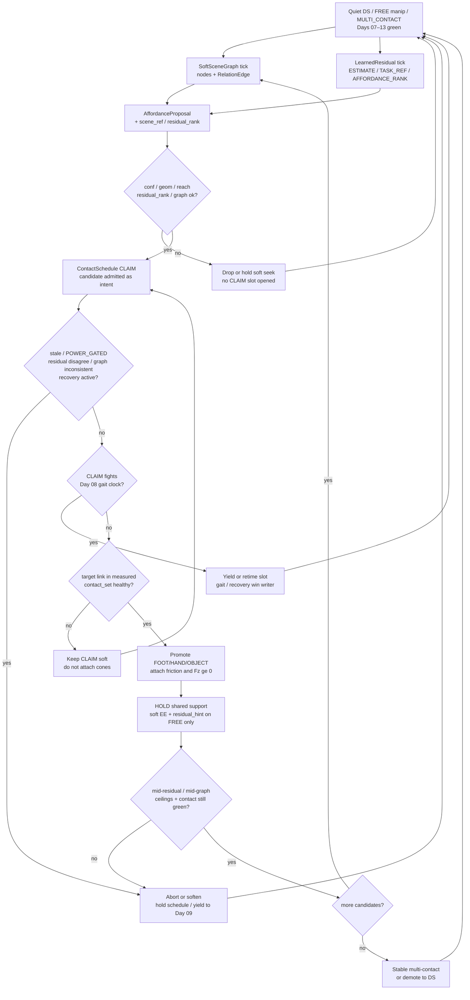
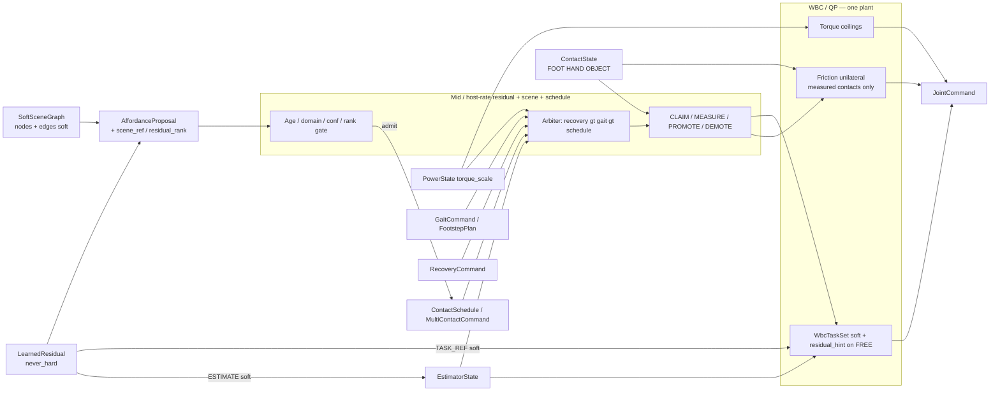
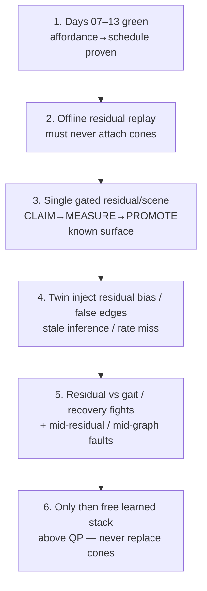

# Day 14 — Learned residuals / richer scene graphs on the affordance→schedule stack


[Day 13](/lessons/day-13-support-affordances) owned `AffordanceProposal` / `ContactAffordance` as soft CLAIM candidates only: confidence gates **CLAIM**, not cones; MEASURE required before PROMOTE; detector score $\neq$ MEASURED; measured `ContactState` owns the hard set; perception never attaches cones, never replaces contact, never writes `JointCommand`; yields to Day 08 gait and Day 09 recovery. [Day 12](/lessons/day-12-multicontact-transitions) owned the `ContactSchedule` lifecycle and OBJECT kind. [Day 11](/lessons/day-11-hand-support-loco-manipulation)–[Day 10](/lessons/day-10-upper-body-manipulation) owned measured hand support and soft EE on FREE limbs. [Day 09](/lessons/day-09-push-recovery)–[Day 08](/lessons/day-08-stepping-locomotion) owned recovery abort and gait vs measured `contact_set`. [Day 07](/lessons/day-07-wbc-balance) owned the feasible program. [Day 06](/lessons/day-06-estimation-balance) owned the estimate. [Day 05](/lessons/day-05-power-bms) owned sag honesty.

Today owns **learned residuals** and **richer scene graphs** as layers that sit **above** the hard stack: soft additive correctors and structured candidates into the Day 12/13 affordance→schedule path — **not** constraint truth, **not** a second plant, and **not** inside FOC / rate / QP microsecond loops until jitter is measured and budgeted.

## Residuals and scene graphs are soft correctors, not constraint truth

A residual net that writes friction cones, a scene graph that stamps `ContactState` membership, or an inference path that emits `JointCommand` beside the QP is detector-as-constraint-truth wearing a larger model. Residuals correct *soft* features and rank *soft* candidates. Scene graphs enrich *WHERE / WHAT / relations* among rails, crates, walls, and grasped objects. MEASURE still admits contacts. Demotion is still mandatory when residual disagreement, graph inconsistency, wrench disagreement, or ceilings fail — including when the net still “believes” the rail is load-bearing.

| Layer | Owns | Must not own |
|-------|------|--------------|
| Learned residual | Soft additive correction on `EstimatorState` features, soft task refs (`com_ref` / `ee_refs` / capture hints), or `AffordanceProposal` confidence / geometry **ranking** | Hard friction cones / $F_z \ge 0$ / `JointCommand` / FOC $i_q$ / BMS `torque_scale` override / `ContactState` membership |
| Scene graph | Structured `SoftSceneGraph` / `ObjectNode` / `SupportSurfaceNode` / `RelationEdge` feed that enriches affordance generation | Replacing `ContactState`; attaching cones from graph score; writing schedule phases without CLAIM admit |
| Affordance / perception | Soft `AffordanceProposal` candidates (WHERE / WHAT / confidence / geometry) — now with `scene_ref?` / `residual_rank?` | Friction cones / `ContactState` / FOC / BMS / gait / recovery truth |
| Contact schedule | Whether a CLAIM slot is *allowed* given gated proposals + residual/graph ranking; ordered promote / hold / demote intent | Treating residual or graph score as MEASURED; attaching cones from inference alone |
| Measured contact | Membership in hard `contact_set` (FOOT \| HAND \| OBJECT) with confidence + wrench agreement | Residual wish, graph edge, or schedule intent as constraint truth |
| Gait (Day 08) | Intended DS/SS/swing clock vs measured feet | Being overridden by a high-confidence residual CLAIM during swing |
| Recovery (Day 09) | Mid-disturbance abort / emergency step | Losing the writer fight to a stuck residual/graph-driven HOLD |
| Soft tasks | EE / grasp / posture on **FREE** limbs; optional `residual_hint` soft refs | Parallel “learned plant” writing `JointCommand` |
| Honesty | Mid-residual / mid-graph CLAIM abort on stale / `POWER_GATED` / flicker / residual disagreement / graph inconsistency | Heroic completion of a residual-driven handoff into brownout or a false edge |

**Core thesis:** learned residuals and richer scene graphs **consume** the same `EstimatorState` + `ContactState` + `PowerState` stack. A `LearnedResidual` / `ResidualCorrection` is a soft additive correction (estimate features, soft task refs, or affordance ranking). A `SoftSceneGraph` / `SceneGraphSnapshot` enriches `AffordanceProposal` generation with structured WHERE / WHAT / relations. Both still feed Day 12/13 CLAIM admit as **soft candidates**. Confidence / residual_rank / graph consistency gates whether a CLAIM is **allowed** — not whether cones attach. MEASURE is still required before PROMOTE; residual score $\neq$ MEASURED; graph score $\neq$ MEASURED. There is still **one** QP face — not a “learned plant” that finishes a wall brace because the residual looked sure. Inference runs at mid / host rates with `age_ms`; never inside the current loop or EtherCAT cyclic write path until jitter is measured and budgeted.



**Ownership rule:** one writer for *residual / scene soft feeds*, one writer for *affordance candidates*, one writer for *schedule intent*, one writer for *measured* `contact_set`. When they disagree, **measured contact wins for constraints**. Residual confidence and graph score never attach cones. Intent aborts, softens, retimes, or waits — it does not promote OBJECT because the residual ranked a phantom rail first. Day 08 gait and Day 09 recovery still outrank a stuck schedule hold, even when the net is loud.

## How today fits the Days 05–13 stack

| Day | What you already froze | What Day 14 reuses |
|-----|------------------------|--------------------|
| 05 | `torque_scale`, `POWER_GATED`, sag honesty | Same ceilings bind every joint through every residual/graph-driven CLAIM — residual never overrides BMS |
| 06 | `EstimatorState`, age / stale, contact modes | Residuals may soft-correct estimate **features**; they do not replace the estimate or erase age faults |
| 07 | Tasks vs hard friction / unilaterality | New contacts join the **hard** set only when measured — never from residual or graph score |
| 08 | Gait modes vs measured `contact_set` | Residual/graph CLAIMs must **not fight** gait clocks; feet stay honest |
| 09 | Mid-event abort / soften; `RecoveryCommand` | Mid-residual / mid-graph abort; recovery preempts residual-driven holds |
| 10 | Soft EE / grasp; FREE vs CLAIM honesty | CLAIM without measure still forbidden — residual CLAIM included; `residual_hint` stays soft |
| 11 | MEASURED_SUPPORT hands; LOCO_MANIP | Hands remain first-class; residual may *rank* hand CLAIM only |
| 12 | `ContactSchedule` phases; OBJECT kind | Residual/graph feed fills CLAIM slots; schedule lifecycle unchanged |
| 13 | Affordance soft CLAIM; conf gates CLAIM not cones | Scene graph enriches proposals; residual ranks them — detector-as-constraint-truth still forbidden |

Do not bolt a “learned plant” that writes `JointCommand` or attaches cones beside the QP when residual confidence fires. That is Day 10’s second-plant anti-pattern wearing a GPU.

## Residual honesty / rate / jitter gates

Day 13’s pre-CLAIM gate still holds. Day 14 adds **residual-domain** and **rate** honesty: residuals correct soft things at mid / host rates with explicit age — never as hard truth inside µs paths.

| Gate | Meaning | Allowed today |
|------|---------|---------------|
| INFER | Host / mid-rate publishes `LearnedResidual` / `SceneGraphSnapshot` | Soft only — **no** schedule phase change yet; **no** cone attach |
| AGE / JITTER | `age_ms` within budget; inference not inside current / EtherCAT cyclic | Eligible to influence soft refs or ranking; stale → expire |
| DOMAIN | `ESTIMATE` \| `TASK_REF` \| `AFFORDANCE_RANK` only | Never `HARD_CONTACT` / never `JOINT_CMD` / never `TORQUE_SCALE` |
| CONF / GEOM / REACH / RANK | Day 13 gates + residual_rank / graph consistency | Eligible to open a CLAIM slot |
| CLAIM | Schedule wants this slot to take weight next | Approach / soft contact seek — **no** hard cones yet |
| MEASURED | Link in measured `contact_set` with healthy confidence + wrench agreement | Eligible to promote — **residual / graph score does not count** |
| PROMOTE / HOLD | Hard friction + $F_z \ge 0$ attached; soft EE / residual_hint on FREE only | Weight transfer under expanded support |
| DEMOTE | Leave hard set on flicker / stale / gated / residual disagree / graph inconsistency | Soft EE / residual_hint may return only if intentionally FREE again |

**Sequencing rules (all required):**

1. Residual and scene-graph scores gate **CLAIM entry** and soft ranking — never cone attach.
2. `never_hard: true` is not decoration — API and runtime must refuse residual writes into friction / unilaterality / `JointCommand` / FOC / `torque_scale` / `ContactState`.
3. MEASURE still required before PROMOTE; residual score $\neq$ MEASURED; graph score $\neq$ MEASURED.
4. Inference runs at mid / host rates with `age_ms`; never inside the current loop or EtherCAT cyclic write path until jitter is measured and budgeted.
5. Residual disagreement with MEASURE / wrench, or graph inconsistency (false edge, missing node, flipped relation) → fail gate or demote — never silently trust the net.
6. Mid-sequence `POWER_GATED` / stale / recovery / inference dropout → freeze or abort the schedule; do not advance phases on stale tensors.

Demotion is success when the residual hallucinated support, the scene graph invented a rail–wall edge, or the pack sagged. A robot that always finishes the residual-driven handoff into a collapsing bus is ignoring Day 05 with a prettier training curve.

## Scene-graph vs affordance vs measure vs QP ownership

Learned layers are where teams accidentally create a fifth writer on support constraints. Freeze the split:

| Conflict | Winner | Residual / scene / schedule behavior |
|----------|--------|--------------------------------------|
| Residual score vs missing measure | Measured contact | Wait; soft CLAIM seek only — **no cones** |
| Graph edge vs missing measure | Measured contact | Drop or never promote; log false edge for twin |
| Residual bias vs MEASURE / wrench disagree | Measured contact + wrench | Demote / fail PROMOTE; residual does not win |
| Scene-graph false edge / missing node | Measured contact (absence or presence) | Expire CLAIM candidates; do not invent membership |
| Stale inference / rate miss | Schedule timing + age gate | Expire by `age_ms`; never constraint truth from last-known residual |
| Residual fighting soft task refs | Documented soft priority | `residual_hint` is soft additive — QP still owns feasibility |
| Active `RecoveryCommand` (Day 09) | Recovery | Abort / hold schedule; clear residual/graph-driven CLAIMs if recovery needs feet-first escape |
| Gait swing / touchdown commit (Day 08) | Measured feet + gait owner | Retime or pause residual CLAIM; never steal swing constraints |
| `POWER_GATED` / low `torque_scale` | Power honesty | Soften / abort; residual never overrides BMS |
| Two residuals / graphs disagree | Single residual+scene / schedule owner | One writer into CLAIM slots; explicit priority — no peer learned plants |
| Residual wants hard cone / JointCommand | Hard stack refusal | Reject at API; log anti-pattern |



**Hard vs soft:** support constraints on **measured** FOOT / HAND / OBJECT stay hard. Soft EE and `residual_hint` authority live only on FREE limbs and soft task refs. Residuals and scene graphs are softer still — they feed ranking and CLAIM, they do not feed cones. If the QP goes infeasible under the expanded set, demote / abort / soften — do not silently drop an object cone so the residual “makes it.”

## Mid-residual / mid-graph abort honesty

Learned mid-rate paths are where teams disable safety “just until the batch settles.” Do not.

| Signal mid-CLAIM / mid-residual / mid-graph | Required behavior |
|---------------------------------------------|-------------------|
| `INPUT_STALE` / confidence cliff on estimate or contact | Freeze schedule; demote newly promoted contacts that lost confidence; hold safest measured support |
| Inference dropout / host stall / rate miss | Do **not** promote on last-known residual; expire CLAIM candidates by `age_ms` |
| Residual disagreement with MEASURE / wrench | Fail PROMOTE or demote; never keep cones the residual invented |
| Graph inconsistency (false edge / missing node / flipped relation) | Re-gate; drop CLAIM or never promote; log for twin |
| Residual bias retract (net flips after CLAIM) | Keep soft seek or demote CLAIM; never keep cones that were never MEASURED |
| `POWER_GATED` / falling `torque_scale` | Abort remaining CLAIMs / promotes; raise margins; residual never finishes lean into brownout |
| Contact flicker / wrench disagree | Demote that slot to FREE/CLAIM; do not keep cones on noise |
| Foot `contact_set` collapses mid-handoff | Yield to Day 09 recovery; residual schedule is not the escape owner |
| QP infeasible under expanded cones | Demote newest promote and/or drop soft EE / residual_hint — do not drop unilaterality |
| Recovery asserts | Preempt schedule writer; clear or soften MULTI_CONTACT / residual CLAIM hold |
| Residual attempts hard write (cones / JointCommand / torque_scale) | Reject; treat as fault — not as “helpful autonomy” |

Abort, demote, and soften are **success paths** when the residual hallucinated, the graph lied, or the pack sagged mid-handoff.

## Shared API: residual + scene graph into Day 13 affordance shapes

Keep Day 02 / 04 wire honesty. Cyclic commands still carry `BusHeader`. Extend Day 13 `AffordanceProposal` / Day 12 `ContactSchedule` / `WbcTaskSet` — do not invent a parallel “learned bus” or second plant:

```text
BusHeader:
  node_id, seq
  t_sample, clock_domain, age_budget_ms
  faults

# Upstream (read-only here; residuals may soft-correct features only)
EstimatorState, PowerState  ⊇ BusHeader

ContactState ⊇ BusHeader:
  contact_set[]        # feet, hands, AND objects when measured
  SupportContact:
    link_id / frame
    kind               # FOOT | HAND | OBJECT
    mu, normal, wrench_est?
    confidence, age_ms
    flags              # settling / flicker / gated / grasp_lost
    parent_grasp_id?

# Soft learned residual (host / mid-rate) — NEVER hard
LearnedResidual ⊇ BusHeader:          # or ResidualCorrection
  domain               # ESTIMATE | TASK_REF | AFFORDANCE_RANK
  delta_estimate?      # soft feature deltas only
  delta_com_ref? / delta_ee_refs? / delta_capture?
  residual_rank?       # re-rank AffordanceProposal slots
  confidence
  age_ms               # expire stale inference
  never_hard: true     # API + runtime refuse cones / Fz / JointCmd /
                       # FOC iq / torque_scale / ContactState writes
  relax_on_fault       # stale / dropout / domain_violation → expire

# Soft scene structure (host / mid-rate) — NEVER ContactState
SoftSceneGraph ⊇ BusHeader:           # or SceneGraphSnapshot
  nodes[]:
    ObjectNode | SupportSurfaceNode:
      node_id, kind_hint, pose_hint
      normal_hint? / mu_hint?
      confidence, age_ms
  edges[]:
    RelationEdge:
      src, dst
      relation           # ON | BESIDE | SUPPORTS | GRASPED_BY | ...
      confidence, age_ms
  confidence
  age_ms
  relax_on_fault       # inconsistency / stale → expire candidates

# Soft perception feed — Day 13 + residual/scene enrichment
AffordanceProposal ⊇ BusHeader:
  proposals[]:
    target_frame
    kind_hint          # FOOT | HAND | OBJECT
    pose_hint
    normal_hint?       # soft — not hard cone truth
    mu_hint?
    confidence         # gates CLAIM entry, NOT cone attach
    geometry_ok
    reachability_ok
    residual_rank?     # from LearnedResidual AFFORDANCE_RANK
    scene_ref?         # SoftSceneGraph node / edge id
    age_ms
    source             # VISION | TACTILE | FUSED | RESIDUAL | SCENE | ...
  relax_on_fault

# Thin multi-contact face — Day 12/13 + residual/scene admit
ContactSchedule ⊇ BusHeader:
  intent               # IDLE | MULTI_CONTACT | OBJECT_SUPPORT | ABORT
  slots[]:
    target_frame
    phase              # FREE | CLAIM | PROMOTE | HOLD | DEMOTE
    earliest_t / latest_t?
    priority_hint
    affordance_ref?
    residual_ref?      # which LearnedResidual ranked this CLAIM
    scene_ref?
  yield_to             # GAIT | RECOVERY | POWER
  admit_policy         # min conf / geom / reach / residual_rank /
                       # graph consistency to open CLAIM
  relax_on_fault       # stale / POWER_GATED / flicker / grasp_lost /
                       # residual_disagree / graph_inconsistent /
                       # inference_dropout → abort/demote

ManipulationCommand ⊇ BusHeader:
  intent               # … | CLAIM_SUPPORT | LOCO_MANIP
                       # | OBJECT_SUPPORT | MULTI_CONTACT | ABORT
  ee_refs[] / hand_refs[]
  hand_role[] / support_claim[]
  object_claim[]
  schedule_ref?
  affordance_ref?
  residual_ref?
  scene_ref?
  relax_on_fault

# Extended task face — residual_hint soft only
WbcTaskSet ⊇ BusHeader:
  mode                 # STANCE_DS | STANCE_SS | SWING | IMPACT | RECOVER_IP
                       # | MANIP | HAND_SUPPORT | LOCO_MANIP
                       # | OBJECT_SUPPORT | MULTI_CONTACT | ...
  com_ref / capture_ref?
  residual_hint?       # soft additive on com_ref / ee_refs / capture
                       # NEVER hard constraints
  foot_refs[]
  hand_support_refs[]?
  object_support_refs[]?
  ee_refs[]            # soft EE — FREE limbs only
  hand_refs[]
  posture_bias?
  priority_order[]
  relax_on_fault

JointCommand ⊇ BusHeader:
  q_des? / qd_des? / tau_ff?
  iq_ceiling? / tau_ceiling?
  flags                # STO / soften / hold
```

Higher layers publish residual corrections, scene structure, affordance candidates, and schedule intent. Measured `ContactState` owns support membership. Gait and recovery keep their writers. Rate loops enforce BMS ceilings. Nobody re-implements FOC, AHRS, or friction cones inside the residual net or the scene graph.

**Physical ↔ digital pairing for residual / scene-driven CLAIMs**

| Physical | Digital twin / backing |
|----------|------------------------|
| Same `EstimatorState` under changing support membership | No perfect-state residual that always CLAIMs when the net fires |
| Residual bias (systematic soft error) | Twin **must** inject residual bias; CLAIM without MEASURE never enables cones |
| Scene-graph false edges / missing nodes | Twin must inject false edges and drop nodes mid-CLAIM; expire by `age_ms` |
| Inference delay / dropout matching hardware age budgets | Matched delay / rate-miss budgets — soft timing only; never constraint truth |
| Residual vs MEASURE disagreement | Injected disagreement; fail PROMOTE / demote proven |
| `POWER_GATED` during residual-driven CLAIM | `torque_scale` replay — no infinite-torque brace on a residual-ranked rail |
| Residual fighting gait / recovery | Twin must show yield/retime/abort — not silent override |
| Mid-rate residual + scene + schedule tick + jitter | Cannot beat hardware cadence or hide age faults; no net inside cyclic write path |

If the twin always promotes when the residual ranks a slot with sticky contacts and a full pack while hardware sees biased residuals, false edges, delayed inference, and sag, you will tune learning rates forever and never ship a CLAIM that survives a tired bus or a hallucinated rail.

## Bring-up sequence (before free residual / graph-driven schedules)

Days 07–13 green (stance, step, recovery, FREE-hand reach, measured hand SUPPORT / loco-manip, scripted multi-contact / OBJECT handoffs, gated affordance CLAIM with false+/miss/delay/wrong-normal proven). Then:



1. **Days 07–13 green** — affordance admit + schedule abort paths still behave; no open recovery or gait fights; OBJECT / HAND promotes still require MEASURE; detector-as-constraint-truth still impossible.
2. **Offline residual / scene replay** — replay logged residuals and scene snapshots into soft refs and CLAIM admit only; confirm high residual_rank without MEASURE never attaches cones; confirm domain violation (`never_hard`) is refused; confirm stale `age_ms` expires candidates.
3. **Single live gated residual/scene CLAIM** — one known surface or fixed object; scene graph + residual rank propose → gate → CLAIM → wait for MEASURED → PROMOTE → HOLD → DEMOTE; feet remain primary; confirm QP feasible; confirm `residual_hint` stays soft.
4. **Learned honesty injects** — residual bias, scene-graph false edges / missing nodes, inference delay / dropout, residual-vs-MEASURE disagreement, `POWER_GATED` mid-CLAIM in twin **and** on hardware; confirm drop / wait / demote, not heroic promote-on-score.
5. **Non-fight + mid-residual / mid-graph faults** — force residual-CLAIM-during-swing, recovery-during-HOLD, stale / gated / flicker / graph inconsistency / residual disagreement; confirm yield / abort / demote.
6. **Then** add free residual / scene-driven schedules that choose ranking / soft refs above the QP — never replace cones, FOC, `torque_scale`, gait, recovery, or measured `ContactState`. Closed-loop learned policies under measured ceilings and sim-to-real residual validation wait for Day 15+.

Skip to “end-to-end learned multi-contact in sim” and hardware’s first residual-ranked rail grasp becomes an unplanned tip / brownout experiment with better TensorBoard.

## Failure gallery

| Symptom | Likely cause |
|---------|----------------|
| Promotes on air / tips toward residual-ranked phantom | Residual / graph score treated as MEASURED; cones without `contact_set` |
| Twin CLAIMs, hardware faceplants | Perfect residuals / no false edges / infinite `torque_scale` in sim |
| Completes residual lean into brownout | Mid-CLAIM abort missing; ceilings not consulted; residual overrode honesty |
| Net “wins,” foot slips | Soft EE / residual_hint treated as hard; unilaterality dropped |
| Scene-graph edge invents OBJECT membership | Graph score trusted as `ContactState` without MEASURE |
| Residual vs MEASURE disagree → still HOLD | Disagreement demote path missing |
| Stale tensors keep CLAIMing | Residual / scene `age_ms` / dropout expire missing |
| Second plant for residual brace | Parallel optimizer / policy writing `JointCommand`; fights Day 07 program |
| Net inside current / EtherCAT cyclic | Jitter never measured; standing principle violated |
| Residual overrides `torque_scale` | BMS honesty broken; `never_hard` not enforced |
| Schedule freezes loaded sole for residual pose | Intent / residual owns foot constraints instead of measured feet |
| QP infeasible → silent cone drop | Demote/abort path missing; “make it feasible” anti-pattern |
| Gait / recovery fights residual CLAIM | Multiple writers on `WbcTaskSet` / mode; no arbiter |
| Swing stolen by residual rail CLAIM | Schedule did not yield to Day 08 gait commit |
| Net learns only on sticky perfect graphs | Residual trained without bias / false edges / delay / disagreement / sag |

## What to freeze this week

Extend [frames](/frames) and your control config with:

- `LearnedResidual` / `ResidualCorrection` fields: `domain`, soft `delta_*`, `residual_rank`, `confidence`, `age_ms`, **`never_hard: true`**
- `SoftSceneGraph` / `SceneGraphSnapshot`: `ObjectNode` / `SupportSurfaceNode` / `RelationEdge`, confidence, `age_ms` — **soft only**
- `AffordanceProposal` extensions: `scene_ref?`, `residual_rank?`
- `WbcTaskSet` optional `residual_hint` — soft additive on FREE / soft refs only
- Who owns **residual / scene soft feeds** vs **affordance candidates** vs **ContactSchedule intent** vs **measured** `contact_set` vs **gait** vs **recovery** (disagree → wait/yield/demote; measured contact wins for cones; recovery and gait outrank schedule holds)
- Admit policy: confidence / geometry / reachability / residual_rank / graph consistency gate **CLAIM**, never cone attach
- Explicit rule: residual score $\neq$ MEASURED; graph score $\neq$ MEASURED; learned layers never write `JointCommand`, friction cones, FOC $i_q$, or `torque_scale`
- Rate / jitter budget: residual + scene inference at mid / host rates with `age_ms`; forbidden inside µs / EtherCAT cyclic until jitter measured
- Mid-residual / mid-graph abort / demote for stale, `POWER_GATED`, low `torque_scale`, flicker, residual disagreement, graph inconsistency, and inference dropout
- Twin hooks: residual bias, false edges / missing nodes, inference delay / dropout, residual-vs-MEASURE disagreement, `POWER_GATED` mid-CLAIM, residual-vs-gait/recovery fights — same as hardware
- Bring-up gate: no free residual / graph-driven multi-contact until steps 1–5 above are green

The lesson is not “drop a bigger net on the robot until the reward looks busy.” It is **make learned residuals and richer scene graphs the same contact-rich program in silicon and in the twin**: soft correctors and structured candidates into affordance→schedule CLAIM slots, ranking gating entry not cones, one estimate, honest power ceilings, measured FOOT/HAND/OBJECT in the hard support set, schedules that wait for measurement and yield to gait/recovery, soft tasks / residual_hints only where soft belongs, inference outside µs loops until jitter is honest, and abort / demote paths that stay honest when the residual or the graph lies mid-CLAIM.

## Next

**Day 15+** — Closed-loop learned policies under measured ceilings / sim-to-real residual validation: policies that act only through soft refs and schedule candidates above the same measured hard set — still no learned-plant-as-constraint-truth; twin must keep residual bias / false edges / delay / disagreement / sag honesty before free closed-loop learned multi-contact.
