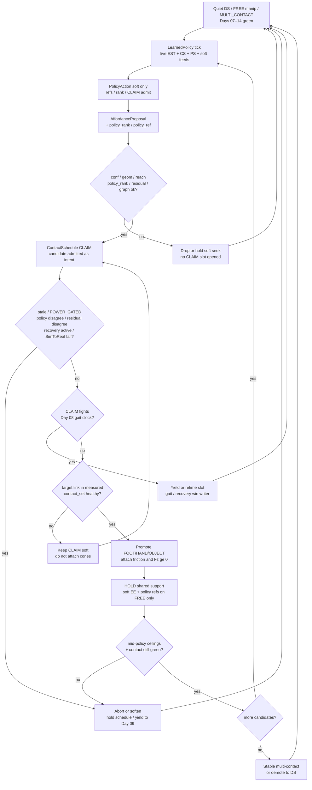
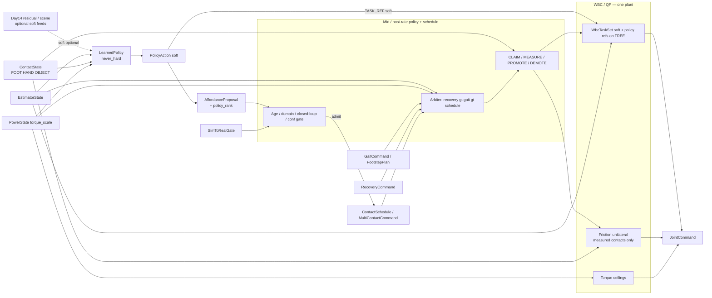
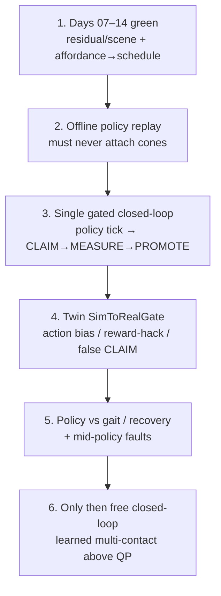

# Day 15 — Closed-loop learned policies under measured ceilings / sim-to-real residual validation


[Day 14](/lessons/day-14-learned-residuals-scene-graphs) owned `LearnedResidual` / `ResidualCorrection` and `SoftSceneGraph` as soft correctors and structured candidates into the affordance→schedule path: `never_hard` refuse cones / $F_z \ge 0$ / `JointCommand` / FOC / `torque_scale` / `ContactState`; residual/graph score $\neq$ MEASURED; inference at mid / host rates with `age_ms`. [Day 13](/lessons/day-13-support-affordances) owned `AffordanceProposal` as soft CLAIM candidates. [Day 12](/lessons/day-12-multicontact-transitions) owned the `ContactSchedule` lifecycle and OBJECT kind. [Day 11](/lessons/day-11-hand-support-loco-manipulation)–[Day 10](/lessons/day-10-upper-body-manipulation) owned measured hand support and soft EE on FREE limbs. [Day 09](/lessons/day-09-push-recovery)–[Day 08](/lessons/day-08-stepping-locomotion) owned recovery abort and gait vs measured `contact_set`. [Day 07](/lessons/day-07-wbc-balance) owned the feasible program. [Day 06](/lessons/day-06-estimation-balance) owned the estimate. [Day 05](/lessons/day-05-power-bms) owned sag honesty.

Today owns **closed-loop learned policies** (RL / imitation / behavior policies) that act **only** through soft refs and schedule / affordance candidates above the same measured hard set — still no learned-plant-as-constraint-truth — plus **sim-to-real residual validation** in the twin before free closed-loop learned multi-contact on hardware.

## Policies are soft writers, not a second plant

A policy that writes friction cones, stamps `ContactState` membership, emits `JointCommand` beside the QP, or overrides `torque_scale` is detector-as-constraint-truth wearing a reward function. Closed-loop means the policy ticks on **live** `EstimatorState` + `ContactState` + `PowerState` (+ optional Day 14 residual / scene soft feeds) at mid / host rate with `age_ms` — not open-loop replay of a taped action sequence, and not inside µs / EtherCAT cyclic until jitter is measured and budgeted. MEASURE still admits contacts. Demotion is still mandatory when policy disagreement, residual / graph inconsistency, wrench disagreement, domain gap, or ceilings fail — including when the reward still looks busy.

| Layer | Owns | Must not own |
|-------|------|--------------|
| Learned policy | Soft `PolicyAction` / `PolicyCommand`: soft task refs (`com_ref` / `ee_refs` / capture hints), `AffordanceProposal` ranking / generation, or `ContactSchedule` CLAIM candidate admit | Hard friction cones / $F_z \ge 0$ / `JointCommand` / FOC $i_q$ / BMS `torque_scale` override / `ContactState` membership |
| Day 14 residual / scene | Optional soft feeds the policy may consume (`residual_hint`, `scene_ref`, `residual_rank`) | Becoming hard truth because the policy is closed-loop |
| Affordance / perception | Soft `AffordanceProposal` candidates — now with optional `policy_rank?` / `policy_ref?` | Friction cones / `ContactState` / FOC / BMS / gait / recovery truth |
| Contact schedule | Whether a CLAIM slot is *allowed* given gated proposals + policy admit; ordered promote / hold / demote intent | Treating policy score as MEASURED; attaching cones from reward alone |
| Measured contact | Membership in hard `contact_set` (FOOT \| HAND \| OBJECT) with confidence + wrench agreement | Policy wish, residual rank, graph edge, or schedule intent as constraint truth |
| Gait (Day 08) | Intended DS/SS/swing clock vs measured feet | Being overridden by a high-reward policy CLAIM during swing |
| Recovery (Day 09) | Mid-disturbance abort / emergency step | Losing the writer fight to a stuck policy-driven HOLD |
| Soft tasks | EE / grasp / posture on **FREE** limbs; optional policy soft refs | Parallel “policy plant” writing `JointCommand` |
| Sim-to-real gate | Twin residual / domain-gap honesty before free hardware closed-loop | Perfect-sim policies that always CLAIM successfully |
| Honesty | Mid-policy abort on stale / `POWER_GATED` / flicker / residual disagree / domain gap / reward-hack attempt | Heroic completion of a policy-driven handoff into brownout or a sim-only success |

**Core thesis:** a `LearnedPolicy` / `PolicyAction` / `PolicyCommand` is **soft output only**. Closed-loop means it consumes the same live `EstimatorState` + `ContactState` + `PowerState` stack (plus optional Day 14 residual / scene soft feeds) and publishes soft task refs, affordance ranking / generation, or CLAIM candidate admit — never hard friction cones / $F_z \ge 0$ / `JointCommand` / FOC $i_q$ / `torque_scale` / `ContactState` membership. Policy score $\neq$ MEASURED. MEASURE is still required before PROMOTE. There is still **one** QP face — not a “learned plant” that finishes a wall brace because the reward looked sure. The twin must keep residual bias / false edges / delay / disagreement / sag honesty **and** inject policy-domain gap (action bias, reward hacking into hard writes, latency, dropout, domain shift, false CLAIM success in sim) before free closed-loop learned multi-contact on hardware. Day 14 `never_hard` still binds. Inference / policy ticks run at mid / host rates with `age_ms`; never inside the current loop or EtherCAT cyclic write path until jitter is measured and budgeted.



**Ownership rule:** one writer for *policy soft actions*, one writer for *affordance candidates*, one writer for *schedule intent*, one writer for *measured* `contact_set`. When they disagree, **measured contact wins for constraints**. Policy confidence and reward never attach cones. Intent aborts, softens, retimes, or waits — it does not promote OBJECT because the policy scored a phantom rail first. Day 08 gait and Day 09 recovery still outrank a stuck schedule hold, even when the reward is loud. Day 14 residual / scene soft feeds remain soft when the policy consumes them.

## How today fits the Days 05–14 stack

| Day | What you already froze | What Day 15 reuses |
|-----|------------------------|--------------------|
| 05 | `torque_scale`, `POWER_GATED`, sag honesty | Same ceilings bind every joint through every policy-driven CLAIM — policy never overrides BMS |
| 06 | `EstimatorState`, age / stale, contact modes | Policy ticks on live estimate; does not replace it or erase age faults |
| 07 | Tasks vs hard friction / unilaterality | New contacts join the **hard** set only when measured — never from policy score |
| 08 | Gait modes vs measured `contact_set` | Policy CLAIMs must **not fight** gait clocks; feet stay honest |
| 09 | Mid-event abort / soften; `RecoveryCommand` | Mid-policy abort; recovery preempts policy-driven holds |
| 10 | Soft EE / grasp; FREE vs CLAIM honesty | CLAIM without measure still forbidden — policy CLAIM included; policy refs stay soft |
| 11 | MEASURED_SUPPORT hands; LOCO_MANIP | Hands remain first-class; policy may *rank* hand CLAIM only |
| 12 | `ContactSchedule` phases; OBJECT kind | Policy feed fills CLAIM slots; schedule lifecycle unchanged |
| 13 | Affordance soft CLAIM; conf gates CLAIM not cones | Policy may rank / generate proposals — detector-as-constraint-truth still forbidden |
| 14 | Residual / scene soft; `never_hard`; mid-rate `age_ms` | Policy may consume residual / scene soft feeds; `never_hard` still binds; no net in µs loops |

Do not bolt a “policy plant” that writes `JointCommand` or attaches cones beside the QP when the reward fires. That is Day 10’s second-plant anti-pattern wearing a GPU and a training curve.

## Policy honesty / rate / domain gates

Day 13’s pre-CLAIM gate and Day 14’s residual-domain / rate honesty still hold. Day 15 adds **policy-domain** and **sim-to-real** honesty: closed-loop policies correct soft things at mid / host rates with explicit age — never as hard truth inside µs paths, never as open-loop replay labeled “closed-loop.”

| Gate | Meaning | Allowed today |
|------|---------|---------------|
| POLICY_TICK | Host / mid-rate publishes `LearnedPolicy` / `PolicyAction` on live state | Soft only — **no** schedule phase change yet; **no** cone attach |
| AGE / JITTER | `age_ms` within budget; policy not inside current / EtherCAT cyclic | Eligible to influence soft refs or ranking; stale → expire |
| DOMAIN | `TASK_REF` \| `AFFORDANCE_RANK` \| `CLAIM_ADMIT` only | Never `HARD_CONTACT` / never `JOINT_CMD` / never `TORQUE_SCALE` |
| CLOSED_LOOP | Consumes live `EstimatorState` + `ContactState` + `PowerState` (+ soft feeds) | Open-loop replay is **not** closed-loop; do not promote on taped actions alone |
| CONF / GEOM / REACH / RANK | Day 13–14 gates + `policy_rank` / residual / graph consistency | Eligible to open a CLAIM slot |
| CLAIM | Schedule wants this slot to take weight next | Approach / soft contact seek — **no** hard cones yet |
| MEASURED | Link in measured `contact_set` with healthy confidence + wrench agreement | Eligible to promote — **policy score does not count** |
| PROMOTE / HOLD | Hard friction + $F_z \ge 0$ attached; soft EE / policy refs on FREE only | Weight transfer under expanded support |
| DEMOTE | Leave hard set on flicker / stale / gated / policy disagree / domain gap | Soft EE / policy refs may return only if intentionally FREE again |
| SIM_TO_REAL | Twin residual / domain-gap gate green | Required before free closed-loop learned multi-contact on hardware |

**Sequencing rules (all required):**

1. Policy scores gate **CLAIM entry** and soft ranking / soft refs — never cone attach.
2. `never_hard: true` is not decoration — API and runtime must refuse policy writes into friction / unilaterality / `JointCommand` / FOC / `torque_scale` / `ContactState` (Day 14 bind still holds).
3. MEASURE still required before PROMOTE; policy score $\neq$ MEASURED; residual / graph score $\neq$ MEASURED.
4. Closed-loop means live state ticks at mid / host rates with `age_ms` — not open-loop replay; never inside the current loop or EtherCAT cyclic write path until jitter is measured and budgeted.
5. Policy disagreement with MEASURE / wrench, residual disagreement, graph inconsistency, or sim-to-real gate fail → fail gate or demote — never silently trust the reward.
6. Mid-sequence `POWER_GATED` / stale / recovery / inference dropout / reward-hack attempt into hard writes → freeze or abort the schedule; do not advance phases on stale tensors or hard-write attempts.
7. Twin must prove sim-to-real residual validation (action bias, reward hacking into hard writes, latency, dropout, domain shift, false CLAIM success in sim, plus Day 14 residual honesty) before free closed-loop learned multi-contact on hardware.

Demotion is success when the policy hallucinated support, the reward hacked toward a hard write, the sim CLAIMed on sticky contacts the hardware never saw, or the pack sagged. A robot that always finishes the policy-driven handoff into a collapsing bus is ignoring Day 05 with a prettier eval curve.

## Ownership conflict: policy vs measure vs gait vs recovery vs power

Learned closed-loop policies are where teams accidentally create a sixth writer on support constraints. Freeze the split:

| Conflict | Winner | Policy / schedule behavior |
|----------|--------|----------------------------|
| Policy score vs missing measure | Measured contact | Wait; soft CLAIM seek only — **no cones** |
| Policy reward vs MEASURE / wrench disagree | Measured contact + wrench | Demote / fail PROMOTE; policy does not win |
| Residual / scene soft feed vs MEASURE | Measured contact (Day 14) | Policy may consume soft feeds; still never cones from them |
| Stale policy / rate miss / dropout | Schedule timing + age gate | Expire by `age_ms`; never constraint truth from last-known action |
| Policy fighting soft task refs | Documented soft priority | Policy refs are soft additive — QP still owns feasibility |
| Active `RecoveryCommand` (Day 09) | Recovery | Abort / hold schedule; clear policy-driven CLAIMs if recovery needs feet-first escape |
| Gait swing / touchdown commit (Day 08) | Measured feet + gait owner | Retime or pause policy CLAIM; never steal swing constraints |
| `POWER_GATED` / low `torque_scale` | Power honesty | Soften / abort; policy never overrides BMS |
| Two policies / residual+policy disagree | Single policy+schedule owner | One soft writer into CLAIM slots; explicit priority — no peer policy plants |
| Policy wants hard cone / JointCommand / torque_scale | Hard stack refusal | Reject at API; log anti-pattern / reward-hack attempt |
| Sim CLAIM success vs hardware miss | SimToRealGate fail | No free hardware closed-loop until twin honesty proven |
| Open-loop replay labeled closed-loop | Honesty / CLOSED_LOOP gate | Refuse promote-on-tape; require live state tick |



**Hard vs soft:** support constraints on **measured** FOOT / HAND / OBJECT stay hard. Soft EE and policy refs live only on FREE limbs and soft task refs. Policies (and Day 14 residual / scene feeds) are softer still — they feed ranking and CLAIM, they do not feed cones. If the QP goes infeasible under the expanded set, demote / abort / soften — do not silently drop an object cone so the policy “makes it.”

## Mid-policy abort honesty

Closed-loop mid-rate paths are where teams disable safety “just until the episode ends.” Do not.

| Signal mid-CLAIM / mid-policy | Required behavior |
|-------------------------------|-------------------|
| `INPUT_STALE` / confidence cliff on estimate or contact | Freeze schedule; demote newly promoted contacts that lost confidence; hold safest measured support |
| Policy dropout / host stall / rate miss | Do **not** promote on last-known action; expire CLAIM candidates by `age_ms` |
| Policy disagreement with MEASURE / wrench | Fail PROMOTE or demote; never keep cones the policy invented |
| Residual / graph inconsistency (Day 14) while policy holds | Re-gate; drop CLAIM or never promote; log for twin |
| Reward-hack attempt into hard writes (cones / JointCommand / torque_scale) | Reject; treat as fault — not as “helpful autonomy” |
| Domain shift / action bias detected | Soften / re-gate; fail SimToRealGate if on free-hardware path |
| `POWER_GATED` / falling `torque_scale` | Abort remaining CLAIMs / promotes; raise margins; policy never finishes lean into brownout |
| Contact flicker / wrench disagree | Demote that slot to FREE/CLAIM; do not keep cones on noise |
| Foot `contact_set` collapses mid-handoff | Yield to Day 09 recovery; policy schedule is not the escape owner |
| QP infeasible under expanded cones | Demote newest promote and/or drop soft EE / policy refs — do not drop unilaterality |
| Recovery asserts | Preempt schedule writer; clear or soften MULTI_CONTACT / policy CLAIM hold |
| Open-loop replay used as closed-loop | Refuse; require live state tick with `age_ms` |
| SimToRealGate red | Freeze free closed-loop path; stay on gated / scripted bring-up |

Abort, demote, and soften are **success paths** when the policy hallucinated, the reward hacked, the sim lied, or the pack sagged mid-handoff.

## Shared API: LearnedPolicy into Day 13–14 shapes

Keep Day 02 / 04 wire honesty. Cyclic commands still carry `BusHeader`. Extend Day 14 residual / Day 13 `AffordanceProposal` / Day 12 `ContactSchedule` / `WbcTaskSet` — do not invent a parallel “policy bus” or second plant:

```text
BusHeader:
  node_id, seq
  t_sample, clock_domain, age_budget_ms
  faults

# Upstream (read-only here; policy consumes, does not replace)
EstimatorState, PowerState  ⊇ BusHeader

ContactState ⊇ BusHeader:
  contact_set[]        # feet, hands, AND objects when measured
  SupportContact:
    link_id / frame
    kind               # FOOT | HAND | OBJECT
    mu, normal, wrench_est?
    confidence, age_ms
    flags              # settling / flicker / gated / grasp_lost
    parent_grasp_id?

# Optional Day 14 soft feeds the policy may consume
LearnedResidual / SoftSceneGraph  ⊇ BusHeader
  # still never_hard; still soft only — Day 14 unchanged

# Soft closed-loop policy (host / mid-rate) — NEVER hard
LearnedPolicy ⊇ BusHeader:
  mode                 # IDLE | CLOSED_LOOP | GATED | ABORT
  observes             # ESTIMATE | CONTACT | POWER | RESIDUAL? | SCENE?
  tick_rate_hint_hz    # mid / host — not µs cyclic
  age_ms               # expire stale policy ticks
  never_hard: true     # API + runtime refuse cones / Fz / JointCmd /
                       # FOC iq / torque_scale / ContactState writes
  relax_on_fault       # stale / dropout / domain_violation /
                       # reward_hack_attempt → expire / abort

PolicyAction / PolicyCommand ⊇ BusHeader:   # soft output only
  domain               # TASK_REF | AFFORDANCE_RANK | CLAIM_ADMIT
  delta_com_ref? / delta_ee_refs? / delta_capture?
  policy_rank?         # re-rank AffordanceProposal slots
  claim_candidates[]?  # soft CLAIM admit hints only
  confidence
  age_ms
  never_hard: true
  closed_loop: true    # must have consumed live state this tick
  relax_on_fault

# Soft perception feed — Day 13/14 + policy enrichment
AffordanceProposal ⊇ BusHeader:
  proposals[]:
    target_frame
    kind_hint          # FOOT | HAND | OBJECT
    pose_hint
    normal_hint?       # soft — not hard cone truth
    mu_hint?
    confidence         # gates CLAIM entry, NOT cone attach
    geometry_ok
    reachability_ok
    residual_rank?     # Day 14
    scene_ref?         # Day 14
    policy_rank?       # from PolicyAction AFFORDANCE_RANK
    policy_ref?        # which LearnedPolicy tick ranked this
    age_ms
    source             # VISION | TACTILE | FUSED | RESIDUAL | SCENE | POLICY | ...
  relax_on_fault

# Thin multi-contact face — Day 12–14 + policy admit
ContactSchedule ⊇ BusHeader:
  intent               # IDLE | MULTI_CONTACT | OBJECT_SUPPORT | ABORT
  slots[]:
    target_frame
    phase              # FREE | CLAIM | PROMOTE | HOLD | DEMOTE
    earliest_t / latest_t?
    priority_hint
    affordance_ref?
    residual_ref?
    scene_ref?
    policy_ref?        # which PolicyAction admitted this CLAIM
  yield_to             # GAIT | RECOVERY | POWER
  admit_policy         # min conf / geom / reach / residual_rank /
                       # graph consistency / policy_rank to open CLAIM
  relax_on_fault       # stale / POWER_GATED / flicker / grasp_lost /
                       # residual_disagree / graph_inconsistent /
                       # policy_disagree / inference_dropout /
                       # reward_hack_attempt → abort/demote

# Sim-to-real residual validation gate (twin + bring-up)
SimToRealGate ⊇ BusHeader:
  status               # RED | YELLOW | GREEN
  checks[]:
    action_bias
    reward_hack_to_hard_write
    latency_dropout
    domain_shift
    false_claim_success_in_sim
    residual_bias          # Day 14
    false_edges            # Day 14
    measure_disagreement   # Day 14
    power_sag              # Day 05
  age_ms
  block_free_closed_loop_until_green: true

ManipulationCommand ⊇ BusHeader:
  intent               # … | CLAIM_SUPPORT | LOCO_MANIP
                       # | OBJECT_SUPPORT | MULTI_CONTACT | ABORT
  ee_refs[] / hand_refs[]
  hand_role[] / support_claim[]
  object_claim[]
  schedule_ref?
  affordance_ref?
  residual_ref?
  scene_ref?
  policy_ref?
  relax_on_fault

# Extended task face — policy refs soft only
WbcTaskSet ⊇ BusHeader:
  mode                 # STANCE_DS | STANCE_SS | SWING | IMPACT | RECOVER_IP
                       # | MANIP | HAND_SUPPORT | LOCO_MANIP
                       # | OBJECT_SUPPORT | MULTI_CONTACT | ...
  com_ref / capture_ref?
  residual_hint?       # Day 14 soft additive
  policy_hint?         # soft additive on com_ref / ee_refs / capture
                       # NEVER hard constraints
  foot_refs[]
  hand_support_refs[]?
  object_support_refs[]?
  ee_refs[]            # soft EE — FREE limbs only
  hand_refs[]
  posture_bias?
  priority_order[]
  relax_on_fault

JointCommand ⊇ BusHeader:
  q_des? / qd_des? / tau_ff?
  iq_ceiling? / tau_ceiling?
  flags                # STO / soften / hold
```

Higher layers publish policy actions, residual corrections, scene structure, affordance candidates, and schedule intent. Measured `ContactState` owns support membership. Gait and recovery keep their writers. Rate loops enforce BMS ceilings. The twin owns `SimToRealGate` honesty. Nobody re-implements FOC, AHRS, or friction cones inside the policy net.

**Physical ↔ digital pairing for policy / sim-to-real**

| Physical | Digital twin / backing |
|----------|------------------------|
| Same `EstimatorState` under changing support membership | No perfect-state policy that always CLAIMs when the reward fires |
| Policy action bias / domain shift | Twin **must** inject action bias and domain shift; CLAIM without MEASURE never enables cones |
| Reward hacking into hard writes | Twin must attempt / detect policy writes into cones / `JointCommand` / `torque_scale` and **reject** |
| Inference / policy delay / dropout matching hardware age budgets | Matched delay / rate-miss budgets — soft timing only; never constraint truth |
| Residual bias / false edges / MEASURE disagreement (Day 14) | Still required — closed-loop does not erase residual honesty |
| False CLAIM success in sim (sticky contacts / perfect wrench) | Twin must inject false CLAIM success; hardware path blocked until gate green |
| `POWER_GATED` during policy-driven CLAIM | `torque_scale` replay — no infinite-torque brace on a policy-ranked rail |
| Policy fighting gait / recovery | Twin must show yield/retime/abort — not silent override |
| Open-loop replay vs closed-loop | Twin must refuse promote-on-tape; require live state tick |
| Mid-rate policy + schedule tick + jitter | Cannot beat hardware cadence or hide age faults; no net inside cyclic write path |
| SimToRealGate | Explicit RED/YELLOW/GREEN; block free closed-loop until GREEN |

If the twin always promotes when the policy scores a slot with sticky contacts and a full pack while hardware sees biased actions, reward hacks, delayed ticks, residual lies, and sag, you will tune learning rates forever and never ship a CLAIM that survives a tired bus or a sim-only success.

## Bring-up sequence (before free closed-loop learned multi-contact)

Days 07–14 green (stance, step, recovery, FREE-hand reach, measured hand SUPPORT / loco-manip, scripted multi-contact / OBJECT handoffs, gated affordance CLAIM, residual / scene soft feeds with bias / false edges / delay / disagreement proven). Then:



1. **Days 07–14 green** — affordance admit + residual / scene soft paths still behave; no open recovery or gait fights; OBJECT / HAND promotes still require MEASURE; `never_hard` still enforced; detector-as-constraint-truth still impossible.
2. **Offline policy replay** — replay logged `PolicyAction`s into soft refs and CLAIM admit only; confirm high `policy_rank` without MEASURE never attaches cones; confirm domain violation (`never_hard`) is refused; confirm stale `age_ms` expires candidates; confirm open-loop tape alone cannot promote.
3. **Single live gated closed-loop tick** — one known surface or fixed object; policy observes live state → soft action → gate → CLAIM → wait for MEASURED → PROMOTE → HOLD → DEMOTE; feet remain primary; confirm QP feasible; confirm `policy_hint` stays soft.
4. **Sim-to-real residual validation** — twin injects action bias, reward hacking into hard writes, latency / dropout, domain shift, false CLAIM success in sim, plus Day 14 residual bias / false edges / MEASURE disagreement / `POWER_GATED` mid-CLAIM; confirm drop / wait / demote / API reject; `SimToRealGate` must go GREEN before free hardware path.
5. **Non-fight + mid-policy faults** — force policy-CLAIM-during-swing, recovery-during-HOLD, stale / gated / flicker / residual disagreement / reward-hack attempt; confirm yield / abort / demote / reject.
6. **Then** add free closed-loop learned multi-contact that chooses ranking / soft refs above the QP — never replace cones, FOC, `torque_scale`, gait, recovery, or measured `ContactState`. Teleop / shared-autonomy arbitration under the same ceilings waits for Day 16+.

Skip to “end-to-end closed-loop learned multi-contact in sim” and hardware’s first policy-ranked rail grasp becomes an unplanned tip / brownout experiment with better WandB charts.

## Failure gallery

| Symptom | Likely cause |
|---------|----------------|
| Promotes on air / tips toward policy-ranked phantom | Policy score treated as MEASURED; cones without `contact_set` |
| Twin CLAIMs, hardware faceplants | Perfect policy / sticky contacts / infinite `torque_scale` in sim; SimToRealGate skipped |
| Completes policy lean into brownout | Mid-policy abort missing; ceilings not consulted; policy overrode honesty |
| Reward “wins,” foot slips | Soft EE / policy_hint treated as hard; unilaterality dropped |
| Policy writes JointCommand / cones / torque_scale | Reward hacking into hard writes; `never_hard` not enforced |
| Open-loop tape treated as closed-loop | CLOSED_LOOP gate missing; promote-on-replay |
| Residual / scene soft feed becomes hard under policy | Day 14 `never_hard` broken when policy consumes feeds |
| Stale policy ticks keep CLAIMing | Policy `age_ms` / dropout expire missing |
| Second plant for policy brace | Parallel optimizer / policy writing `JointCommand`; fights Day 07 program |
| Net inside current / EtherCAT cyclic | Jitter never measured; standing principle violated |
| Policy overrides `torque_scale` | BMS honesty broken; `never_hard` not enforced |
| Schedule freezes loaded sole for policy pose | Intent / policy owns foot constraints instead of measured feet |
| QP infeasible → silent cone drop | Demote/abort path missing; “make it feasible” anti-pattern |
| Gait / recovery fights policy CLAIM | Multiple writers on `WbcTaskSet` / mode; no arbiter |
| Swing stolen by policy rail CLAIM | Schedule did not yield to Day 08 gait commit |
| Policy trained only on sticky perfect sims | No action bias / reward-hack / delay / residual / sag injects; SimToRealGate never red |

## What to freeze this week

Extend [frames](/frames) and your control config with:

- `LearnedPolicy` / `PolicyAction` / `PolicyCommand` fields: `domain`, soft `delta_*` / `policy_rank` / `claim_candidates`, `confidence`, `age_ms`, `closed_loop: true`, **`never_hard: true`**
- `SimToRealGate`: RED/YELLOW/GREEN checks for action bias, reward-hack-to-hard-write, latency/dropout, domain shift, false CLAIM success in sim, plus Day 14 residual honesty + Day 05 sag
- `AffordanceProposal` extensions: `policy_rank?`, `policy_ref?`
- `WbcTaskSet` optional `policy_hint` — soft additive on FREE / soft refs only
- Who owns **policy soft actions** vs **residual / scene soft feeds** vs **affordance candidates** vs **ContactSchedule intent** vs **measured** `contact_set` vs **gait** vs **recovery** (disagree → wait/yield/demote; measured contact wins for cones; recovery and gait outrank schedule holds)
- Admit policy: confidence / geometry / reachability / residual_rank / graph consistency / policy_rank gate **CLAIM**, never cone attach
- Explicit rule: policy score $\neq$ MEASURED; residual / graph score $\neq$ MEASURED; learned layers never write `JointCommand`, friction cones, FOC $i_q$, or `torque_scale`
- Rate / jitter budget: policy ticks at mid / host rates with `age_ms`; forbidden inside µs / EtherCAT cyclic until jitter measured; closed-loop requires live state (not open-loop replay)
- Mid-policy abort / demote for stale, `POWER_GATED`, low `torque_scale`, flicker, residual disagreement, graph inconsistency, policy disagreement, reward-hack attempts, and inference dropout
- Twin hooks: action bias, reward hacking into hard writes, latency / dropout, domain shift, false CLAIM success in sim, residual bias / false edges / MEASURE disagreement, `POWER_GATED` mid-CLAIM, policy-vs-gait/recovery fights — same as hardware; `SimToRealGate` blocks free path until GREEN
- Bring-up gate: no free closed-loop learned multi-contact until steps 1–5 above are green

The lesson is not “drop a bigger policy on the robot until the eval reward looks busy.” It is **make closed-loop learned policies the same contact-rich program in silicon and in the twin**: soft refs and schedule / affordance candidates above the measured hard set, policy score gating CLAIM entry not cones, one estimate, honest power ceilings, measured FOOT/HAND/OBJECT in the hard support set, schedules that wait for measurement and yield to gait/recovery, soft tasks / policy_hints only where soft belongs, inference outside µs loops until jitter is honest, Day 14 `never_hard` still binding, and abort / demote / SimToRealGate paths that stay honest when the policy, the reward, or the sim lies mid-CLAIM.

## Next

**Day 16+** — Teleop / shared-autonomy arbitration under the same measured ceilings: human teleop and learned policy as co-equal soft writers into refs / CLAIM admit — still no human-or-policy-as-constraint-truth; arbiter yields to gait / recovery / power; twin must keep mid-arbitration abort and sim-to-real honesty before free shared-autonomy multi-contact.
