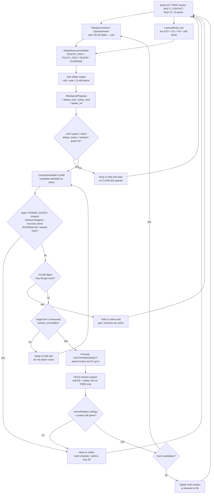
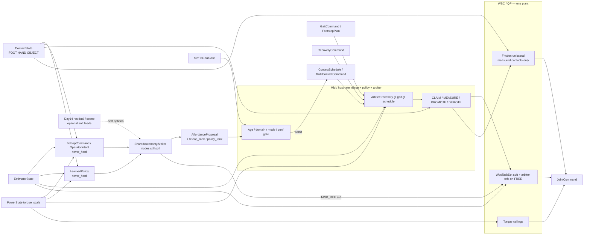
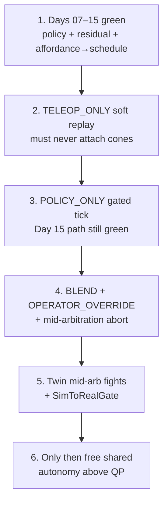

# Day 16 — Teleop / shared-autonomy arbitration under the same measured ceilings


[Day 15](/lessons/day-15-closed-loop-learned-policies) owned `LearnedPolicy` / `PolicyAction` / `PolicyCommand` as soft closed-loop writers into soft task refs / `AffordanceProposal` ranking / `ContactSchedule` CLAIM admit — still `never_hard`; policy score $\neq$ MEASURED; mid / host `age_ms`; `SimToRealGate` before free closed-loop. [Day 14](/lessons/day-14-learned-residuals-scene-graphs) owned `LearnedResidual` / `SoftSceneGraph` as soft correctors and structured candidates. [Day 13](/lessons/day-13-support-affordances) owned `AffordanceProposal` as soft CLAIM candidates. [Day 12](/lessons/day-12-multicontact-transitions) owned the `ContactSchedule` lifecycle and OBJECT kind. [Day 11](/lessons/day-11-hand-support-loco-manipulation)–[Day 10](/lessons/day-10-upper-body-manipulation) owned measured hand support and soft EE on FREE limbs. [Day 09](/lessons/day-09-push-recovery)–[Day 08](/lessons/day-08-stepping-locomotion) owned recovery abort and gait vs measured `contact_set`. [Day 07](/lessons/day-07-wbc-balance) owned the feasible program. [Day 06](/lessons/day-06-estimation-balance) owned the estimate. [Day 05](/lessons/day-05-power-bms) owned sag honesty.

Today owns **teleop / shared-autonomy arbitration**: human teleop and learned policy as **co-equal soft writers** into the same soft refs / affordance ranking / CLAIM admit path — still no human-or-policy-as-constraint-truth — under a `SharedAutonomyArbiter` whose modes are all soft, whose hard set still comes only from measured `ContactState` into **one** WBC/QP, and whose twin must inject mid-arbitration fights before free shared-autonomy multi-contact on hardware.

## Human and policy are co-equal soft writers, not a second plant

A stick, VR EE delta, or operator button that writes friction cones, stamps `ContactState` membership, emits `JointCommand` beside the QP, or overrides `torque_scale` is detector-as-constraint-truth wearing a human. Shared autonomy means the arbiter ticks on **live** `EstimatorState` + `ContactState` + `PowerState` (+ optional Day 14 residual / scene soft feeds + Day 15 policy soft feeds + `TeleopCommand` / `OperatorIntent`) at mid / host rate with `age_ms` — not µs / EtherCAT cyclic until jitter is measured and budgeted. MEASURE still admits contacts. Demotion is still mandatory when teleop / policy / residual disagree, operator dropout, wrench disagreement, domain gap, or ceilings fail — including when the operator is sure and the reward still looks busy.

| Layer | Owns | Must not own |
|-------|------|--------------|
| Teleop / operator | Soft `TeleopCommand` / `OperatorIntent`: stick / VR / EE delta / soft task refs, `AffordanceProposal` ranking hints, or `ContactSchedule` CLAIM candidate admit | Hard friction cones / $F_z \ge 0$ / `JointCommand` / FOC $i_q$ / BMS `torque_scale` override / `ContactState` membership |
| Day 15 policy | Soft `PolicyAction` / `PolicyCommand` — co-equal soft writer with teleop | Becoming hard truth because a human is also on the stick |
| SharedAutonomyArbiter | Mode select + soft blend / priority into soft refs / CLAIM admit (`TELEOP_ONLY` \| `POLICY_ONLY` \| `BLEND` / `SHARED` \| `OPERATOR_OVERRIDE`) | Attaching cones; writing `JointCommand`; replacing measured `contact_set` |
| Day 14 residual / scene | Optional soft feeds the arbiter / policy / teleop may consume | Becoming hard truth under OPERATOR_OVERRIDE |
| Affordance / perception | Soft `AffordanceProposal` candidates — now with optional `teleop_rank?` / `arbiter_ref?` | Friction cones / `ContactState` / FOC / BMS / gait / recovery truth |
| Contact schedule | Whether a CLAIM slot is *allowed* given gated proposals + arbiter admit; ordered promote / hold / demote intent | Treating teleop score / operator confidence / policy score as MEASURED |
| Measured contact | Membership in hard `contact_set` (FOOT \| HAND \| OBJECT) with confidence + wrench agreement | Operator wish, policy wish, blend score, or schedule intent as constraint truth |
| Gait (Day 08) | Intended DS/SS/swing clock vs measured feet | Being overridden by a loud stick or high-reward policy CLAIM during swing |
| Recovery (Day 09) | Mid-disturbance abort / emergency step | Losing the writer fight to a stuck teleop-driven HOLD |
| Soft tasks | EE / grasp / posture on **FREE** limbs; optional arbiter soft refs | Parallel “teleop plant” writing `JointCommand` |
| Sim-to-real gate | Twin mid-arbitration honesty before free hardware shared autonomy | Perfect-sim teleop / policy that always CLAIMs successfully |
| Honesty | Mid-arbitration abort on stale / `POWER_GATED` / flicker / residual disagree / SimToReal fail / operator dropout / reward-hack attempt | Heroic completion of a blended handoff into brownout or a sim-only success |

**Core thesis:** a `TeleopCommand` / `OperatorIntent` and a `LearnedPolicy` / `PolicyAction` are **co-equal soft outputs**. A `SharedAutonomyArbiter` selects among `TELEOP_ONLY` \| `POLICY_ONLY` \| `BLEND` / `SHARED` \| `OPERATOR_OVERRIDE` and publishes soft task refs, affordance ranking / generation, or CLAIM candidate admit — never hard friction cones / $F_z \ge 0$ / `JointCommand` / FOC $i_q$ / `torque_scale` / `ContactState` membership. Operator confidence / teleop score / policy score / blend score $\neq$ MEASURED. MEASURE is still required before PROMOTE. There is still **one** QP face — not a “teleop plant” that finishes a wall brace because the operator leaned hard, and not a learned plant beside it. The twin must keep residual bias / false edges / delay / disagreement / sag honesty **and** inject mid-arbitration fights (teleop vs policy vs MEASURE vs gait vs recovery), operator latency / dropout, policy reward-hack attempts, false CLAIM from operator intent, and `SimToRealGate` honesty before free shared-autonomy multi-contact on hardware. Day 14 / 15 `never_hard` still binds. Teleop / policy / arbiter ticks run at mid / host rates with `age_ms`; never inside the current loop or EtherCAT cyclic write path until jitter is measured and budgeted.



**Ownership rule:** one writer for *teleop soft commands*, one writer for *policy soft actions*, one writer for *arbiter soft blend*, one writer for *affordance candidates*, one writer for *schedule intent*, one writer for *measured* `contact_set`. When they disagree, **measured contact wins for constraints**. Operator confidence and policy reward never attach cones. Intent aborts, softens, retimes, or waits — it does not promote OBJECT because the stick pointed at a phantom rail first. Day 08 gait and Day 09 recovery still outrank a stuck schedule hold, even when the operator is shouting OVERRIDE. Day 14 residual / scene soft feeds and Day 15 policy soft feeds remain soft when the arbiter consumes them.

## How today fits the Days 05–15 stack

| Day | What you already froze | What Day 16 reuses |
|-----|------------------------|--------------------|
| 05 | `torque_scale`, `POWER_GATED`, sag honesty | Same ceilings bind every joint through every teleop / blend CLAIM — operator never overrides BMS |
| 06 | `EstimatorState`, age / stale, contact modes | Arbiter ticks on live estimate; does not replace it or erase age faults |
| 07 | Tasks vs hard friction / unilaterality | New contacts join the **hard** set only when measured — never from stick or blend score |
| 08 | Gait modes vs measured `contact_set` | Teleop / blend CLAIMs must **not fight** gait clocks; feet stay honest |
| 09 | Mid-event abort / soften; `RecoveryCommand` | Mid-arbitration abort; recovery preempts teleop-driven holds |
| 10 | Soft EE / grasp; FREE vs CLAIM honesty | CLAIM without measure still forbidden — teleop CLAIM included; EE deltas stay soft |
| 11 | MEASURED_SUPPORT hands; LOCO_MANIP | Hands remain first-class; teleop / policy may *rank* hand CLAIM only |
| 12 | `ContactSchedule` phases; OBJECT kind | Arbiter feed fills CLAIM slots; schedule lifecycle unchanged |
| 13 | Affordance soft CLAIM; conf gates CLAIM not cones | Teleop / policy / blend may rank / generate proposals — human-as-constraint-truth still forbidden |
| 14 | Residual / scene soft; `never_hard`; mid-rate `age_ms` | Arbiter may consume residual / scene soft feeds; `never_hard` still binds; no stick / net in µs loops |
| 15 | `LearnedPolicy` soft; `SimToRealGate`; closed-loop live ticks | Policy is co-equal soft peer of teleop; SimToRealGate still blocks free path; closed-loop stack still applies |

Do not bolt a “teleop plant” that writes `JointCommand` or attaches cones beside the QP when the operator presses hard or the blend score fires. That is Day 10’s second-plant anti-pattern wearing a VR headset and a GPU.

## Arbitration modes (all still soft)

Document the modes loudly. Every mode publishes soft outputs only. `OPERATOR_OVERRIDE` does **not** mean “operator owns friction cones.”

| Mode | Meaning | Soft output | Still forbidden |
|------|---------|-------------|-----------------|
| `TELEOP_ONLY` | Human stick / VR / EE delta owns soft refs and CLAIM admit ranking | `TeleopCommand` → soft refs / CLAIM admit | Cones / $F_z$ / `JointCommand` / FOC / `torque_scale` / `ContactState` |
| `POLICY_ONLY` | Day 15 closed-loop policy owns soft refs and CLAIM admit | `PolicyAction` as Day 15 | Same `never_hard` bind |
| `BLEND` / `SHARED` | Arbiter blends teleop + policy soft refs / ranks with explicit weights / priority | Soft blend only — QP still owns feasibility | Treating blend score as MEASURED; silent hard merge |
| `OPERATOR_OVERRIDE` | Human soft priority wins over policy soft refs for ranking / CLAIM admit | Soft priority bump — **not** hard constraint ownership | Operator attaching cones; skipping MEASURE; overriding BMS / gait / recovery |

**Sequencing rules (all required):**

1. Teleop / policy / blend scores gate **CLAIM entry** and soft ranking / soft refs — never cone attach.
2. `never_hard: true` is not decoration — API and runtime must refuse teleop / arbiter / policy writes into friction / unilaterality / `JointCommand` / FOC / `torque_scale` / `ContactState` (Day 14 / 15 bind still holds).
3. MEASURE still required before PROMOTE; teleop score / operator confidence / policy score / blend score $\neq$ MEASURED; residual / graph score $\neq$ MEASURED.
4. Closed-loop stack from Day 15 still applies: mid / host rate with `age_ms` — not open-loop replay of taped teleop; never inside the current loop or EtherCAT cyclic write path until jitter is measured and budgeted.
5. Teleop / policy disagreement with MEASURE / wrench, residual disagreement, graph inconsistency, operator dropout, or sim-to-real gate fail → fail gate or demote — never silently trust the stick or the reward.
6. Mid-sequence `POWER_GATED` / stale / recovery / inference dropout / operator dropout / reward-hack attempt into hard writes → freeze or abort the schedule; do not advance phases on stale tensors or hard-write attempts.
7. Twin must prove mid-arbitration honesty (teleop vs policy vs MEASURE vs gait vs recovery fights, operator latency / dropout, false CLAIM from operator intent, reward hacking into hard writes, plus Day 14 / 15 residual / sim-to-real honesty) before free shared-autonomy multi-contact on hardware.

Demotion is success when the operator hallucinated support, the blend scored a phantom, the policy hacked toward a hard write, the sim CLAIMed on sticky contacts the hardware never saw, or the pack sagged. A robot that always finishes the blended handoff into a collapsing bus is ignoring Day 05 with a prettier operator demo.

## Ownership conflict: teleop vs policy vs measure vs gait vs recovery vs power

Shared autonomy is where teams accidentally create a seventh writer on support constraints. Freeze the split:

| Conflict | Winner | Teleop / arbiter / schedule behavior |
|----------|--------|--------------------------------------|
| Teleop / blend score vs missing measure | Measured contact | Wait; soft CLAIM seek only — **no cones** |
| Operator confidence vs MEASURE / wrench disagree | Measured contact + wrench | Demote / fail PROMOTE; stick does not win |
| Policy vs teleop soft refs (no OVERRIDE) | Documented arbiter priority / blend weights | Soft merge only; QP still owns feasibility |
| `OPERATOR_OVERRIDE` vs policy soft refs | Operator soft priority | Soft ranking / CLAIM admit bump — **still no cones** |
| Residual / scene soft feed vs MEASURE | Measured contact (Day 14) | Arbiter may consume soft feeds; still never cones from them |
| Stale teleop / operator dropout / rate miss | Schedule timing + age gate | Expire by `age_ms`; never constraint truth from last-known stick |
| Stale policy / inference dropout | Schedule timing + age gate | Expire policy candidates; do not promote on last-known action |
| Active `RecoveryCommand` (Day 09) | Recovery | Abort / hold schedule; clear teleop / blend CLAIMs if recovery needs feet-first escape |
| Gait swing / touchdown commit (Day 08) | Measured feet + gait owner | Retime or pause teleop / blend CLAIM; never steal swing constraints |
| `POWER_GATED` / low `torque_scale` | Power honesty | Soften / abort; operator never overrides BMS |
| Teleop wants hard cone / JointCommand / torque_scale | Hard stack refusal | Reject at API; log anti-pattern / human-as-constraint-truth attempt |
| Policy reward-hack into hard writes under blend | Hard stack refusal | Reject; treat as fault — not as “helpful autonomy” |
| False CLAIM from operator intent (pointed at air) | Measured contact + admit gates | Soft seek only; no cones until MEASURED |
| Sim CLAIM success vs hardware miss | SimToRealGate fail | No free hardware shared autonomy until twin honesty proven |
| Open-loop taped teleop labeled closed-loop shared | Honesty / CLOSED_LOOP + age gate | Refuse promote-on-tape; require live state + live stick / policy tick |



**Hard vs soft:** support constraints on **measured** FOOT / HAND / OBJECT stay hard. Soft EE and arbiter refs live only on FREE limbs and soft task refs. Teleop, policy, and blend are softer still — they feed ranking and CLAIM, they do not feed cones. If the QP goes infeasible under the expanded set, demote / abort / soften — do not silently drop an object cone so the operator “makes it.”

## Mid-arbitration abort honesty

Shared-autonomy mid-rate paths are where teams disable safety “just until the operator finishes the demo.” Do not.

| Signal mid-CLAIM / mid-arbitration | Required behavior |
|------------------------------------|-------------------|
| `INPUT_STALE` / confidence cliff on estimate or contact | Freeze schedule; demote newly promoted contacts that lost confidence; hold safest measured support |
| Operator dropout / stick disconnect / VR tracking loss | Do **not** promote on last-known EE delta; expire CLAIM candidates by `age_ms` |
| Policy dropout / host stall / rate miss | Expire policy candidates; do not promote on last-known action |
| Teleop / policy disagreement with MEASURE / wrench | Fail PROMOTE or demote; never keep cones the stick or reward invented |
| Residual / graph inconsistency (Day 14) while blend holds | Re-gate; drop CLAIM or never promote; log for twin |
| Reward-hack attempt into hard writes under blend | Reject; treat as fault — not as “helpful autonomy” |
| Operator attempt to write cones / JointCommand / torque_scale | Reject at API; log human-as-constraint-truth attempt |
| Domain shift / action bias / SimToRealGate red | Soften / re-gate; freeze free shared-autonomy path |
| `POWER_GATED` / falling `torque_scale` | Abort remaining CLAIMs / promotes; raise margins; operator never finishes lean into brownout |
| Contact flicker / wrench disagree | Demote that slot to FREE/CLAIM; do not keep cones on noise |
| Foot `contact_set` collapses mid-handoff | Yield to Day 09 recovery; teleop / blend schedule is not the escape owner |
| QP infeasible under expanded cones | Demote newest promote and/or drop soft EE / arbiter refs — do not drop unilaterality |
| Recovery asserts | Preempt schedule writer; clear or soften MULTI_CONTACT / teleop CLAIM hold |
| Gait swing / touchdown commit | Retime or pause CLAIM; never steal swing constraints |
| Open-loop taped teleop used as live shared autonomy | Refuse; require live state + live stick / policy tick with `age_ms` |

Abort, demote, and soften are **success paths** when the operator hallucinated, the blend lied, the policy hacked, the sim lied, or the pack sagged mid-handoff.

## Shared API: Teleop + Arbiter into Day 13–15 shapes

Keep Day 02 / 04 wire honesty. Cyclic commands still carry `BusHeader`. Extend Day 15 policy / Day 14 residual / Day 13 `AffordanceProposal` / Day 12 `ContactSchedule` / `WbcTaskSet` — do not invent a parallel “teleop bus” or second plant:

```text
BusHeader:
  node_id, seq
  t_sample, clock_domain, age_budget_ms
  faults

# Upstream (read-only here; teleop / policy / arbiter consume, do not replace)
EstimatorState, PowerState  ⊇ BusHeader

ContactState ⊇ BusHeader:
  contact_set[]        # feet, hands, AND objects when measured
  SupportContact:
    link_id / frame
    kind               # FOOT | HAND | OBJECT
    mu, normal, wrench_est?
    confidence, age_ms
    flags              # settling / flicker / gated / grasp_lost
    parent_grasp_id?

# Optional Day 14 soft feeds
LearnedResidual / SoftSceneGraph  ⊇ BusHeader
  # still never_hard; still soft only — Day 14 unchanged

# Soft teleop (host / mid-rate) — NEVER hard
TeleopCommand / OperatorIntent ⊇ BusHeader:
  source               # STICK | VR | EE_DELTA | BUTTON | FUSED
  mode_request?        # TELEOP_ONLY | BLEND | OPERATOR_OVERRIDE | ...
  delta_com_ref? / delta_ee_refs? / delta_capture?
  teleop_rank?         # re-rank AffordanceProposal slots
  claim_candidates[]?  # soft CLAIM admit hints only
  operator_confidence
  age_ms               # expire on dropout / latency
  never_hard: true     # API + runtime refuse cones / Fz / JointCmd /
                       # FOC iq / torque_scale / ContactState writes
  relax_on_fault       # stale / dropout / domain_violation /
                       # hard_write_attempt → expire / abort

# Soft closed-loop policy (Day 15) — co-equal soft peer
LearnedPolicy / PolicyAction / PolicyCommand  ⊇ BusHeader
  # unchanged from Day 15; still never_hard; still closed_loop + age_ms

# Shared-autonomy arbiter (host / mid-rate) — modes still soft
SharedAutonomyArbiter ⊇ BusHeader:
  mode                 # TELEOP_ONLY | POLICY_ONLY | BLEND | SHARED
                       # | OPERATOR_OVERRIDE | ABORT
  blend_weights?       # teleop_w / policy_w when BLEND / SHARED
  priority             # soft ranking only — NEVER hard ownership
  observes             # ESTIMATE | CONTACT | POWER | TELEOP | POLICY
                       # | RESIDUAL? | SCENE?
  tick_rate_hint_hz    # mid / host — not µs cyclic
  age_ms
  never_hard: true
  yield_to             # GAIT | RECOVERY | POWER
  relax_on_fault       # stale / POWER_GATED / flicker / dropout /
                       # residual_disagree / policy_disagree /
                       # operator_dropout / reward_hack_attempt /
                       # SimToReal fail → abort / demote

# Soft perception feed — Day 13–15 + teleop / arbiter enrichment
AffordanceProposal ⊇ BusHeader:
  proposals[]:
    target_frame
    kind_hint          # FOOT | HAND | OBJECT
    pose_hint
    normal_hint?       # soft — not hard cone truth
    mu_hint?
    confidence         # gates CLAIM entry, NOT cone attach
    geometry_ok
    reachability_ok
    residual_rank?     # Day 14
    scene_ref?         # Day 14
    policy_rank?       # Day 15
    policy_ref?
    teleop_rank?       # from TeleopCommand
    arbiter_ref?       # which SharedAutonomyArbiter tick ranked this
    age_ms
    source             # VISION | TACTILE | FUSED | RESIDUAL | SCENE
                       # | POLICY | TELEOP | ARBITER | ...
  relax_on_fault

# Thin multi-contact face — Day 12–15 + arbiter admit
ContactSchedule ⊇ BusHeader:
  intent               # IDLE | MULTI_CONTACT | OBJECT_SUPPORT | ABORT
  slots[]:
    target_frame
    phase              # FREE | CLAIM | PROMOTE | HOLD | DEMOTE
    earliest_t / latest_t?
    priority_hint
    affordance_ref?
    residual_ref?
    scene_ref?
    policy_ref?
    teleop_ref?
    arbiter_ref?
  yield_to             # GAIT | RECOVERY | POWER
  admit_policy         # min conf / geom / reach / residual_rank /
                       # graph consistency / policy_rank / teleop_rank
                       # / arbiter mode gates to open CLAIM
  relax_on_fault       # stale / POWER_GATED / flicker / grasp_lost /
                       # residual_disagree / graph_inconsistent /
                       # policy_disagree / operator_dropout /
                       # inference_dropout / reward_hack_attempt →
                       # abort/demote

# Sim-to-real gate (twin + bring-up) — Day 15 + mid-arbitration fights
SimToRealGate ⊇ BusHeader:
  status               # RED | YELLOW | GREEN
  checks[]:
    action_bias
    reward_hack_to_hard_write
    latency_dropout
    domain_shift
    false_claim_success_in_sim
    residual_bias          # Day 14
    false_edges            # Day 14
    measure_disagreement
    power_sag              # Day 05
    teleop_vs_policy_fight # Day 16
    operator_dropout       # Day 16
    false_claim_from_intent# Day 16
    mid_arbitration_fight  # teleop vs policy vs MEASURE vs gait vs recovery
  age_ms
  block_free_shared_autonomy_until_green: true

ManipulationCommand ⊇ BusHeader:
  intent               # … | CLAIM_SUPPORT | LOCO_MANIP
                       # | OBJECT_SUPPORT | MULTI_CONTACT | ABORT
  ee_refs[] / hand_refs[]
  hand_role[] / support_claim[]
  object_claim[]
  schedule_ref?
  affordance_ref?
  residual_ref?
  scene_ref?
  policy_ref?
  teleop_ref?
  arbiter_ref?
  relax_on_fault

# Extended task face — arbiter refs soft only
WbcTaskSet ⊇ BusHeader:
  mode                 # STANCE_DS | STANCE_SS | SWING | IMPACT | RECOVER_IP
                       # | MANIP | HAND_SUPPORT | LOCO_MANIP
                       # | OBJECT_SUPPORT | MULTI_CONTACT | ...
  com_ref / capture_ref?
  residual_hint?       # Day 14 soft additive
  policy_hint?         # Day 15 soft additive
  arbiter_hint?        # soft additive on com_ref / ee_refs / capture
                       # NEVER hard constraints
  foot_refs[]
  hand_support_refs[]?
  object_support_refs[]?
  ee_refs[]            # soft EE — FREE limbs only
  hand_refs[]
  posture_bias?
  priority_order[]
  relax_on_fault

JointCommand ⊇ BusHeader:
  q_des? / qd_des? / tau_ff?
  iq_ceiling? / tau_ceiling?
  flags                # STO / soften / hold
```

Higher layers publish teleop commands, policy actions, arbiter blends, residual corrections, scene structure, affordance candidates, and schedule intent. Measured `ContactState` owns support membership. Gait and recovery keep their writers. Rate loops enforce BMS ceilings. The twin owns `SimToRealGate` honesty. Nobody re-implements FOC, AHRS, or friction cones inside the stick path or the policy net.

**Physical ↔ digital pairing for teleop / shared autonomy**

| Physical | Digital twin / backing |
|----------|------------------------|
| Same `EstimatorState` under changing support membership | No perfect-state teleop that always CLAIMs when the stick points |
| Operator latency / dropout matching hardware age budgets | Matched delay / disconnect budgets — soft timing only; never constraint truth |
| False CLAIM from operator intent (pointed at air / wrong normal) | Twin **must** inject false CLAIM from intent; CLAIM without MEASURE never enables cones |
| Teleop vs policy soft fights mid-CLAIM | Twin must show blend / OVERRIDE / yield — not silent hard merge |
| Policy reward hacking into hard writes under blend | Twin must attempt / detect and **reject** |
| Residual bias / false edges / MEASURE disagreement (Day 14) | Still required — shared autonomy does not erase residual honesty |
| False CLAIM success in sim (sticky contacts / perfect wrench) | Twin must inject false CLAIM success; hardware path blocked until gate green |
| `POWER_GATED` during teleop / blend CLAIM | `torque_scale` replay — no infinite-torque brace on an operator-ranked rail |
| Teleop / blend fighting gait / recovery | Twin must show yield/retime/abort — not silent override |
| Open-loop taped teleop vs live shared autonomy | Twin must refuse promote-on-tape; require live state + live stick / policy tick |
| Mid-rate teleop + policy + arbiter tick + jitter | Cannot beat hardware cadence or hide age faults; no stick / net inside cyclic write path |
| SimToRealGate | Explicit RED/YELLOW/GREEN; block free shared autonomy until GREEN |

If the twin always promotes when the operator points at a slot with sticky contacts and a full pack while hardware sees delayed sticks, dropped VR tracking, reward hacks, residual lies, and sag, you will tune blend weights forever and never ship a CLAIM that survives a tired bus or a sim-only success.

## Bring-up sequence (before free shared-autonomy multi-contact)

Days 07–15 green (stance, step, recovery, FREE-hand reach, measured hand SUPPORT / loco-manip, scripted multi-contact / OBJECT handoffs, gated affordance CLAIM, residual / scene soft feeds, closed-loop policy with `SimToRealGate` green). Then:



1. **Days 07–15 green** — policy + residual / scene + affordance admit paths still behave; no open recovery or gait fights; OBJECT / HAND promotes still require MEASURE; `never_hard` still enforced; detector-as-constraint-truth and policy-as-constraint-truth still impossible.
2. **TELEOP_ONLY soft replay** — replay logged `TeleopCommand`s into soft refs and CLAIM admit only; confirm high `teleop_rank` / operator confidence without MEASURE never attaches cones; confirm domain violation (`never_hard`) is refused; confirm stale `age_ms` / operator dropout expires candidates; confirm taped teleop alone cannot promote.
3. **POLICY_ONLY gated tick** — Day 15 single gated closed-loop path still green under the arbiter in `POLICY_ONLY`; confirm policy soft peer is unchanged.
4. **BLEND + OPERATOR_OVERRIDE + mid-arbitration abort** — force blend under live state; force `OPERATOR_OVERRIDE` soft priority; inject stale / gated / flicker / residual disagreement / operator dropout / reward-hack attempt; confirm yield / abort / demote / reject; confirm OVERRIDE still cannot attach cones or skip MEASURE.
5. **Twin mid-arbitration fights + SimToRealGate** — twin injects teleop vs policy vs MEASURE vs gait vs recovery fights, operator latency / dropout, false CLAIM from operator intent, reward hacking into hard writes, plus Day 14 / 15 residual / sim-to-real honesty; confirm drop / wait / demote / API reject; `SimToRealGate` must go GREEN before free hardware path.
6. **Then** add free shared-autonomy multi-contact that chooses ranking / soft refs above the QP — never replace cones, FOC, `torque_scale`, gait, recovery, or measured `ContactState`. Runtime safety supervisor / monitors / kill-chain for shared autonomy waits for Day 17+.

Skip to “end-to-end shared autonomy in sim” and hardware’s first operator-ranked rail grasp becomes an unplanned tip / brownout experiment with better VR footage.

## Failure gallery

| Symptom | Likely cause |
|---------|--------------|
| Promotes on air / tips toward stick-pointed phantom | Operator confidence treated as MEASURED; cones without `contact_set` |
| Twin CLAIMs, hardware faceplants | Perfect teleop / sticky contacts / infinite `torque_scale` in sim; SimToRealGate skipped |
| Completes blended lean into brownout | Mid-arbitration abort missing; ceilings not consulted; operator overrode honesty |
| Stick “wins,” foot slips | Soft EE / arbiter_hint treated as hard; unilaterality dropped |
| Teleop writes JointCommand / cones / torque_scale | Human-as-constraint-truth; `never_hard` not enforced |
| `OPERATOR_OVERRIDE` skips MEASURE | Mode misdocumented as hard ownership; admit gates broken |
| Open-loop taped teleop treated as live shared autonomy | Age / CLOSED_LOOP gate missing; promote-on-replay |
| Operator dropout keeps CLAIMing | Teleop `age_ms` / dropout expire missing |
| Blend silently hard-merges teleop + policy | Arbiter wrote constraints; soft blend not enforced |
| Residual / scene soft feed becomes hard under OVERRIDE | Day 14 `never_hard` broken when arbiter consumes feeds |
| Second plant for teleop brace | Parallel optimizer / stick writing `JointCommand`; fights Day 07 program |
| Stick / VR / net inside current / EtherCAT cyclic | Jitter never measured; standing principle violated |
| Operator overrides `torque_scale` | BMS honesty broken; `never_hard` not enforced |
| Schedule freezes loaded sole for teleop pose | Intent / teleop owns foot constraints instead of measured feet |
| QP infeasible → silent cone drop | Demote/abort path missing; “make it feasible” anti-pattern |
| Gait / recovery fights teleop CLAIM | Multiple writers on `WbcTaskSet` / mode; no arbiter yield |
| Swing stolen by stick rail CLAIM | Schedule did not yield to Day 08 gait commit |
| Policy reward-hack under blend ignored | Hard-write refusal missing; treated as helpful autonomy |
| Shared autonomy trained only on sticky perfect sims | No dropout / fight / delay / residual / sag injects; SimToRealGate never red |

## What to freeze this week

Extend [frames](/frames) and your control config with:

- `TeleopCommand` / `OperatorIntent` fields: `source`, soft `delta_*` / `teleop_rank` / `claim_candidates`, `operator_confidence`, `age_ms`, **`never_hard: true`**
- `SharedAutonomyArbiter` modes: `TELEOP_ONLY` \| `POLICY_ONLY` \| `BLEND` / `SHARED` \| `OPERATOR_OVERRIDE` \| `ABORT` — all still soft; `blend_weights?`, `yield_to`, `never_hard: true`
- Explicit rule: `OPERATOR_OVERRIDE` is soft priority for ranking / CLAIM admit — **not** hard constraint ownership, not MEASURE skip, not BMS / gait / recovery override
- `AffordanceProposal` extensions: `teleop_rank?`, `arbiter_ref?` (keep Day 15 `policy_rank?` / `policy_ref?`)
- `WbcTaskSet` optional `arbiter_hint` — soft additive on FREE / soft refs only
- Who owns **teleop soft commands** vs **policy soft actions** vs **arbiter soft blend** vs **residual / scene soft feeds** vs **affordance candidates** vs **ContactSchedule intent** vs **measured** `contact_set` vs **gait** vs **recovery** (disagree → wait/yield/demote; measured contact wins for cones; recovery and gait outrank schedule holds)
- Admit policy: confidence / geometry / reachability / residual_rank / graph consistency / policy_rank / teleop_rank / arbiter mode gate **CLAIM**, never cone attach
- Explicit rule: teleop score / operator confidence / policy score / blend score $\neq$ MEASURED; soft layers never write `JointCommand`, friction cones, FOC $i_q$, or `torque_scale`
- Rate / jitter budget: teleop / policy / arbiter ticks at mid / host rates with `age_ms`; forbidden inside µs / EtherCAT cyclic until jitter measured; live shared autonomy requires live state + live stick / policy (not open-loop tape)
- Mid-arbitration abort / demote for stale, `POWER_GATED`, low `torque_scale`, flicker, residual disagreement, graph inconsistency, policy disagreement, operator dropout, reward-hack attempts, and inference dropout
- Twin hooks: teleop vs policy vs MEASURE vs gait vs recovery fights, operator latency / dropout, false CLAIM from operator intent, reward hacking into hard writes, residual bias / false edges / MEASURE disagreement, `POWER_GATED` mid-CLAIM — same as hardware; `SimToRealGate` blocks free path until GREEN
- Bring-up gate: no free shared-autonomy multi-contact until steps 1–5 above are green

The lesson is not “put a human on the stick until the demo looks smooth.” It is **make teleop and shared autonomy the same contact-rich program in silicon and in the twin**: co-equal soft writers into soft refs and schedule / affordance candidates above the measured hard set, operator / policy / blend scores gating CLAIM entry not cones, one estimate, honest power ceilings, measured FOOT/HAND/OBJECT in the hard support set, schedules that wait for measurement and yield to gait/recovery, soft tasks / arbiter_hints only where soft belongs, teleop and inference outside µs loops until jitter is honest, Day 14 / 15 `never_hard` still binding, and abort / demote / SimToRealGate paths that stay honest when the operator, the policy, the blend, or the sim lies mid-CLAIM.

## Next

**Day 17+** — Runtime safety supervisor / monitors / kill-chain for shared autonomy under the same measured ceilings: explicit monitor set and kill / soften / STO paths that outrank teleop, policy, and arbiter soft writers when ceilings or contact honesty fail — still no supervisor-as-second-plant; twin must prove mid-event kill honesty before free unsupervised shared-autonomy multi-contact. (Alternate coherent next: teleop+policy logging / replay / dataset hygiene under the same soft-vs-hard split.)
