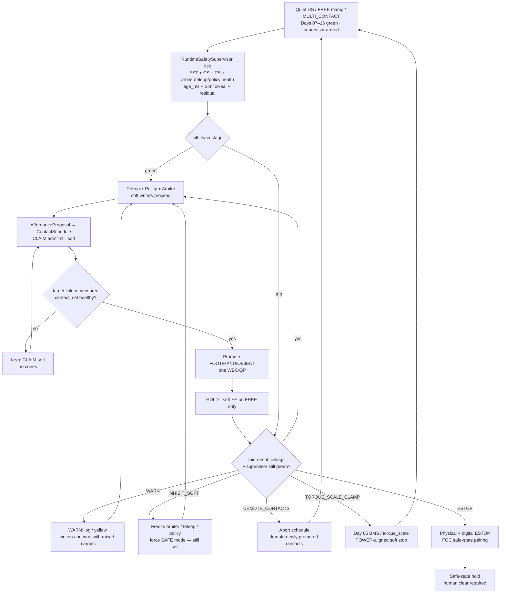
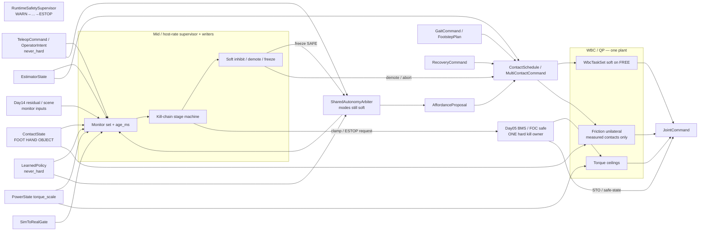
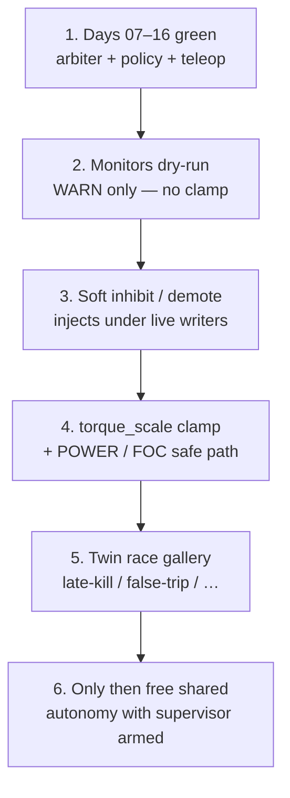

# Day 17 — Runtime safety supervisor / monitors / kill-chain for shared autonomy


[Day 16](/lessons/day-16-teleop-shared-autonomy) owned `SharedAutonomyArbiter` with modes `TELEOP_ONLY` \| `POLICY_ONLY` \| `BLEND` / `SHARED` \| `OPERATOR_OVERRIDE` — all soft — and `TeleopCommand` / `OperatorIntent` + `LearnedPolicy` as co-equal soft writers into soft refs / affordance ranking / CLAIM admit. [Day 15](/lessons/day-15-closed-loop-learned-policies) owned closed-loop `LearnedPolicy` under measured ceilings. [Day 14](/lessons/day-14-learned-residuals-scene-graphs)–[Day 13](/lessons/day-13-support-affordances) owned soft residuals / scene graphs / affordance CLAIM candidates. [Day 12](/lessons/day-12-multicontact-transitions)–[Day 11](/lessons/day-11-hand-support-loco-manipulation) owned schedules and measured hand support. [Day 09](/lessons/day-09-push-recovery)–[Day 08](/lessons/day-08-stepping-locomotion) owned recovery abort and gait vs measured `contact_set`. [Day 07](/lessons/day-07-wbc-balance) owned the feasible program. [Day 06](/lessons/day-06-estimation-balance) owned the estimate. [Day 05](/lessons/day-05-power-bms) owned sag honesty and `torque_scale`.

Today owns the **`RuntimeSafetySupervisor`**: the honesty / inhibit / escalate / kill path that sits **above** teleop, policy, and arbiter. It monitors live `EstimatorState` + `ContactState` + `PowerState` + arbiter / teleop / policy health + `age_ms` + `SimToRealGate` + residual disagree signals; emits soft **inhibit / demote / freeze / escalate** intents; and owns a hard **safe torque / kill** path that only goes through the existing Day 05 BMS / `torque_scale` / FOC safe path — never a second `JointCommand` plant and never attaching friction cones. The twin must inject supervisor race conditions before free shared-autonomy multi-contact with the supervisor armed.

## The supervisor is not a second plant

A “safety” box that writes friction cones, stamps `ContactState` membership, emits `JointCommand` beside the QP, dual-writes `torque_scale` against the BMS, or lets `OPERATOR_OVERRIDE` skip ESTOP is detector-as-constraint-truth wearing a hard hat. The supervisor ticks at **mid / host** rate with `age_ms` — not µs / EtherCAT cyclic until jitter is measured and budgeted. Soft stages freeze / demote / abort intent. Hard kill only clamps through Day 05. MEASURE still admits contacts. Day 08 gait and Day 09 recovery still outrank soft holds. Day 14 / 15 / 16 `never_hard` still binds.

| Layer | Owns | Must not own |
|-------|------|--------------|
| RuntimeSafetySupervisor | Monitor set; kill-chain stage; soft inhibit / demote / freeze / escalate; hard kill *intent* into Day 05 safe path | Becoming MEASURED contact truth; attaching cones; replacing WBC/QP; second `JointCommand` plant; dual-writer on `torque_scale` |
| Soft inhibit / escalate intents | Force arbiter SAFE / freeze teleop+policy soft writers; demote schedule; raise margins | Friction cones / $F_z \ge 0$ / `ContactState` membership / FOC $i_q$ |
| Hard kill path | Day 05 `torque_scale` clamp / `POWER_GATED` soft stop / FOC STO / physical+digital ESTOP pairing | A parallel plant that “finishes the demo safely” by inventing torques |
| Day 16 arbiter / teleop / policy | Soft writers under supervisor inhibit | Bypassing WARN→ESTOP; OVERRIDE skipping BMS / gait / recovery |
| Day 14 residual / scene | Optional soft feeds the supervisor may observe | Becoming hard truth because a WARN fired |
| Measured contact | Membership in hard `contact_set` (FOOT \| HAND \| OBJECT) | Supervisor stage, inhibit score, or ESTOP latch as cone truth |
| Gait (Day 08) | Intended DS/SS/swing clock vs measured feet | Losing the writer fight to a stuck supervisor freeze that ignores gait commit |
| Recovery (Day 09) | Mid-disturbance abort / emergency step | Deadlock with supervisor freeze ordering — document preempt |
| Soft tasks | EE / grasp / posture on **FREE** limbs | Parallel “safety plant” writing `JointCommand` |
| Sim-to-real gate | Twin supervisor-race honesty before free hardware path | Perfect-sim kill that always wins the race |
| Honesty | Escalate when ceilings / age / contact honesty fail — including when the operator is sure and the reward still looks busy | Heroic completion of a blended handoff into brownout or a false-green twin |

**Core thesis:** a `RuntimeSafetySupervisor` sits **above** `TeleopCommand` / `OperatorIntent`, `LearnedPolicy`, and `SharedAutonomyArbiter`. It monitors live estimate / contact / power / writer health / `age_ms` / `SimToRealGate` / residual disagree, and advances a documented kill-chain — `WARN` → `INHIBIT_SOFT` → `DEMOTE_CONTACTS` → `TORQUE_SCALE_CLAMP` → `ESTOP` / safe-state — emitting soft inhibit / demote / freeze / escalate intents and a hard safe-torque / kill intent that **only** enters the plant through Day 05 BMS / `torque_scale` / FOC safe path. The supervisor does **not** become MEASURED contact truth, does not replace WBC/QP, does not attach friction cones, does not let `OPERATOR_OVERRIDE` bypass BMS / gait / recovery, and does not run neural nets in µs loops. Operator confidence / policy score / blend score / supervisor stage $\neq$ MEASURED. There is still **one** QP face and **one** hard torque ceiling owner. The twin must inject supervisor races (late kill, false trip, teleop fighting inhibit, policy reward-hacking past WARN, stale `age_ms` missing a trip, dual-writer on `torque_scale`, missed `POWER_GATED`, recovery preempt vs supervisor freeze ordering) before free shared-autonomy multi-contact with the supervisor armed.



**Ownership rule:** one writer for *supervisor stage + soft inhibit intents*, one writer for *Day 05 torque ceilings / hard kill latch*, one writer for *teleop soft commands*, one writer for *policy soft actions*, one writer for *arbiter soft blend*, one writer for *schedule intent*, one writer for *measured* `contact_set`. When they disagree on constraints, **measured contact wins for cones**. When they disagree on torque ceilings or ESTOP, **Day 05 / supervisor hard path wins** — `OPERATOR_OVERRIDE` included. Intent aborts, softens, retimes, or waits — it does not promote OBJECT because the kill-chain was still yellow. Day 08 gait and Day 09 recovery still outrank a stuck schedule hold; document freeze-vs-recovery preempt so the twin cannot invent a deadlock.

## How today fits the Days 05–16 stack

| Day | What you already froze | What Day 17 reuses |
|-----|------------------------|--------------------|
| 05 | `torque_scale`, `POWER_GATED`, sag honesty, FOC safe | **Only** hard kill / soft-stop path — supervisor never dual-writes `torque_scale` |
| 06 | `EstimatorState`, age / stale, contact modes | Supervisor monitors live estimate; does not replace it or erase age faults |
| 07 | Tasks vs hard friction / unilaterality | New contacts join the hard set only when measured — never from WARN / INHIBIT |
| 08 | Gait modes vs measured `contact_set` | Supervisor freeze must not steal swing constraints; document yield / retime |
| 09 | Mid-event abort / soften; `RecoveryCommand` | Recovery preempt vs supervisor freeze ordering is a first-class twin fight |
| 10 | Soft EE / grasp; FREE vs CLAIM honesty | CLAIM without measure still forbidden under inhibit |
| 11 | MEASURED_SUPPORT hands; LOCO_MANIP | Hands remain first-class; demote path must cover HAND / OBJECT slots |
| 12 | `ContactSchedule` phases; OBJECT kind | `DEMOTE_CONTACTS` aborts schedule lifecycle — does not invent cones |
| 13 | Affordance soft CLAIM; conf gates CLAIM not cones | Supervisor may drop CLAIM admit; still never attaches cones |
| 14 | Residual / scene soft; `never_hard`; mid-rate `age_ms` | Residual disagree is a monitor input; `never_hard` still binds |
| 15 | `LearnedPolicy` soft; `SimToRealGate`; closed-loop live ticks | Policy is inhibitable soft peer; SimToRealGate still blocks free path |
| 16 | `SharedAutonomyArbiter`; teleop + policy co-equal soft; OVERRIDE still soft | Supervisor sits **above** arbiter; OVERRIDE cannot bypass kill-chain / BMS |

Do not bolt a “safety plant” that writes `JointCommand` or attaches cones beside the QP when WARN fires. That is Day 10’s second-plant anti-pattern wearing a red mushroom button.

## Kill-chain stages (document loudly)

Every stage has a soft face. Only `TORQUE_SCALE_CLAMP` and `ESTOP` touch the hard Day 05 path. Soft stages never become MEASURED.

| Stage | Meaning | Soft effect | Hard effect | Still forbidden |
|-------|---------|-------------|-------------|-----------------|
| `WARN` | Yellow honesty; log + raise margins | Teleop / policy / arbiter continue; operator / twin notified | None yet | Treating WARN as MEASURED; skipping later stages because “demo” |
| `INHIBIT_SOFT` | Soft freeze / force SAFE | Freeze or force arbiter `SAFE` / `ABORT`; expire soft CLAIM admit; teleop + policy soft writers held | None | Attaching cones; writing `JointCommand`; skipping MEASURE |
| `DEMOTE_CONTACTS` | Abort schedule / demote promoted slots | Demote newly promoted FOOT/HAND/OBJECT that lost honesty; hold safest measured support | None via cones — demotion through schedule / measured contact owner | Supervisor inventing a new `contact_set` |
| `TORQUE_SCALE_CLAMP` | POWER-aligned soft stop | Soft writers stay frozen | Clamp / lower `torque_scale` **through Day 05 BMS owner only** | Dual-writer on `torque_scale`; parallel FOC write |
| `ESTOP` / safe-state | Physical + digital pairing | All soft writers latched off | FOC STO / safe-state + physical ESTOP channel; human clear required | Virtual-only ESTOP with no physical pair; OVERRIDE clearing latch |

**Sequencing rules (all required):**

1. Monitors gate **stage advance** — never cone attach. Stage $\neq$ MEASURED.
2. Soft stages (`WARN` / `INHIBIT_SOFT` / `DEMOTE_CONTACTS`) publish soft intents only; hard clamp / ESTOP only through Day 05.
3. `never_hard: true` on soft supervisor intents — API and runtime refuse supervisor writes into friction / unilaterality / `JointCommand` / FOC $i_q$ / `ContactState` (Day 14–16 bind still holds). Hard kill is a *separate* Day 05 latch, not a soft field with a louder name.
4. MEASURE still required before PROMOTE; supervisor stage / inhibit score $\neq$ MEASURED.
5. Supervisor ticks at mid / host rate with `age_ms` — never inside the current loop or EtherCAT cyclic write path until jitter is measured and budgeted; no neural nets in µs loops.
6. `OPERATOR_OVERRIDE` cannot bypass BMS / gait / recovery / kill-chain hard stages.
7. Twin must prove supervisor-race honesty (late kill, false trip, teleop vs inhibit, reward-hack past WARN, stale `age_ms`, dual-writer `torque_scale`, missed `POWER_GATED`, recovery vs freeze order) before free shared-autonomy multi-contact with supervisor armed.

Demotion and ESTOP are **success paths** when the operator hallucinated, the blend lied, the policy hacked past WARN, the pack sagged, or the twin showed a late kill. A robot that always finishes the blended handoff into a collapsing bus is ignoring Day 05 with a prettier kill-chain diagram.

## Ownership conflict: supervisor vs teleop vs policy vs measure vs gait vs recovery vs power

Shared autonomy with a supervisor is where teams accidentally create an eighth writer on support constraints and a second writer on `torque_scale`. Freeze the split:

| Conflict | Winner | Supervisor / schedule behavior |
|----------|--------|--------------------------------|
| Supervisor inhibit vs teleop soft refs | Supervisor soft freeze | Expire CLAIM admit; force SAFE — still no cones |
| Supervisor inhibit vs `OPERATOR_OVERRIDE` | Supervisor soft freeze + Day 05 hard path | OVERRIDE is soft priority only — cannot clear ESTOP or raise `torque_scale` |
| Policy reward-hack past WARN | Supervisor escalate | Advance stage; reject hard-write attempt; treat as fault |
| Supervisor stage vs missing measure | Measured contact | Wait / demote; stage never attaches cones |
| Stale monitor / `age_ms` miss | Age gate + escalate | Prefer fail-safe advance over trusting last-known green |
| False trip (noisy monitor) | Documented hysteresis / confirm window | Soft WARN first; twin must inject false trip — do not disable kill-chain |
| Late kill (trip after CLAIM promote) | Day 05 clamp / ESTOP + demote | Prove in twin; hardware path blocked until race gallery green |
| Dual-writer on `torque_scale` | Day 05 BMS owner only | Reject supervisor direct write; supervisor requests clamp via BMS API |
| Missed `POWER_GATED` | Power honesty + supervisor | Escalate to clamp; operator never finishes lean into brownout |
| Active `RecoveryCommand` vs supervisor freeze | Documented preempt (recovery escape vs freeze hold) | Twin must show ordering; no silent deadlock |
| Gait swing / touchdown commit vs freeze | Measured feet + gait owner | Retime / pause CLAIM; never steal swing constraints |
| Supervisor wants hard cone / JointCommand | Hard stack refusal | Reject at API; log supervisor-as-plant attempt |
| Sim kill always wins race / hardware late | SimToRealGate fail | No free hardware path until twin late-kill honesty proven |
| Open-loop taped teleop under armed supervisor | Honesty / age gate | Refuse promote-on-tape; require live state + live monitors |



**Hard vs soft:** support constraints on **measured** FOOT / HAND / OBJECT stay hard. Soft EE and arbiter refs live only on FREE limbs. Supervisor soft intents are softer still — they freeze and demote, they do not feed cones. Hard kill / clamp is owned only by Day 05. If the QP goes infeasible under the expanded set, demote / abort / soften — do not silently drop an object cone so the supervisor “makes it safe.”

## Mid-event supervisor honesty

Shared-autonomy mid-rate paths are where teams disable the kill-chain “just until the operator finishes the demo.” Do not.

| Signal mid-CLAIM / mid-arbitration | Required behavior |
|------------------------------------|-------------------|
| `INPUT_STALE` / confidence cliff on estimate or contact | Advance at least to `INHIBIT_SOFT` / `DEMOTE_CONTACTS`; hold safest measured support |
| Operator dropout / stick disconnect / VR tracking loss | Inhibit soft teleop; do **not** promote on last-known EE delta |
| Policy dropout / host stall / rate miss | Inhibit policy candidates; do not promote on last-known action |
| Teleop fighting `INHIBIT_SOFT` / OVERRIDE spam | Soft freeze wins; OVERRIDE cannot clear stage; log fight |
| Policy reward-hack past WARN into hard writes | Escalate stage; reject; treat as fault — not “helpful autonomy” |
| Residual / graph inconsistency (Day 14) while blend holds | Re-gate; demote or never promote; log for twin |
| Domain shift / SimToRealGate red | Soften / re-gate; freeze free shared-autonomy path |
| `POWER_GATED` / falling `torque_scale` | Escalate to `TORQUE_SCALE_CLAMP`; operator never finishes lean into brownout |
| Contact flicker / wrench disagree | `DEMOTE_CONTACTS` that slot; do not keep cones on noise |
| Foot `contact_set` collapses mid-handoff | Yield to Day 09 recovery; document freeze vs recovery preempt |
| QP infeasible under expanded cones | Demote newest promote and/or drop soft EE — do not drop unilaterality |
| Late kill (trip after promote) | Demote + Day 05 clamp / ESTOP; twin must have proven this race |
| False trip | Hysteresis / confirm; do not disable kill-chain; log for twin gallery |
| Dual-writer attempt on `torque_scale` | Reject non-BMS writer; fault |
| Recovery asserts during supervisor freeze | Follow documented preempt; no deadlock |
| Gait swing / touchdown commit | Retime or pause CLAIM; never steal swing constraints |
| Open-loop taped teleop under armed supervisor | Refuse; require live state + live monitors with `age_ms` |
| Physical ESTOP without digital latch (or reverse) | Fail bring-up — pairing required |

Abort, demote, clamp, and ESTOP are **success paths** when the operator, the policy, the blend, the pack, or the race lied mid-CLAIM.

## Shared API: RuntimeSafetySupervisor above Day 16 shapes

Keep Day 02 / 04 wire honesty. Cyclic commands still carry `BusHeader`. Extend Day 16 arbiter / Day 15 policy / Day 14 residual / Day 13 `AffordanceProposal` / Day 12 `ContactSchedule` / Day 05 power — do not invent a parallel “safety bus” or second plant:

```text
BusHeader:
  node_id, seq
  t_sample, clock_domain, age_budget_ms
  faults

# Upstream (read-only here; supervisor consumes, does not replace)
EstimatorState, PowerState  ⊇ BusHeader

ContactState ⊇ BusHeader:
  contact_set[]        # feet, hands, AND objects when measured
  SupportContact:
    link_id / frame
    kind               # FOOT | HAND | OBJECT
    mu, normal, wrench_est?
    confidence, age_ms
    flags              # settling / flicker / gated / grasp_lost
    parent_grasp_id?

# Soft teleop / policy / arbiter — Day 16 unchanged; inhibitable
TeleopCommand / OperatorIntent  ⊇ BusHeader
  # still never_hard; still age_ms; OVERRIDE still soft only

LearnedPolicy / PolicyAction / PolicyCommand  ⊇ BusHeader
  # still never_hard; still closed_loop + age_ms

SharedAutonomyArbiter ⊇ BusHeader:
  mode                 # … | SAFE | ABORT   # SAFE forced by supervisor
  # still never_hard; still yield_to GAIT | RECOVERY | POWER
  supervisor_ref?      # which RuntimeSafetySupervisor tick froze / forced SAFE

# Optional Day 14 soft feeds — monitor inputs, still never_hard
LearnedResidual / SoftSceneGraph  ⊇ BusHeader

# Runtime safety supervisor (host / mid-rate)
RuntimeSafetySupervisor ⊇ BusHeader:
  stage                # GREEN | WARN | INHIBIT_SOFT | DEMOTE_CONTACTS
                       # | TORQUE_SCALE_CLAMP | ESTOP
  monitors[]:
    estimate_health    # stale / confidence / age_ms
    contact_health     # flicker / wrench disagree / membership collapse
    power_health       # POWER_GATED / torque_scale trend / sag
    teleop_health      # dropout / latency / hard_write_attempt
    policy_health      # inference dropout / reward_hack_attempt
    arbiter_health     # mode thrash / blend anomaly
    residual_disagree  # Day 14
    sim_to_real        # SimToRealGate status
  soft_intent          # NONE | INHIBIT | DEMOTE | FREEZE | ESCALATE
  hard_kill_request    # NONE | CLAMP_TORQUE_SCALE | ESTOP
                       # — request only; Day 05 BMS owns the latch
  force_arbiter_mode?  # SAFE | ABORT
  hysteresis_ms / confirm_window_ms
  tick_rate_hint_hz    # mid / host — not µs cyclic
  age_ms
  never_hard_soft_intents: true
  yield_to             # GAIT | RECOVERY | POWER   # document freeze vs recovery
  relax_on_fault       # stale monitor / dual_writer_attempt /
                       # missed_POWER_GATED / late_kill_detect → escalate
  block_free_shared_autonomy_until_armed_green: true

# Day 05 hard path — ONE owner (supervisor requests, does not dual-write)
PowerState / BmsCommand ⊇ BusHeader:
  torque_scale
  POWER_GATED
  clamp_request_src?   # SUPERVISOR | BMS | ...
  estop_latch          # physical + digital pair
  clear_requires_human: true

# Soft perception / schedule — Day 13–16 + supervisor demote
AffordanceProposal ⊇ BusHeader:
  # … Day 16 fields …
  supervisor_ref?      # inhibit dropped this admit

ContactSchedule ⊇ BusHeader:
  # … Day 16 fields …
  supervisor_ref?
  relax_on_fault       # … | supervisor_DEMOTE | supervisor_ESTOP →
                       # abort/demote

# Sim-to-real gate — Day 15/16 + supervisor races
SimToRealGate ⊇ BusHeader:
  status               # RED | YELLOW | GREEN
  checks[]:
    # … Day 14–16 checks …
    late_kill
    false_trip
    teleop_fights_inhibit
    reward_hack_past_WARN
    stale_age_missed_trip
    dual_writer_torque_scale
    missed_POWER_GATED
    recovery_vs_supervisor_freeze_order
  age_ms
  block_free_shared_autonomy_until_green: true

ManipulationCommand / WbcTaskSet / JointCommand
  # Day 16 shapes unchanged — supervisor never writes JointCommand
  # or attaches cones; CEIL comes from Day 05 only
```

Higher layers publish teleop commands, policy actions, arbiter blends, residual corrections, affordance candidates, schedule intent, and supervisor soft intents. Measured `ContactState` owns support membership. Day 05 owns torque ceilings and ESTOP latch. Gait and recovery keep their writers. Nobody re-implements FOC, AHRS, or friction cones inside the kill-chain soft path.

**Physical ↔ digital pairing for supervisor / kill-chain**

| Physical | Digital twin / backing |
|----------|------------------------|
| Same monitor set under changing support membership | No perfect-state supervisor that always stays GREEN when hardware ages out |
| Physical ESTOP channel ↔ digital `estop_latch` | Pairing required; virtual-only ESTOP fails bring-up |
| Late kill after CLAIM promote | Twin **must** inject late kill; demote + clamp path proven |
| False trip / noisy monitor | Twin must inject false trip; hysteresis — do not disable kill-chain |
| Teleop fighting inhibit / OVERRIDE spam | Twin must show soft freeze wins; OVERRIDE cannot clear ESTOP |
| Policy reward-hacking past WARN | Twin must attempt / detect and escalate |
| Stale `age_ms` missing a trip | Twin must inject age miss; fail-safe escalate |
| Dual-writer on `torque_scale` | Twin must attempt / reject; BMS remains sole owner |
| Missed `POWER_GATED` mid-CLAIM | `torque_scale` replay — no infinite-torque brace under WARN |
| Recovery preempt vs supervisor freeze | Twin must show documented ordering — not silent deadlock |
| Mid-rate supervisor tick + jitter | Cannot beat hardware cadence or hide age faults; no net inside cyclic write path |
| SimToRealGate | Explicit RED/YELLOW/GREEN; block free path until GREEN with race gallery |

If the twin always kills on time with a full pack while hardware sees late trips, false greens, OVERRIDE spam, and dual-writers, you will tune hysteresis forever and never ship a CLAIM that survives a tired bus or a race you only passed in slides.

## Bring-up sequence (before free shared-autonomy with supervisor armed)

Days 07–16 green (stance, step, recovery, FREE-hand reach, measured hand SUPPORT / loco-manip, scripted multi-contact / OBJECT handoffs, gated affordance CLAIM, residual / scene soft feeds, closed-loop policy with `SimToRealGate` green, teleop / blend / OVERRIDE mid-arbitration honesty). Then:



1. **Days 07–16 green** — teleop / policy / arbiter / residual / affordance admit paths still behave; `never_hard` still enforced; OVERRIDE still cannot attach cones or skip MEASURE.
2. **Monitors dry-run (WARN only)** — arm monitor set with stage capped at `WARN`; confirm logs / yellow / raised margins; confirm no accidental clamp / ESTOP; confirm stale `age_ms` surfaces.
3. **Soft inhibit / demote injects** — force `INHIBIT_SOFT` / `DEMOTE_CONTACTS` under live teleop + policy + blend; confirm arbiter forced SAFE; confirm schedule abort / demote; confirm cones never appear from inhibit; confirm OVERRIDE cannot clear soft freeze.
4. **`torque_scale` clamp + POWER / FOC safe path** — request clamp **through Day 05 BMS only**; confirm no dual-writer; confirm physical ↔ digital ESTOP pairing; confirm human clear required.
5. **Twin race gallery + SimToRealGate** — twin injects late kill, false trip, teleop fighting inhibit, reward-hack past WARN, stale `age_ms` miss, dual-writer `torque_scale`, missed `POWER_GATED`, recovery vs freeze ordering; confirm escalate / reject / demote / clamp; `SimToRealGate` must go GREEN before free hardware path.
6. **Then** run free shared-autonomy multi-contact with supervisor armed above the QP — never replace cones, FOC, `torque_scale` ownership, gait, recovery, or measured `ContactState`. Teleop+policy logging / replay / dataset hygiene waits for Day 18+.

Skip to “end-to-end shared autonomy with a big red button in the GUI” and hardware’s first operator-ranked rail grasp becomes an unplanned tip / brownout experiment with better ESTOP footage.

## Failure gallery

| Symptom | Likely cause |
|---------|--------------|
| Promotes on air while WARN yellow | Stage treated as advisory theater; cones without `contact_set` |
| Twin kills on time, hardware late | Late-kill race skipped; SimToRealGate green without gallery |
| Completes blended lean into brownout | Missed `POWER_GATED`; clamp path not wired through Day 05 |
| OVERRIDE clears ESTOP / raises `torque_scale` | OVERRIDE misdocumented as hard ownership; BMS dual-writer |
| Supervisor writes JointCommand / cones | Supervisor-as-second-plant; `never_hard_soft_intents` not enforced |
| Dual-writer fights on `torque_scale` | Supervisor bypassed BMS API; ceilings thrash |
| False trips → team disables kill-chain | No hysteresis / WARN-first path; honesty removed under pressure |
| Stale `age_ms` keeps stage GREEN | Monitor age gate missing; last-known green trusted |
| Policy reward-hack past WARN ignored | Escalate missing; treated as helpful autonomy |
| Teleop fights inhibit and wins | Soft freeze not enforced; stick louder than supervisor |
| Recovery deadlocks with freeze | Preempt ordering undocumented; twin never injected the fight |
| Virtual ESTOP only / physical unpaired | Bring-up pairing skipped |
| Second plant for “safe” brace | Parallel optimizer writing `JointCommand` on ESTOP edge |
| Supervisor net inside current / EtherCAT cyclic | Jitter never measured; standing principle violated |
| QP infeasible → silent cone drop under demote | Demote/abort path missing; “make it feasible” anti-pattern |
| Gait swing stolen during freeze | Freeze did not yield / retime to Day 08 commit |
| Schedule freezes loaded sole for SAFE pose | Intent owns foot constraints instead of measured feet |
| Armed supervisor trained only on sticky perfect sims | No late-kill / false-trip / dual-writer / sag injects; gate never red |

## What to freeze this week

Extend [frames](/frames) and your control config with:

- `RuntimeSafetySupervisor` fields: `stage` (`GREEN` \| `WARN` \| `INHIBIT_SOFT` \| `DEMOTE_CONTACTS` \| `TORQUE_SCALE_CLAMP` \| `ESTOP`), `monitors[]`, `soft_intent`, `hard_kill_request`, `force_arbiter_mode?`, `hysteresis_ms` / `confirm_window_ms`, `age_ms`, **`never_hard_soft_intents: true`**
- Explicit kill-chain sequencing: WARN → INHIBIT_SOFT → DEMOTE_CONTACTS → TORQUE_SCALE_CLAMP → ESTOP / safe-state
- Hard kill ownership: Day 05 BMS / `torque_scale` / FOC safe / physical+digital ESTOP pairing — supervisor **requests**, never dual-writes
- Explicit rule: `OPERATOR_OVERRIDE` cannot bypass kill-chain hard stages, BMS, gait, or recovery
- Explicit rule: supervisor stage / inhibit score $\neq$ MEASURED; soft intents never write `JointCommand`, friction cones, FOC $i_q$, or `ContactState`
- `SharedAutonomyArbiter` extension: `SAFE` / `ABORT` force from supervisor; `supervisor_ref?`
- Who owns **supervisor stage + soft inhibit** vs **Day 05 hard kill latch** vs **teleop soft** vs **policy soft** vs **arbiter soft blend** vs **schedule intent** vs **measured** `contact_set` vs **gait** vs **recovery** (disagree on cones → measured wins; disagree on ceilings / ESTOP → Day 05 / supervisor hard path wins)
- Documented recovery preempt vs supervisor freeze ordering
- Rate / jitter budget: supervisor ticks at mid / host rates with `age_ms`; forbidden inside µs / EtherCAT cyclic until jitter measured; no supervisor nets in µs loops
- Mid-event escalate / demote / clamp for stale, `POWER_GATED`, flicker, residual disagree, teleop fight, reward-hack past WARN, dual-writer attempts, and late-kill detect
- Twin hooks: late kill, false trip, teleop fighting inhibit, reward-hack past WARN, stale `age_ms` miss, dual-writer `torque_scale`, missed `POWER_GATED`, recovery vs freeze order — same as hardware; `SimToRealGate` blocks free path until GREEN
- Bring-up gate: no free shared-autonomy multi-contact with supervisor armed until steps 1–5 above are green

The lesson is not “add a red button until the demo looks safe.” It is **make runtime safety the same contact-rich program in silicon and in the twin**: a supervisor above soft teleop / policy / arbiter writers, a kill-chain that soft-freezes and demotes before it clamps, hard kill only through Day 05, measured FOOT/HAND/OBJECT still owning the hard support set, one estimate, honest power ceilings, schedules that wait for measurement and yield to gait/recovery, soft tasks only where soft belongs, supervisor ticks outside µs loops until jitter is honest, Days 14–16 `never_hard` still binding, and abort / demote / clamp / ESTOP / SimToRealGate paths that stay honest when the operator, the policy, the blend, the race, or the sim lies mid-CLAIM.

## Next

**Day 18+** — Teleop+policy logging / replay / dataset hygiene under the same soft-vs-hard split and supervisor-armed kill-chain: what you may log from soft writers vs measured contact vs power, how replay must preserve `age_ms` / stage / SimToRealGate honesty, and how dataset labels refuse to treat teleop score / policy reward / supervisor WARN as MEASURED — still no logging plant that writes cones on playback.
