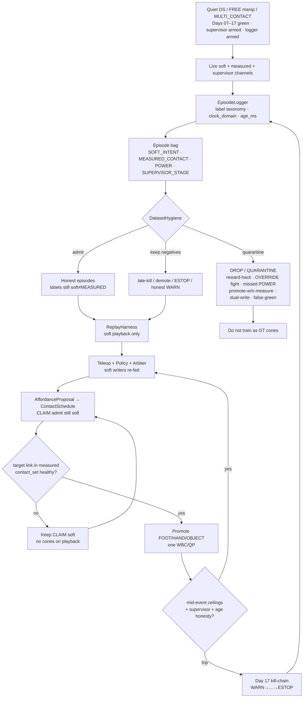
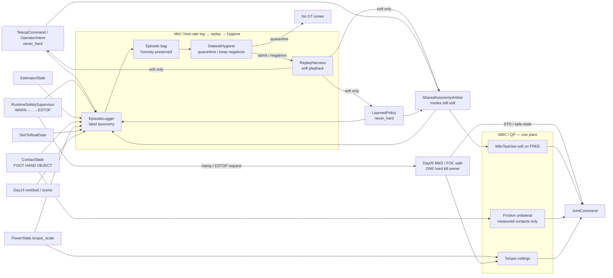
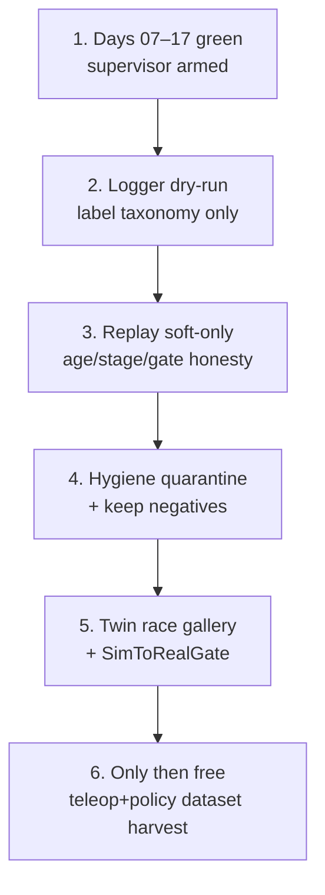

# Day 18 — Teleop+policy logging / replay / dataset hygiene


[Day 17](/lessons/day-17-runtime-safety-supervisor) owned `RuntimeSafetySupervisor` above teleop / policy / arbiter — kill-chain `WARN` → `INHIBIT_SOFT` → `DEMOTE_CONTACTS` → `TORQUE_SCALE_CLAMP` → `ESTOP`, soft inhibit / demote / freeze, hard clamp / ESTOP only through Day 05 BMS / `torque_scale` / FOC. [Day 16](/lessons/day-16-teleop-shared-autonomy) owned `SharedAutonomyArbiter` with `TeleopCommand` / `OperatorIntent` + `LearnedPolicy` as co-equal soft writers. [Day 15](/lessons/day-15-closed-loop-learned-policies) owned closed-loop `LearnedPolicy` under measured ceilings. [Day 14](/lessons/day-14-learned-residuals-scene-graphs)–[Day 13](/lessons/day-13-support-affordances) owned soft residuals / scene graphs / affordance CLAIM candidates. [Day 12](/lessons/day-12-multicontact-transitions)–[Day 11](/lessons/day-11-hand-support-loco-manipulation) owned schedules and measured hand support. [Day 09](/lessons/day-09-push-recovery)–[Day 08](/lessons/day-08-stepping-locomotion) owned recovery abort and gait vs measured `contact_set`. [Day 07](/lessons/day-07-wbc-balance) owned the feasible program. [Day 06](/lessons/day-06-estimation-balance) owned the estimate. [Day 05](/lessons/day-05-power-bms) owned sag honesty and `torque_scale`.

Today owns **`EpisodeLogger` / `ReplayHarness` / `DatasetHygiene`**: what you may log from soft writers vs measured contact vs power under a supervisor-armed kill-chain; how replay must preserve `age_ms` / stage / `SimToRealGate` honesty and still feed **only** soft writers; and how dataset labels refuse to treat teleop score / policy reward / supervisor `WARN` as `MEASURED` — still no logging plant that writes cones on playback. The twin must inject logging / replay races before free teleop+policy dataset harvest with the supervisor armed.

## The logger is not a plant

A “dataset” box that strips `age_ms`, relabels `WARN` as `MEASURED`, plays back teleop as friction cones, dual-writes `torque_scale` on export, or trains on `OPERATOR_OVERRIDE` as ground truth is detector-as-constraint-truth wearing a bagfile. Logging ticks at **mid / host** rate with `clock_domain` and `age_ms` — not µs / EtherCAT cyclic until jitter is measured and budgeted. Soft channels stay soft forever. Measured channels stay measured forever. Replay is soft. Day 08 gait and Day 09 recovery still outrank soft holds. Day 05 still owns ceilings. Day 17 kill-chain still arms. Days 14–17 `never_hard` still binds.

| Layer | Owns | Must not own |
|-------|------|--------------|
| EpisodeLogger | Channel capture; label taxonomy; preserve `age_ms` / stage / `SimToRealGate` / `POWER_GATED` / residual disagree; same schema phys+twin | Becoming MEASURED contact truth; inventing cones on export; “cleaning” honesty for prettier bags |
| ReplayHarness | Soft playback into teleop / policy / arbiter writers; re-inject age / stage / gate honesty | Friction cones / $F_z \ge 0$ / `ContactState` membership / `JointCommand` as-if-measured / FOC $i_q$ / dual-write `torque_scale` |
| DatasetHygiene | Quarantine dishonest episodes; keep late-kill / demote / ESTOP as valuable negatives; refuse soft→MEASURED promotion | Training plant that rewrites labels; treating OVERRIDE / reward / WARN as ground-truth cones |
| Day 17 supervisor | Stage + monitors still armed during log / replay / harvest | Being stripped from bags; stage score becoming MEASURED |
| Day 16 arbiter / teleop / policy | Soft writers under logger + supervisor | Bypassing kill-chain because “we need clean demos”; OVERRIDE-as-GT |
| Measured contact | Membership in hard `contact_set` (FOOT \| HAND \| OBJECT) | Soft score / blend / reward / WARN stage as cone truth |
| Gait (Day 08) | Intended DS/SS/swing clock vs measured feet | Losing the writer fight to a replayed soft hold that ignores gait commit |
| Recovery (Day 09) | Mid-disturbance abort / emergency step | Deadlock with replayed freeze ordering — document preempt |
| Soft tasks | EE / grasp / posture on **FREE** limbs | Parallel “logging plant” writing `JointCommand` on playback |
| Sim-to-real gate | Twin logging/replay-race honesty before free dataset export | Perfect-sim bags that always look green after honesty is stripped |
| Honesty | Escalate / quarantine when ceilings / age / contact / stage honesty fail — including when the reward looks busy | Heroic completion of a bag that trained past brownout or a false-green twin |

**Core thesis:** an `EpisodeLogger` captures soft teleop / policy / arbiter / supervisor channels **and** measured `EstimatorState` / `ContactState` / `PowerState` / `BusHeader` / `torque_scale` under one schema shared by physical and twin. A `ReplayHarness` plays soft channels back into soft writers only — never attaching friction cones, never writing `JointCommand` as if measured, never dual-writing `torque_scale`. `DatasetHygiene` refuses label promotion: teleop score / policy reward / blend score / supervisor stage $\neq$ MEASURED. Replay must preserve `age_ms`, kill-chain stage, `SimToRealGate`, `POWER_GATED`, and residual disagree — never “clean” them away for prettier training. Episodes that reward-hacked past `WARN`, used `OVERRIDE` to fight inhibit, missed `POWER_GATED`, promoted without measure, dual-wrote `torque_scale`, or had false-green `SimToRealGate` are **quarantined**; late-kill / demote / ESTOP episodes are **kept** as valuable negatives. There is still **one** QP face and **one** hard torque ceiling owner. The twin must inject logging / replay races (stale age stripped on export, `WARN` relabeled `MEASURED`, replay writing cones, clock skew dropping stage, training on `OVERRIDE`-as-ground-truth, honesty cleaned for pretty bags) before free teleop+policy dataset harvest with the supervisor armed.



**Ownership rule:** one writer for *logger schema + label taxonomy*, one writer for *replay soft feeds*, one writer for *hygiene quarantine decisions*, one writer for *supervisor stage + soft inhibit*, one writer for *Day 05 torque ceilings / hard kill latch*, one writer for *teleop soft commands*, one writer for *policy soft actions*, one writer for *arbiter soft blend*, one writer for *schedule intent*, one writer for *measured* `contact_set`. When they disagree on constraints, **measured contact wins for cones**. When they disagree on torque ceilings or ESTOP, **Day 05 / supervisor hard path wins** — replayed `OPERATOR_OVERRIDE` included. Intent aborts, softens, retimes, or waits — it does not promote OBJECT because a bag said the stick was confident. Day 08 gait and Day 09 recovery still outrank a stuck replayed hold; document freeze-vs-recovery preempt so the twin cannot invent a deadlock on playback.

## How today fits the Days 05–17 stack

| Day | What you already froze | What Day 18 reuses |
|-----|------------------------|--------------------|
| 05 | `torque_scale`, `POWER_GATED`, sag honesty, FOC safe | **Logged** as `LABEL_POWER`; replay never dual-writes; missed `POWER_GATED` → quarantine |
| 06 | `EstimatorState`, age / stale, contact modes | Logged with `age_ms`; stripping age on export is a twin race / hygiene fail |
| 07 | Tasks vs hard friction / unilaterality | New contacts join the hard set only when measured — never from replayed soft score |
| 08 | Gait modes vs measured `contact_set` | Replay soft freeze must not steal swing constraints; document yield / retime |
| 09 | Mid-event abort / soften; `RecoveryCommand` | Recovery preempt vs replayed freeze ordering is a first-class twin fight |
| 10 | Soft EE / grasp; FREE vs CLAIM honesty | CLAIM without measure still forbidden under replay |
| 11 | MEASURED_SUPPORT hands; LOCO_MANIP | Hands remain first-class; demote / quarantine cover HAND / OBJECT slots |
| 12 | `ContactSchedule` phases; OBJECT kind | Replay demote aborts schedule lifecycle — does not invent cones |
| 13 | Affordance soft CLAIM; conf gates CLAIM not cones | Logger may record CLAIM admit; still never attaches cones |
| 14 | Residual / scene soft; `never_hard`; mid-rate `age_ms` | Residual disagree is a logged honesty channel; `never_hard` still binds |
| 15 | `LearnedPolicy` soft; `SimToRealGate`; closed-loop live ticks | Policy soft channel logged; reward ≠ MEASURED; gate honesty preserved |
| 16 | `SharedAutonomyArbiter`; teleop + policy co-equal soft; OVERRIDE still soft | Soft channels logged; OVERRIDE replay still soft; OVERRIDE-as-GT quarantined |
| 17 | `RuntimeSafetySupervisor`; kill-chain; hard kill via Day 05 only | Stage + monitors **must** be logged; stage ≠ MEASURED; supervisor stays armed during harvest |

Do not bolt a “logging plant” that writes `JointCommand` or attaches cones beside the QP when a bag plays back. That is Day 10’s second-plant anti-pattern wearing a rosbag sticker.

## Label taxonomy (refuse soft→MEASURED promotion)

Every logged sample carries an explicit label class. Soft scores never promote into measured membership by rename.

| Label | Meaning | May train as | Must never become |
|-------|---------|--------------|-------------------|
| `LABEL_SOFT_INTENT` | Teleop / `OperatorIntent` / policy action / arbiter blend / soft CLAIM admit | Soft imitation / ranking / blend priors | `MEASURED` contact membership / cones / $F_z \ge 0$ |
| `LABEL_SUPERVISOR_STAGE` | Kill-chain stage + monitor snapshot + soft_intent | Safety curriculum / negative mining / stage prediction | Cone truth; “green enough to promote” |
| `LABEL_MEASURED_CONTACT` | Measured `ContactState` membership / wrench honesty | Hard-set supervision / contact classifiers grounded in measure | Soft score with a louder name |
| `LABEL_POWER` | `PowerState` / `torque_scale` / `POWER_GATED` / sag | Power-aware derate / brownout negatives | Infinite-torque GT; dual-writer on playback |
| `LABEL_ESTIMATE` | `EstimatorState` + residual disagree channels | State / residual honesty | Age-stripped “clean” state as GT |
| `LABEL_GATE` | `SimToRealGate` status + check gallery | Gate / domain-shift curriculum | False-green export after stripping fails |
| `LABEL_NEGATIVE_KILL` | Late-kill / demote / ESTOP / honest WARN trips | Valuable negatives — **keep** | Dropped because “failed demos” |

**Promotion refusal rules (all required):**

1. Teleop confidence / policy reward $r$ / blend weight $\alpha$ / supervisor stage score $s$ satisfy
   soft score $\neq$ MEASURED, and stage $s$ (WARN … ESTOP) $\neq$ `contact_set` membership.
2. Relabeling `WARN` → `MEASURED` (or reward → cones) is a **hygiene fault**, not a preprocessing option.
3. `OPERATOR_OVERRIDE` bags remain `LABEL_SOFT_INTENT`; OVERRIDE-as-ground-truth is quarantined.
4. `never_hard: true` on soft logged channels — API and runtime refuse soft→hard promotion in export and in replay.
5. Logger / replay / hygiene tick at mid / host rate with `age_ms` — never inside the current loop or EtherCAT cyclic write path until jitter is measured and budgeted; no nets in µs loops reconstructing cones from bags.

Quarantine and keep-negatives are **success paths** when the operator hallucinated, the blend lied, the policy hacked past `WARN`, the pack sagged, the twin showed a late kill, or someone tried to pretty-print honesty out of the bag. A dataset that always looks green after export is ignoring Day 05–17 with prettier parquet.

## Ownership conflict: logger vs replay vs hygiene vs soft vs measure vs gait vs recovery vs power

Logging under shared autonomy is where teams accidentally create a ninth writer on support constraints and a second writer on `torque_scale` “for training fidelity.” Freeze the split:

| Conflict | Winner | Logger / replay / hygiene behavior |
|----------|--------|--------------------------------------|
| Soft score vs measured contact | Measured contact | Soft stays `LABEL_SOFT_INTENT`; never promotes |
| Supervisor stage vs missing measure | Measured contact | Wait / demote; stage never attaches cones; log both |
| Replay soft refs vs cones | Soft-only replay | Reject cone attach on playback; fault + quarantine source if attempted |
| Replay vs `JointCommand` as-if-measured | Hard stack refusal | Replay feeds soft writers only |
| Dual-writer on `torque_scale` (live or playback) | Day 05 BMS owner only | Reject; quarantine episode |
| Missed `POWER_GATED` in bag | Power honesty + hygiene | Quarantine if training path ignored it; keep as negative if logged honestly |
| Stale `age_ms` stripped on export | Age gate + hygiene | Fail export / quarantine; twin must inject |
| `WARN` / reward / teleop score relabeled MEASURED | Label taxonomy refusal | Quarantine; treat as fault |
| `OVERRIDE` fighting inhibit / clearing stage | Supervisor + Day 05 hard path | Soft freeze wins; OVERRIDE cannot clear ESTOP; quarantine as GT |
| False-green `SimToRealGate` export | Gate honesty | Block free harvest; twin race must fail closed |
| Clock skew dropping kill-chain stage | Clock domain + hygiene | Prefer fail-safe quarantine over trusting stage-less bags |
| Active `RecoveryCommand` vs replayed freeze | Documented preempt | Twin must show ordering on playback; no silent deadlock |
| Gait swing / touchdown vs replayed soft hold | Measured feet + gait owner | Retime / pause CLAIM; never steal swing constraints |
| Pretty-bag cleaning (drop residual disagree / stage) | Honesty refusal | Reject cleaner; keep raw honesty channels |
| Open-loop taped teleop bag under armed supervisor | Honesty / age gate | Refuse promote-on-tape; require live state + live monitors with `age_ms` for free harvest gates |
| Training plant wants hard cones from soft bags | Hard stack refusal | Reject at API; log logging-plant attempt |



**Hard vs soft:** support constraints on **measured** FOOT / HAND / OBJECT stay hard. Soft EE and arbiter refs live only on FREE limbs. Logged soft intents and replayed soft intents are softer still — they propose and freeze, they do not feed cones. Hard kill / clamp is owned only by Day 05. If the QP goes infeasible under an expanded set during replay, demote / abort / soften — do not silently drop an object cone so the bag “makes it safe.”

## What you may log (channel map)

Log **both** soft and measured. Tag everything. Do not invent a parallel “training bus” that erases Day 05–17 contracts.

| Channel | Label | Required honesty fields | Forbidden on this channel |
|---------|-------|-------------------------|---------------------------|
| `TeleopCommand` / `OperatorIntent` | `LABEL_SOFT_INTENT` | `age_ms`, source, confidence, hard_write_attempt? | Cones / `ContactState` / `JointCommand` / FOC / `torque_scale` |
| `LearnedPolicy` / `PolicyAction` | `LABEL_SOFT_INTENT` | `age_ms`, reward / value (as soft), `closed_loop`, reward_hack_attempt? | Same as above; reward ≠ MEASURED |
| Arbiter mode / blend \(\alpha\) | `LABEL_SOFT_INTENT` | mode, weights, `supervisor_ref?`, yield flags | Blend score as contact membership |
| `RuntimeSafetySupervisor` | `LABEL_SUPERVISOR_STAGE` | `stage`, `monitors[]`, `soft_intent`, `hard_kill_request`, hysteresis | Stage as MEASURED; dual-write ceilings |
| `EstimatorState` | `LABEL_ESTIMATE` | `age_ms`, stale / confidence, residual disagree | Age-stripped “clean” state as sole GT |
| `ContactState` | `LABEL_MEASURED_CONTACT` | membership, kind, wrench honesty, flicker flags | Soft score renamed into membership |
| `PowerState` / `torque_scale` | `LABEL_POWER` | `POWER_GATED`, sag, `clamp_request_src?` | Infinite torque; dual-writer |
| `BusHeader` | (all) | `seq`, `t_sample`, `clock_domain`, `age_budget_ms`, faults | Dropping header “to save space” on free harvest |
| `SimToRealGate` | `LABEL_GATE` | status, checks[], age | False-green after stripping fails |
| Kill / demote / ESTOP events | `LABEL_NEGATIVE_KILL` | stage timeline, reason codes | Dropping “failed” episodes by default |

**Physical ↔ digital pairing for logging / replay**

| Physical | Digital twin / backing |
|----------|------------------------|
| Same log schema under changing support membership | No perfect-state bags that strip age / stage while hardware ages out |
| Live `age_ms` / `clock_domain` | Twin must inject clock skew dropping stage; export must preserve |
| Live kill-chain stage + monitors | Twin must inject `WARN` relabel-as-MEASURED attempts; hygiene rejects |
| Soft replay into writers | Twin must inject replay-writing-cones / JointCommand-as-measured; reject |
| `POWER_GATED` / `torque_scale` history | Twin must inject missed `POWER_GATED` and dual-writer attempts |
| `OPERATOR_OVERRIDE` fights | Twin must show OVERRIDE-as-GT quarantine; soft freeze still wins |
| Late-kill / demote / ESTOP episodes | **Kept** as negatives — twin must not auto-drop “failed demos” |
| Mid-rate logger + jitter | Cannot beat hardware cadence or hide age faults; no net inside cyclic write path reconstructing cones |
| `SimToRealGate` | Explicit RED/YELLOW/GREEN; block free dataset harvest until GREEN with race gallery |

If the twin always exports green bags with full packs while hardware sees late trips, false greens, OVERRIDE spam, stripped age, and dual-writers, you will train forever on theater and never ship a CLAIM that survives a tired bus or a race you only passed in slides.

## Mid-event logging / replay honesty

Shared-autonomy mid-rate paths are where teams “clean the bag just until the trainer finishes the epoch.” Do not.

| Signal mid-CLAIM / mid-replay | Required behavior |
|-------------------------------|-------------------|
| `INPUT_STALE` / confidence cliff on estimate or contact | Preserve in bag; advance supervisor; do not strip age for export |
| Operator dropout / stick disconnect / VR tracking loss | Log; inhibit soft teleop; do **not** promote on last-known EE delta; quarantine if trained as GT |
| Policy dropout / host stall / rate miss | Log; inhibit policy candidates; do not promote on last-known action |
| Teleop fighting `INHIBIT_SOFT` / OVERRIDE spam | Soft freeze wins; OVERRIDE cannot clear stage; quarantine OVERRIDE-as-GT |
| Policy reward-hack past WARN into hard writes | Escalate stage; reject; quarantine episode for GT use — keep as negative |
| Residual / graph inconsistency (Day 14) while blend holds | Preserve residual disagree; demote or never promote; do not clean away |
| Domain shift / SimToRealGate red | Soften / re-gate; freeze free harvest; do not export as green |
| `POWER_GATED` / falling `torque_scale` | Escalate to clamp; quarantine if ignored in training path; keep honest traces |
| Contact flicker / wrench disagree | Demote that slot; preserve flicker flags in bag |
| Foot `contact_set` collapses mid-handoff | Yield to Day 09 recovery; document freeze vs recovery preempt on replay |
| QP infeasible under expanded cones | Demote newest promote and/or drop soft EE — do not drop unilaterality to “fit the bag” |
| Late kill (trip after promote) | Demote + Day 05 clamp / ESTOP; **keep** episode as `LABEL_NEGATIVE_KILL` |
| False trip | Hysteresis / confirm; do not disable kill-chain; log for twin gallery |
| Dual-writer attempt on `torque_scale` (live or replay) | Reject non-BMS writer; quarantine |
| Replay attempting cones / JointCommand | Reject at ReplayHarness API; fault as logging-plant attempt |
| Age / stage stripped by exporter | Fail export; hygiene quarantine; twin race must catch |
| Recovery asserts during replayed freeze | Follow documented preempt; no deadlock |
| Gait swing / touchdown commit | Retime or pause CLAIM; never steal swing constraints |
| Open-loop taped teleop under armed supervisor | Refuse free harvest promote-on-tape; require live state + live monitors with `age_ms` |
| Physical ESTOP without digital latch (or reverse) | Fail bring-up — pairing required; bags without pairing metadata quarantine for free harvest |

Abort, demote, clamp, ESTOP, quarantine, and keep-negatives are **success paths** when the operator, the policy, the blend, the pack, the exporter, or the race lied mid-CLAIM.

## Shared API: EpisodeLogger / ReplayHarness / DatasetHygiene above Day 17 shapes

Keep Day 02 / 04 wire honesty. Cyclic commands still carry `BusHeader`. Extend Day 17 supervisor / Day 16 arbiter / Day 15 policy / Day 14 residual / Day 13 `AffordanceProposal` / Day 12 `ContactSchedule` / Day 05 power — do not invent a parallel “training bus” or second plant:

```text
BusHeader:
  node_id, seq
  t_sample, clock_domain, age_budget_ms
  faults

# Upstream (read-only for logger; does not replace owners)
EstimatorState, PowerState  ⊇ BusHeader
ContactState ⊇ BusHeader:
  contact_set[]        # feet, hands, AND objects when measured
  SupportContact:
    link_id / frame
    kind               # FOOT | HAND | OBJECT
    mu, normal, wrench_est?
    confidence, age_ms
    flags              # settling / flicker / gated / grasp_lost
    parent_grasp_id?

# Soft teleop / policy / arbiter — Day 16 unchanged; inhibitable; loggable
TeleopCommand / OperatorIntent  ⊇ BusHeader
  # still never_hard; still age_ms; OVERRIDE still soft only

LearnedPolicy / PolicyAction / PolicyCommand  ⊇ BusHeader
  # still never_hard; still closed_loop + age_ms

SharedAutonomyArbiter ⊇ BusHeader:
  mode                 # … | SAFE | ABORT
  # still never_hard; still yield_to GAIT | RECOVERY | POWER
  supervisor_ref?

RuntimeSafetySupervisor ⊇ BusHeader:
  stage                # GREEN | WARN | INHIBIT_SOFT | DEMOTE_CONTACTS
                       # | TORQUE_SCALE_CLAMP | ESTOP
  monitors[]
  soft_intent / hard_kill_request
  # still never_hard_soft_intents; hard kill via Day 05 only

# Optional Day 14 soft feeds — still never_hard; loggable honesty
LearnedResidual / SoftSceneGraph  ⊇ BusHeader

# Episode logging (host / mid-rate)
EpisodeLogger ⊇ BusHeader:
  episode_id
  schema_version
  channels[]:
    name               # teleop | policy | arbiter | supervisor |
                       # estimate | contact | power | gate | residual | …
    label              # LABEL_SOFT_INTENT | LABEL_SUPERVISOR_STAGE |
                       # LABEL_MEASURED_CONTACT | LABEL_POWER |
                       # LABEL_ESTIMATE | LABEL_GATE | LABEL_NEGATIVE_KILL
    payload_ref
    age_ms_preserved: true
    stage_preserved: true
    gate_preserved: true
    power_gated_preserved: true
    residual_disagree_preserved: true
  strip_honesty: false           # API refuses true on free-export path
  same_schema_phys_twin: true
  tick_rate_hint_hz              # mid / host — not µs cyclic
  age_ms
  never_promote_soft_to_measured: true
  block_free_harvest_until_hygiene_green: true

ReplayHarness ⊇ BusHeader:
  episode_id
  mode                 # SOFT_ONLY   # hard plant modes forbidden
  feeds                # TELEOP | POLICY | ARBITER   # soft writers only
  reinject:
    age_ms: true
    supervisor_stage: true
    sim_to_real_gate: true
    power_gated: true
    residual_disagree: true
  forbid:
    attach_cones: true
    write_joint_command_as_measured: true
    dual_write_torque_scale: true
    write_contact_state_membership: true
  never_hard: true
  yield_to             # GAIT | RECOVERY | POWER
  age_ms
  block_if_honesty_stripped: true

DatasetHygiene ⊇ BusHeader:
  decision             # ADMIT | QUARANTINE | KEEP_NEGATIVE
  reasons[]:
    reward_hack_past_WARN
    override_fought_inhibit
    missed_POWER_GATED
    promote_without_measure
    dual_write_torque_scale
    false_green_SimToRealGate
    soft_relabeled_MEASURED
    age_or_stage_stripped
    replay_plant_attempt
    clock_skew_dropped_stage
    override_as_ground_truth
  keep_negatives:
    late_kill: true
    demote: true
    ESTOP: true
    honest_WARN_trips: true
  refuse_soft_to_measured: true
  age_ms
  block_free_harvest_until_green: true

# Day 05 hard path — ONE owner (logger records; replay never dual-writes)
PowerState / BmsCommand ⊇ BusHeader:
  torque_scale
  POWER_GATED
  clamp_request_src?   # SUPERVISOR | BMS | ...
  estop_latch
  clear_requires_human: true

# Soft perception / schedule — Day 13–17 + hygiene demote / quarantine
AffordanceProposal ⊇ BusHeader
ContactSchedule ⊇ BusHeader

SimToRealGate ⊇ BusHeader:
  status               # RED | YELLOW | GREEN
  checks[]:
    # … Day 14–17 checks …
    stale_age_stripped_on_export
    WARN_relabeled_MEASURED
    replay_writing_cones
    clock_skew_dropped_stage
    OVERRIDE_as_ground_truth
    honesty_cleaned_for_pretty_bags
    missed_POWER_GATED_in_training_path
    dual_writer_torque_scale_on_playback
  age_ms
  block_free_dataset_harvest_until_green: true

ManipulationCommand / WbcTaskSet / JointCommand
  # Day 16–17 shapes unchanged — logger/replay never write JointCommand
  # as-if-measured or attach cones; CEIL comes from Day 05 only
```

Higher layers publish teleop commands, policy actions, arbiter blends, residual corrections, affordance candidates, schedule intent, supervisor soft intents, and **logged / replayed soft feeds**. Measured `ContactState` owns support membership. Day 05 owns torque ceilings and ESTOP latch. Gait and recovery keep their writers. Nobody re-implements FOC, AHRS, or friction cones inside the logger, the replay harness, or the hygiene quarantine path.

## Bring-up sequence (before free teleop+policy dataset harvest with supervisor armed)

Days 07–17 green (stance, step, recovery, FREE-hand reach, measured hand SUPPORT / loco-manip, scripted multi-contact / OBJECT handoffs, gated affordance CLAIM, residual / scene soft feeds, closed-loop policy with `SimToRealGate` green, teleop / blend / OVERRIDE mid-arbitration honesty, supervisor race gallery green with kill-chain armed). Then:



1. **Days 07–17 green** — teleop / policy / arbiter / residual / affordance admit / supervisor paths still behave; `never_hard` still enforced; OVERRIDE still cannot attach cones or skip MEASURE; hard kill still only through Day 05.
2. **Logger dry-run (label taxonomy)** — arm `EpisodeLogger` with all channels tagged; confirm soft vs measured vs power vs supervisor labels; confirm `age_ms` / stage / gate / `POWER_GATED` / residual disagree preserved; confirm strip-honesty API refuses; confirm no accidental cone invent on export.
3. **Replay soft-only + honesty reinject** — play bags into teleop / policy / arbiter soft writers only; confirm cones / `JointCommand`-as-measured / dual-write `torque_scale` rejected; confirm age / stage / gate / power honesty reinjected; confirm OVERRIDE replay still soft; confirm MEASURE still required before PROMOTE.
4. **Hygiene quarantine + keep negatives** — inject reward-hack past WARN, OVERRIDE fight, missed `POWER_GATED`, promote-without-measure, dual-write, false-green gate, soft-relabeled-MEASURED; confirm quarantine; confirm late-kill / demote / ESTOP / honest WARN **kept** as `LABEL_NEGATIVE_KILL`.
5. **Twin race gallery + SimToRealGate** — twin injects stale age stripped on export, WARN relabeled MEASURED, replay writing cones, clock skew dropping stage, OVERRIDE-as-GT, honesty cleaned for pretty bags, missed `POWER_GATED` in training path, dual-writer on playback; confirm escalate / reject / quarantine; `SimToRealGate` must go GREEN before free harvest.
6. **Then** run free teleop+policy dataset harvest with supervisor armed and logger / hygiene gates green — never replace cones, FOC, `torque_scale` ownership, gait, recovery, measured `ContactState`, or Day 17 kill-chain. Offline evaluation / shadow mode / canary deploy under supervisor + logging gates waits for Day 19+.

Skip to “dump every stick demo into the trainer with a cleaned bag” and hardware’s first operator-ranked rail grasp becomes an unplanned tip / brownout experiment with better wandb curves.

## Failure gallery

| Symptom | Likely cause |
|---------|--------------|
| Promotes on air from replayed soft score | Soft→MEASURED promotion; cones without `contact_set` |
| Twin bags green, hardware late / yellow | Age / stage stripped; SimToRealGate green without race gallery |
| Trains past brownout | Missed `POWER_GATED` cleaned away; clamp path not in bag |
| OVERRIDE bags used as cone GT | OVERRIDE misdocumented as hard ownership; hygiene skipped |
| Replay writes JointCommand / cones | ReplayHarness-as-second-plant; `never_hard` not enforced |
| Dual-writer fights on `torque_scale` during playback | Replay bypassed BMS API; ceilings thrash |
| WARN / reward / teleop score labeled MEASURED | Label taxonomy missing; “helpful” relabel preprocessing |
| Pretty exporter drops residual disagree / stage | Honesty cleaner anti-pattern; quarantine missing |
| False-green gate export | Gate checks not in bag; twin race skipped |
| Clock skew bags without stage | `clock_domain` / stage preservation missing |
| Late-kill / ESTOP episodes auto-deleted | Negatives treated as trash; `LABEL_NEGATIVE_KILL` missing |
| Stale `age_ms` kept GREEN in export | Age gate missing; last-known green trusted |
| Policy reward-hack past WARN trained as success | Escalate / quarantine missing; treated as helpful autonomy |
| Teleop fights inhibit and wins in bag GT | Soft freeze not enforced; stick louder than supervisor |
| Recovery deadlocks with replayed freeze | Preempt ordering undocumented; twin never injected the fight |
| Virtual ESTOP only / physical unpaired in harvest | Bring-up pairing skipped |
| Second plant for “safe” brace from bag | Parallel optimizer writing `JointCommand` on ESTOP edge of replay |
| Logger / replay net inside current / EtherCAT cyclic | Jitter never measured; standing principle violated |
| QP infeasible → silent cone drop under replay demote | Demote/abort path missing; “make it feasible” anti-pattern |
| Gait swing stolen during replayed freeze | Freeze did not yield / retime to Day 08 commit |
| Schedule freezes loaded sole for SAFE pose from bag | Intent owns foot constraints instead of measured feet |
| Armed harvest trained only on sticky perfect sims | No age-strip / WARN-relabel / replay-cones / OVERRIDE-as-GT / sag injects; gate never red |

## What to freeze this week

Extend [frames](/frames) and your control / logging config with:

- `EpisodeLogger` fields: `episode_id`, `schema_version`, `channels[]` with explicit `label` taxonomy (`LABEL_SOFT_INTENT` \| `LABEL_SUPERVISOR_STAGE` \| `LABEL_MEASURED_CONTACT` \| `LABEL_POWER` \| `LABEL_ESTIMATE` \| `LABEL_GATE` \| `LABEL_NEGATIVE_KILL`), **`age_ms_preserved` / `stage_preserved` / `gate_preserved` / `power_gated_preserved` / `residual_disagree_preserved: true`**, `strip_honesty: false`, `same_schema_phys_twin: true`, `never_promote_soft_to_measured: true`
- `ReplayHarness` fields: `mode: SOFT_ONLY`, soft feeds only (`TELEOP` \| `POLICY` \| `ARBITER`), reinject age / stage / gate / power / residual, **forbid** cones / `JointCommand`-as-measured / dual-write `torque_scale` / `ContactState` membership writes, `never_hard: true`, `yield_to` GAIT \| RECOVERY \| POWER
- `DatasetHygiene` decisions: `ADMIT` \| `QUARANTINE` \| `KEEP_NEGATIVE`; quarantine reasons (reward-hack past WARN, OVERRIDE fight, missed `POWER_GATED`, promote-without-measure, dual-write, false-green gate, soft-relabeled-MEASURED, age/stage stripped, replay-plant attempt, clock skew, OVERRIDE-as-GT); **keep** late-kill / demote / ESTOP / honest WARN as negatives
- Explicit rule: teleop score / policy reward / blend score / supervisor stage $\neq$ MEASURED; soft channels never write `JointCommand`, friction cones, FOC $i_q$, or `ContactState` on log or replay
- Explicit rule: Day 17 supervisor stays armed during log / replay / harvest; hard kill still only through Day 05; `OPERATOR_OVERRIDE` cannot bypass kill-chain hard stages, BMS, gait, or recovery — including on playback
- Who owns **logger schema + labels** vs **replay soft feeds** vs **hygiene quarantine** vs **supervisor stage + soft inhibit** vs **Day 05 hard kill latch** vs **teleop soft** vs **policy soft** vs **arbiter soft blend** vs **schedule intent** vs **measured** `contact_set` vs **gait** vs **recovery** (disagree on cones → measured wins; disagree on ceilings / ESTOP → Day 05 / supervisor hard path wins)
- Documented recovery preempt vs replayed freeze ordering
- Rate / jitter budget: logger / replay / hygiene at mid / host rates with `age_ms`; forbidden inside µs / EtherCAT cyclic until jitter measured; no nets reconstructing cones in µs loops
- Twin hooks: stale age stripped on export, WARN relabeled MEASURED, replay writing cones, clock skew dropping stage, OVERRIDE-as-GT, honesty cleaned for pretty bags, missed `POWER_GATED` in training path, dual-writer on playback — same as hardware; `SimToRealGate` blocks free harvest until GREEN
- Bring-up gate: no free teleop+policy dataset harvest with supervisor armed until steps 1–5 above are green

The lesson is not “log everything until the trainer looks busy.” It is **make teleop+policy logging the same contact-rich program in silicon and in the twin**: an `EpisodeLogger` that tags soft vs measured vs power vs supervisor without promoting scores to MEASURED, a `ReplayHarness` that feeds soft writers only and reinjects age / stage / gate honesty, `DatasetHygiene` that quarantines dishonest episodes and keeps late-kill / demote / ESTOP as valuable negatives, measured FOOT/HAND/OBJECT still owning the hard support set, one estimate, honest power ceilings, Day 17 kill-chain still armed, schedules that wait for measurement and yield to gait/recovery, soft tasks only where soft belongs, logger / replay ticks outside µs loops until jitter is honest, Days 14–17 `never_hard` still binding, and quarantine / keep-negative / SimToRealGate paths that stay honest when the operator, the policy, the blend, the exporter, the race, or the sim lies mid-CLAIM.

## Next

**Day 19+** — Offline evaluation / shadow mode / canary deploy of policies under supervisor + logging gates: score policies against quarantined-vs-admitted bags without writing cones, run shadow inference beside live soft writers with Day 17 kill-chain armed, and canary promote only when `DatasetHygiene` + `SimToRealGate` stay green — still no deploy plant that bypasses MEASURE or Day 05 ceilings.
