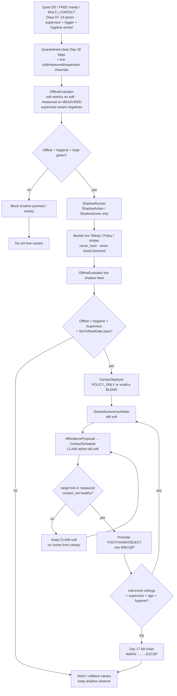
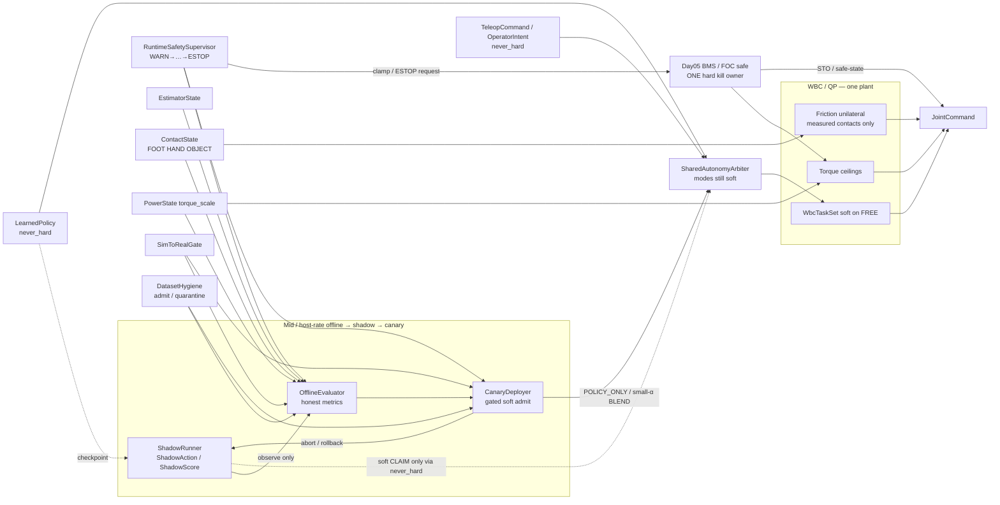
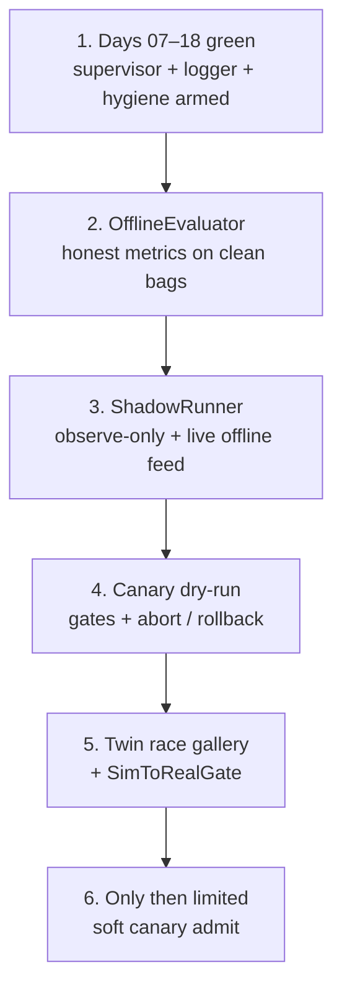

# Day 19 — Offline eval / shadow mode / canary under supervisor + logging gates


[Day 18](/lessons/day-18-teleop-policy-logging-replay) owned `EpisodeLogger` / `ReplayHarness` / `DatasetHygiene` — soft teleop / policy / arbiter / supervisor channels vs measured `EstimatorState` / `ContactState` / `PowerState`; label taxonomy refusing soft score / reward / blend / `WARN` → MEASURED; replay soft-only with `age_ms` / stage / `SimToRealGate` / `POWER_GATED` / residual disagree preserved; quarantine dishonest episodes; keep late-kill / demote / ESTOP as negatives. [Day 17](/lessons/day-17-runtime-safety-supervisor) owned `RuntimeSafetySupervisor` above teleop / policy / arbiter — kill-chain `WARN` → `INHIBIT_SOFT` → `DEMOTE_CONTACTS` → `TORQUE_SCALE_CLAMP` → `ESTOP`, soft inhibit / demote / freeze, hard clamp / ESTOP only through Day 05 BMS / `torque_scale` / FOC. [Day 16](/lessons/day-16-teleop-shared-autonomy) owned `SharedAutonomyArbiter` with `TeleopCommand` / `OperatorIntent` + `LearnedPolicy` as co-equal soft writers. [Day 15](/lessons/day-15-closed-loop-learned-policies) owned closed-loop `LearnedPolicy` under measured ceilings with `SimToRealGate`. [Day 14](/lessons/day-14-learned-residuals-scene-graphs)–[Day 13](/lessons/day-13-support-affordances) owned soft residuals / scene graphs / affordance CLAIM candidates. [Day 12](/lessons/day-12-multicontact-transitions)–[Day 11](/lessons/day-11-hand-support-loco-manipulation) owned schedules and measured hand support. [Day 09](/lessons/day-09-push-recovery)–[Day 08](/lessons/day-08-stepping-locomotion) owned recovery abort and gait vs measured `contact_set`. [Day 07](/lessons/day-07-wbc-balance) owned the feasible program. [Day 06](/lessons/day-06-estimation-balance) owned the estimate. [Day 05](/lessons/day-05-power-bms) owned sag honesty and `torque_scale`.

Today owns **`OfflineEvaluator` / `ShadowRunner` / `CanaryDeployer`**: how you score quarantined-clean Day 18 bags with metrics that respect the label taxonomy and supervisor-aware negatives; how a new checkpoint runs **beside** the live soft stack as a soft observer that never hard-writes; and how limited soft canary admission under `SharedAutonomyArbiter` is gated by OfflineEvaluator + DatasetHygiene + RuntimeSafetySupervisor — still no deploy plant that writes cones, dual-writes `torque_scale`, skips MEASURE, or treats `OPERATOR_OVERRIDE` as a gate bypass. The twin must inject eval / shadow / canary races before free canary.

## The evaluator is not a promotion plant

A “canary” box that green-lights on reward alone, shadows by secretly writing `JointCommand`, admits blend weight without MEASURE, dual-writes `torque_scale` “for the new checkpoint,” clears supervisor stage during the canary window, or treats `OPERATOR_OVERRIDE` as a gate bypass is detector-as-constraint-truth wearing a deploy sticker. Offline eval, shadow, and canary tick at **mid / host** rate with `clock_domain` and `age_ms` — not µs / EtherCAT cyclic until jitter is measured and budgeted. Soft channels stay soft forever. Measured channels stay measured forever. Shadow is soft. Canary is soft. Day 08 gait and Day 09 recovery still outrank soft holds. Day 05 still owns ceilings. Day 17 kill-chain still arms. Day 18 hygiene still gates admit sets. Days 14–18 `never_hard` still binds.

| Layer | Owns | Must not own |
|-------|------|--------------|
| OfflineEvaluator | Honest metrics on quarantined-clean bags; soft metrics on soft labels; measured metrics on MEASURED; supervisor-aware negatives | Promoting soft→MEASURED for prettier scores; green on reward/success alone; stripping honesty to pass |
| ShadowRunner | `ShadowAction` / `ShadowScore` beside live soft writers; live feed into OfflineEvaluator; optional soft CLAIM via Day 15–16 never_hard path | `JointCommand`; friction cones; `ContactState` membership; dual-write `torque_scale`; clearing supervisor stage |
| CanaryDeployer | Gated promotion shadow → limited soft writer under Arbiter (`POLICY_ONLY` or small-α `BLEND`); abort / rollback on gate fail | Skipping MEASURE; dual-write ceilings; OVERRIDE-as-bypass; second plant; free canary before twin race gallery |
| Day 18 hygiene / logger | Admit set + quarantine spike signal for canary gates; honesty channels still logged | Being stripped so offline scores look green |
| Day 17 supervisor | Stage + monitors still armed during eval / shadow / canary | Being cleared by canary or OVERRIDE; stage score becoming MEASURED |
| Day 16 arbiter / teleop / policy | Soft writers; canary admits as another soft policy/blend source | Bypassing kill-chain because “canary is trusted”; OVERRIDE past hard path |
| Measured contact | Membership in hard `contact_set` (FOOT \| HAND \| OBJECT) | Soft score / shadow score / canary weight / WARN stage as cone truth |
| Gait (Day 08) | Intended DS/SS/swing clock vs measured feet | Losing the writer fight to a canary soft hold that ignores gait commit |
| Recovery (Day 09) | Mid-disturbance abort / emergency step | Deadlock with canary freeze ordering — document preempt |
| Soft tasks | EE / grasp / posture on **FREE** limbs | Parallel “canary plant” writing `JointCommand` |
| Sim-to-real gate | Twin eval/shadow/canary-race honesty before free canary | Perfect-sim green offline that always admits |
| Honesty | Escalate / abort / rollback when ceilings / age / contact / stage / hygiene fail — including when reward looks busy | Heroic canary that rode past brownout or a false-green twin |

**Core thesis:** an `OfflineEvaluator` scores quarantined-clean Day 18 bags with metrics that respect label taxonomy — soft metrics on soft channels, measured metrics only on MEASURED, never train/eval by promoting soft→MEASURED. Metrics must include supervisor-aware negatives (`WARN` trips, demotes, ESTOP), `age_ms` honesty, `SimToRealGate`, and `POWER_GATED` misses — not just reward / success rate. A `ShadowRunner` runs a new policy (or blend / checkpoint) **alongside** the live stack as a soft observer — produces `ShadowAction` / `ShadowScore` only; never writes `JointCommand`, never attaches cones, never dual-writes `torque_scale`, never clears supervisor stage. Shadow feeds `OfflineEvaluator` live; may propose soft CLAIM only if wired through the same `never_hard` path as Day 15–16. Shadow dropout / disagree with live policy / residual disagree / supervisor stage elevation are first-class signals. A `CanaryDeployer` gates promotion of a checkpoint from shadow → limited soft writer admission under `SharedAutonomyArbiter` (`POLICY_ONLY` or `BLEND` with small weight) **only** when OfflineEvaluator + DatasetHygiene + RuntimeSafetySupervisor gates pass. Canary is still soft; MEASURE is still required before contact promote. Canary abort / rollback on supervisor escalate, age stale, `POWER_GATED`, `SimToRealGate` fail, residual disagree, hygiene quarantine spike. `OPERATOR_OVERRIDE` cannot force canary past Day 05 hard path. There is still **one** QP face and **one** hard torque ceiling owner. The twin must inject eval / shadow / canary races (false-green offline scores that strip honesty, shadow that secretly hard-writes, canary that skips MEASURE, canary that dual-writes `torque_scale`, canary that treats OVERRIDE as gate bypass, clock skew dropping stage during canary window, reward-hacked bags scoring green offline) before free canary.



**Ownership rule:** one writer for *offline metric schema + honesty checks*, one writer for *shadow soft observe / optional soft CLAIM*, one writer for *canary admit / abort / rollback*, one writer for *hygiene quarantine decisions*, one writer for *supervisor stage + soft inhibit*, one writer for *Day 05 torque ceilings / hard kill latch*, one writer for *teleop soft commands*, one writer for *live policy soft actions*, one writer for *arbiter soft blend*, one writer for *schedule intent*, one writer for *measured* `contact_set`. When they disagree on constraints, **measured contact wins for cones**. When they disagree on torque ceilings or ESTOP, **Day 05 / supervisor hard path wins** — canary and `OPERATOR_OVERRIDE` included. Intent aborts, softens, retimes, rolls back, or waits — it does not promote OBJECT because a checkpoint’s offline reward looked busy. Day 08 gait and Day 09 recovery still outrank a stuck canary hold; document freeze-vs-recovery preempt so the twin cannot invent a deadlock under canary weight.

## How today fits the Days 05–18 stack

| Day | What you already froze | What Day 19 reuses |
|-----|------------------------|--------------------|
| 05 | `torque_scale`, `POWER_GATED`, sag honesty, FOC safe | Offline metrics include missed `POWER_GATED`; canary never dual-writes; OVERRIDE cannot bypass |
| 06 | `EstimatorState`, age / stale, contact modes | Offline / shadow / canary preserve and score `age_ms`; stripping age is a false-green race |
| 07 | Tasks vs hard friction / unilaterality | New contacts join the hard set only when measured — never from shadow score or canary weight |
| 08 | Gait modes vs measured `contact_set` | Canary soft freeze must not steal swing constraints; document yield / retime |
| 09 | Mid-event abort / soften; `RecoveryCommand` | Recovery preempt vs canary freeze ordering is a first-class twin fight |
| 10 | Soft EE / grasp; FREE vs CLAIM honesty | CLAIM without measure still forbidden under shadow / canary |
| 11 | MEASURED_SUPPORT hands; LOCO_MANIP | Hands remain first-class; demote / canary abort cover HAND / OBJECT slots |
| 12 | `ContactSchedule` phases; OBJECT kind | Canary demote / abort aborts schedule lifecycle — does not invent cones |
| 13 | Affordance soft CLAIM; conf gates CLAIM not cones | Shadow / canary may rank CLAIM; still never attaches cones |
| 14 | Residual / scene soft; `never_hard`; mid-rate `age_ms` | Residual disagree is a first-class shadow / canary abort signal |
| 15 | `LearnedPolicy` soft; `SimToRealGate`; closed-loop live ticks | Shadow / canary are soft policy siblings; score ≠ MEASURED; gate honesty preserved |
| 16 | `SharedAutonomyArbiter`; teleop + policy co-equal soft; OVERRIDE still soft | Canary admits as limited soft writer into Arbiter; OVERRIDE still cannot hard-bypass |
| 17 | `RuntimeSafetySupervisor`; kill-chain; hard kill via Day 05 only | Stage + monitors **must** stay armed; canary abort on escalate; stage ≠ MEASURED |
| 18 | `EpisodeLogger` / `ReplayHarness` / `DatasetHygiene` | OfflineEvaluator consumes quarantined-clean bags; hygiene spike aborts canary; labels still refuse soft→MEASURED |

Do not bolt a “canary plant” that writes `JointCommand` or attaches cones beside the QP when a checkpoint graduates. That is Day 10’s second-plant anti-pattern wearing a progressive-delivery sticker.

## Offline metrics (respect label taxonomy)

Every offline score is labeled by the channel it may touch. Soft scores never promote into measured membership by rename — including for “just evaluation.”

| Metric class | May read | Must never become / use as |
|--------------|----------|----------------------------|
| Soft imitation / ranking / value | `LABEL_SOFT_INTENT` (teleop / policy / arbiter / shadow) | `MEASURED` contact membership / cones / $F_z \ge 0$ |
| Supervisor-aware negatives | `LABEL_SUPERVISOR_STAGE`, `LABEL_NEGATIVE_KILL` | Cone truth; “green enough to canary” without stage honesty |
| Measured contact fidelity | `LABEL_MEASURED_CONTACT` | Soft score with a louder name; shadow score as membership |
| Power honesty | `LABEL_POWER` | Infinite-torque GT; dual-writer on canary |
| Estimate / residual honesty | `LABEL_ESTIMATE` + residual disagree | Age-stripped “clean” state as sole eval GT |
| Gate honesty | `LABEL_GATE` | False-green after stripping fails |
| Aggregate canary admit score | Weighted soft + measured + negatives + age + gate + power | Reward / success rate alone |

**Required offline metric families (all required before green):**

1. Soft metrics on soft channels only — teleop score / policy reward $r$ / blend weight $\alpha$ / shadow score satisfy soft score $\neq$ MEASURED.
2. Measured metrics only on `LABEL_MEASURED_CONTACT` / estimate / power — never soft-relabeled.
3. Supervisor-aware negatives: count / rate of `WARN` trips, demotes, ESTOP, honest late-kills — **kept**, not dropped for prettier curves.
4. `age_ms` honesty: stale / stripped age fails offline green.
5. `SimToRealGate` status distribution — false-green export fails offline green.
6. `POWER_GATED` miss rate — ignored gating fails offline green.
7. Residual disagree rate under Day 14 channels.
8. Hygiene quarantine rate on the candidate’s shadow / replay bags — spike fails canary admit.

**Promotion refusal rules (all required):**

1. Relabeling soft→MEASURED (or reward→cones) for offline scoring is a **hygiene / eval fault**, not a preprocessing option.
2. `OPERATOR_OVERRIDE` bags remain soft; OVERRIDE-as-ground-truth stays quarantined and must not green offline.
3. `never_hard: true` on shadow and canary soft channels — API and runtime refuse soft→hard promotion in eval, shadow, and canary admit.
4. Offline / shadow / canary tick at mid / host rate with `age_ms` — never inside the current loop or EtherCAT cyclic write path until jitter is measured and budgeted; no nets in µs loops reconstructing cones from bags or canary scores.

Quarantine, abort, rollback, and keep-negatives are **success paths** when the checkpoint hacked past `WARN`, the shadow lied, the canary skipped MEASURE, the pack sagged, the twin showed a late kill, or someone tried to pretty-print honesty out of the offline report. An offline dashboard that always looks green after export is ignoring Day 05–18 with prettier wandb curves.

## Ownership conflict: offline vs shadow vs canary vs soft vs measure vs gait vs recovery vs power

Eval / shadow / canary is where teams accidentally create a tenth writer on support constraints and a second writer on `torque_scale` “for the new checkpoint.” Freeze the split:

| Conflict | Winner | Offline / shadow / canary behavior |
|----------|--------|-------------------------------------|
| Soft / shadow score vs measured contact | Measured contact | Soft stays soft; never promotes |
| Supervisor stage vs missing measure | Measured contact | Wait / demote / abort canary; stage never attaches cones |
| Shadow soft refs vs cones | Soft-only shadow | Reject cone attach; fault as shadow-plant attempt |
| Shadow vs `JointCommand` | Hard stack refusal | Shadow produces `ShadowAction` only |
| Canary vs dual-writer on `torque_scale` | Day 05 BMS owner only | Reject; abort / rollback canary |
| Canary skips MEASURE before PROMOTE | Measured contact + hygiene | Abort; quarantine episode; twin race must catch |
| Missed `POWER_GATED` during canary | Power honesty + supervisor | Escalate / clamp; abort canary |
| Stale `age_ms` during canary window | Age gate + supervisor | Abort / rollback; fail offline green if stripped |
| False-green offline (honesty stripped) | OfflineEvaluator refusal | Block shadow promote / canary; twin race must fail closed |
| Reward-hacked bags scoring green offline | Hygiene + OfflineEvaluator | Fail offline green; quarantine remains |
| Clock skew dropping stage during canary | Clock domain + supervisor | Prefer fail-safe abort over trusting stage-less canary |
| Canary treats OVERRIDE as gate bypass | Supervisor + Day 05 hard path | Soft freeze / hard path wins; abort; quarantine |
| Shadow dropout / disagree with live policy | First-class shadow signal | Feed OfflineEvaluator; may block canary admit |
| Residual disagree under canary weight | Day 14 honesty + supervisor | Abort / demote; do not clean away |
| Active `RecoveryCommand` vs canary freeze | Documented preempt | Twin must show ordering; no silent deadlock |
| Gait swing / touchdown vs canary soft hold | Measured feet + gait owner | Retime / pause CLAIM; never steal swing constraints |
| Hygiene quarantine spike mid-canary | DatasetHygiene + CanaryDeployer | Abort / rollback; do not “ride it out” |
| Pretty offline cleaner (drop stage / negatives) | Honesty refusal | Reject cleaner; keep raw honesty channels |
| Training / deploy plant wants hard cones from canary | Hard stack refusal | Reject at API; log canary-plant attempt |



**Hard vs soft:** support constraints on **measured** FOOT / HAND / OBJECT stay hard. Soft EE and arbiter refs live only on FREE limbs. Shadow scores and canary weights are softer still — they propose and admit, they do not feed cones. Hard kill / clamp is owned only by Day 05. If the QP goes infeasible under an expanded set during canary, demote / abort / soften / rollback — do not silently drop an object cone so the checkpoint “makes it safe.”

## What shadow may emit (and must not)

Shadow runs beside live. Tag everything. Do not invent a parallel “shadow bus” that erases Day 05–18 contracts.

| Channel | Label / type | Required honesty fields | Forbidden |
|---------|--------------|-------------------------|-----------|
| `ShadowAction` / `ShadowScore` | `LABEL_SOFT_INTENT` | `age_ms`, checkpoint_id, agree_with_live?, dropout?, residual_disagree? | Cones / `ContactState` / `JointCommand` / FOC / `torque_scale` / clear stage |
| Optional soft CLAIM propose | `LABEL_SOFT_INTENT` via Day 15–16 path | same never_hard API as `LearnedPolicy` | CLAIM without never_hard wiring; cone attach |
| Live disagree / dropout | first-class soft signal | rate, duration, stage_at_event | Treated as “noise to ignore for canary” |
| Supervisor stage elevation under shadow | `LABEL_SUPERVISOR_STAGE` logged | stage timeline | Shadow clearing stage |
| OfflineEvaluator live feed | soft + measured refs as Day 18 | preserve honesty | Stripping age / stage for greener shadow scores |

**Physical ↔ digital pairing for offline / shadow / canary**

| Physical | Digital twin / backing |
|----------|------------------------|
| Same offline metric schema under changing support membership | No perfect-state offline that strips age / stage while hardware ages out |
| Live `age_ms` / `clock_domain` during shadow / canary | Twin must inject clock skew dropping stage in canary window |
| Live kill-chain stage + monitors | Twin must inject canary that treats OVERRIDE as bypass; reject |
| Soft shadow observe | Twin must inject shadow hard-write / cones / JointCommand; reject |
| `POWER_GATED` / `torque_scale` history | Twin must inject canary dual-writer and missed `POWER_GATED` |
| Canary abort / rollback | Twin must show rollback restores prior soft admit; hard path unchanged |
| Hygiene quarantine spike | Twin must inject spike mid-canary → abort |
| False-green offline / reward-hacked bags | Twin must inject honesty-stripped scores; OfflineEvaluator fails closed |
| Mid-rate eval / shadow / canary + jitter | Cannot beat hardware cadence or hide age faults; no net inside cyclic write path |
| `SimToRealGate` | Explicit RED/YELLOW/GREEN; block free canary until GREEN with race gallery |

If the twin always greens offline and admits canary with full packs while hardware sees late trips, false greens, OVERRIDE spam, stripped age, and dual-writers, you will canary forever on theater and never ship a CLAIM that survives a tired bus or a race you only passed in slides.

## Mid-event shadow / canary honesty

Shared-autonomy mid-rate paths are where teams “keep the canary weight just until the demo finishes.” Do not.

| Signal mid-CLAIM / mid-canary | Required behavior |
|-------------------------------|-------------------|
| `INPUT_STALE` / confidence cliff on estimate or contact | Abort / inhibit canary soft weight; advance supervisor; do not strip age for offline |
| Shadow dropout / host stall / rate miss | Log; inhibit shadow CLAIM; do not promote on last-known shadow action |
| Shadow disagree with live policy beyond budget | First-class signal; may block canary admit / trigger abort |
| Operator dropout / stick disconnect under canary blend | Inhibit teleop; do **not** promote on last-known EE delta; canary still yields |
| Canary fighting `INHIBIT_SOFT` / OVERRIDE spam | Soft freeze wins; OVERRIDE cannot clear stage or force canary past Day 05; abort |
| Policy / canary reward-hack past WARN into hard writes | Escalate stage; reject; abort / quarantine — keep as negative |
| Residual / graph inconsistency (Day 14) under canary weight | Preserve residual disagree; demote or never promote; abort canary |
| Domain shift / SimToRealGate red | Soften / re-gate; freeze free canary; do not export offline as green |
| `POWER_GATED` / falling `torque_scale` | Escalate to clamp; abort canary; quarantine if ignored |
| Contact flicker / wrench disagree | Demote that slot; abort canary weight on that CLAIM |
| Foot `contact_set` collapses mid-handoff | Yield to Day 09 recovery; document freeze vs recovery preempt under canary |
| QP infeasible under expanded cones | Demote newest promote and/or drop soft EE — do not drop unilaterality to “fit the canary” |
| Late kill (trip after promote under canary) | Demote + Day 05 clamp / ESTOP; **rollback** canary; keep as `LABEL_NEGATIVE_KILL` |
| Hygiene quarantine spike mid-canary | Abort / rollback; do not ride it out |
| False trip | Hysteresis / confirm; do not disable kill-chain; log for twin gallery |
| Dual-writer attempt on `torque_scale` (shadow or canary) | Reject non-BMS writer; abort; quarantine |
| Shadow / canary attempting cones / JointCommand | Reject at ShadowRunner / CanaryDeployer API; fault as plant attempt |
| Age / stage stripped by offline exporter | Fail offline green; hygiene quarantine; twin race must catch |
| Recovery asserts during canary freeze | Follow documented preempt; no deadlock |
| Gait swing / touchdown commit | Retime or pause CLAIM; never steal swing constraints |
| Canary skips MEASURE before PROMOTE | Abort; quarantine; twin race must catch |
| Physical ESTOP without digital latch (or reverse) | Fail bring-up — pairing required; canary bags without pairing metadata quarantine |

Abort, demote, clamp, ESTOP, quarantine, rollback, and keep-negatives are **success paths** when the checkpoint, the shadow, the canary, the pack, the exporter, or the race lied mid-CLAIM.

## Shared API: OfflineEvaluator / ShadowRunner / CanaryDeployer above Day 18 shapes

Keep Day 02 / 04 wire honesty. Cyclic commands still carry `BusHeader`. Extend Day 18 hygiene / Day 17 supervisor / Day 16 arbiter / Day 15 policy / Day 14 residual / Day 13 `AffordanceProposal` / Day 12 `ContactSchedule` / Day 05 power — do not invent a parallel “deploy bus” or second plant:

```text
BusHeader:
  node_id, seq
  t_sample, clock_domain, age_budget_ms
  faults

# Upstream (read-only for evaluator; does not replace owners)
EstimatorState, PowerState  ⊇ BusHeader
ContactState ⊇ BusHeader:
  contact_set[]        # feet, hands, AND objects when measured
  SupportContact:
    link_id / frame
    kind               # FOOT | HAND | OBJECT
    mu, normal, wrench_est?
    confidence, age_ms
    flags              # settling / flicker / gated / grasp_lost
    parent_grasp_id?

# Soft teleop / policy / arbiter — Day 16 unchanged; inhibitable; loggable
TeleopCommand / OperatorIntent  ⊇ BusHeader
  # still never_hard; still age_ms; OVERRIDE still soft only

LearnedPolicy / PolicyAction / PolicyCommand  ⊇ BusHeader
  # still never_hard; still closed_loop + age_ms

SharedAutonomyArbiter ⊇ BusHeader:
  mode                 # … | SAFE | ABORT
  # still never_hard; still yield_to GAIT | RECOVERY | POWER
  supervisor_ref?
  canary_ref?          # optional limited soft admit (Day 19)

RuntimeSafetySupervisor ⊇ BusHeader:
  stage                # GREEN | WARN | INHIBIT_SOFT | DEMOTE_CONTACTS
                       # | TORQUE_SCALE_CLAMP | ESTOP
  monitors[]
  soft_intent / hard_kill_request
  # still never_hard_soft_intents; hard kill via Day 05 only

# Day 18 — still armed; OfflineEvaluator consumes admit set
EpisodeLogger / ReplayHarness / DatasetHygiene  ⊇ BusHeader
  # labels refuse soft→MEASURED; replay soft-only; quarantine / keep negatives

# Offline evaluation (host / mid-rate)
OfflineEvaluator ⊇ BusHeader:
  eval_id
  schema_version
  bag_set_ref            # DatasetHygiene ADMIT (+ KEEP_NEGATIVE for neg metrics)
  metrics[]:
    name
    label_scope          # SOFT_INTENT | MEASURED_CONTACT | POWER |
                         # SUPERVISOR_STAGE | ESTIMATE | GATE | NEGATIVE_KILL
    value
    honesty_ok: true
  require:
    soft_metrics_on_soft_only: true
    measured_metrics_on_measured_only: true
    supervisor_aware_negatives: true
    age_ms_honesty: true
    sim_to_real_gate_honesty: true
    power_gated_honesty: true
    residual_disagree_honesty: true
  refuse_soft_to_measured: true
  refuse_green_on_reward_alone: true
  strip_honesty: false
  same_schema_phys_twin: true
  tick_rate_hint_hz              # mid / host — not µs cyclic
  age_ms
  block_canary_until_green: true

ShadowRunner ⊇ BusHeader:
  checkpoint_id
  mode                 # OBSERVE_ONLY   # hard plant modes forbidden
  emits                # ShadowAction | ShadowScore
  feeds_offline_live: true
  optional_soft_claim_via: DAY15_16_NEVER_HARD
  forbid:
    write_joint_command: true
    attach_cones: true
    dual_write_torque_scale: true
    write_contact_state_membership: true
    clear_supervisor_stage: true
  signals:
    dropout: true
    disagree_with_live_policy: true
    residual_disagree: true
    supervisor_stage_elevated: true
  never_hard: true
  yield_to             # GAIT | RECOVERY | POWER
  age_ms
  block_if_hard_write_attempt: true

CanaryDeployer ⊇ BusHeader:
  checkpoint_id
  admit_mode           # POLICY_ONLY | BLEND
  blend_weight_max     # small α — still soft
  gates_required:
    offline_evaluator_green: true
    dataset_hygiene_green: true
    runtime_safety_supervisor_armed: true
    sim_to_real_gate_green: true
  still_soft: true
  measure_before_promote: true
  abort_on:
    supervisor_escalate: true
    age_stale: true
    POWER_GATED: true
    sim_to_real_fail: true
    residual_disagree: true
    hygiene_quarantine_spike: true
    shadow_hard_write_attempt: true
    measure_skipped: true
    dual_write_torque_scale: true
    override_as_gate_bypass: true
    clock_skew_dropped_stage: true
  rollback_restores_prior_soft_admit: true
  never_hard: true
  yield_to             # GAIT | RECOVERY | POWER
  age_ms
  block_free_canary_until_twin_gallery_green: true
  operator_override_cannot_bypass_day05: true

# Day 05 hard path — ONE owner (canary / shadow never dual-write)
PowerState / BmsCommand ⊇ BusHeader:
  torque_scale
  POWER_GATED
  clamp_request_src?   # SUPERVISOR | BMS | ...
  estop_latch
  clear_requires_human: true

# Soft perception / schedule — Day 13–18 + canary abort / demote
AffordanceProposal ⊇ BusHeader
ContactSchedule ⊇ BusHeader

SimToRealGate ⊇ BusHeader:
  status               # RED | YELLOW | GREEN
  checks[]:
    # … Day 14–18 checks …
    false_green_offline_stripped_honesty
    shadow_secret_hard_write
    canary_skips_MEASURE
    canary_dual_writes_torque_scale
    canary_OVERRIDE_as_gate_bypass
    clock_skew_dropped_stage_in_canary_window
    reward_hacked_bags_green_offline
    hygiene_quarantine_spike_ignored
  age_ms
  block_free_canary_until_green: true

ManipulationCommand / WbcTaskSet / JointCommand
  # Day 16–18 shapes unchanged — shadow/canary never write JointCommand
  # as-if-measured or attach cones; CEIL comes from Day 05 only
```

Higher layers publish teleop commands, policy actions, arbiter blends, shadow scores, canary soft admits, residual corrections, affordance candidates, schedule intent, supervisor soft intents, and **offline-scored** honesty. Measured `ContactState` owns support membership. Day 05 owns torque ceilings and ESTOP latch. Gait and recovery keep their writers. Nobody re-implements FOC, AHRS, or friction cones inside the OfflineEvaluator, the ShadowRunner, or the CanaryDeployer.

## Bring-up sequence (before free canary)

Days 07–18 green (stance, step, recovery, FREE-hand reach, measured hand SUPPORT / loco-manip, scripted multi-contact / OBJECT handoffs, gated affordance CLAIM, residual / scene soft feeds, closed-loop policy with `SimToRealGate` green, teleop / blend / OVERRIDE mid-arbitration honesty, supervisor race gallery green with kill-chain armed, logger / replay / hygiene race gallery green with free harvest gates). Then:



1. **Days 07–18 green** — teleop / policy / arbiter / residual / affordance admit / supervisor / logger / hygiene paths still behave; `never_hard` still enforced; OVERRIDE still cannot attach cones or skip MEASURE; hard kill still only through Day 05; free dataset harvest gates green.
2. **OfflineEvaluator (honest metrics)** — score quarantined-clean bags; confirm soft metrics on soft only; measured on MEASURED only; supervisor-aware negatives present; `age_ms` / gate / `POWER_GATED` / residual honesty required; confirm refuse-green-on-reward-alone; confirm strip-honesty API refuses.
3. **ShadowRunner observe-only + live offline feed** — run checkpoint beside live soft stack; confirm `ShadowAction` / `ShadowScore` only; confirm cones / `JointCommand` / dual-write `torque_scale` / clear-stage rejected; confirm dropout / live disagree / residual / stage↑ are first-class; confirm optional soft CLAIM only via Day 15–16 never_hard path; confirm OfflineEvaluator consumes live shadow feed.
4. **Canary dry-run (gates + abort / rollback)** — attempt limited `POLICY_ONLY` / small-α `BLEND` admit only when Offline + Hygiene + Supervisor + `SimToRealGate` pass; inject supervisor escalate, age stale, `POWER_GATED`, gate fail, residual disagree, hygiene spike; confirm abort / rollback restores prior soft admit; confirm MEASURE still required before PROMOTE; confirm OVERRIDE cannot force past Day 05.
5. **Twin race gallery + SimToRealGate** — twin injects false-green offline scores that strip honesty, shadow that secretly hard-writes, canary that skips MEASURE, canary that dual-writes `torque_scale`, canary that treats OVERRIDE as gate bypass, clock skew dropping stage during canary window, reward-hacked bags scoring green offline, quarantine spike ignored; confirm escalate / reject / abort / rollback; `SimToRealGate` must go GREEN before free canary.
6. **Then** run limited soft canary admit under Arbiter with supervisor + logger + hygiene gates green — never replace cones, FOC, `torque_scale` ownership, gait, recovery, measured `ContactState`, Day 17 kill-chain, or Day 18 label taxonomy. HIL regression farm / fleet log sync / online continual learning under the same gates waits for Day 20+.

Skip to “ship the checkpoint because offline reward looked busy” and hardware’s first canary-weighted rail grasp becomes an unplanned tip / brownout experiment with better progressive-delivery charts.

## Failure gallery

| Symptom | Likely cause |
|---------|--------------|
| Promotes on air from shadow / canary soft score | Soft→MEASURED promotion; cones without `contact_set` |
| Twin offline green, hardware late / yellow | Age / stage stripped; SimToRealGate green without race gallery |
| Canary rides past brownout | Missed `POWER_GATED`; clamp path not in abort gates |
| OVERRIDE forces canary past Day 05 | OVERRIDE misdocumented as hard ownership; gate bypass |
| Shadow writes JointCommand / cones | ShadowRunner-as-second-plant; `never_hard` not enforced |
| Dual-writer fights on `torque_scale` during canary | Canary bypassed BMS API; ceilings thrash |
| Offline greens on reward alone | Supervisor-aware negatives / age / gate / power metrics missing |
| Pretty exporter drops residual disagree / stage for scores | Honesty cleaner anti-pattern; OfflineEvaluator refusal missing |
| False-green gate export under canary | Gate checks not in bag; twin race skipped |
| Clock skew canary window without stage | `clock_domain` / stage preservation missing |
| Hygiene quarantine spike ignored mid-canary | Abort-on-spike missing; “ride it out” anti-pattern |
| Stale `age_ms` kept GREEN in offline | Age gate missing; last-known green trusted |
| Policy / canary reward-hack past WARN trained as success | Escalate / abort / quarantine missing |
| Shadow dropout treated as noise | First-class shadow signals missing |
| Recovery deadlocks with canary freeze | Preempt ordering undocumented; twin never injected the fight |
| Virtual ESTOP only / physical unpaired under canary | Bring-up pairing skipped |
| Second plant for “safe” brace from canary | Parallel optimizer writing `JointCommand` on ESTOP edge |
| Offline / shadow / canary net inside current / EtherCAT cyclic | Jitter never measured; standing principle violated |
| QP infeasible → silent cone drop under canary demote | Demote/abort/rollback path missing; “make it feasible” anti-pattern |
| Gait swing stolen during canary freeze | Freeze did not yield / retime to Day 08 commit |
| Schedule freezes loaded sole for SAFE pose from canary | Intent owns foot constraints instead of measured feet |
| Free canary only on sticky perfect sims | No false-green / shadow-hard-write / skip-MEASURE / dual-write / OVERRIDE-bypass / sag injects; gate never red |

## What to freeze this week

Extend [frames](/frames) and your control / eval / deploy config with:

- `OfflineEvaluator` fields: `eval_id`, `schema_version`, `bag_set_ref` from DatasetHygiene ADMIT (+ KEEP_NEGATIVE for neg metrics), `metrics[]` with explicit `label_scope`, **require** soft-on-soft / measured-on-measured / supervisor-aware negatives / `age_ms` / gate / `POWER_GATED` / residual honesty, `refuse_soft_to_measured: true`, `refuse_green_on_reward_alone: true`, `strip_honesty: false`, `block_canary_until_green: true`
- `ShadowRunner` fields: `mode: OBSERVE_ONLY`, emits `ShadowAction` / `ShadowScore` only, `feeds_offline_live: true`, optional soft CLAIM only via Day 15–16 never_hard path, **forbid** `JointCommand` / cones / dual-write `torque_scale` / `ContactState` writes / clear supervisor stage, first-class dropout / live disagree / residual / stage↑, `never_hard: true`, `yield_to` GAIT \| RECOVERY \| POWER
- `CanaryDeployer` fields: `admit_mode` POLICY_ONLY \| BLEND with small `blend_weight_max`, gates_required OfflineEvaluator + DatasetHygiene + RuntimeSafetySupervisor + SimToRealGate, `still_soft: true`, `measure_before_promote: true`, abort_on supervisor escalate / age stale / POWER_GATED / sim-to-real fail / residual disagree / hygiene spike / hard-write / measure skip / dual-write / OVERRIDE-bypass / clock skew, `rollback_restores_prior_soft_admit: true`, `operator_override_cannot_bypass_day05: true`
- Explicit rule: teleop score / policy reward / blend score / shadow score / canary weight / supervisor stage $\neq$ MEASURED; soft channels never write `JointCommand`, friction cones, FOC $i_q$, or `ContactState` on offline, shadow, or canary
- Explicit rule: Day 17 supervisor + Day 18 logger / hygiene stay armed during offline / shadow / canary; hard kill still only through Day 05; `OPERATOR_OVERRIDE` cannot bypass kill-chain hard stages, BMS, gait, or recovery — including to force canary
- Who owns **offline metric schema** vs **shadow soft observe** vs **canary admit / abort / rollback** vs **hygiene quarantine** vs **supervisor stage + soft inhibit** vs **Day 05 hard kill latch** vs **teleop soft** vs **policy soft** vs **arbiter soft blend** vs **schedule intent** vs **measured** `contact_set` vs **gait** vs **recovery** (disagree on cones → measured wins; disagree on ceilings / ESTOP → Day 05 / supervisor hard path wins)
- Documented recovery preempt vs canary freeze ordering
- Rate / jitter budget: offline / shadow / canary at mid / host rates with `age_ms`; forbidden inside µs / EtherCAT cyclic until jitter measured; no nets reconstructing cones in µs loops
- Twin hooks: false-green offline stripped honesty, shadow secret hard-write, canary skips MEASURE, canary dual-writes `torque_scale`, canary OVERRIDE-as-bypass, clock skew dropping stage in canary window, reward-hacked bags green offline, hygiene quarantine spike ignored — same as hardware; `SimToRealGate` blocks free canary until GREEN
- Bring-up gate: no free canary until steps 1–5 above are green

The lesson is not “ship the checkpoint until the offline reward looks busy.” It is **make offline eval / shadow / canary the same contact-rich program in silicon and in the twin**: an `OfflineEvaluator` that scores quarantined-clean bags without promoting soft→MEASURED and without greening on reward alone, a `ShadowRunner` that observes beside live soft writers and feeds honest live metrics, a `CanaryDeployer` that admits limited soft weight under Arbiter only when OfflineEvaluator + DatasetHygiene + RuntimeSafetySupervisor + SimToRealGate pass, measured FOOT/HAND/OBJECT still owning the hard support set, one estimate, honest power ceilings, Day 17 kill-chain still armed, Day 18 labels still refusing soft→MEASURED, schedules that wait for measurement and yield to gait/recovery, soft tasks only where soft belongs, eval / shadow / canary ticks outside µs loops until jitter is honest, Days 14–18 `never_hard` still binding, and abort / rollback / quarantine / SimToRealGate paths that stay honest when the checkpoint, the shadow, the canary, the exporter, the race, or the sim lies mid-CLAIM.

## Next

**Day 20+** — Hardware-in-loop (HIL) regression farm under supervisor + logging + canary gates: continuous twin+bench suites that replay Day 18 bags, re-score OfflineEvaluator, re-run ShadowRunner, and refuse CanaryDeployer admit when race galleries or hygiene spikes regress — still no farm plant that bypasses MEASURE or Day 05 ceilings (fleet multi-robot shared-autonomy logging / online continual learning under the same gates remain adjacent).
