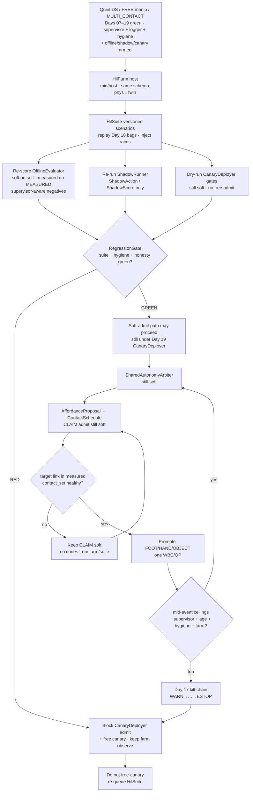
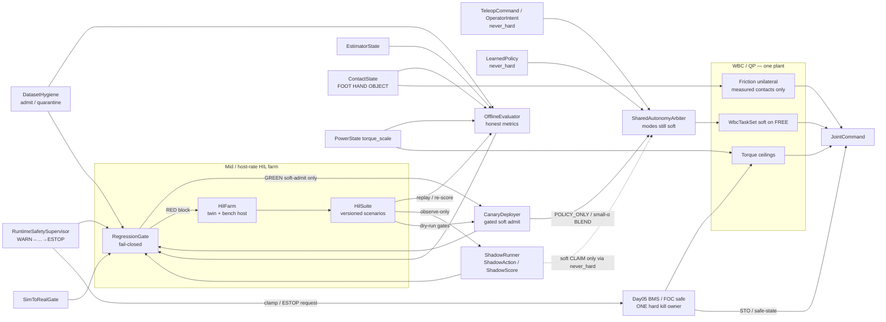
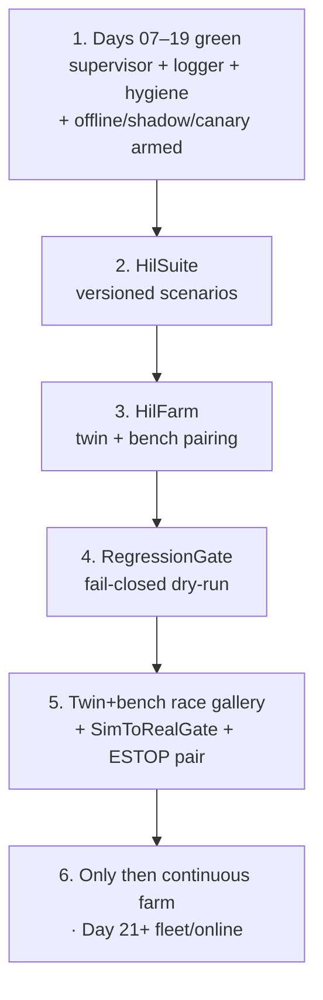

# Day 20 — Hardware-in-loop (HIL) regression farm under supervisor + logging + canary gates


[Day 19](/lessons/day-19-offline-eval-shadow-canary) owned `OfflineEvaluator` / `ShadowRunner` / `CanaryDeployer` — honest offline metrics on quarantined-clean Day 18 bags with supervisor-aware negatives; shadow as `ShadowAction` / `ShadowScore` soft-only (never `JointCommand`, cones, dual-write `torque_scale`, or supervisor stage clear); canary limited soft admit under `SharedAutonomyArbiter` only when OfflineEvaluator + DatasetHygiene + RuntimeSafetySupervisor + SimToRealGate pass; twin race gallery before free canary; MEASURE and Day 05 still bind. [Day 18](/lessons/day-18-teleop-policy-logging-replay) owned `EpisodeLogger` / `ReplayHarness` / `DatasetHygiene` — soft vs measured labels refusing soft→MEASURED; replay soft-only with `age_ms` / stage / `SimToRealGate` / `POWER_GATED` / residual disagree preserved; quarantine dishonest episodes. [Day 17](/lessons/day-17-runtime-safety-supervisor) owned `RuntimeSafetySupervisor` above teleop / policy / arbiter — kill-chain `WARN` → `INHIBIT_SOFT` → `DEMOTE_CONTACTS` → `TORQUE_SCALE_CLAMP` → `ESTOP`, hard clamp / ESTOP only through Day 05 BMS / `torque_scale` / FOC. [Day 16](/lessons/day-16-teleop-shared-autonomy) owned `SharedAutonomyArbiter` with teleop + policy as co-equal soft writers. [Day 15](/lessons/day-15-closed-loop-learned-policies) owned closed-loop `LearnedPolicy` under measured ceilings with `SimToRealGate`. [Day 14](/lessons/day-14-learned-residuals-scene-graphs)–[Day 13](/lessons/day-13-support-affordances) owned soft residuals / scene graphs / affordance CLAIM candidates. [Day 12](/lessons/day-12-multicontact-transitions)–[Day 11](/lessons/day-11-hand-support-loco-manipulation) owned schedules and measured hand support. [Day 09](/lessons/day-09-push-recovery)–[Day 08](/lessons/day-08-stepping-locomotion) owned recovery abort and gait vs measured `contact_set`. [Day 07](/lessons/day-07-wbc-balance) owned the feasible program. [Day 06](/lessons/day-06-estimation-balance) owned the estimate. [Day 05](/lessons/day-05-power-bms) owned sag honesty and `torque_scale`.

Today owns **`HilFarm` / `HilSuite` / `RegressionGate`**: how a continuous twin + bench orchestration host schedules regression suites against physical HIL benches and digital twins with the **same schema**; how versioned suites replay Day 18 bags, inject Day 17–19 race gallery cases, re-score OfflineEvaluator, re-run ShadowRunner observe-only, and dry-run CanaryDeployer gates — including supervisor-aware negatives, `age_ms`, `POWER_GATED`, `SimToRealGate`, residual disagree, and hygiene quarantine spikes; and how a fail-closed `RegressionGate` refuses CanaryDeployer admit (and free canary) when suite regressions, hygiene spikes, false-green offline, shadow hard-write attempts, measure-skip, dual-write `torque_scale`, OVERRIDE-as-bypass, clock skew dropping stage, or unpaired physical/digital ESTOP appear — still no farm plant that writes `JointCommand`, attaches cones, dual-writes `torque_scale`, clears supervisor stage, skips MEASURE, or treats `OPERATOR_OVERRIDE` as a gate bypass.

## The farm is not a promotion plant

A “HIL farm” that greens by stripping honesty, replaying bags without `age_ms` / stage, dual-writing `torque_scale` “for the bench,” treating `OPERATOR_OVERRIDE` as a bypass, skipping MEASURE because the suite looked busy, or silently unpaired physical/digital ESTOP is detector-as-constraint-truth wearing a CI sticker. The farm ticks at **mid / host** rate with `clock_domain` and `age_ms` — not µs / EtherCAT cyclic until jitter is measured and budgeted. Soft channels stay soft forever. Measured channels stay measured forever. Suite pass is soft. Gate green is a soft-admit blocker release — not contact membership. Day 08 gait and Day 09 recovery still outrank soft holds. Day 05 still owns ceilings. Day 17 kill-chain still arms. Day 18 hygiene still gates admit sets. Day 19 Offline / Shadow / Canary still bind. Days 14–19 `never_hard` still binds.

| Layer | Owns | Must not own |
|-------|------|--------------|
| HilFarm | Continuous twin + bench orchestration; schedules suites at mid/host; same schema phys↔twin | Second plant; `JointCommand`; dual-write `torque_scale` “for the bench”; clearing supervisor stage; promoting soft→MEASURED |
| HilSuite | Versioned scenarios: Day 18 bag replay, Day 17–19 race injects, OfflineEvaluator re-score, ShadowRunner observe-only, CanaryDeployer dry-run | Honesty-stripped scenarios that always green; reward-alone pass criteria; measure-skip “because suite busy” |
| RegressionGate | Fail-closed soft-admit blocker; refuses CanaryDeployer / free canary on suite / hygiene / false-green / hard-write / measure-skip / dual-write / OVERRIDE-bypass / clock skew / unpaired ESTOP | Writing `JointCommand` / cones; clearing stage; dual-writing ceilings; hard ESTOP ownership (Day 05 still owns) |
| Day 19 Offline / Shadow / Canary | Re-scored / re-run / dry-run under farm suites; still soft; still gated | Being stripped so farm greens look busy; farm as free-canary shortcut |
| Day 18 hygiene / logger | Admit set + quarantine spike signal for farm gates; honesty channels still logged | Being stripped so suite scores look green |
| Day 17 supervisor | Stage + monitors still armed during every suite tick | Being cleared by farm or OVERRIDE; stage score becoming MEASURED |
| Day 16 arbiter / teleop / policy | Soft writers; canary dry-run still soft under Arbiter | Bypassing kill-chain because “farm is trusted”; OVERRIDE past hard path |
| Measured contact | Membership in hard `contact_set` (FOOT \| HAND \| OBJECT) | Soft score / suite pass / gate green / WARN stage as cone truth |
| Gait (Day 08) | Intended DS/SS/swing clock vs measured feet | Losing the writer fight to a farm soft hold that ignores gait commit |
| Recovery (Day 09) | Mid-disturbance abort / emergency step | Deadlock with farm freeze ordering — document preempt |
| Soft tasks | EE / grasp / posture on **FREE** limbs | Parallel “farm plant” writing `JointCommand` |
| Sim-to-real gate | Twin+bench race honesty before continuous farm / free canary | Perfect-sim green suite that always admits |
| Honesty | Escalate / abort / block canary when ceilings / age / contact / stage / hygiene / pairing fail — including when suite looked busy | Heroic farm that rode past brownout or a false-green twin |

**Core thesis:** a `HilFarm` is a continuous twin + bench orchestration host that schedules regression suites against physical HIL benches and digital twins with the **same schema** — mid / host rate, never a second plant. An `HilSuite` is a versioned suite of scenarios that replay Day 18 bags / inject Day 17–19 race gallery cases / re-score OfflineEvaluator / re-run ShadowRunner observe-only / dry-run CanaryDeployer gates — and **must** include supervisor-aware negatives, `age_ms`, `POWER_GATED`, `SimToRealGate`, residual disagree, and hygiene quarantine spikes. A `RegressionGate` fails closed — refuses CanaryDeployer admit (and free canary) when suite regressions, hygiene spikes, false-green offline, shadow hard-write attempts, measure-skip, dual-write `torque_scale`, OVERRIDE-as-bypass, clock skew dropping stage, or unpaired physical/digital ESTOP appear. The gate is a **soft-admit blocker only**; it never writes `JointCommand` / cones / clears supervisor / dual-writes `torque_scale`. Soft stays soft. Measured stays measured. Day 05 owns ceilings. Day 17 kill-chain stays armed. Day 18 labels refuse soft→MEASURED. Day 19 Offline / Shadow / Canary still bind. There is still **one** QP face and **one** hard torque ceiling owner. The twin + bench must inject farm races (honesty-stripped suite green, replay without `age_ms`/stage, dual-write `torque_scale` “for the bench,” OVERRIDE-as-bypass, skip MEASURE because suite looked busy, unpaired ESTOP, false-green OfflineEvaluator re-score, shadow hard-write under farm schedule, canary dry-run that treats farm green as free admit) before continuous farm / free canary.



**Ownership rule:** one writer for *farm schedule / twin↔bench pairing*, one writer for *suite version + scenario taxonomy*, one writer for *regression gate fail-closed decision*, one writer for *offline metric schema + honesty checks*, one writer for *shadow soft observe / optional soft CLAIM*, one writer for *canary admit / abort / rollback*, one writer for *hygiene quarantine decisions*, one writer for *supervisor stage + soft inhibit*, one writer for *Day 05 torque ceilings / hard kill latch*, one writer for *teleop soft commands*, one writer for *live policy soft actions*, one writer for *arbiter soft blend*, one writer for *schedule intent*, one writer for *measured* `contact_set`. When they disagree on constraints, **measured contact wins for cones**. When they disagree on torque ceilings or ESTOP, **Day 05 / supervisor hard path wins** — farm, canary, and `OPERATOR_OVERRIDE` included. Intent aborts, softens, retimes, rolls back, blocks canary, or waits — it does not promote OBJECT because a suite looked busy. Day 08 gait and Day 09 recovery still outrank a stuck farm hold; document freeze-vs-recovery preempt so the twin cannot invent a deadlock under farm schedule.

## How today fits the Days 05–19 stack

| Day | What you already froze | What Day 20 reuses |
|-----|------------------------|--------------------|
| 05 | `torque_scale`, `POWER_GATED`, sag honesty, FOC safe | Farm never dual-writes; suite scores missed `POWER_GATED`; OVERRIDE cannot bypass; unpaired ESTOP fails gate |
| 06 | `EstimatorState`, age / stale, contact modes | Suite replay / re-score preserve and score `age_ms`; stripping age is a false-green farm race |
| 07 | Tasks vs hard friction / unilaterality | New contacts join the hard set only when measured — never from suite pass or gate green |
| 08 | Gait modes vs measured `contact_set` | Farm soft freeze must not steal swing constraints; document yield / retime |
| 09 | Mid-event abort / soften; `RecoveryCommand` | Recovery preempt vs farm freeze ordering is a first-class twin fight |
| 10 | Soft EE / grasp; FREE vs CLAIM honesty | CLAIM without measure still forbidden under farm / suite / gate |
| 11 | MEASURED_SUPPORT hands; LOCO_MANIP | Hands remain first-class; demote / farm block cover HAND / OBJECT slots |
| 12 | `ContactSchedule` phases; OBJECT kind | Farm demote / canary block aborts schedule lifecycle — does not invent cones |
| 13 | Affordance soft CLAIM; conf gates CLAIM not cones | Suite / farm may rank CLAIM; still never attaches cones |
| 14 | Residual / scene soft; `never_hard`; mid-rate `age_ms` | Residual disagree is a first-class suite / gate fail signal |
| 15 | `LearnedPolicy` soft; `SimToRealGate`; closed-loop live ticks | Farm schedules soft policy siblings; suite pass ≠ MEASURED; gate honesty preserved |
| 16 | `SharedAutonomyArbiter`; teleop + policy co-equal soft; OVERRIDE still soft | Farm / canary dry-run still soft into Arbiter; OVERRIDE still cannot hard-bypass |
| 17 | `RuntimeSafetySupervisor`; kill-chain; hard kill via Day 05 only | Stage + monitors **must** stay armed on every suite tick; stage ≠ MEASURED |
| 18 | `EpisodeLogger` / `ReplayHarness` / `DatasetHygiene` | Suites replay Day 18 bags soft-only; hygiene spike fails RegressionGate; labels still refuse soft→MEASURED |
| 19 | `OfflineEvaluator` / `ShadowRunner` / `CanaryDeployer` | Suites re-score Offline, re-run Shadow observe-only, dry-run Canary; RegressionGate blocks admit on regress |

Do not bolt a “farm plant” that writes `JointCommand` or attaches cones beside the QP when a suite greens. That is Day 10’s second-plant anti-pattern wearing a continuous-integration sticker.

## Suite / scenario taxonomy (label honesty)

Every suite scenario is labeled by the channel it may touch. Soft scores and suite passes never promote into measured membership by rename — including for “just HIL.”

| Scenario class | May exercise | Must never become / use as |
|----------------|--------------|----------------------------|
| Soft bag replay / ranking / dry-run | `LABEL_SOFT_INTENT` (teleop / policy / arbiter / shadow / canary dry-run) | `MEASURED` contact membership / cones / $F_z \ge 0$ |
| Supervisor-aware negatives | `LABEL_SUPERVISOR_STAGE`, `LABEL_NEGATIVE_KILL` | Cone truth; “green enough to free-canary” without stage honesty |
| Measured contact fidelity | `LABEL_MEASURED_CONTACT` | Soft score / suite pass with a louder name |
| Power honesty | `LABEL_POWER` | Infinite-torque GT; dual-writer “for the bench” |
| Estimate / residual honesty | `LABEL_ESTIMATE` + residual disagree | Age-stripped “clean” state as sole suite GT |
| Gate honesty | `LABEL_GATE` | False-green after stripping fails |
| Aggregate RegressionGate score | Weighted soft + measured + negatives + age + gate + power + pairing | Reward / success rate / “suite looked busy” alone |

**Required HilSuite coverage (all required before continuous farm green):**

1. Replay Day 18 quarantined-clean bags soft-only — preserve `age_ms` / stage / `SimToRealGate` / `POWER_GATED` / residual disagree.
2. Re-score OfflineEvaluator — soft metrics on soft only; measured on MEASURED only; supervisor-aware negatives present; refuse-green-on-reward-alone.
3. Re-run ShadowRunner observe-only — `ShadowAction` / `ShadowScore` only; cones / `JointCommand` / dual-write / clear-stage rejected; dropout / live disagree / residual / stage↑ first-class.
4. Dry-run CanaryDeployer gates — attempt limited admit only when Offline + Hygiene + Supervisor + `SimToRealGate` pass; abort / rollback on escalate / stale / POWER_GATED / gate fail / residual / hygiene spike; MEASURE still required; OVERRIDE cannot force past Day 05.
5. Inject Day 17–19 race gallery cases — false-green offline, shadow hard-write, canary skip-MEASURE, dual-write `torque_scale`, OVERRIDE-as-bypass, clock skew dropping stage, reward-hacked bags, hygiene quarantine spike.
6. Physical ↔ digital ESTOP pairing — unpaired → RegressionGate RED.
7. Mid / host rate with `age_ms` — never inside µs / EtherCAT cyclic write path until jitter measured.

**Promotion / admit refusal rules (all required):**

1. Relabeling soft→MEASURED (or suite-pass→cones) for farm scoring is a **hygiene / farm fault**, not a CI option.
2. `OPERATOR_OVERRIDE` bags / suite ticks remain soft; OVERRIDE-as-bypass stays quarantined and must not green RegressionGate.
3. `never_hard: true` on farm soft channels — API and runtime refuse soft→hard promotion in suite, gate, and canary dry-run.
4. Farm / suite / gate tick at mid / host rate with `age_ms` — never inside the current loop or EtherCAT cyclic write path until jitter is measured and budgeted; no nets in µs loops reconstructing cones from suite scores.

Quarantine, abort, rollback, block-canary, and keep-negatives are **success paths** when the suite hacked past `WARN`, the shadow lied under farm schedule, the canary dry-run skipped MEASURE, the pack sagged, the twin showed a late kill, ESTOP was unpaired, or someone tried to pretty-print honesty out of the farm report. A farm dashboard that always looks green after export is ignoring Day 05–19 with prettier CI badges.

## Ownership conflict: farm vs offline vs shadow vs canary vs soft vs measure vs gait vs recovery vs power

HIL regression is where teams accidentally create an eleventh writer on support constraints and a second writer on `torque_scale` “for the bench.” Freeze the split:

| Conflict | Winner | Farm / suite / gate behavior |
|----------|--------|------------------------------|
| Soft / suite pass vs measured contact | Measured contact | Soft stays soft; never promotes |
| Supervisor stage vs missing measure | Measured contact | Wait / demote / block canary; stage never attaches cones |
| Farm soft refs vs cones | Soft-only farm | Reject cone attach; fault as farm-plant attempt |
| Farm vs `JointCommand` | Hard stack refusal | Farm schedules only; never writes JointCommand |
| Farm vs dual-writer on `torque_scale` | Day 05 BMS owner only | Reject; RegressionGate RED |
| Suite / canary skips MEASURE before PROMOTE | Measured contact + hygiene | Block; quarantine episode; twin race must catch |
| Missed `POWER_GATED` during suite | Power honesty + supervisor | Escalate / clamp; gate RED |
| Stale `age_ms` during suite window | Age gate + supervisor | Fail suite; gate RED if stripped |
| False-green OfflineEvaluator re-score | OfflineEvaluator + RegressionGate | Block canary; twin race must fail closed |
| Reward-hacked bags greening suite | Hygiene + OfflineEvaluator | Fail suite green; quarantine remains |
| Clock skew dropping stage during suite | Clock domain + supervisor | Prefer fail-safe gate RED over trusting stage-less suite |
| Farm treats OVERRIDE as gate bypass | Supervisor + Day 05 hard path | Soft freeze / hard path wins; gate RED; quarantine |
| Shadow hard-write under farm schedule | ShadowRunner + RegressionGate | Block; fault as plant attempt |
| Residual disagree under suite | Day 14 honesty + supervisor | Gate RED; do not clean away |
| Active `RecoveryCommand` vs farm freeze | Documented preempt | Twin must show ordering; no silent deadlock |
| Gait swing / touchdown vs farm soft hold | Measured feet + gait owner | Retime / pause CLAIM; never steal swing constraints |
| Hygiene quarantine spike mid-suite | DatasetHygiene + RegressionGate | Gate RED; do not “ride it out” |
| Pretty suite cleaner (drop stage / negatives) | Honesty refusal | Reject cleaner; keep raw honesty channels |
| Unpaired physical/digital ESTOP | Bring-up pairing + RegressionGate | Gate RED; do not continuous-farm |
| Training / deploy plant wants hard cones from farm green | Hard stack refusal | Reject at API; log farm-plant attempt |



**Hard vs soft:** support constraints on **measured** FOOT / HAND / OBJECT stay hard. Soft EE and arbiter refs live only on FREE limbs. Suite passes and gate greens are softer still — they schedule and block, they do not feed cones. Hard kill / clamp is owned only by Day 05. If the QP goes infeasible under an expanded set during a farm suite, demote / abort / soften / block canary — do not silently drop an object cone so the suite “makes it safe.”

## Physical ↔ digital pairing for HIL

| Physical | Digital twin / backing |
|----------|------------------------|
| Same HilSuite schema under changing support membership | No perfect-state suite that strips age / stage while hardware ages out |
| Live `age_ms` / `clock_domain` during suite ticks | Twin must inject clock skew dropping stage in suite window |
| Live kill-chain stage + monitors | Twin must inject farm that treats OVERRIDE as bypass; reject |
| Soft farm schedule / suite observe | Twin must inject farm hard-write / cones / JointCommand; reject |
| `POWER_GATED` / `torque_scale` history | Twin must inject farm dual-writer and missed `POWER_GATED` |
| Canary dry-run abort / rollback under farm | Twin must show rollback restores prior soft admit; hard path unchanged |
| Hygiene quarantine spike | Twin must inject spike mid-suite → RegressionGate RED |
| False-green OfflineEvaluator re-score | Twin must inject honesty-stripped scores; gate fails closed |
| Physical + digital ESTOP pairing | Unpaired → gate RED; continuous farm forbidden |
| Mid-rate farm / suite / gate + jitter | Cannot beat hardware cadence or hide age faults; no net inside cyclic write path |
| `SimToRealGate` | Explicit RED/YELLOW/GREEN; block continuous farm / free canary until GREEN with race gallery |

If the twin always greens suites and admits canary with full packs while hardware sees late trips, false greens, OVERRIDE spam, stripped age, dual-writers, and unpaired ESTOP, you will farm forever on theater and never ship a CLAIM that survives a tired bus or a race you only passed in CI slides.

## Mid-event / mid-suite honesty

Shared-autonomy mid-rate paths are where teams “keep the farm green just until the demo finishes.” Do not.

| Signal mid-CLAIM / mid-suite | Required behavior |
|------------------------------|-------------------|
| `INPUT_STALE` / confidence cliff on estimate or contact | Abort / inhibit soft weight; advance supervisor; do not strip age for suite score |
| Shadow dropout / host stall / rate miss under farm | Log; inhibit shadow CLAIM; do not promote on last-known shadow action; may gate RED |
| Shadow disagree with live policy beyond budget | First-class signal; may block canary admit / gate RED |
| Operator dropout / stick disconnect under canary blend during suite | Inhibit teleop; do **not** promote on last-known EE delta; farm still yields |
| Farm / canary fighting `INHIBIT_SOFT` / OVERRIDE spam | Soft freeze wins; OVERRIDE cannot clear stage or force farm past Day 05; gate RED |
| Policy / canary / suite reward-hack past WARN into hard writes | Escalate stage; reject; abort / quarantine — keep as negative |
| Residual / graph inconsistency (Day 14) under suite | Preserve residual disagree; demote or never promote; gate RED |
| Domain shift / SimToRealGate red | Soften / re-gate; freeze continuous farm / free canary; do not export suite as green |
| `POWER_GATED` / falling `torque_scale` | Escalate to clamp; gate RED; quarantine if ignored |
| Contact flicker / wrench disagree | Demote that slot; abort soft weight on that CLAIM |
| Foot `contact_set` collapses mid-handoff | Yield to Day 09 recovery; document freeze vs recovery preempt under farm |
| QP infeasible under expanded cones | Demote newest promote and/or drop soft EE — do not drop unilaterality to “fit the suite” |
| Late kill (trip after promote under suite) | Demote + Day 05 clamp / ESTOP; **rollback** canary dry-run; keep as `LABEL_NEGATIVE_KILL`; gate RED |
| Hygiene quarantine spike mid-suite | Gate RED; do not ride it out |
| False trip | Hysteresis / confirm; do not disable kill-chain; log for twin gallery |
| Dual-writer attempt on `torque_scale` (farm or suite harness) | Reject non-BMS writer; gate RED; quarantine |
| Farm / suite attempting cones / JointCommand | Reject at HilFarm / HilSuite API; fault as plant attempt |
| Age / stage stripped by suite exporter | Fail suite green; hygiene quarantine; twin race must catch |
| Recovery asserts during farm freeze | Follow documented preempt; no deadlock |
| Gait swing / touchdown commit | Retime or pause CLAIM; never steal swing constraints |
| Suite / canary skips MEASURE before PROMOTE | Gate RED; quarantine; twin race must catch |
| Physical ESTOP without digital latch (or reverse) | Fail bring-up — pairing required; gate RED; bags without pairing metadata quarantine |
| Suite looked busy → skip honesty | Fail closed; honesty > busyness |

Abort, demote, clamp, ESTOP, quarantine, rollback, block-canary, and keep-negatives are **success paths** when the suite, the farm harness, the shadow, the canary dry-run, the pack, the exporter, the pairing, or the race lied mid-CLAIM.

## Shared API: HilFarm / HilSuite / RegressionGate above Day 19 shapes

Keep Day 02 / 04 wire honesty. Cyclic commands still carry `BusHeader`. Extend Day 19 Offline / Shadow / Canary / Day 18 hygiene / Day 17 supervisor / Day 16 arbiter / Day 15 policy / Day 14 residual / Day 13 `AffordanceProposal` / Day 12 `ContactSchedule` / Day 05 power — do not invent a parallel “farm bus” or second plant:

```text
BusHeader:
  node_id, seq
  t_sample, clock_domain, age_budget_ms
  faults

# Upstream (read-only for farm; does not replace owners)
EstimatorState, PowerState  ⊇ BusHeader
ContactState ⊇ BusHeader:
  contact_set[]        # feet, hands, AND objects when measured
  SupportContact:
    link_id / frame
    kind               # FOOT | HAND | OBJECT
    mu, normal, wrench_est?
    confidence, age_ms
    flags              # settling / flicker / gated / grasp_lost
    parent_grasp_id?

# Soft teleop / policy / arbiter — Day 16 unchanged; inhibitable; loggable
TeleopCommand / OperatorIntent  ⊇ BusHeader
  # still never_hard; still age_ms; OVERRIDE still soft only

LearnedPolicy / PolicyAction / PolicyCommand  ⊇ BusHeader
  # still never_hard; still closed_loop + age_ms

SharedAutonomyArbiter ⊇ BusHeader:
  mode                 # … | SAFE | ABORT
  # still never_hard; still yield_to GAIT | RECOVERY | POWER
  supervisor_ref?
  canary_ref?          # optional limited soft admit (Day 19)
  farm_ref?            # optional suite context (Day 20) — still soft

RuntimeSafetySupervisor ⊇ BusHeader:
  stage                # GREEN | WARN | INHIBIT_SOFT | DEMOTE_CONTACTS
                       # | TORQUE_SCALE_CLAMP | ESTOP
  monitors[]
  soft_intent / hard_kill_request
  # still never_hard_soft_intents; hard kill via Day 05 only

# Day 18 — still armed; suites consume admit set
EpisodeLogger / ReplayHarness / DatasetHygiene  ⊇ BusHeader
  # labels refuse soft→MEASURED; replay soft-only; quarantine / keep negatives

# Day 19 — still bind; suites re-score / re-run / dry-run
OfflineEvaluator ⊇ BusHeader
  # refuse_soft_to_measured; refuse_green_on_reward_alone; strip_honesty: false
  # block_canary_until_green: true

ShadowRunner ⊇ BusHeader
  # mode OBSERVE_ONLY; never JointCommand / cones / dual-write / clear stage

CanaryDeployer ⊇ BusHeader
  # gates_required Offline + Hygiene + Supervisor + SimToRealGate
  # + RegressionGate green (Day 20)
  block_free_canary_until_twin_gallery_green: true
  block_canary_until_farm_green: true   # Day 20

# HIL farm (host / mid-rate)
HilFarm ⊇ BusHeader:
  farm_id
  schema_version
  targets[]:           # PHYSICAL_BENCH | DIGITAL_TWIN
    bench_id / twin_id
    same_schema: true
  schedule:
    continuous: true
    tick_rate_hint_hz          # mid / host — not µs cyclic
  orchestrates: HilSuite
  never_hard: true
  forbid:
    write_joint_command: true
    attach_cones: true
    dual_write_torque_scale: true
    write_contact_state_membership: true
    clear_supervisor_stage: true
    skip_measure_for_busy_suite: true
  yield_to             # GAIT | RECOVERY | POWER
  age_ms
  require_estop_pairing: true
  block_if_unpaired_estop: true

HilSuite ⊇ BusHeader:
  suite_id
  version
  scenarios[]:
    kind               # BAG_REPLAY | RACE_INJECT | OFFLINE_RESCORE
                       # | SHADOW_OBSERVE | CANARY_DRY_RUN
    bag_set_ref?       # DatasetHygiene ADMIT (+ KEEP_NEGATIVE)
    race_inject?       # Day 17–19 gallery case id
    require:
      supervisor_aware_negatives: true
      age_ms_honesty: true
      power_gated_honesty: true
      sim_to_real_gate_honesty: true
      residual_disagree_honesty: true
      hygiene_spike_coverage: true
  refuse_soft_to_measured: true
  refuse_strip_honesty: true
  never_hard: true
  tick_rate_hint_hz            # mid / host
  age_ms
  same_schema_phys_twin: true

RegressionGate ⊇ BusHeader:
  gate_id
  status               # GREEN | RED
  fail_closed: true
  soft_admit_blocker_only: true
  block_canary_until_farm_green: true
  refuse_on:
    suite_regression: true
    hygiene_quarantine_spike: true
    false_green_offline: true
    shadow_hard_write_attempt: true
    measure_skipped: true
    dual_write_torque_scale: true
    override_as_gate_bypass: true
    clock_skew_dropped_stage: true
    unpaired_physical_digital_estop: true
    reward_alone_suite_pass: true
    honesty_stripped_export: true
  never_hard: true
  forbid:
    write_joint_command: true
    attach_cones: true
    dual_write_torque_scale: true
    clear_supervisor_stage: true
  yield_to             # GAIT | RECOVERY | POWER
  age_ms
  operator_override_cannot_bypass_day05: true

# Day 05 hard path — ONE owner (farm / suite / gate never dual-write)
PowerState / BmsCommand ⊇ BusHeader:
  torque_scale
  POWER_GATED
  clamp_request_src?   # SUPERVISOR | BMS | ...
  estop_latch
  clear_requires_human: true
  phys_digital_paired: true

# Soft perception / schedule — Day 13–19 + farm block / demote
AffordanceProposal ⊇ BusHeader
ContactSchedule ⊇ BusHeader

SimToRealGate ⊇ BusHeader:
  status               # RED | YELLOW | GREEN
  checks[]:
    # … Day 14–19 checks …
    farm_honesty_stripped_suite_green
    farm_dual_writes_torque_scale_for_bench
    farm_OVERRIDE_as_bypass
    farm_skips_MEASURE_because_suite_busy
    farm_unpaired_estop
    farm_replay_without_age_or_stage
    farm_shadow_hard_write_under_schedule
    farm_canary_dry_run_as_free_admit
  age_ms
  block_continuous_farm_until_green: true
  block_free_canary_until_green: true

ManipulationCommand / WbcTaskSet / JointCommand
  # Day 16–19 shapes unchanged — farm/suite/gate never write JointCommand
  # as-if-measured or attach cones; CEIL comes from Day 05 only
```

Higher layers publish teleop commands, policy actions, arbiter blends, shadow scores, canary soft admits, farm schedules, suite results, residual corrections, affordance candidates, schedule intent, supervisor soft intents, offline-scored honesty, and **regression-gate** soft-admit decisions. Measured `ContactState` owns support membership. Day 05 owns torque ceilings and ESTOP latch. Gait and recovery keep their writers. Nobody re-implements FOC, AHRS, or friction cones inside the HilFarm, the HilSuite, or the RegressionGate.

## Bring-up sequence (before continuous farm)

Days 07–19 green (stance, step, recovery, FREE-hand reach, measured hand SUPPORT / loco-manip, scripted multi-contact / OBJECT handoffs, gated affordance CLAIM, residual / scene soft feeds, closed-loop policy with `SimToRealGate` green, teleop / blend / OVERRIDE mid-arbitration honesty, supervisor race gallery green with kill-chain armed, logger / replay / hygiene race gallery green with free harvest gates, offline / shadow / canary race gallery green with free canary gates). Then:



1. **Days 07–19 green** — teleop / policy / arbiter / residual / affordance admit / supervisor / logger / hygiene / offline / shadow / canary paths still behave; `never_hard` still enforced; OVERRIDE still cannot attach cones or skip MEASURE; hard kill still only through Day 05; free canary gates green.
2. **HilSuite (versioned scenarios)** — define bag-replay / race-inject / offline-rescore / shadow-observe / canary-dry-run scenarios; confirm supervisor-aware negatives, `age_ms`, `POWER_GATED`, `SimToRealGate`, residual, hygiene spike coverage; confirm refuse soft→MEASURED and refuse strip-honesty.
3. **HilFarm (twin + bench pairing)** — schedule same schema on physical HIL and digital twin; confirm mid/host rate; confirm forbid `JointCommand` / cones / dual-write `torque_scale` / clear-stage / skip-MEASURE; confirm ESTOP pairing required.
4. **RegressionGate fail-closed dry-run** — inject suite regression, hygiene spike, false-green offline, shadow hard-write, measure-skip, dual-write, OVERRIDE-bypass, clock skew, unpaired ESTOP; confirm status RED blocks CanaryDeployer admit / free canary; confirm gate never writes hard channels; confirm OVERRIDE cannot force past Day 05.
5. **Twin+bench race gallery + SimToRealGate + ESTOP pair** — twin+bench inject honesty-stripped suite green, replay without `age_ms`/stage, dual-write `torque_scale` for bench, OVERRIDE-as-bypass, skip MEASURE because suite looked busy, unpaired ESTOP, false-green OfflineEvaluator re-score, shadow hard-write under farm schedule, canary dry-run treated as free admit; confirm escalate / reject / gate RED; `SimToRealGate` must go GREEN before continuous farm.
6. **Then** run continuous farm with supervisor + logger + hygiene + offline / shadow / canary gates green — never replace cones, FOC, `torque_scale` ownership, gait, recovery, measured `ContactState`, Day 17 kill-chain, Day 18 label taxonomy, or Day 19 Offline / Shadow / Canary contracts. Fleet multi-robot shared-autonomy logging / ticket-log sync / online continual learning under the same gates waits for Day 21+.

Skip to “ship continuous farm because the suite looked busy” and hardware’s first farm-scheduled rail grasp becomes an unplanned tip / brownout experiment with better CI charts.

## Failure gallery

| Symptom | Likely cause |
|---------|--------------|
| Promotes on air from suite pass / gate green | Soft→MEASURED promotion; cones without `contact_set` |
| Twin suite green, hardware late / yellow | Age / stage stripped; SimToRealGate green without race gallery |
| Farm rides past brownout | Missed `POWER_GATED`; clamp path not in refuse_on |
| OVERRIDE forces farm past Day 05 | OVERRIDE misdocumented as hard ownership; gate bypass |
| Farm writes JointCommand / cones | HilFarm-as-second-plant; `never_hard` not enforced |
| Dual-writer fights on `torque_scale` during suite | Farm / harness bypassed BMS API; ceilings thrash |
| Suite greens on reward / busy alone | Supervisor-aware negatives / age / gate / power / pairing metrics missing |
| Pretty exporter drops residual disagree / stage for suite scores | Honesty cleaner anti-pattern; RegressionGate refusal missing |
| False-green OfflineEvaluator re-score under farm | Gate checks not in suite; twin race skipped |
| Clock skew suite window without stage | `clock_domain` / stage preservation missing |
| Hygiene quarantine spike ignored mid-suite | refuse_on spike missing; “ride it out” anti-pattern |
| Stale `age_ms` kept GREEN in suite | Age gate missing; last-known green trusted |
| Policy / canary / suite reward-hack past WARN trained as success | Escalate / abort / quarantine / gate RED missing |
| Shadow hard-write under farm schedule treated as noise | First-class plant-attempt fault missing |
| Recovery deadlocks with farm freeze | Preempt ordering undocumented; twin never injected the fight |
| Virtual ESTOP only / physical unpaired under farm | Bring-up pairing skipped; gate did not RED |
| Second plant for “safe” brace from farm green | Parallel optimizer writing `JointCommand` on ESTOP edge |
| Farm / suite / gate net inside current / EtherCAT cyclic | Jitter never measured; standing principle violated |
| QP infeasible → silent cone drop under farm demote | Demote/abort/block path missing; “make it feasible” anti-pattern |
| Gait swing stolen during farm freeze | Freeze did not yield / retime to Day 08 commit |
| Schedule freezes loaded sole for SAFE pose from farm | Intent owns foot constraints instead of measured feet |
| Continuous farm only on sticky perfect sims | No honesty-strip / dual-write / skip-MEASURE / OVERRIDE-bypass / unpaired-ESTOP / sag injects; gate never red |
| Canary dry-run treated as free admit because farm green | RegressionGate / CanaryDeployer contract broken; still_soft missing |

## What to freeze this week

Extend [frames](/frames) and your control / eval / deploy / HIL config with:

- `HilFarm` fields: `farm_id`, `schema_version`, `targets[]` PHYSICAL_BENCH \| DIGITAL_TWIN with `same_schema: true`, continuous schedule at mid/host `tick_rate_hint_hz`, orchestrates `HilSuite`, **forbid** `JointCommand` / cones / dual-write `torque_scale` / `ContactState` writes / clear supervisor stage / skip-MEASURE-for-busy-suite, `require_estop_pairing: true`, `never_hard: true`, `yield_to` GAIT \| RECOVERY \| POWER
- `HilSuite` fields: `suite_id`, `version`, scenarios BAG_REPLAY \| RACE_INJECT \| OFFLINE_RESCORE \| SHADOW_OBSERVE \| CANARY_DRY_RUN, **require** supervisor-aware negatives / `age_ms` / `POWER_GATED` / gate / residual / hygiene spike coverage, `refuse_soft_to_measured: true`, `refuse_strip_honesty: true`, `same_schema_phys_twin: true`
- `RegressionGate` fields: `status` GREEN \| RED, `fail_closed: true`, `soft_admit_blocker_only: true`, `block_canary_until_farm_green: true`, refuse_on suite regression / hygiene spike / false-green offline / shadow hard-write / measure-skip / dual-write / OVERRIDE-bypass / clock skew / unpaired ESTOP / reward-alone / honesty-stripped export, **forbid** hard writes, `operator_override_cannot_bypass_day05: true`
- Day 19 `CanaryDeployer` extension: `block_canary_until_farm_green: true` beside existing Offline + Hygiene + Supervisor + SimToRealGate gates
- Explicit rule: teleop score / policy reward / blend score / shadow score / canary weight / suite pass / gate green / supervisor stage $\neq$ MEASURED; soft channels never write `JointCommand`, friction cones, FOC $i_q$, or `ContactState` on farm, suite, or gate
- Explicit rule: Day 17 supervisor + Day 18 logger / hygiene + Day 19 Offline / Shadow / Canary stay armed during farm; hard kill still only through Day 05; `OPERATOR_OVERRIDE` cannot bypass kill-chain hard stages, BMS, gait, or recovery — including to force farm green or canary
- Who owns **farm schedule / pairing** vs **suite version / taxonomy** vs **regression gate fail-closed** vs **offline metric schema** vs **shadow soft observe** vs **canary admit / abort / rollback** vs **hygiene quarantine** vs **supervisor stage + soft inhibit** vs **Day 05 hard kill latch** vs **teleop soft** vs **policy soft** vs **arbiter soft blend** vs **schedule intent** vs **measured** `contact_set` vs **gait** vs **recovery** (disagree on cones → measured wins; disagree on ceilings / ESTOP → Day 05 / supervisor hard path wins)
- Documented recovery preempt vs farm freeze ordering
- Rate / jitter budget: farm / suite / gate at mid / host rates with `age_ms`; forbidden inside µs / EtherCAT cyclic until jitter measured; no nets reconstructing cones in µs loops
- Twin+bench hooks: honesty-stripped suite green, replay without `age_ms`/stage, dual-write `torque_scale` for bench, OVERRIDE-as-bypass, skip MEASURE because suite looked busy, unpaired ESTOP, false-green OfflineEvaluator re-score, shadow hard-write under farm schedule, canary dry-run as free admit — same as hardware; `SimToRealGate` blocks continuous farm / free canary until GREEN
- Bring-up gate: no continuous farm until steps 1–5 above are green

The lesson is not “ship continuous farm until the suite looks busy.” It is **make HIL regression the same contact-rich program in silicon, on the bench, and in the twin**: a `HilFarm` that schedules twin+bench suites without becoming a second plant, an `HilSuite` that replays Day 18 bags and re-scores / re-runs / dry-runs Day 19 Offline / Shadow / Canary with supervisor-aware honesty intact, a `RegressionGate` that fails closed on canary admit when races or hygiene regress, measured FOOT/HAND/OBJECT still owning the hard support set, one estimate, honest power ceilings, Day 17 kill-chain still armed, Day 18 labels still refusing soft→MEASURED, Day 19 Offline / Shadow / Canary still binding, schedules that wait for measurement and yield to gait/recovery, soft tasks only where soft belongs, farm / suite / gate ticks outside µs loops until jitter is honest, Days 14–19 `never_hard` still binding, and abort / rollback / quarantine / gate-RED / SimToRealGate paths that stay honest when the suite, the farm harness, the exporter, the pairing, the race, or the sim lies mid-CLAIM.

## Next

**Day 21+** — Fleet multi-robot shared-autonomy logging / ticket-log sync / online continual learning under supervisor + logging + canary + HIL gates: multi-robot EpisodeLogger / hygiene / OfflineEvaluator / ShadowRunner / CanaryDeployer / HilFarm coordination with ticket-log sync and gated online continual learning — still no plant that bypasses MEASURE or Day 05 ceilings.
