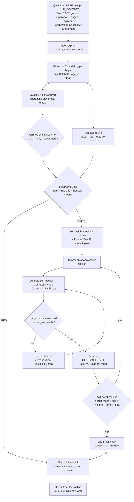
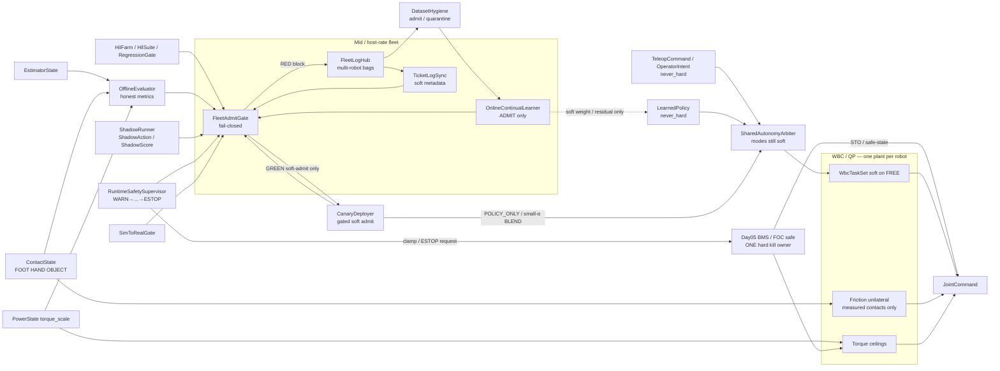
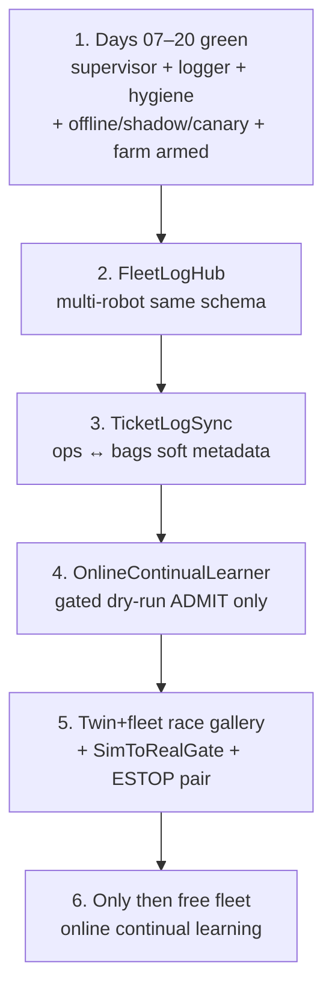

# Day 21 — Fleet multi-robot shared-autonomy logging / ticket-log sync / online continual learning under supervisor + logging + canary + HIL gates


[Day 20](/lessons/day-20-hil-regression-farm) owned `HilFarm` / `HilSuite` / `RegressionGate` — continuous twin+bench orchestration schedules versioned suites that replay Day 18 bags, re-score OfflineEvaluator, re-run ShadowRunner observe-only, and dry-run CanaryDeployer; `RegressionGate` fails closed and blocks canary admit when races or hygiene regress; soft-admit blocker only; never a farm plant that bypasses MEASURE or Day 05. [Day 19](/lessons/day-19-offline-eval-shadow-canary) owned `OfflineEvaluator` / `ShadowRunner` / `CanaryDeployer` — honest offline metrics, shadow soft-only, canary limited soft admit when Offline + Hygiene + Supervisor + SimToRealGate pass. [Day 18](/lessons/day-18-teleop-policy-logging-replay) owned `EpisodeLogger` / `ReplayHarness` / `DatasetHygiene` — soft vs measured labels refusing soft→MEASURED; replay soft-only with honesty preserved; quarantine dishonest episodes. [Day 17](/lessons/day-17-runtime-safety-supervisor) owned `RuntimeSafetySupervisor` — kill-chain WARN→…→ESTOP; hard clamp / ESTOP only through Day 05. [Day 16](/lessons/day-16-teleop-shared-autonomy) owned `SharedAutonomyArbiter` with teleop + policy as co-equal soft writers. [Day 15](/lessons/day-15-closed-loop-learned-policies)–[Day 14](/lessons/day-14-learned-residuals-scene-graphs) owned closed-loop soft policies and residuals under measured ceilings. [Day 13](/lessons/day-13-support-affordances)–[Day 11](/lessons/day-11-hand-support-loco-manipulation) owned affordances and measured hand support. [Day 09](/lessons/day-09-push-recovery)–[Day 08](/lessons/day-08-stepping-locomotion) owned recovery and gait. [Day 07](/lessons/day-07-wbc-balance)–[Day 05](/lessons/day-05-power-bms) owned the feasible program, estimate, and sag honesty.

Today owns **`FleetLogHub` / `TicketLogSync` / `OnlineContinualLearner`**: how a multi-robot logging hub coordinates per-robot EpisodeLoggers with the **same schema and label taxonomy**; how ticket↔log sync links ops tickets / incidents to bags, hygiene outcomes, and gate results as **soft metadata only**; and how a fail-closed gated `OnlineContinualLearner` consumes fleet hygiene-admit sets only — still mid / host rate, still `never_hard`, still under Day 17 supervisor + Day 18 hygiene + Day 19 Offline / Shadow / Canary + Day 20 HilFarm / RegressionGate — including a soft-admit `FleetAdmitGate` that refuses online updates when cross-robot label drift, ticket soft→MEASURED renames, quarantine-as-train, dual-write `torque_scale` “for fleet health,” OVERRIDE-ticket-as-bypass, measure-skip because the fleet looked busy, clock skew dropping stage, or unpaired physical/digital ESTOP appear — still no fleet plant that writes `JointCommand`, attaches cones, dual-writes `torque_scale`, clears supervisor stage, skips MEASURE, or treats `OPERATOR_OVERRIDE` as a gate bypass.

## The fleet is not a promotion plant

A “fleet continual learning” stack that greens by stripping honesty across robots, training on quarantined bags because “fleet volume,” renaming ticket severity into MEASURED contact, dual-writing `torque_scale` “for fleet health,” treating OVERRIDE tickets as hard bypass, skipping MEASURE because the fleet looked busy, or silently unpaired ESTOP across sites is detector-as-constraint-truth wearing a multi-robot sticker. The hub ticks at **mid / host** rate with `clock_domain` and `age_ms` — not µs / EtherCAT cyclic until jitter is measured and budgeted. Soft channels stay soft forever. Measured channels stay measured forever. Fleet green is soft. Ticket severity is soft. Online update weight is soft. Gate green is a soft-admit blocker release — not contact membership. Day 08 gait and Day 09 recovery still outrank soft holds. Day 05 still owns ceilings. Day 17 kill-chain still arms. Day 18 hygiene still gates admit sets. Day 19 Offline / Shadow / Canary still bind. Day 20 farm / suite / gate still bind. Days 14–20 `never_hard` still binds.

| Layer | Owns | Must not own |
|-------|------|--------------|
| FleetLogHub | Multi-robot EpisodeLogger coordination; same schema / labels / hygiene across robots; mid/host | Second plant; `JointCommand`; dual-write `torque_scale` “for fleet”; clearing supervisor stage; promoting soft→MEASURED |
| TicketLogSync | Ticket↔bag / hygiene / gate linkage as soft metadata | Cone truth; MEASURED membership via ticket rename; OVERRIDE-ticket hard bypass |
| OnlineContinualLearner | Gated soft weight / residual updates from hygiene ADMIT only | Hard writes; train-on-quarantine; skip MEASURE; clear stage; dual-write ceilings |
| FleetAdmitGate | Fail-closed soft-admit blocker for online updates / free fleet canary | Writing `JointCommand` / cones; clearing stage; dual-writing ceilings; hard ESTOP ownership |
| Day 20 farm / suite / gate | Per-robot / per-bench regression still required before fleet online | Being stripped so fleet greens look busy |
| Day 19 Offline / Shadow / Canary | Still soft; still gated per robot | Being stripped so fleet online looks green |
| Day 18 hygiene / logger | Per-robot admit set; fleet consumes ADMIT only | Being stripped / cross-robot label drift ignored |
| Day 17 supervisor | Stage + monitors still armed per robot during fleet ticks | Being cleared by fleet hub, ticket, or OVERRIDE |
| Day 16 arbiter / teleop / policy | Soft writers; online updates still soft under Arbiter | Bypassing kill-chain because “fleet is trusted” |
| Measured contact | Membership in hard `contact_set` (FOOT \| HAND \| OBJECT) | Soft score / ticket severity / fleet green / learn weight / WARN stage as cone truth |
| Gait (Day 08) | Intended DS/SS/swing clock vs measured feet | Losing the writer fight to a fleet soft hold |
| Recovery (Day 09) | Mid-disturbance abort / emergency step | Deadlock with fleet freeze — document preempt |
| Soft tasks | EE / grasp / posture on **FREE** limbs | Parallel “fleet plant” writing `JointCommand` |
| Sim-to-real gate | Twin+fleet race honesty before free fleet online | Perfect-sim green fleet that always admits |
| Honesty | Escalate / abort / block online when ceilings / age / contact / stage / hygiene / pairing / cross-robot drift fail | Heroic fleet that rode past brownout or a false-green twin |

**Core thesis:** a `FleetLogHub` is a multi-robot EpisodeLogger coordination host with the **same schema** on every robot and twin — mid / host rate, never a second plant. A `TicketLogSync` links ops tickets / incidents to bags, hygiene outcomes, and gate results as **soft metadata only** — ticket severity never becomes MEASURED. An `OnlineContinualLearner` consumes fleet hygiene-admit sets only, emits soft weight / residual updates under `never_hard`, and is blocked by a fail-closed `FleetAdmitGate` when cross-robot label drift, ticket soft→MEASURED, quarantine-as-train, dual-write `torque_scale`, OVERRIDE-ticket bypass, measure-skip, clock skew dropping stage, or unpaired ESTOP appear. Soft stays soft. Measured stays measured. Day 05 owns ceilings. Day 17 kill-chain stays armed. Day 18 labels refuse soft→MEASURED. Day 19 Offline / Shadow / Canary still bind. Day 20 HilFarm / RegressionGate still bind. There is still **one** QP face and **one** hard torque ceiling owner **per robot**. The twin + fleet must inject fleet races (cross-robot label drift, ticket rename soft→MEASURED, learn on quarantine, dual-write `torque_scale` for fleet, OVERRIDE-ticket bypass, skip MEASURE because fleet looked busy, unpaired ESTOP, honesty-stripped fleet export, online update treated as free plant) before free fleet online continual learning.



**Ownership rule:** one writer for *fleet log coordination / schema*, one writer for *ticket↔log soft linkage*, one writer for *online continual soft update*, one writer for *fleet admit fail-closed decision*, one writer for *farm schedule / pairing*, one writer for *suite version*, one writer for *regression gate*, one writer for *offline metric schema*, one writer for *shadow soft observe*, one writer for *canary admit / abort / rollback*, one writer for *hygiene quarantine*, one writer for *supervisor stage + soft inhibit*, one writer for *Day 05 torque ceilings / hard kill latch*, one writer for *teleop soft*, one writer for *live policy soft*, one writer for *arbiter soft blend*, one writer for *schedule intent*, one writer for *measured* `contact_set` **per robot**. When they disagree on constraints, **measured contact wins for cones**. When they disagree on torque ceilings or ESTOP, **Day 05 / supervisor hard path wins** — fleet, ticket, online learn, farm, canary, and `OPERATOR_OVERRIDE` included. Intent aborts, softens, retimes, rolls back, blocks online, or waits — it does not promote OBJECT because a ticket looked severe or a fleet dashboard looked busy. Day 08 gait and Day 09 recovery still outrank a stuck fleet hold; document freeze-vs-recovery preempt so the twin cannot invent a deadlock under fleet schedule.

## How today fits the Days 05–20 stack

| Day | What you already froze | What Day 21 reuses |
|-----|------------------------|--------------------|
| 05 | `torque_scale`, `POWER_GATED`, sag honesty, FOC safe | Fleet never dual-writes; ticket/learn scores missed `POWER_GATED`; OVERRIDE ticket cannot bypass; unpaired ESTOP fails gate |
| 06 | `EstimatorState`, age / stale, contact modes | Fleet bags / learn preserve and score `age_ms`; stripping age is a false-green fleet race |
| 07 | Tasks vs hard friction / unilaterality | New contacts join the hard set only when measured — never from ticket / fleet green / learn weight |
| 08 | Gait modes vs measured `contact_set` | Fleet soft freeze must not steal swing constraints; document yield / retime |
| 09 | Mid-event abort / soften; `RecoveryCommand` | Recovery preempt vs fleet freeze ordering is a first-class twin fight |
| 10 | Soft EE / grasp; FREE vs CLAIM honesty | CLAIM without measure still forbidden under fleet / ticket / learn |
| 11 | MEASURED_SUPPORT hands; LOCO_MANIP | Hands remain first-class; demote / fleet block cover HAND / OBJECT slots |
| 12 | `ContactSchedule` phases; OBJECT kind | Fleet demote / online block aborts schedule lifecycle — does not invent cones |
| 13 | Affordance soft CLAIM; conf gates CLAIM not cones | Ticket / fleet may rank CLAIM; still never attaches cones |
| 14 | Residual / scene soft; `never_hard`; mid-rate `age_ms` | Residual disagree is a first-class fleet / gate fail signal |
| 15 | `LearnedPolicy` soft; `SimToRealGate`; closed-loop live ticks | Online learner updates soft policy siblings; fleet pass ≠ MEASURED |
| 16 | `SharedAutonomyArbiter`; teleop + policy co-equal soft | Online updates still soft into Arbiter; OVERRIDE still cannot hard-bypass |
| 17 | `RuntimeSafetySupervisor`; kill-chain; hard kill via Day 05 only | Stage + monitors **must** stay armed on every fleet tick; stage ≠ MEASURED |
| 18 | `EpisodeLogger` / `ReplayHarness` / `DatasetHygiene` | FleetLogHub coordinates per-robot loggers; hygiene ADMIT only into learner; labels still refuse soft→MEASURED |
| 19 | `OfflineEvaluator` / `ShadowRunner` / `CanaryDeployer` | Still bind per robot; fleet online blocked until canary / offline honesty green |
| 20 | `HilFarm` / `HilSuite` / `RegressionGate` | FleetAdmitGate requires farm green; suites still catch races before free fleet online |

Do not bolt a “fleet plant” that writes `JointCommand` or attaches cones beside the QP when a ticket greens or a learn step finishes. That is Day 10’s second-plant anti-pattern wearing a multi-robot sticker.

## Channel taxonomy (label honesty)

Every fleet / ticket / online channel is labeled by what it may touch. Soft scores, ticket severity, and learn weights never promote into measured membership by rename — including for “just fleet.”

| Channel class | May exercise | Must never become / use as |
|---------------|--------------|----------------------------|
| Soft bag / fleet hub / ranking | `LABEL_SOFT_INTENT` (teleop / policy / arbiter / shadow / canary / online delta) | `MEASURED` contact membership / cones / $F_z \ge 0$ |
| Ticket / incident linkage | `LABEL_TICKET_META` (severity, robot_id, bag_id, gate refs) | Cone truth; soft→MEASURED rename; hard OVERRIDE |
| Supervisor-aware negatives | `LABEL_SUPERVISOR_STAGE`, `LABEL_NEGATIVE_KILL` | Cone truth; “green enough to free-fleet-online” without stage honesty |
| Measured contact fidelity | `LABEL_MEASURED_CONTACT` | Soft score / ticket severity / learn weight with a louder name |
| Power honesty | `LABEL_POWER` | Infinite-torque GT; dual-writer “for fleet health” |
| Estimate / residual honesty | `LABEL_ESTIMATE` + residual disagree | Age-stripped “clean” fleet state as sole GT |
| Gate honesty | `LABEL_GATE` | False-green after stripping fails / cross-robot drift |
| Aggregate FleetAdmitGate score | Weighted soft + measured + negatives + age + gate + power + pairing + drift | Reward / ticket volume / “fleet looked busy” alone |

**Required FleetLogHub / TicketLogSync / OnlineContinualLearner coverage (all required before free fleet online):**

1. Multi-robot Day 18 bags soft-only — same schema; preserve `age_ms` / stage / `SimToRealGate` / `POWER_GATED` / residual disagree per robot.
2. Hygiene ADMIT only into OnlineContinualLearner — quarantine stays out; cross-robot label drift fails admit.
3. TicketLogSync soft metadata — link ticket ↔ bag_id / robot_id / suite / gate; refuse ticket severity → MEASURED; OVERRIDE tickets remain soft.
4. OnlineContinualLearner dry-run — soft weight / residual deltas only; cones / `JointCommand` / dual-write / clear-stage rejected; MEASURE still required; OVERRIDE cannot force past Day 05.
5. Inject Day 17–20 race gallery cases at fleet scale — false-green offline, shadow hard-write, canary skip-MEASURE, farm dual-write, OVERRIDE-as-bypass, clock skew, hygiene spike, **plus** cross-robot label drift, ticket soft→MEASURED, learn-on-quarantine, skip MEASURE because fleet looked busy.
6. Physical ↔ digital ESTOP pairing **per robot** — unpaired → FleetAdmitGate RED.
7. Mid / host rate with `age_ms` — never inside µs / EtherCAT cyclic write path until jitter measured.

**Promotion / admit refusal rules (all required):**

1. Relabeling soft→MEASURED (or ticket-severity→cones, or learn-weight→cones) is a **hygiene / fleet fault**, not a multi-robot option.
2. `OPERATOR_OVERRIDE` tickets / fleet ticks remain soft; OVERRIDE-as-bypass stays quarantined and must not green FleetAdmitGate.
3. `never_hard: true` on fleet soft channels — API and runtime refuse soft→hard promotion in hub, ticket sync, online learner, and admit gate.
4. Fleet / ticket / learn / gate tick at mid / host rate with `age_ms` — never inside the current loop or EtherCAT cyclic write path until jitter is measured and budgeted; no nets in µs loops reconstructing cones from fleet scores.

Quarantine, abort, rollback, block-online, and keep-negatives are **success paths** when the ticket hacked past `WARN`, the learner ate quarantine, the farm harness lied under fleet schedule, the pack sagged, the twin showed a late kill, ESTOP was unpaired, or someone tried to pretty-print honesty out of the fleet report. A fleet dashboard that always looks green after export is ignoring Day 05–20 with prettier multi-robot badges.

## Ownership conflict: fleet vs ticket vs online vs farm vs offline vs soft vs measure vs gait vs recovery vs power

Fleet continual learning is where teams accidentally create a twelfth writer on support constraints and a second writer on `torque_scale` “for fleet health.” Freeze the split:

| Conflict | Winner | Fleet / ticket / learn behavior |
|----------|--------|----------------------------------|
| Soft / ticket / learn vs measured contact | Measured contact | Soft stays soft; never promotes |
| Supervisor stage vs missing measure | Measured contact | Wait / demote / block online; stage never attaches cones |
| Fleet soft refs vs cones | Soft-only fleet | Reject cone attach; fault as fleet-plant attempt |
| Fleet vs `JointCommand` | Hard stack refusal | Fleet coordinates only; never writes JointCommand |
| Fleet vs dual-writer on `torque_scale` | Day 05 BMS owner only | Reject; FleetAdmitGate RED |
| Ticket / learn skips MEASURE before PROMOTE | Measured contact + hygiene | Block; quarantine; twin race must catch |
| Missed `POWER_GATED` during fleet window | Power honesty + supervisor | Escalate / clamp; gate RED |
| Stale `age_ms` during fleet window | Age gate + supervisor | Fail; gate RED if stripped |
| Cross-robot label drift | Hygiene + FleetLogHub | Gate RED; do not merge drifted schemas |
| Ticket soft→MEASURED rename | TicketLogSync + hygiene | Reject; quarantine ticket linkage |
| Learn on quarantined bags | DatasetHygiene + OnlineContinualLearner | Refuse; gate RED |
| False-green OfflineEvaluator under fleet | OfflineEvaluator + FleetAdmitGate | Block online; twin race must fail closed |
| Clock skew dropping stage during fleet tick | Clock domain + supervisor | Prefer fail-safe gate RED |
| Fleet treats OVERRIDE ticket as bypass | Supervisor + Day 05 hard path | Soft freeze / hard path wins; gate RED |
| Shadow hard-write under fleet schedule | ShadowRunner + FleetAdmitGate | Block; fault as plant attempt |
| Residual disagree under fleet learn | Day 14 honesty + supervisor | Gate RED; do not clean away |
| Active `RecoveryCommand` vs fleet freeze | Documented preempt | Twin must show ordering; no silent deadlock |
| Gait swing / touchdown vs fleet soft hold | Measured feet + gait owner | Retime / pause CLAIM; never steal swing |
| Hygiene quarantine spike mid-fleet | DatasetHygiene + FleetAdmitGate | Gate RED; do not “ride it out” |
| Pretty fleet cleaner (drop stage / negatives / drift) | Honesty refusal | Reject cleaner; keep raw honesty channels |
| Unpaired physical/digital ESTOP | Bring-up pairing + FleetAdmitGate | Gate RED; do not free-fleet-online |
| Training plant wants hard cones from fleet green | Hard stack refusal | Reject at API; log fleet-plant attempt |
| Farm RED but fleet dashboard green | RegressionGate + FleetAdmitGate | Fleet must fail closed; no override |



**Hard vs soft:** support constraints on **measured** FOOT / HAND / OBJECT stay hard. Soft EE and arbiter refs live only on FREE limbs. Ticket severity, fleet greens, and learn weights are softer still — they sync and block, they do not feed cones. Hard kill / clamp is owned only by Day 05. If the QP goes infeasible under an expanded set during a fleet learn window, demote / abort / soften / block online — do not silently drop an object cone so the fleet “makes it safe.”

## Physical ↔ digital pairing for fleet

| Physical | Digital twin / backing |
|----------|------------------------|
| Same FleetLogHub schema under changing support membership | No perfect-state fleet that strips age / stage while hardware ages out |
| Live `age_ms` / `clock_domain` during fleet ticks | Twin must inject clock skew dropping stage in fleet window |
| Live kill-chain stage + monitors per robot | Twin must inject fleet that treats OVERRIDE ticket as bypass; reject |
| Soft fleet schedule / ticket / learn observe | Twin must inject fleet hard-write / cones / JointCommand; reject |
| `POWER_GATED` / `torque_scale` history per robot | Twin must inject fleet dual-writer and missed `POWER_GATED` |
| Online update abort / rollback under fleet | Twin must show rollback restores prior soft weights; hard path unchanged |
| Hygiene quarantine spike / cross-robot drift | Twin must inject spike / drift → FleetAdmitGate RED |
| Ticket soft→MEASURED rename | Twin must inject rename; sync refuses; quarantine |
| Learn on quarantine bags | Twin must inject; learner refuses; gate RED |
| Physical + digital ESTOP pairing per robot | Unpaired → gate RED; free fleet online forbidden |
| Mid-rate fleet / ticket / learn + jitter | Cannot beat hardware cadence or hide age faults; no net inside cyclic write path |
| `SimToRealGate` | Explicit RED/YELLOW/GREEN; block free fleet online until GREEN with race gallery |

If the twin always greens fleet online with full packs while hardware sees late trips, false greens, OVERRIDE spam, stripped age, dual-writers, drifted labels, and unpaired ESTOP, you will learn forever on theater and never ship a CLAIM that survives a tired bus or a race you only passed in fleet slides.

## Mid-event / mid-fleet honesty

Shared-autonomy mid-rate paths are where teams “keep the fleet green just until the demo finishes.” Do not.

| Signal mid-CLAIM / mid-fleet | Required behavior |
|------------------------------|-------------------|
| `INPUT_STALE` / confidence cliff on estimate or contact | Abort / inhibit soft weight; advance supervisor; do not strip age for fleet score |
| Shadow dropout / host stall / rate miss under fleet | Log; inhibit shadow CLAIM; do not promote on last-known shadow action; may gate RED |
| Cross-robot label / schema drift | Fail FleetLogHub merge; gate RED; do not train |
| Operator dropout / stick disconnect under canary blend during fleet | Inhibit teleop; do **not** promote on last-known EE delta; fleet still yields |
| Fleet / ticket fighting `INHIBIT_SOFT` / OVERRIDE spam | Soft freeze wins; OVERRIDE cannot clear stage or force fleet past Day 05; gate RED |
| Policy / canary / learn reward-hack past WARN into hard writes | Escalate stage; reject; abort / quarantine — keep as negative |
| Residual / graph inconsistency (Day 14) under fleet learn | Preserve residual disagree; demote or never promote; gate RED |
| Domain shift / SimToRealGate red | Soften / re-gate; freeze free fleet online; do not export as green |
| `POWER_GATED` / falling `torque_scale` | Escalate to clamp; gate RED; quarantine if ignored |
| Contact flicker / wrench disagree | Demote that slot; abort soft weight on that CLAIM |
| Foot `contact_set` collapses mid-handoff | Yield to Day 09 recovery; document freeze vs recovery preempt under fleet |
| QP infeasible under expanded cones | Demote newest promote and/or drop soft EE — do not drop unilaterality to “fit the fleet” |
| Late kill (trip after promote under fleet) | Demote + Day 05 clamp / ESTOP; **rollback** online update; keep as `LABEL_NEGATIVE_KILL`; gate RED |
| Hygiene quarantine spike mid-fleet | Gate RED; do not ride it out |
| Ticket severity used as MEASURED | Reject; quarantine ticket linkage |
| Learn step consumes quarantined bag | Refuse; gate RED |
| False trip | Hysteresis / confirm; do not disable kill-chain; log for twin gallery |
| Dual-writer attempt on `torque_scale` (fleet or ticket harness) | Reject non-BMS writer; gate RED; quarantine |
| Fleet / ticket / learn attempting cones / JointCommand | Reject at FleetLogHub / OnlineContinualLearner API; fault as plant attempt |
| Age / stage stripped by fleet exporter | Fail fleet green; hygiene quarantine; twin race must catch |
| Recovery asserts during fleet freeze | Follow documented preempt; no deadlock |
| Gait swing / touchdown commit | Retime or pause CLAIM; never steal swing constraints |
| Ticket / learn skips MEASURE before PROMOTE | Gate RED; quarantine; twin race must catch |
| Physical ESTOP without digital latch (or reverse) | Fail bring-up — pairing required; gate RED |
| Fleet looked busy → skip honesty | Fail closed; honesty > busyness |
| Farm RED ignored because fleet dashboard green | Fail closed; FleetAdmitGate requires farm green |

Abort, demote, clamp, ESTOP, quarantine, rollback, block-online, and keep-negatives are **success paths** when the ticket, the learner, the farm harness, the shadow, the canary, the pack, the exporter, the pairing, the drift, or the race lied mid-CLAIM.

## Shared API: FleetLogHub / TicketLogSync / OnlineContinualLearner / FleetAdmitGate above Day 20 shapes

Keep Day 02 / 04 wire honesty. Cyclic commands still carry `BusHeader`. Extend Day 20 farm / Day 19 Offline / Shadow / Canary / Day 18 hygiene / Day 17 supervisor / Day 16 arbiter / Day 15 policy / Day 14 residual / Day 13 `AffordanceProposal` / Day 12 `ContactSchedule` / Day 05 power — do not invent a parallel “fleet bus” or second plant:

```text
BusHeader:
  node_id, seq
  t_sample, clock_domain, age_budget_ms
  faults

# Upstream (read-only for fleet; does not replace owners)
EstimatorState, PowerState  ⊇ BusHeader
ContactState ⊇ BusHeader:
  contact_set[]        # feet, hands, AND objects when measured
  SupportContact:
    link_id / frame
    kind               # FOOT | HAND | OBJECT
    mu, normal, wrench_est?
    confidence, age_ms
    flags              # settling / flicker / gated / grasp_lost
    parent_grasp_id?

# Soft teleop / policy / arbiter — Day 16 unchanged; inhibitable; loggable
TeleopCommand / OperatorIntent  ⊇ BusHeader
  # still never_hard; still age_ms; OVERRIDE still soft only

LearnedPolicy / PolicyAction / PolicyCommand  ⊇ BusHeader
  # still never_hard; still closed_loop + age_ms
  online_update_ref?   # optional soft weight / residual from Day 21

SharedAutonomyArbiter ⊇ BusHeader:
  mode                 # … | SAFE | ABORT
  # still never_hard; still yield_to GAIT | RECOVERY | POWER
  supervisor_ref?
  canary_ref?          # optional limited soft admit (Day 19)
  farm_ref?            # optional suite context (Day 20) — still soft
  fleet_ref?           # optional fleet / online context (Day 21) — still soft

RuntimeSafetySupervisor ⊇ BusHeader:
  stage                # GREEN | WARN | INHIBIT_SOFT | DEMOTE_CONTACTS
                       # | TORQUE_SCALE_CLAMP | ESTOP
  monitors[]
  soft_intent / hard_kill_request
  # still never_hard_soft_intents; hard kill via Day 05 only

# Day 18 — still armed; fleet consumes admit set
EpisodeLogger / ReplayHarness / DatasetHygiene  ⊇ BusHeader
  # labels refuse soft→MEASURED; replay soft-only; quarantine / keep negatives
  robot_id
  fleet_hub_ref?

# Day 19 — still bind
OfflineEvaluator ⊇ BusHeader
  # refuse_soft_to_measured; refuse_green_on_reward_alone; strip_honesty: false
  # block_canary_until_green: true

ShadowRunner ⊇ BusHeader
  # mode OBSERVE_ONLY; never JointCommand / cones / dual-write / clear stage

CanaryDeployer ⊇ BusHeader
  # gates_required Offline + Hygiene + Supervisor + SimToRealGate
  # + RegressionGate green (Day 20)
  # + FleetAdmitGate green (Day 21) before free fleet online
  block_free_canary_until_twin_gallery_green: true
  block_canary_until_farm_green: true
  block_online_until_fleet_green: true   # Day 21

# Day 20 — still bind
HilFarm / HilSuite / RegressionGate  ⊇ BusHeader
  # still soft-admit blockers; still forbid hard writes
  # FleetAdmitGate requires RegressionGate green

# Fleet (host / mid-rate)
FleetLogHub ⊇ BusHeader:
  fleet_id
  schema_version
  robots[]:
    robot_id
    logger_ref           # EpisodeLogger
    same_schema: true
  coordinate:
    label_taxonomy: Day18
    hygiene_ref: DatasetHygiene
  tick_rate_hint_hz          # mid / host — not µs cyclic
  never_hard: true
  forbid:
    write_joint_command: true
    attach_cones: true
    dual_write_torque_scale: true
    write_contact_state_membership: true
    clear_supervisor_stage: true
    skip_measure_for_busy_fleet: true
    merge_on_label_drift: true
  yield_to             # GAIT | RECOVERY | POWER
  age_ms
  require_estop_pairing_per_robot: true
  block_if_unpaired_estop: true
  block_if_cross_robot_label_drift: true

TicketLogSync ⊇ BusHeader:
  sync_id
  links[]:
    ticket_id
    robot_id?
    bag_id?
    suite_id?
    gate_refs[]          # Offline / Shadow / Canary / Regression / Fleet
    severity             # soft metadata only
    label: LABEL_TICKET_META
  refuse_soft_to_measured: true
  refuse_ticket_severity_as_cones: true
  operator_override_tickets_remain_soft: true
  never_hard: true
  age_ms

OnlineContinualLearner ⊇ BusHeader:
  learner_id
  consume: DatasetHygiene.ADMIT_ONLY
  refuse_quarantine_as_train: true
  emit:
    soft_weight_delta?   # into LearnedPolicy — still never_hard
    soft_residual_delta? # Day 14 style — still never_hard
  never_hard: true
  forbid:
    write_joint_command: true
    attach_cones: true
    dual_write_torque_scale: true
    clear_supervisor_stage: true
    skip_measure: true
  tick_rate_hint_hz            # mid / host
  age_ms
  require_fleet_admit_green: true
  require_farm_green: true
  require_canary_gates: true
  block_free_online_until_twin_gallery_green: true

FleetAdmitGate ⊇ BusHeader:
  gate_id
  status               # GREEN | RED
  fail_closed: true
  soft_admit_blocker_only: true
  block_online_until_fleet_green: true
  require:
    regression_gate_green: true
    hygiene_admit_only: true
    no_cross_robot_label_drift: true
  refuse_on:
    cross_robot_label_drift: true
    ticket_soft_to_measured: true
    learn_on_quarantine: true
    hygiene_quarantine_spike: true
    false_green_offline: true
    shadow_hard_write_attempt: true
    measure_skipped: true
    dual_write_torque_scale: true
    override_ticket_as_bypass: true
    clock_skew_dropped_stage: true
    unpaired_physical_digital_estop: true
    reward_alone_fleet_pass: true
    honesty_stripped_export: true
    farm_red_ignored: true
  never_hard: true
  forbid:
    write_joint_command: true
    attach_cones: true
    dual_write_torque_scale: true
    clear_supervisor_stage: true
  yield_to             # GAIT | RECOVERY | POWER
  age_ms
  operator_override_cannot_bypass_day05: true

# Day 05 hard path — ONE owner per robot (fleet never dual-write)
PowerState / BmsCommand ⊇ BusHeader:
  torque_scale
  POWER_GATED
  clamp_request_src?   # SUPERVISOR | BMS | ...
  estop_latch
  clear_requires_human: true
  phys_digital_paired: true

# Soft perception / schedule — Day 13–20 + fleet block / demote
AffordanceProposal ⊇ BusHeader
ContactSchedule ⊇ BusHeader

SimToRealGate ⊇ BusHeader:
  status               # RED | YELLOW | GREEN
  checks[]:
    # … Day 14–20 checks …
    fleet_honesty_stripped_export
    fleet_dual_writes_torque_scale
    fleet_OVERRIDE_ticket_as_bypass
    fleet_skips_MEASURE_because_busy
    fleet_unpaired_estop
    fleet_cross_robot_label_drift
    fleet_ticket_soft_to_measured
    fleet_learn_on_quarantine
    fleet_online_as_free_plant
  age_ms
  block_free_fleet_online_until_green: true
  block_free_canary_until_green: true

ManipulationCommand / WbcTaskSet / JointCommand
  # Day 16–20 shapes unchanged — fleet/ticket/learn/gate never write JointCommand
  # as-if-measured or attach cones; CEIL comes from Day 05 only
```

Higher layers publish teleop commands, policy actions, arbiter blends, shadow scores, canary soft admits, farm schedules, suite results, fleet bags, ticket links, online soft updates, residual corrections, affordance candidates, schedule intent, supervisor soft intents, offline-scored honesty, and **fleet-admit** soft-admit decisions. Measured `ContactState` owns support membership. Day 05 owns torque ceilings and ESTOP latch. Gait and recovery keep their writers. Nobody re-implements FOC, AHRS, or friction cones inside the FleetLogHub, the TicketLogSync, the OnlineContinualLearner, or the FleetAdmitGate.

## Bring-up sequence (before free fleet online)

Days 07–20 green (stance, step, recovery, FREE-hand reach, measured hand SUPPORT / loco-manip, scripted multi-contact / OBJECT handoffs, gated affordance CLAIM, residual / scene soft feeds, closed-loop policy with `SimToRealGate` green, teleop / blend / OVERRIDE mid-arbitration honesty, supervisor race gallery green with kill-chain armed, logger / replay / hygiene race gallery green, offline / shadow / canary race gallery green, HIL farm race gallery green with continuous farm gates). Then:



1. **Days 07–20 green** — teleop / policy / arbiter / residual / affordance / supervisor / logger / hygiene / offline / shadow / canary / farm paths still behave; `never_hard` still enforced; OVERRIDE still cannot attach cones or skip MEASURE; hard kill still only through Day 05; continuous farm gates green.
2. **FleetLogHub (multi-robot same schema)** — coordinate per-robot EpisodeLoggers; confirm same label taxonomy; confirm refuse merge on label drift; confirm forbid `JointCommand` / cones / dual-write / clear-stage / skip-MEASURE; confirm ESTOP pairing per robot.
3. **TicketLogSync (ops ↔ bags)** — link tickets to bags / gates as soft metadata; confirm refuse ticket severity → MEASURED; confirm OVERRIDE tickets remain soft.
4. **OnlineContinualLearner gated dry-run** — consume ADMIT only; emit soft weight / residual only; inject learn-on-quarantine, dual-write, OVERRIDE-ticket bypass, measure-skip, cross-robot drift; confirm FleetAdmitGate RED blocks online admit; confirm OVERRIDE cannot force past Day 05.
5. **Twin+fleet race gallery + SimToRealGate + ESTOP pair** — twin+fleet inject honesty-stripped fleet export, ticket soft→MEASURED, learn-on-quarantine, dual-write `torque_scale` for fleet, OVERRIDE-ticket bypass, skip MEASURE because fleet looked busy, unpaired ESTOP, cross-robot label drift, online update treated as free plant; confirm escalate / reject / gate RED; `SimToRealGate` must go GREEN before free fleet online.
6. **Then** run free fleet online continual learning with supervisor + logger + hygiene + offline / shadow / canary + farm gates green — never replace cones, FOC, `torque_scale` ownership, gait, recovery, measured `ContactState`, Day 17 kill-chain, Day 18 label taxonomy, Day 19 Offline / Shadow / Canary, or Day 20 HilFarm / RegressionGate contracts. Fleet canary orchestration / multi-site sim-to-real ranking under the same gates waits for Day 22+.

Skip to “ship free fleet online because the dashboard looked busy” and hardware’s first fleet-scheduled rail grasp becomes an unplanned tip / brownout experiment with better multi-robot charts.

## Failure gallery

| Symptom | Likely cause |
|---------|--------------|
| Promotes on air from ticket severity / fleet green / learn weight | Soft→MEASURED promotion; cones without `contact_set` |
| Twin fleet green, hardware late / yellow | Age / stage stripped; SimToRealGate green without race gallery |
| Fleet rides past brownout | Missed `POWER_GATED`; clamp path not in refuse_on |
| OVERRIDE ticket forces fleet past Day 05 | OVERRIDE misdocumented as hard ownership; gate bypass |
| Fleet writes JointCommand / cones | FleetLogHub-as-second-plant; `never_hard` not enforced |
| Dual-writer fights on `torque_scale` during fleet learn | Fleet / harness bypassed BMS API; ceilings thrash |
| Fleet greens on reward / ticket volume alone | Supervisor-aware negatives / age / gate / power / pairing / drift metrics missing |
| Pretty exporter drops residual disagree / stage / drift for fleet scores | Honesty cleaner anti-pattern; FleetAdmitGate refusal missing |
| Cross-robot label drift silently merged | FleetLogHub merge_on_label_drift not forbidden |
| Ticket severity used as MEASURED | TicketLogSync refuse missing |
| Learner trained on quarantined bags | refuse_quarantine_as_train missing |
| False-green OfflineEvaluator under fleet | Gate checks not in fleet; twin race skipped |
| Clock skew fleet window without stage | `clock_domain` / stage preservation missing |
| Hygiene quarantine spike ignored mid-fleet | refuse_on spike missing; “ride it out” anti-pattern |
| Stale `age_ms` kept GREEN in fleet | Age gate missing; last-known green trusted |
| Policy / canary / learn reward-hack past WARN trained as success | Escalate / abort / quarantine / gate RED missing |
| Shadow hard-write under fleet schedule treated as noise | First-class plant-attempt fault missing |
| Recovery deadlocks with fleet freeze | Preempt ordering undocumented; twin never injected the fight |
| Virtual ESTOP only / physical unpaired under fleet | Bring-up pairing skipped; gate did not RED |
| Second plant for “safe” brace from fleet green | Parallel optimizer writing `JointCommand` on ESTOP edge |
| Fleet / ticket / learn net inside current / EtherCAT cyclic | Jitter never measured; standing principle violated |
| QP infeasible → silent cone drop under fleet demote | Demote/abort/block path missing; “make it feasible” anti-pattern |
| Gait swing stolen during fleet freeze | Freeze did not yield / retime to Day 08 commit |
| Farm RED ignored because fleet dashboard green | FleetAdmitGate require regression_gate_green missing |
| Continuous fleet online only on sticky perfect sims | No honesty-strip / dual-write / skip-MEASURE / OVERRIDE-bypass / unpaired-ESTOP / drift / quarantine-train injects; gate never red |
| Online update treated as free plant because fleet green | FleetAdmitGate / OnlineContinualLearner contract broken; still_soft missing |

## What to freeze this week

Extend [frames](/frames) and your control / eval / deploy / HIL / fleet config with:

- `FleetLogHub` fields: `fleet_id`, `schema_version`, `robots[]` with `robot_id` / `logger_ref` / `same_schema: true`, forbid hard writes + merge_on_label_drift, `require_estop_pairing_per_robot`, mid/host `tick_rate_hint_hz`, `age_ms`, `never_hard: true`
- `TicketLogSync` fields: `links[]` ticket↔bag/gate, `LABEL_TICKET_META`, `refuse_soft_to_measured`, `refuse_ticket_severity_as_cones`, `operator_override_tickets_remain_soft`, `never_hard: true`
- `OnlineContinualLearner` fields: `consume: ADMIT_ONLY`, `refuse_quarantine_as_train`, soft emit only, forbid hard writes, `require_fleet_admit_green` / `require_farm_green` / `require_canary_gates`, `block_free_online_until_twin_gallery_green`, `never_hard: true`
- `FleetAdmitGate` fields: `fail_closed: true`, `soft_admit_blocker_only: true`, `require.regression_gate_green`, refuse_on cross-robot drift / ticket soft→MEASURED / learn-on-quarantine / hygiene spike / false-green / shadow hard-write / measure-skip / dual-write / OVERRIDE-ticket bypass / clock skew / unpaired ESTOP / reward-alone / honesty-stripped / farm_red_ignored, **forbid** hard writes, `operator_override_cannot_bypass_day05: true`
- Day 19 `CanaryDeployer` extension: `block_online_until_fleet_green: true` beside existing Offline + Hygiene + Supervisor + SimToRealGate + farm gates
- Day 15 `LearnedPolicy` extension: optional `online_update_ref` still `never_hard`
- Explicit rule: teleop score / policy reward / blend score / shadow score / canary weight / suite pass / farm green / ticket severity / learn weight / fleet green / supervisor stage $\neq$ MEASURED; soft channels never write `JointCommand`, friction cones, FOC $i_q$, or `ContactState` on fleet, ticket, learn, or gate
- Explicit rule: Day 17 supervisor + Day 18 logger / hygiene + Day 19 Offline / Shadow / Canary + Day 20 farm stay armed during fleet; hard kill still only through Day 05; `OPERATOR_OVERRIDE` cannot bypass kill-chain hard stages, BMS, gait, or recovery — including to force fleet green or online
- Who owns **fleet log coordination** vs **ticket soft linkage** vs **online continual soft update** vs **fleet admit fail-closed** vs **farm schedule** vs **suite version** vs **regression gate** vs **offline metric schema** vs **shadow soft observe** vs **canary admit** vs **hygiene quarantine** vs **supervisor stage** vs **Day 05 hard kill latch** vs **teleop soft** vs **policy soft** vs **arbiter soft blend** vs **schedule intent** vs **measured** `contact_set` vs **gait** vs **recovery** (disagree on cones → measured wins; disagree on ceilings / ESTOP → Day 05 / supervisor hard path wins)
- Documented recovery preempt vs fleet freeze ordering
- Rate / jitter budget: fleet / ticket / learn / gate at mid / host rates with `age_ms`; forbidden inside µs / EtherCAT cyclic until jitter measured; no nets reconstructing cones in µs loops
- Twin+fleet hooks: honesty-stripped fleet export, ticket soft→MEASURED, learn-on-quarantine, dual-write `torque_scale` for fleet, OVERRIDE-ticket bypass, skip MEASURE because fleet looked busy, unpaired ESTOP, cross-robot label drift, online update as free plant — same as hardware; `SimToRealGate` blocks free fleet online until GREEN
- Bring-up gate: no free fleet online until steps 1–5 above are green

The lesson is not “ship free fleet online until the dashboard looks busy.” It is **make multi-robot logging, ticket sync, and gated online continual learning the same contact-rich program in silicon, on every robot, and in the twin**: a `FleetLogHub` that coordinates bags without becoming a second plant, a `TicketLogSync` that links ops tickets as soft metadata only, an `OnlineContinualLearner` that updates soft weights from hygiene ADMIT only, a `FleetAdmitGate` that fails closed when races, drift, or hygiene regress, measured FOOT/HAND/OBJECT still owning the hard support set, one estimate, honest power ceilings, Day 17 kill-chain still armed, Day 18 labels still refusing soft→MEASURED, Day 19 Offline / Shadow / Canary still binding, Day 20 HilFarm / RegressionGate still binding, schedules that wait for measurement and yield to gait/recovery, soft tasks only where soft belongs, fleet / ticket / learn / gate ticks outside µs loops until jitter is honest, Days 14–20 `never_hard` still binding, and abort / rollback / quarantine / gate-RED / SimToRealGate paths that stay honest when the ticket, the learner, the farm harness, the exporter, the pairing, the drift, the race, or the sim lies mid-CLAIM.

## Next

**Day 22+** — Fleet canary orchestration / multi-site sim-to-real ranking under supervisor + logging + canary + HIL + fleet gates: coordinated CanaryDeployer across robots / sites with ranked twin galleries and fail-closed fleet canary admit — still no plant that bypasses MEASURE or Day 05 ceilings.
