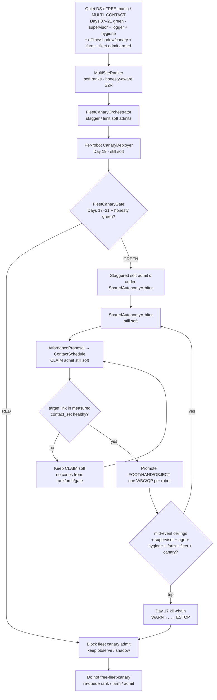
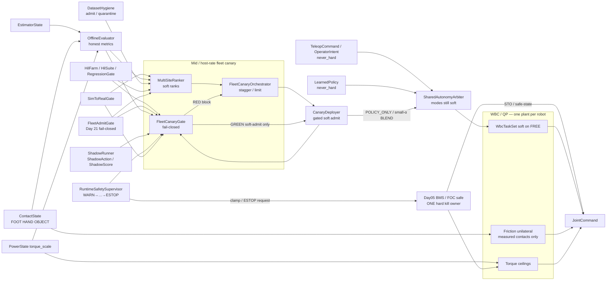
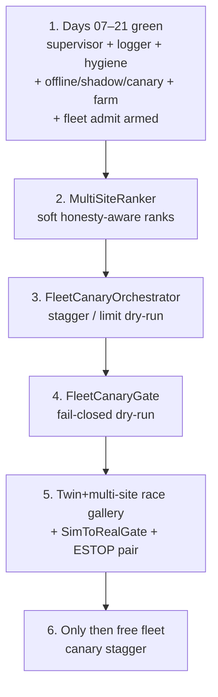

# Day 22 — Fleet canary orchestration / multi-site sim-to-real ranking under supervisor + logging + canary + HIL + fleet gates


[Day 21](/lessons/day-21-fleet-continual-learning) owned `FleetLogHub` / `TicketLogSync` / `OnlineContinualLearner` / `FleetAdmitGate` — multi-robot EpisodeLogger same schema; ticket↔bag soft metadata only; gated online continual learning from hygiene ADMIT only; `FleetAdmitGate` fails closed on cross-robot drift / ticket soft→MEASURED / quarantine-train / farm RED / OVERRIDE-ticket bypass / unpaired ESTOP. [Day 20](/lessons/day-20-hil-regression-farm) owned `HilFarm` / `HilSuite` / `RegressionGate` — continuous twin+bench suites; soft-admit blocker only; never a farm plant that bypasses MEASURE or Day 05. [Day 19](/lessons/day-19-offline-eval-shadow-canary) owned `OfflineEvaluator` / `ShadowRunner` / `CanaryDeployer` — honest offline metrics, shadow soft-only, canary limited soft admit when Offline + Hygiene + Supervisor + SimToRealGate pass. [Day 18](/lessons/day-18-teleop-policy-logging-replay) owned `EpisodeLogger` / `ReplayHarness` / `DatasetHygiene` — soft vs measured labels refusing soft→MEASURED. [Day 17](/lessons/day-17-runtime-safety-supervisor) owned `RuntimeSafetySupervisor` — kill-chain WARN→…→ESTOP; hard clamp / ESTOP only through Day 05. [Day 16](/lessons/day-16-teleop-shared-autonomy) owned `SharedAutonomyArbiter` with teleop + policy as co-equal soft writers. [Day 15](/lessons/day-15-closed-loop-learned-policies)–[Day 14](/lessons/day-14-learned-residuals-scene-graphs) owned closed-loop soft policies and residuals under measured ceilings. [Day 13](/lessons/day-13-support-affordances)–[Day 11](/lessons/day-11-hand-support-loco-manipulation) owned affordances and measured hand support. [Day 09](/lessons/day-09-push-recovery)–[Day 08](/lessons/day-08-stepping-locomotion) owned recovery and gait. [Day 07](/lessons/day-07-wbc-balance)–[Day 05](/lessons/day-05-power-bms) owned the feasible program, estimate, and sag honesty.

Today owns **`FleetCanaryOrchestrator` / `MultiSiteRanker` / `FleetCanaryGate`**: how a fleet canary orchestrator coordinates Day 19 `CanaryDeployer` across robots / sites with **staggered, limited soft admits** at mid / host rate; how a multi-site ranker orders twin galleries / sites / robots by **honesty-aware** sim-to-real signals (residual disagree, `SimToRealGate`, OfflineEvaluator honesty, hygiene, farm, `FleetAdmitGate`) — ranking is **soft, never MEASURED**; and how a fail-closed `FleetCanaryGate` (site sim-to-real rank gate) blocks fleet-wide canary promotion unless Days 17–21 greens hold — refusing site-rank→MEASURED, cross-site honesty strip, OVERRIDE-as-bypass, dual-write `torque_scale` “for fleet canary,” skip MEASURE because rank looked good, unpaired ESTOP, farm RED ignored because rank green, and the rest — still no plant that writes `JointCommand`, attaches cones, dual-writes `torque_scale`, clears supervisor stage, skips MEASURE, or treats `OPERATOR_OVERRIDE` as a gate bypass.

## The fleet canary is not a promotion plant

A “fleet canary” stack that greens by stripping honesty across sites, promoting the highest-ranked twin gallery into MEASURED contact, dual-writing `torque_scale` “for fleet canary,” treating OVERRIDE as hard bypass, skipping MEASURE because the rank looked good, ignoring farm RED because the ranker was green, or silently unpaired ESTOP across sites is detector-as-constraint-truth wearing a multi-site sticker. The orchestrator ticks at **mid / host** rate with `clock_domain` and `age_ms` — not µs / EtherCAT cyclic until jitter is measured and budgeted. Soft channels stay soft forever. Measured channels stay measured forever. Site rank is soft. Fleet canary green is soft. Gate green is a soft-admit blocker release — not contact membership. Day 08 gait and Day 09 recovery still outrank soft holds. Day 05 still owns ceilings. Day 17 kill-chain still arms. Day 18 hygiene still gates admit sets. Day 19 Offline / Shadow / Canary still bind per robot. Day 20 farm / suite / gate still bind. Day 21 FleetAdmitGate / hub / ticket / online still bind. Days 14–21 `never_hard` still binds.

| Layer | Owns | Must not own |
|-------|------|--------------|
| FleetCanaryOrchestrator | Coordinate Day 19 `CanaryDeployer` across robots/sites; stagger / limit soft admits; mid/host | Second plant; `JointCommand`; dual-write `torque_scale` “for fleet canary”; clearing supervisor stage; promoting rank→MEASURED |
| MultiSiteRanker | Soft ranks of twin galleries / sites / robots by honesty-aware S2R signals | Cone truth; MEASURED membership via rank; stripping honesty to look green |
| FleetCanaryGate | Fail-closed soft-admit blocker for fleet-wide canary promotion | Writing `JointCommand` / cones; clearing stage; dual-writing ceilings; hard ESTOP ownership |
| Day 21 FleetAdmitGate / hub / ticket / online | Still required before free fleet canary | Being stripped so fleet canary greens look busy |
| Day 20 farm / suite / gate | Per-robot / per-bench regression still required | Being ignored because site rank looked green |
| Day 19 Offline / Shadow / Canary | Per-robot CanaryDeployer still owns local soft admit | Being stripped so orchestrator looks green |
| Day 18 hygiene / logger | Per-robot admit set; fleet canary consumes honest sets only | Being stripped / cross-site label drift ignored |
| Day 17 supervisor | Stage + monitors still armed per robot during fleet canary ticks | Being cleared by orchestrator, ranker, or OVERRIDE |
| Day 16 arbiter / teleop / policy | Soft writers; canary admits still soft under Arbiter | Bypassing kill-chain because “fleet canary is trusted” |
| Measured contact | Membership in hard `contact_set` (FOOT \| HAND \| OBJECT) | Soft rank / fleet canary green / WARN stage as cone truth |
| Gait (Day 08) | Intended DS/SS/swing clock vs measured feet | Losing the writer fight to a fleet canary soft hold |
| Recovery (Day 09) | Mid-disturbance abort / emergency step | Deadlock with fleet canary freeze — document preempt |
| Soft tasks | EE / grasp / posture on **FREE** limbs | Parallel “fleet canary plant” writing `JointCommand` |
| Sim-to-real gate | Twin+fleet race honesty before free fleet canary | Perfect-sim green fleet that always admits |
| Honesty | Escalate / abort / block fleet canary when ceilings / age / contact / stage / hygiene / pairing / cross-site honesty fail | Heroic fleet canary that rode past brownout or a false-green twin |

**Core thesis:** a `MultiSiteRanker` is a soft ranking host over twin galleries / sites / robots — honesty-aware sim-to-real signals only, never MEASURED. A `FleetCanaryOrchestrator` coordinates per-robot `CanaryDeployer` with staggered, limited soft admits at mid / host rate — never a second plant. A `FleetCanaryGate` fails closed when site-rank→MEASURED, cross-site honesty strip, OVERRIDE-as-bypass, dual-write `torque_scale`, skip MEASURE because rank looked good, unpaired ESTOP, farm RED ignored because rank green, or Days 17–21 greens regress. Soft stays soft. Measured stays measured. Day 05 owns ceilings. Day 17 kill-chain stays armed. Day 18 labels refuse soft→MEASURED. Day 19 Offline / Shadow / Canary still bind. Day 20 HilFarm / RegressionGate still bind. Day 21 FleetAdmitGate still binds. There is still **one** QP face and **one** hard torque ceiling owner **per robot**. The twin + multi-site farm must inject fleet-canary races (site-rank→MEASURED, cross-site honesty strip, dual-write `torque_scale` for fleet canary, OVERRIDE-as-bypass, skip MEASURE because rank looked good, farm RED ignored, unpaired ESTOP, honesty-stripped rank export, orchestrator treated as free plant) before free fleet canary.



**Ownership rule:** one writer for *multi-site soft ranking*, one writer for *fleet canary orchestration / stagger*, one writer for *fleet canary fail-closed decision*, one writer for *per-robot canary admit / abort / rollback*, one writer for *fleet admit fail-closed*, one writer for *farm schedule / pairing*, one writer for *suite version*, one writer for *regression gate*, one writer for *offline metric schema*, one writer for *shadow soft observe*, one writer for *hygiene quarantine*, one writer for *supervisor stage + soft inhibit*, one writer for *Day 05 torque ceilings / hard kill latch*, one writer for *teleop soft*, one writer for *live policy soft*, one writer for *arbiter soft blend*, one writer for *schedule intent*, one writer for *measured* `contact_set` **per robot**. When they disagree on constraints, **measured contact wins for cones**. When they disagree on torque ceilings or ESTOP, **Day 05 / supervisor hard path wins** — orchestrator, ranker, fleet canary gate, farm, canary, and `OPERATOR_OVERRIDE` included. Intent aborts, softens, retimes, rolls back, blocks fleet canary, or waits — it does not promote OBJECT because a site ranked high or a fleet canary dashboard looked busy. Day 08 gait and Day 09 recovery still outrank a stuck fleet canary hold; document freeze-vs-recovery preempt so the twin cannot invent a deadlock under fleet canary schedule.

## How today fits the Days 05–21 stack

| Day | What you already froze | What Day 22 reuses |
|-----|------------------------|--------------------|
| 05 | `torque_scale`, `POWER_GATED`, sag honesty, FOC safe | Fleet canary never dual-writes; rank/orch scores missed `POWER_GATED`; OVERRIDE cannot bypass; unpaired ESTOP fails gate |
| 06 | `EstimatorState`, age / stale, contact modes | Rank / orch preserve and score `age_ms`; stripping age is a false-green fleet-canary race |
| 07 | Tasks vs hard friction / unilaterality | New contacts join the hard set only when measured — never from site rank / fleet canary green |
| 08 | Gait modes vs measured `contact_set` | Fleet canary soft freeze must not steal swing constraints; document yield / retime |
| 09 | Mid-event abort / soften; `RecoveryCommand` | Recovery preempt vs fleet canary freeze ordering is a first-class twin fight |
| 10 | Soft EE / grasp; FREE vs CLAIM honesty | CLAIM without measure still forbidden under rank / orch / gate |
| 11 | MEASURED_SUPPORT hands; LOCO_MANIP | Hands remain first-class; demote / fleet canary block cover HAND / OBJECT slots |
| 12 | `ContactSchedule` phases; OBJECT kind | Fleet canary demote / block aborts schedule lifecycle — does not invent cones |
| 13 | Affordance soft CLAIM; conf gates CLAIM not cones | Rank may order CLAIM priority; still never attaches cones |
| 14 | Residual / scene soft; `never_hard`; mid-rate `age_ms` | Residual disagree is a first-class rank / gate fail signal |
| 15 | `LearnedPolicy` soft; `SimToRealGate`; closed-loop live ticks | Canary admits soft policy siblings; site rank pass ≠ MEASURED |
| 16 | `SharedAutonomyArbiter`; teleop + policy co-equal soft | Fleet canary admits still soft into Arbiter; OVERRIDE still cannot hard-bypass |
| 17 | `RuntimeSafetySupervisor`; kill-chain; hard kill via Day 05 only | Stage + monitors **must** stay armed on every fleet canary tick; stage ≠ MEASURED |
| 18 | `EpisodeLogger` / `ReplayHarness` / `DatasetHygiene` | Rank / orch consume honest bags; labels still refuse soft→MEASURED |
| 19 | `OfflineEvaluator` / `ShadowRunner` / `CanaryDeployer` | Per-robot CanaryDeployer still owns local soft admit; orch coordinates, does not replace |
| 20 | `HilFarm` / `HilSuite` / `RegressionGate` | FleetCanaryGate requires farm green; farm RED ignored because rank green → RED |
| 21 | `FleetLogHub` / `TicketLogSync` / `OnlineContinualLearner` / `FleetAdmitGate` | FleetCanaryGate requires FleetAdmitGate green; online still never frees plant |

Do not bolt a “fleet canary plant” that writes `JointCommand` or attaches cones beside the QP when a site ranks high or a stagger step finishes. That is Day 10’s second-plant anti-pattern wearing a multi-site sticker.

## Channel taxonomy (label honesty)

Every rank / orchestrator / fleet-canary channel is labeled by what it may touch. Soft ranks, site scores, and fleet canary greens never promote into measured membership by rename — including for “just fleet canary.”

| Channel class | May exercise | Must never become / use as |
|---------------|--------------|----------------------------|
| Soft rank / site gallery score | `LABEL_SITE_RANK` (honesty-aware S2R / residual / offline / hygiene / farm / FleetAdmit) | `MEASURED` contact membership / cones / $F_z \ge 0$ |
| Fleet canary orchestration | `LABEL_SOFT_INTENT` (stagger schedule, soft admit α refs) | Cone truth; rank→MEASURED rename; hard OVERRIDE |
| Supervisor-aware negatives | `LABEL_SUPERVISOR_STAGE`, `LABEL_NEGATIVE_KILL` | Cone truth; “green enough to free-fleet-canary” without stage honesty |
| Measured contact fidelity | `LABEL_MEASURED_CONTACT` | Soft rank / fleet canary green with a louder name |
| Power honesty | `LABEL_POWER` | Infinite-torque GT; dual-writer “for fleet canary” |
| Estimate / residual honesty | `LABEL_ESTIMATE` + residual disagree | Age-stripped “clean” multi-site state as sole GT |
| Gate honesty | `LABEL_GATE` | False-green after stripping fails / cross-site honesty |
| Aggregate FleetCanaryGate score | Weighted soft + measured + negatives + age + gate + power + pairing + rank honesty | Reward / site volume / “rank looked good” alone |

**Required FleetCanaryOrchestrator / MultiSiteRanker / FleetCanaryGate coverage (all required before free fleet canary):**

1. MultiSiteRanker soft-only — rank by honesty-aware residual disagree / `SimToRealGate` / OfflineEvaluator honesty / hygiene / farm / FleetAdmitGate; refuse reward-alone ranking; preserve `age_ms` / stage / `POWER_GATED` / residual disagree per site/robot.
2. FleetCanaryOrchestrator mid/host — stagger / limit soft admits through per-robot `CanaryDeployer`; forbid `JointCommand` / cones / dual-write / clear-stage / skip-MEASURE; never replace per-robot CanaryDeployer ownership.
3. FleetCanaryGate dry-run — require Days 17–21 greens; refuse site-rank→MEASURED, cross-site honesty strip, OVERRIDE-as-bypass, dual-write `torque_scale` “for fleet canary,” skip MEASURE because rank looked good, farm RED ignored because rank green, unpaired ESTOP.
4. Inject Day 17–21 race gallery cases at multi-site scale — false-green offline, shadow hard-write, canary skip-MEASURE, farm dual-write, OVERRIDE-as-bypass, clock skew, hygiene spike, cross-robot drift, ticket soft→MEASURED, learn-on-quarantine, **plus** site-rank→MEASURED, cross-site honesty strip, skip MEASURE because rank looked good, farm RED ignored because rank green.
5. Physical ↔ digital ESTOP pairing **per robot** — unpaired → FleetCanaryGate RED.
6. Mid / host rate with `age_ms` — never inside µs / EtherCAT cyclic write path until jitter measured.

**Promotion / admit refusal rules (all required):**

1. Relabeling soft→MEASURED (or site-rank→cones, or fleet-canary-green→cones) is a **hygiene / fleet-canary fault**, not a multi-site option.
2. `OPERATOR_OVERRIDE` during fleet canary remains soft; OVERRIDE-as-bypass stays quarantined and must not green FleetCanaryGate.
3. `never_hard: true` on fleet canary soft channels — API and runtime refuse soft→hard promotion in ranker, orchestrator, and gate.
4. Rank / orch / gate tick at mid / host rate with `age_ms` — never inside the current loop or EtherCAT cyclic write path until jitter is measured and budgeted; no nets in µs loops reconstructing cones from site ranks.

Quarantine, abort, rollback, block-fleet-canary, and keep-negatives are **success paths** when the ranker hacked past `WARN`, the orchestrator ate honesty-stripped exports, the farm harness lied under fleet canary schedule, the pack sagged, the twin showed a late kill, ESTOP was unpaired, or someone tried to pretty-print honesty out of the multi-site report. A fleet canary dashboard that always looks green after export is ignoring Day 05–21 with prettier multi-site badges.

## Ownership conflict: rank vs orch vs gate vs fleet admit vs farm vs offline vs soft vs measure vs gait vs recovery vs power

Fleet canary orchestration is where teams accidentally create a thirteenth writer on support constraints and a second writer on `torque_scale` “for fleet canary.” Freeze the split:

| Conflict | Winner | Rank / orch / gate behavior |
|----------|--------|-----------------------------|
| Soft rank / orch vs measured contact | Measured contact | Soft stays soft; never promotes |
| Supervisor stage vs missing measure | Measured contact | Wait / demote / block fleet canary; stage never attaches cones |
| Fleet canary soft refs vs cones | Soft-only orch | Reject cone attach; fault as fleet-canary-plant attempt |
| Orch vs `JointCommand` | Hard stack refusal | Orch coordinates only; never writes JointCommand |
| Orch vs dual-writer on `torque_scale` | Day 05 BMS owner only | Reject; FleetCanaryGate RED |
| Rank / orch skips MEASURE before PROMOTE | Measured contact + hygiene | Block; quarantine; twin race must catch |
| Missed `POWER_GATED` during fleet canary window | Power honesty + supervisor | Escalate / clamp; gate RED |
| Stale `age_ms` during fleet canary window | Age gate + supervisor | Fail; gate RED if stripped |
| Site-rank→MEASURED rename | MultiSiteRanker + hygiene | Reject; quarantine rank export |
| Cross-site honesty strip | Ranker + FleetCanaryGate | Gate RED; do not admit on stripped ranks |
| Farm RED but site rank green | RegressionGate + FleetCanaryGate | Fleet canary must fail closed; no override |
| FleetAdmitGate RED but orch wants stagger | FleetAdmitGate + FleetCanaryGate | Fail closed; Days 17–21 required |
| False-green OfflineEvaluator under fleet canary | OfflineEvaluator + FleetCanaryGate | Block fleet canary; twin race must fail closed |
| Clock skew dropping stage during orch tick | Clock domain + supervisor | Prefer fail-safe gate RED |
| Orch treats OVERRIDE as bypass | Supervisor + Day 05 hard path | Soft freeze / hard path wins; gate RED |
| Shadow hard-write under fleet canary schedule | ShadowRunner + FleetCanaryGate | Block; fault as plant attempt |
| Residual disagree under ranked site | Day 14 honesty + supervisor | Gate RED; do not clean away |
| Active `RecoveryCommand` vs fleet canary freeze | Documented preempt | Twin must show ordering; no silent deadlock |
| Gait swing / touchdown vs fleet canary soft hold | Measured feet + gait owner | Retime / pause CLAIM; never steal swing |
| Hygiene quarantine spike mid-fleet-canary | DatasetHygiene + FleetCanaryGate | Gate RED; do not “ride it out” |
| Pretty rank cleaner (drop stage / negatives / residual) | Honesty refusal | Reject cleaner; keep raw honesty channels |
| Unpaired physical/digital ESTOP | Bring-up pairing + FleetCanaryGate | Gate RED; do not free-fleet-canary |
| Training plant wants hard cones from site rank | Hard stack refusal | Reject at API; log fleet-canary-plant attempt |
| Skip MEASURE because rank looked good | Measured contact + FleetCanaryGate | Fail closed; honesty > rank |



**Hard vs soft:** support constraints on **measured** FOOT / HAND / OBJECT stay hard. Soft EE and arbiter refs live only on FREE limbs. Site ranks, fleet canary greens, and stagger schedules are softer still — they rank and block, they do not feed cones. Hard kill / clamp is owned only by Day 05. If the QP goes infeasible under an expanded set during a fleet canary window, demote / abort / soften / block fleet canary — do not silently drop an object cone so the fleet “makes it safe.”

## Physical ↔ digital pairing for multi-site canary

| Physical | Digital twin / backing |
|----------|------------------------|
| Same MultiSiteRanker honesty under changing support membership | No perfect-state ranker that strips age / stage / residual while hardware ages out |
| Live `age_ms` / `clock_domain` during fleet canary ticks | Twin must inject clock skew dropping stage in fleet canary window |
| Live kill-chain stage + monitors per robot | Twin must inject orch that treats OVERRIDE as bypass; reject |
| Soft rank / orch / canary observe | Twin must inject orch hard-write / cones / JointCommand; reject |
| `POWER_GATED` / `torque_scale` history per robot | Twin must inject orch dual-writer and missed `POWER_GATED` |
| Canary admit abort / rollback under fleet canary | Twin must show rollback restores prior soft α; hard path unchanged |
| Hygiene quarantine spike / cross-site honesty strip | Twin must inject spike / strip → FleetCanaryGate RED |
| Site-rank→MEASURED rename | Twin must inject rename; ranker refuses; quarantine |
| Farm RED ignored because rank green | Twin must inject; gate RED |
| Skip MEASURE because rank looked good | Twin must inject; gate RED |
| Physical + digital ESTOP pairing per robot | Unpaired → gate RED; free fleet canary forbidden |
| Mid-rate rank / orch / gate + jitter | Cannot beat hardware cadence or hide age faults; no net inside cyclic write path |
| `SimToRealGate` | Explicit RED/YELLOW/GREEN; block free fleet canary until GREEN with race gallery |

If the twin always greens fleet canary with full packs while hardware sees late trips, false greens, OVERRIDE spam, stripped age, dual-writers, honesty-stripped ranks, and unpaired ESTOP, you will canary forever on theater and never ship a CLAIM that survives a tired bus or a race you only passed in multi-site slides.

## Mid-event / mid-fleet-canary honesty

Shared-autonomy mid-rate paths are where teams “keep the fleet canary green just until the demo finishes.” Do not.

| Signal mid-CLAIM / mid-fleet-canary | Required behavior |
|-------------------------------------|-------------------|
| `INPUT_STALE` / confidence cliff on estimate or contact | Abort / inhibit soft admit α; advance supervisor; do not strip age for rank score |
| Shadow dropout / host stall / rate miss under fleet canary | Log; inhibit shadow CLAIM; do not promote on last-known shadow action; may gate RED |
| Cross-site honesty strip / rank cleaner | Fail MultiSiteRanker export; gate RED; do not admit |
| Operator dropout / stick disconnect under canary blend during fleet canary | Inhibit teleop; do **not** promote on last-known EE delta; orch still yields |
| Orch / rank fighting `INHIBIT_SOFT` / OVERRIDE spam | Soft freeze wins; OVERRIDE cannot clear stage or force fleet canary past Day 05; gate RED |
| Policy / canary / rank reward-hack past WARN into hard writes | Escalate stage; reject; abort / quarantine — keep as negative |
| Residual / graph inconsistency (Day 14) under ranked site | Preserve residual disagree; demote or never promote; gate RED |
| Domain shift / SimToRealGate red | Soften / re-gate; freeze free fleet canary; do not export as green |
| `POWER_GATED` / falling `torque_scale` | Escalate to clamp; gate RED; quarantine if ignored |
| Contact flicker / wrench disagree | Demote that slot; abort soft admit on that CLAIM |
| Foot `contact_set` collapses mid-handoff | Yield to Day 09 recovery; document freeze vs recovery preempt under fleet canary |
| QP infeasible under expanded cones | Demote newest promote and/or drop soft EE — do not drop unilaterality to “fit the fleet canary” |
| Late kill (trip after promote under fleet canary) | Demote + Day 05 clamp / ESTOP; **rollback** soft admit α; keep as `LABEL_NEGATIVE_KILL`; gate RED |
| Hygiene quarantine spike mid-fleet-canary | Gate RED; do not ride it out |
| Site rank used as MEASURED | Reject; quarantine rank export |
| Farm RED ignored because rank green | Refuse; gate RED |
| False trip | Hysteresis / confirm; do not disable kill-chain; log for twin gallery |
| Dual-writer attempt on `torque_scale` (orch or rank harness) | Reject non-BMS writer; gate RED; quarantine |
| Rank / orch attempting cones / JointCommand | Reject at MultiSiteRanker / FleetCanaryOrchestrator API; fault as plant attempt |
| Age / stage stripped by rank exporter | Fail fleet canary green; hygiene quarantine; twin race must catch |
| Recovery asserts during fleet canary freeze | Follow documented preempt; no deadlock |
| Gait swing / touchdown commit | Retime or pause CLAIM; never steal swing constraints |
| Rank / orch skips MEASURE before PROMOTE | Gate RED; quarantine; twin race must catch |
| Physical ESTOP without digital latch (or reverse) | Fail bring-up — pairing required; gate RED |
| Rank looked good → skip honesty | Fail closed; honesty > rank |
| FleetAdmitGate RED ignored because orch schedule green | Fail closed; FleetCanaryGate requires FleetAdmitGate green |

Abort, demote, clamp, ESTOP, quarantine, rollback, block-fleet-canary, and keep-negatives are **success paths** when the ranker, the orchestrator, the farm harness, the shadow, the canary, the pack, the exporter, the pairing, the honesty strip, or the race lied mid-CLAIM.

## Shared API: FleetCanaryOrchestrator / MultiSiteRanker / FleetCanaryGate above Day 21 shapes

Keep Day 02 / 04 wire honesty. Cyclic commands still carry `BusHeader`. Extend Day 21 fleet / Day 20 farm / Day 19 Offline / Shadow / Canary / Day 18 hygiene / Day 17 supervisor / Day 16 arbiter / Day 15 policy / Day 14 residual / Day 13 `AffordanceProposal` / Day 12 `ContactSchedule` / Day 05 power — do not invent a parallel “fleet canary bus” or second plant:

```text
BusHeader:
  t_mono
  seq
  clock_domain         # HOST | MID | … — never claim CYCLIC for rank/orch/gate until jitter measured
  age_ms
  producer_id

# Soft multi-site ranking — never MEASURED
MultiSiteRanker ⊇ BusHeader:
  fleet_id
  schema_version
  never_hard: true
  rank_kind: LABEL_SITE_RANK
  sites[]:
    site_id
    robot_ids[]
    twin_gallery_ref
    signals:
      residual_disagree_score   # soft; higher disagree → worse rank
      sim_to_real_gate          # RED | YELLOW | GREEN
      offline_honesty           # OfflineEvaluator supervisor-aware
      hygiene_admit_ratio
      farm_regression_gate      # GREEN required
      fleet_admit_gate          # Day 21 GREEN required
      age_ms_p95
      power_gated_hits
      unpaired_estop: bool
    rank_score                  # soft aggregate — NOT MEASURED
    refuse_reward_alone: true
  export_rules:
    preserve_age_ms: true
    preserve_stage: true
    preserve_residual_disagree: true
    preserve_POWER_GATED: true
    refuse_honesty_strip: true
    refuse_rank_to_measured: true
  tick_rate_hint_hz             # mid / host
  age_ms

# Soft orchestration — coordinates per-robot CanaryDeployer
FleetCanaryOrchestrator ⊇ BusHeader:
  fleet_id
  never_hard: true
  ranker_ref
  schedule:
    mode: STAGGER | LIMIT | OBSERVE_ONLY
    max_concurrent_soft_admits
    per_robot_alpha_cap         # soft α into SharedAutonomyArbiter
    stagger_gap_ms
  robots[]:
    robot_id
    site_id
    canary_deployer_ref         # Day 19 — orch does NOT replace
    local_status                # IDLE | SHADOW | CANARY_SOFT | BLOCKED | ROLLBACK
  forbid:
    joint_command: true
    attach_cones: true
    dual_write_torque_scale: true
    clear_supervisor_stage: true
    skip_MEASURE: true
    replace_per_robot_canary: true
  require:
    fleet_canary_gate_green: true
    fleet_admit_gate_green: true
    regression_gate_green: true
    sim_to_real_gate_green: true
  yield_to             # GAIT | RECOVERY | POWER
  age_ms
  operator_override_cannot_bypass_day05: true

# Fail-closed soft-admit blocker for fleet-wide canary
FleetCanaryGate ⊇ BusHeader:
  fleet_id
  fail_closed: true
  soft_admit_blocker_only: true
  never_hard: true
  status               # RED | YELLOW | GREEN
  require:
    supervisor_armed: true                 # Day 17
    hygiene_honest: true                   # Day 18
    offline_shadow_canary_green: true      # Day 19
    regression_gate_green: true            # Day 20
    fleet_admit_gate_green: true           # Day 21
    sim_to_real_gate_green: true
    estop_pairing_per_robot: true
  refuse_on[]:
    site_rank_to_measured
    cross_site_honesty_strip
    OVERRIDE_as_bypass
    dual_write_torque_scale_for_fleet_canary
    skip_MEASURE_because_rank_looked_good
    farm_RED_ignored_because_rank_green
    unpaired_estop
    clock_skew_dropping_stage
    shadow_hard_write
    false_green_offline
    hygiene_quarantine_spike
    residual_disagree_stripped
    reward_alone_ranking
    orchestrator_as_free_plant
  forbid:
    joint_command: true
    attach_cones: true
    dual_write_torque_scale: true
    clear_supervisor_stage: true
  operator_override_cannot_bypass_day05: true
  block_free_fleet_canary_until_green: true
  age_ms

# Day 19 CanaryDeployer — extended, not replaced
CanaryDeployer ⊇ BusHeader:
  # … Day 19 fields …
  fleet_orch_ref?
  block_until_fleet_canary_gate_green: true
  still_soft: true
  never_hard: true
  # still: OfflineEvaluator + DatasetHygiene + RuntimeSafetySupervisor + SimToRealGate
  # still: no JointCommand / cones / dual-write / clear-stage / skip-MEASURE

# Day 21 FleetAdmitGate — still required
FleetAdmitGate ⊇ BusHeader:
  # … Day 21 fields …
  block_fleet_canary_until_green: true

# Day 20 RegressionGate — still required
RegressionGate ⊇ BusHeader:
  # … Day 20 fields …
  # farm RED ⇒ FleetCanaryGate RED even if MultiSiteRanker looks green

# Day 15 SimToRealGate — extended checks
SimToRealGate ⊇ BusHeader:
  status               # RED | YELLOW | GREEN
  checks[]:
    # … Day 14–21 checks …
    fleet_canary_honesty_stripped_rank
    fleet_canary_dual_writes_torque_scale
    fleet_canary_OVERRIDE_as_bypass
    fleet_canary_skips_MEASURE_because_rank
    fleet_canary_unpaired_estop
    fleet_canary_site_rank_to_measured
    fleet_canary_farm_red_ignored
    fleet_canary_orch_as_free_plant
  age_ms
  block_free_fleet_canary_until_green: true
  block_free_canary_until_green: true

# Day 05 hard path — ONE owner per robot (fleet canary never dual-write)
PowerState / BmsCommand ⊇ BusHeader:
  torque_scale
  POWER_GATED
  clamp_request_src?   # SUPERVISOR | BMS | ...
  estop_latch
  clear_requires_human: true
  phys_digital_paired: true

# Soft perception / schedule — Day 13–21 + fleet canary block / demote
AffordanceProposal ⊇ BusHeader
ContactSchedule ⊇ BusHeader

ManipulationCommand / WbcTaskSet / JointCommand
  # Day 16–21 shapes unchanged — rank/orch/gate never write JointCommand
  # as-if-measured or attach cones; CEIL comes from Day 05 only
```

Higher layers publish teleop commands, policy actions, arbiter blends, shadow scores, canary soft admits, farm schedules, suite results, fleet bags, ticket links, online soft updates, multi-site ranks, fleet canary stagger schedules, residual corrections, affordance candidates, schedule intent, supervisor soft intents, offline-scored honesty, fleet-admit soft-admit decisions, and **fleet-canary-gate** soft-admit decisions. Measured `ContactState` owns support membership. Day 05 owns torque ceilings and ESTOP latch. Gait and recovery keep their writers. Nobody re-implements FOC, AHRS, or friction cones inside the MultiSiteRanker, the FleetCanaryOrchestrator, or the FleetCanaryGate.

## Bring-up sequence (before free fleet canary)

Days 07–21 green (stance, step, recovery, FREE-hand reach, measured hand SUPPORT / loco-manip, scripted multi-contact / OBJECT handoffs, gated affordance CLAIM, residual / scene soft feeds, closed-loop policy with `SimToRealGate` green, teleop / blend / OVERRIDE mid-arbitration honesty, supervisor race gallery green with kill-chain armed, logger / replay / hygiene race gallery green, offline / shadow / canary race gallery green, HIL farm race gallery green with continuous farm gates, fleet hub / ticket / online / FleetAdmitGate race gallery green). Then:



1. **Days 07–21 green** — teleop / policy / arbiter / residual / affordance / supervisor / logger / hygiene / offline / shadow / canary / farm / fleet admit paths still behave; `never_hard` still enforced; OVERRIDE still cannot attach cones or skip MEASURE; hard kill still only through Day 05; continuous farm + FleetAdmitGate green.
2. **MultiSiteRanker (soft honesty-aware ranks)** — rank twin galleries / sites / robots by residual / S2R / OfflineEvaluator honesty / hygiene / farm / FleetAdmitGate; confirm refuse reward-alone; confirm refuse rank→MEASURED; confirm honesty strip fails export.
3. **FleetCanaryOrchestrator (stagger / limit dry-run)** — coordinate per-robot CanaryDeployer; confirm forbid `JointCommand` / cones / dual-write / clear-stage / skip-MEASURE; confirm does not replace per-robot canary ownership; confirm ESTOP pairing per robot.
4. **FleetCanaryGate fail-closed dry-run** — require Days 17–21 greens; inject site-rank→MEASURED, cross-site honesty strip, dual-write, OVERRIDE-as-bypass, measure-skip because rank looked good, farm RED ignored because rank green, unpaired ESTOP; confirm RED blocks fleet canary admit; confirm OVERRIDE cannot force past Day 05.
5. **Twin+multi-site race gallery + SimToRealGate + ESTOP pair** — twin+sites inject honesty-stripped rank export, site-rank→MEASURED, dual-write `torque_scale` for fleet canary, OVERRIDE-as-bypass, skip MEASURE because rank looked good, farm RED ignored, unpaired ESTOP, orchestrator treated as free plant; confirm escalate / reject / gate RED; `SimToRealGate` must go GREEN before free fleet canary.
6. **Then** run free fleet canary stagger with supervisor + logger + hygiene + offline / shadow / canary + farm + FleetAdmitGate gates green — never replace cones, FOC, `torque_scale` ownership, gait, recovery, measured `ContactState`, Day 17 kill-chain, Day 18 label taxonomy, Day 19 Offline / Shadow / Canary, Day 20 HilFarm / RegressionGate, or Day 21 FleetAdmitGate contracts. Fleet incident response / coordinated rollback / multi-robot kill coordination under the same gates waits for Day 23+.

Skip to “ship free fleet canary because the rank looked good” and hardware’s first fleet-scheduled rail grasp becomes an unplanned tip / brownout experiment with better multi-site charts.

## Failure gallery

| Symptom | Likely cause |
|---------|--------------|
| Promotes on air from site rank / fleet canary green | Soft→MEASURED promotion; cones without `contact_set` |
| Twin fleet canary green, hardware late / yellow | Age / stage stripped; SimToRealGate green without race gallery |
| Fleet canary rides past brownout | Missed `POWER_GATED`; clamp path not in refuse_on |
| OVERRIDE forces fleet canary past Day 05 | OVERRIDE misdocumented as hard ownership; gate bypass |
| Orch writes JointCommand / cones | FleetCanaryOrchestrator-as-second-plant; `never_hard` not enforced |
| Dual-writer fights on `torque_scale` during fleet canary | Orch / harness bypassed BMS API; ceilings thrash |
| Fleet canary greens on reward / rank volume alone | Supervisor-aware negatives / age / gate / power / pairing / honesty metrics missing |
| Pretty exporter drops residual disagree / stage for rank scores | Honesty cleaner anti-pattern; FleetCanaryGate refusal missing |
| Site-rank silently used as MEASURED | MultiSiteRanker refuse_rank_to_measured missing |
| Cross-site honesty strip silently merged | Ranker refuse_honesty_strip missing |
| Farm RED ignored because rank green | FleetCanaryGate refuse farm_RED_ignored missing |
| False-green OfflineEvaluator under fleet canary | Gate checks not in fleet canary; twin race skipped |
| Clock skew fleet canary window without stage | `clock_domain` / stage preservation missing |
| Hygiene quarantine spike ignored mid-fleet-canary | refuse_on spike missing; “ride it out” anti-pattern |
| Stale `age_ms` kept GREEN in fleet canary | Age gate missing; last-known green trusted |
| Policy / canary / rank reward-hack past WARN trained as success | Escalate / abort / quarantine / gate RED missing |
| Shadow hard-write under fleet canary schedule treated as noise | First-class plant-attempt fault missing |
| Recovery deadlocks with fleet canary freeze | Preempt ordering undocumented; twin never injected the fight |
| Virtual ESTOP only / physical unpaired under fleet canary | Bring-up pairing skipped; gate did not RED |
| Second plant for “safe” brace from site rank | Parallel optimizer writing `JointCommand` on ESTOP edge |
| Rank / orch / gate net inside current / EtherCAT cyclic | Jitter never measured; standing principle violated |
| QP infeasible → silent cone drop under fleet canary demote | Demote/abort/block path missing; “make it feasible” anti-pattern |
| Gait swing stolen during fleet canary freeze | Freeze did not yield / retime to Day 08 commit |
| FleetAdmitGate RED ignored because orch schedule green | FleetCanaryGate require fleet_admit_gate_green missing |
| Continuous fleet canary only on sticky perfect sims | No honesty-strip / dual-write / skip-MEASURE / OVERRIDE-bypass / unpaired-ESTOP / rank→MEASURED / farm-red-ignored injects; gate never red |
| Orchestrator treated as free plant because rank green | FleetCanaryGate / FleetCanaryOrchestrator contract broken; still_soft missing |
| Skip MEASURE because rank looked good | FleetCanaryGate refuse missing; honesty > rank violated |

## What to freeze this week

Extend [frames](/frames) and your control / eval / deploy / HIL / fleet / canary config with:

- `MultiSiteRanker` fields: `fleet_id`, `schema_version`, `sites[]` with honesty-aware signals (residual disagree, `SimToRealGate`, OfflineEvaluator honesty, hygiene, farm, FleetAdmitGate, `age_ms_p95`, `POWER_GATED` hits, unpaired ESTOP), `rank_kind: LABEL_SITE_RANK`, `refuse_reward_alone`, `refuse_rank_to_measured`, `refuse_honesty_strip`, preserve age/stage/residual/`POWER_GATED`, mid/host `tick_rate_hint_hz`, `age_ms`, `never_hard: true`
- `FleetCanaryOrchestrator` fields: `schedule.mode` STAGGER \| LIMIT \| OBSERVE_ONLY, `max_concurrent_soft_admits`, `per_robot_alpha_cap`, `stagger_gap_ms`, `robots[]` with `canary_deployer_ref`, forbid hard writes + replace_per_robot_canary, require FleetCanaryGate / FleetAdmitGate / RegressionGate / SimToRealGate green, `yield_to`, `operator_override_cannot_bypass_day05`, mid/host, `never_hard: true`
- `FleetCanaryGate` fields: `fail_closed: true`, `soft_admit_blocker_only: true`, require Days 17–21 greens + ESTOP pairing, refuse_on site-rank→MEASURED / cross-site honesty strip / OVERRIDE-as-bypass / dual-write / skip-MEASURE-because-rank / farm_RED_ignored / unpaired ESTOP / clock skew / shadow hard-write / false-green / hygiene spike / residual stripped / reward-alone / orch-as-free-plant, **forbid** hard writes, `operator_override_cannot_bypass_day05: true`, `block_free_fleet_canary_until_green: true`
- Day 19 `CanaryDeployer` extension: `fleet_orch_ref?`, `block_until_fleet_canary_gate_green: true` beside existing Offline + Hygiene + Supervisor + SimToRealGate + farm + FleetAdmitGate gates
- Day 21 `FleetAdmitGate` extension: `block_fleet_canary_until_green: true`
- Day 15 `SimToRealGate` extension: fleet-canary race checks listed above
- Explicit rule: teleop score / policy reward / blend score / shadow score / canary weight / suite pass / farm green / ticket severity / learn weight / fleet green / **site rank** / fleet canary green / supervisor stage $\neq$ MEASURED; soft channels never write `JointCommand`, friction cones, FOC $i_q$, or `ContactState` on rank, orch, or gate
- Explicit rule: Day 17 supervisor + Day 18 logger / hygiene + Day 19 Offline / Shadow / Canary + Day 20 farm + Day 21 FleetAdmitGate stay armed during fleet canary; hard kill still only through Day 05; `OPERATOR_OVERRIDE` cannot bypass kill-chain hard stages, BMS, gait, or recovery — including to force fleet canary green
- Who owns **multi-site soft ranking** vs **fleet canary orchestration** vs **fleet canary fail-closed** vs **per-robot canary admit** vs **fleet admit fail-closed** vs **farm schedule** vs **suite version** vs **regression gate** vs **offline metric schema** vs **shadow soft observe** vs **hygiene quarantine** vs **supervisor stage** vs **Day 05 hard kill latch** vs **teleop soft** vs **policy soft** vs **arbiter soft blend** vs **schedule intent** vs **measured** `contact_set` vs **gait** vs **recovery** (disagree on cones → measured wins; disagree on ceilings / ESTOP → Day 05 / supervisor hard path wins)
- Documented recovery preempt vs fleet canary freeze ordering
- Rate / jitter budget: rank / orch / gate at mid / host rates with `age_ms`; forbidden inside µs / EtherCAT cyclic until jitter measured; no nets reconstructing cones in µs loops
- Twin+multi-site hooks: honesty-stripped rank export, site-rank→MEASURED, dual-write `torque_scale` for fleet canary, OVERRIDE-as-bypass, skip MEASURE because rank looked good, farm RED ignored because rank green, unpaired ESTOP, orchestrator as free plant — same as hardware; `SimToRealGate` blocks free fleet canary until GREEN
- Bring-up gate: no free fleet canary until steps 1–5 above are green

The lesson is not “ship free fleet canary until the rank looks good.” It is **make multi-site ranking and fleet canary orchestration the same contact-rich program in silicon, on every robot / site, and in the twin**: a `MultiSiteRanker` that ranks by honesty-aware sim-to-real signals without becoming MEASURED, a `FleetCanaryOrchestrator` that staggers per-robot `CanaryDeployer` soft admits without becoming a second plant, a `FleetCanaryGate` that fails closed when races, honesty strips, or hygiene regress, measured FOOT/HAND/OBJECT still owning the hard support set, one estimate, honest power ceilings, Day 17 kill-chain still armed, Day 18 labels still refusing soft→MEASURED, Day 19 Offline / Shadow / Canary still binding, Day 20 HilFarm / RegressionGate still binding, Day 21 FleetAdmitGate still binding, schedules that wait for measurement and yield to gait/recovery, soft tasks only where soft belongs, rank / orch / gate ticks outside µs loops until jitter is honest, Days 14–21 `never_hard` still binding, and abort / rollback / quarantine / gate-RED / SimToRealGate paths that stay honest when the ranker, the orchestrator, the farm harness, the exporter, the pairing, the honesty strip, the race, or the sim lies mid-CLAIM.

## Next

**Day 23+** — Fleet incident response / coordinated rollback / multi-robot kill coordination under supervisor + logging + canary + HIL + fleet + fleet-canary gates: when a staggered canary trips, orchestrate per-robot rollback and Day 17 kill-chain coordination across sites without a second plant, without dual-writing `torque_scale`, and without treating OVERRIDE as a fleet-wide bypass — still no plant that bypasses MEASURE or Day 05 ceilings.
