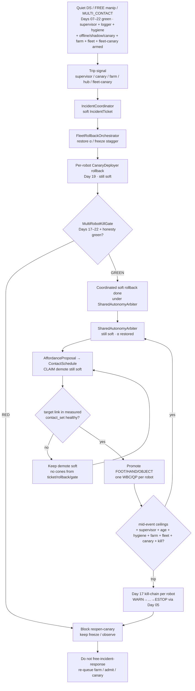
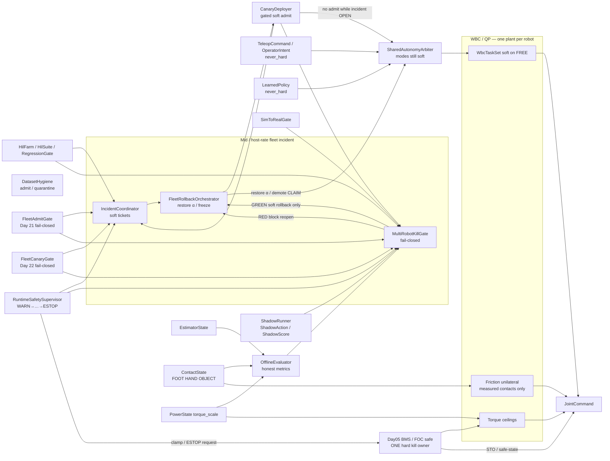
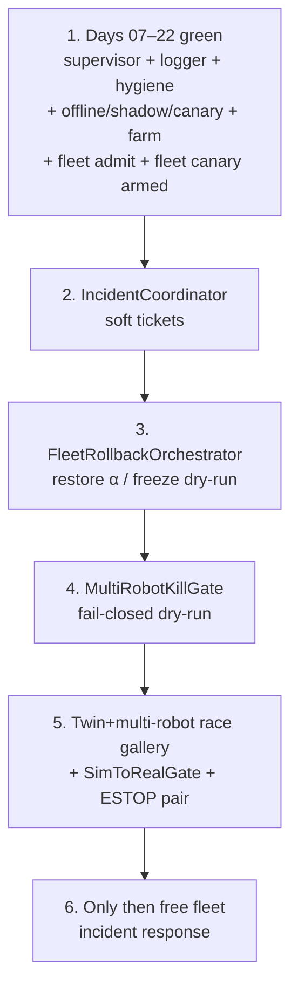

# Day 23 — Fleet incident response / coordinated rollback / multi-robot kill coordination under supervisor + logging + canary + HIL + fleet + fleet-canary gates


[Day 22](/lessons/day-22-fleet-canary-orchestration) owned `FleetCanaryOrchestrator` / `MultiSiteRanker` / `FleetCanaryGate` — multi-site honesty-aware ranking; staggered limited soft admits through per-robot `CanaryDeployer`; `FleetCanaryGate` fails closed on site-rank→MEASURED / cross-site honesty strip / OVERRIDE-bypass / dual-write `torque_scale` / skip MEASURE because rank looked good / farm RED ignored / unpaired ESTOP. [Day 21](/lessons/day-21-fleet-continual-learning) owned `FleetLogHub` / `TicketLogSync` / `OnlineContinualLearner` / `FleetAdmitGate`. [Day 20](/lessons/day-20-hil-regression-farm) owned `HilFarm` / `HilSuite` / `RegressionGate`. [Day 19](/lessons/day-19-offline-eval-shadow-canary) owned `OfflineEvaluator` / `ShadowRunner` / `CanaryDeployer`. [Day 18](/lessons/day-18-teleop-policy-logging-replay) owned `EpisodeLogger` / `ReplayHarness` / `DatasetHygiene`. [Day 17](/lessons/day-17-runtime-safety-supervisor) owned `RuntimeSafetySupervisor` — kill-chain WARN→…→ESTOP; hard clamp / ESTOP only through Day 05. [Day 16](/lessons/day-16-teleop-shared-autonomy) owned `SharedAutonomyArbiter`. [Day 15](/lessons/day-15-closed-loop-learned-policies)–[Day 14](/lessons/day-14-learned-residuals-scene-graphs) owned closed-loop soft policies and residuals. [Day 13](/lessons/day-13-support-affordances)–[Day 11](/lessons/day-11-hand-support-loco-manipulation) owned affordances and measured hand support. [Day 09](/lessons/day-09-push-recovery)–[Day 08](/lessons/day-08-stepping-locomotion) owned recovery and gait. [Day 07](/lessons/day-07-wbc-balance)–[Day 05](/lessons/day-05-power-bms) owned the feasible program, estimate, and sag honesty.

Today owns **`IncidentCoordinator` / `FleetRollbackOrchestrator` / `MultiRobotKillGate`**: how a fleet incident coordinator classifies trips from Day 17 supervisor / Day 19 canary / Day 20 farm / Day 21 hub / Day 22 fleet-canary into a soft `IncidentTicket` at mid / host rate; how a fleet rollback orchestrator coordinates **per-robot soft-admit rollback** (restore prior soft α, freeze stagger, demote CLAIM) across robots / sites when an incident fires — soft-only, never a second plant; and how a fail-closed `MultiRobotKillGate` (multi-robot kill honesty gate) blocks free fleet incident “all-clear” / reopen-canary / hard-path shortcuts unless Days 17–22 greens and ESTOP pairing hold — refusing unpaired ESTOP, farm RED ignored mid-incident, OVERRIDE-as-bypass, cross-robot honesty strip, rollback without MEASURE/Day05 binding, canary admit during active incident, dual-write `torque_scale` “for kill,” skip MEASURE because rollback looked clean, and the rest — still no plant that writes `JointCommand`, attaches cones, dual-writes `torque_scale`, clears supervisor stage, skips MEASURE, or treats `OPERATOR_OVERRIDE` as a fleet-wide bypass.

## The fleet incident path is not a kill plant

An “incident response” stack that greens by stripping honesty across robots, promoting a fleet coordinator into MEASURED contact, dual-writing `torque_scale` “for kill coordination,” treating OVERRIDE as hard bypass, skipping MEASURE because the rollback looked clean, ignoring farm RED because the incident dashboard looked busy, admitting canary during an active incident, or silently unpaired ESTOP across sites is detector-as-constraint-truth wearing a multi-robot sticker. The coordinator ticks at **mid / host** rate with `clock_domain` and `age_ms` — not µs / EtherCAT cyclic until jitter is measured and budgeted. Soft channels stay soft forever. Measured channels stay measured forever. Incident tickets are soft. Rollback schedules are soft. Gate green is a soft-admit / reopen-canary blocker release — not contact membership and not Day 05 ESTOP ownership. Day 08 gait and Day 09 recovery still outrank soft holds. Day 05 still owns ceilings and hard kill latch **per robot**. Day 17 kill-chain still arms **per robot**. Day 18 hygiene still gates admit sets. Day 19 Offline / Shadow / Canary still bind per robot. Day 20 farm / suite / gate still bind. Day 21 FleetAdmitGate / hub / ticket / online still bind. Day 22 FleetCanaryOrchestrator / MultiSiteRanker / FleetCanaryGate still bind. Days 14–22 `never_hard` still binds.

| Layer | Owns | Must not own |
|-------|------|--------------|
| IncidentCoordinator | Classify fleet incidents; open soft `IncidentTicket`; mid/host | Second plant; `JointCommand`; dual-write `torque_scale` “for kill”; clearing supervisor stage; promoting ticket→MEASURED |
| FleetRollbackOrchestrator | Coordinate per-robot soft-admit rollback / freeze stagger / restore α | Cone truth; hard ESTOP ownership; skip MEASURE because rollback looked clean |
| MultiRobotKillGate | Fail-closed soft-admit / reopen-canary blocker + kill honesty | Writing `JointCommand` / cones; clearing stage; dual-writing ceilings; hard ESTOP ownership |
| Day 22 FleetCanaryGate / orch / rank | Still required; freeze stagger on incident | Being stripped so incident dashboard looks busy |
| Day 21 FleetAdmitGate / hub / ticket / online | Still required before free fleet incident response | Being stripped so rollback greens look clean |
| Day 20 farm / suite / gate | Per-robot / per-bench regression still required | Being ignored because incident “looked handled” |
| Day 19 Offline / Shadow / Canary | Per-robot CanaryDeployer still owns local soft admit / abort | Admitting canary during active incident |
| Day 18 hygiene / logger | Per-robot admit set; incident bags remain honest | Being stripped / cross-robot label drift ignored |
| Day 17 supervisor | Stage + monitors still armed **per robot** during incident ticks | Being cleared by coordinator, rollback, or OVERRIDE |
| Day 16 arbiter / teleop / policy | Soft writers; rollback restores soft α under Arbiter | Bypassing kill-chain because “fleet kill is trusted” |
| Measured contact | Membership in hard `contact_set` (FOOT \| HAND \| OBJECT) | Soft ticket / rollback green / WARN stage as cone truth |
| Gait (Day 08) | Intended DS/SS/swing clock vs measured feet | Losing the writer fight to a fleet incident soft hold |
| Recovery (Day 09) | Mid-disturbance abort / emergency step | Deadlock with fleet rollback freeze — document preempt |
| Soft tasks | EE / grasp / posture on **FREE** limbs | Parallel “fleet kill plant” writing `JointCommand` |
| Sim-to-real gate | Twin+fleet race honesty before free fleet incident response | Perfect-sim green fleet that always “handles” incidents |
| Honesty | Escalate / abort / block reopen-canary when ceilings / age / contact / stage / hygiene / pairing / cross-robot honesty fail | Heroic fleet kill that rode past brownout or a false-green twin |

**Core thesis:** an `IncidentCoordinator` is a soft classification host over fleet trips — supervisor / canary / farm / hub / fleet-canary signals only, never MEASURED. A `FleetRollbackOrchestrator` coordinates per-robot soft-admit rollback with restore-α / freeze-stagger at mid / host rate — never a second plant and never a Day 05 ESTOP owner. A `MultiRobotKillGate` fails closed when unpaired ESTOP, farm RED ignored mid-incident, OVERRIDE-as-bypass, cross-robot honesty strip, rollback without MEASURE/Day05 binding, canary admit during active incident, dual-write `torque_scale` “for kill,” skip MEASURE because rollback looked clean, or Days 17–22 greens regress. Soft stays soft. Measured stays measured. Day 05 owns ceilings and hard kill latch **per robot**. Day 17 kill-chain stays armed **per robot**. Day 18 labels refuse soft→MEASURED. Day 19 Offline / Shadow / Canary still bind. Day 20 HilFarm / RegressionGate still bind. Day 21 FleetAdmitGate still binds. Day 22 FleetCanaryGate still binds. There is still **one** QP face and **one** hard torque ceiling / ESTOP owner **per robot**. The twin + multi-robot farm must inject fleet-incident races (rollback without MEASURE/Day05, OVERRIDE-as-bypass, dual-write `torque_scale` for kill, canary admit during active incident, unpaired ESTOP, farm RED ignored mid-incident, cross-robot honesty strip, coordinator treated as free plant) before free fleet incident response.



**Ownership rule:** one writer for *fleet soft incident classification*, one writer for *fleet soft rollback orchestration*, one writer for *multi-robot kill fail-closed decision*, one writer for *per-robot canary admit / abort / rollback*, one writer for *fleet canary fail-closed*, one writer for *fleet admit fail-closed*, one writer for *farm schedule / pairing*, one writer for *suite version*, one writer for *regression gate*, one writer for *offline metric schema*, one writer for *shadow soft observe*, one writer for *hygiene quarantine*, one writer for *supervisor stage + soft inhibit*, one writer for *Day 05 torque ceilings / hard kill latch*, one writer for *teleop soft*, one writer for *live policy soft*, one writer for *arbiter soft blend*, one writer for *schedule intent*, one writer for *measured* `contact_set` **per robot**. When they disagree on constraints, **measured contact wins for cones**. When they disagree on torque ceilings or ESTOP, **Day 05 / supervisor hard path wins** — coordinator, rollback orchestrator, multi-robot kill gate, farm, canary, fleet canary, and `OPERATOR_OVERRIDE` included. Intent aborts, softens, retimes, rolls back, blocks reopen-canary, or waits — it does not promote OBJECT because an incident ticket looked handled or a fleet kill dashboard looked busy. Day 08 gait and Day 09 recovery still outrank a stuck fleet incident hold; document freeze-vs-recovery preempt so the twin cannot invent a deadlock under fleet incident schedule.

## How today fits the Days 05–22 stack

| Day | What you already froze | What Day 23 reuses |
|-----|------------------------|--------------------|
| 05 | `torque_scale`, `POWER_GATED`, sag honesty, FOC safe | Incident stack never dual-writes; rollback scores missed `POWER_GATED`; OVERRIDE cannot bypass; unpaired ESTOP fails gate; hard ESTOP still only Day 05 |
| 06 | `EstimatorState`, age / stale, contact modes | Coord / rollback preserve and score `age_ms`; stripping age is a false-green incident race |
| 07 | Tasks vs hard friction / unilaterality | New contacts join the hard set only when measured — never from incident ticket / rollback green |
| 08 | Gait modes vs measured `contact_set` | Incident soft freeze must not steal swing constraints; document yield / retime |
| 09 | Mid-event abort / soften; `RecoveryCommand` | Recovery preempt vs incident freeze ordering is a first-class twin fight |
| 10 | Soft EE / grasp; FREE vs CLAIM honesty | CLAIM without measure still forbidden under ticket / rollback / gate |
| 11 | MEASURED_SUPPORT hands; LOCO_MANIP | Hands remain first-class; demote / incident block cover HAND / OBJECT slots |
| 12 | `ContactSchedule` phases; OBJECT kind | Incident demote / block aborts schedule lifecycle — does not invent cones |
| 13 | Affordance soft CLAIM; conf gates CLAIM not cones | Ticket may order demote priority; still never attaches cones |
| 14 | Residual / scene soft; `never_hard`; mid-rate `age_ms` | Residual disagree is a first-class incident / gate fail signal |
| 15 | `LearnedPolicy` soft; `SimToRealGate`; closed-loop live ticks | Rollback restores soft policy siblings; incident pass ≠ MEASURED |
| 16 | `SharedAutonomyArbiter`; teleop + policy co-equal soft | Rollback restores soft α into Arbiter; OVERRIDE still cannot hard-bypass |
| 17 | `RuntimeSafetySupervisor`; kill-chain; hard kill via Day 05 only | Stage + monitors **must** stay armed on every incident tick **per robot**; stage ≠ MEASURED; coordinator does not own ESTOP |
| 18 | `EpisodeLogger` / `ReplayHarness` / `DatasetHygiene` | Incident bags stay honest; labels still refuse soft→MEASURED |
| 19 | `OfflineEvaluator` / `ShadowRunner` / `CanaryDeployer` | Per-robot CanaryDeployer still owns local soft admit / abort / rollback; orch coordinates, does not replace; **no canary admit during active incident** |
| 20 | `HilFarm` / `HilSuite` / `RegressionGate` | MultiRobotKillGate requires farm green; farm RED ignored mid-incident → RED |
| 21 | `FleetLogHub` / `TicketLogSync` / `OnlineContinualLearner` / `FleetAdmitGate` | MultiRobotKillGate requires FleetAdmitGate green; online still never frees plant |
| 22 | `FleetCanaryOrchestrator` / `MultiSiteRanker` / `FleetCanaryGate` | Incident freezes fleet canary stagger; FleetCanaryGate still required; site-rank still never MEASURED |

Do not bolt a “fleet kill plant” that writes `JointCommand` or attaches cones beside the QP when an incident fires or a rollback step finishes. That is Day 10’s second-plant anti-pattern wearing a multi-robot sticker.

## Channel taxonomy (label honesty)

Every incident / rollback / multi-robot-kill channel is labeled by what it may touch. Soft tickets, rollback schedules, and kill-gate greens never promote into measured membership by rename — including for “just fleet kill.”

| Channel class | May exercise | Must never become / use as |
|---------------|--------------|----------------------------|
| Soft incident ticket | `LABEL_INCIDENT` (severity, robot scope, source signals) | `MEASURED` contact membership / cones / $F_z \ge 0$ |
| Fleet rollback orchestration | `LABEL_SOFT_INTENT` (restore α, freeze stagger, demote CLAIM) | Cone truth; ticket→MEASURED rename; hard OVERRIDE |
| Supervisor-aware negatives | `LABEL_SUPERVISOR_STAGE`, `LABEL_NEGATIVE_KILL` | Cone truth; “green enough to free-incident” without stage honesty |
| Measured contact fidelity | `LABEL_MEASURED_CONTACT` | Soft ticket / rollback green with a louder name |
| Power honesty | `LABEL_POWER` | Infinite-torque GT; dual-writer “for kill” |
| Estimate / residual honesty | `LABEL_ESTIMATE` + residual disagree | Age-stripped “clean” multi-robot state as sole GT |
| Gate honesty | `LABEL_GATE` | False-green after stripping fails / cross-robot honesty |
| Aggregate MultiRobotKillGate score | Weighted soft + measured + negatives + age + gate + power + pairing + incident honesty | Reward / ticket volume / “rollback looked clean” alone |

**Required IncidentCoordinator / FleetRollbackOrchestrator / MultiRobotKillGate coverage (all required before free fleet incident response):**

1. IncidentCoordinator soft-only — classify from supervisor stage / canary trip / farm RED / FleetAdmitGate / FleetCanaryGate / unpaired ESTOP / residual disagree / `POWER_GATED`; refuse reward-alone / dashboard-alone classification; preserve `age_ms` / stage / `POWER_GATED` / residual disagree per robot.
2. FleetRollbackOrchestrator mid/host — coordinate per-robot soft-admit rollback through `CanaryDeployer` abort / restore α; freeze Day 22 stagger; forbid `JointCommand` / cones / dual-write / clear-stage / skip-MEASURE; never replace per-robot CanaryDeployer or Day 05 ESTOP ownership.
3. MultiRobotKillGate dry-run — require Days 17–22 greens; refuse unpaired ESTOP, farm RED ignored mid-incident, OVERRIDE-as-bypass, cross-robot honesty strip, rollback without MEASURE/Day05 binding, canary admit during active incident, dual-write `torque_scale` “for kill,” skip MEASURE because rollback looked clean.
4. Inject Day 17–22 race gallery cases at multi-robot scale — false-green offline, shadow hard-write, canary skip-MEASURE, farm dual-write, OVERRIDE-as-bypass, clock skew, hygiene spike, cross-robot drift, ticket soft→MEASURED, learn-on-quarantine, site-rank→MEASURED, cross-site honesty strip, **plus** rollback without MEASURE/Day05, canary admit during active incident, dual-write `torque_scale` for kill, unpaired ESTOP mid-incident, farm RED ignored mid-incident, coordinator as free plant.
5. Physical ↔ digital ESTOP pairing **per robot** — unpaired → MultiRobotKillGate RED.
6. Mid / host rate with `age_ms` — never inside µs / EtherCAT cyclic write path until jitter measured.

**Promotion / admit / reopen refusal rules (all required):**

1. Relabeling soft→MEASURED (or ticket→cones, or rollback-green→cones, or kill-gate-green→ESTOP ownership) is a **hygiene / fleet-incident fault**, not a multi-robot option.
2. `OPERATOR_OVERRIDE` during incident remains soft; OVERRIDE-as-bypass stays quarantined and must not green MultiRobotKillGate.
3. `never_hard: true` on incident soft channels — API and runtime refuse soft→hard promotion in coordinator, rollback orchestrator, and gate.
4. Coord / rollback / gate tick at mid / host rate with `age_ms` — never inside the current loop or EtherCAT cyclic write path until jitter is measured and budgeted; no nets in µs loops reconstructing cones from incident tickets.
5. **No canary admit during active incident** — CanaryDeployer / FleetCanaryOrchestrator must refuse new soft admits while `IncidentTicket.status` is OPEN / ROLLING_BACK.

Quarantine, abort, rollback, block-reopen-canary, and keep-negatives are **success paths** when the coordinator hacked past `WARN`, the rollback ate honesty-stripped exports, the farm harness lied under incident schedule, the pack sagged, the twin showed a late kill, ESTOP was unpaired, canary tried to admit mid-incident, or someone tried to pretty-print honesty out of the multi-robot report. A fleet incident dashboard that always looks green after export is ignoring Day 05–22 with prettier multi-robot badges.

## Ownership conflict: ticket vs rollback vs kill-gate vs fleet canary vs fleet admit vs farm vs offline vs soft vs measure vs gait vs recovery vs power

Fleet incident response is where teams accidentally create a fourteenth writer on support constraints and a second writer on `torque_scale` / ESTOP “for kill coordination.” Freeze the split:

| Conflict | Winner | Ticket / rollback / gate behavior |
|----------|--------|-----------------------------------|
| Soft ticket / rollback vs measured contact | Measured contact | Soft stays soft; never promotes |
| Supervisor stage vs missing measure | Measured contact | Wait / demote / block reopen-canary; stage never attaches cones |
| Rollback soft refs vs cones | Soft-only orch | Reject cone attach; fault as fleet-incident-plant attempt |
| Coord / rollback vs `JointCommand` | Hard stack refusal | Coord / rollback coordinate only; never write JointCommand |
| Coord / rollback vs dual-writer on `torque_scale` | Day 05 BMS owner only | Reject; MultiRobotKillGate RED |
| Rollback skips MEASURE before PROMOTE | Measured contact + hygiene | Block; quarantine; twin race must catch |
| Missed `POWER_GATED` during incident window | Power honesty + supervisor | Escalate / clamp; gate RED |
| Stale `age_ms` during incident window | Age gate + supervisor | Fail; gate RED if stripped |
| Ticket→MEASURED rename | IncidentCoordinator + hygiene | Reject; quarantine ticket export |
| Cross-robot honesty strip | Coordinator + MultiRobotKillGate | Gate RED; do not reopen-canary on stripped tickets |
| Farm RED but incident “looked handled” | RegressionGate + MultiRobotKillGate | Fail closed; no override |
| FleetAdmitGate / FleetCanaryGate RED but rollback wants all-clear | Days 21–22 gates + MultiRobotKillGate | Fail closed; Days 17–22 required |
| Canary admit during active incident | CanaryDeployer + MultiRobotKillGate | Refuse; gate RED |
| False-green OfflineEvaluator under incident | OfflineEvaluator + MultiRobotKillGate | Block reopen-canary; twin race must fail closed |
| Clock skew dropping stage during rollback tick | Clock domain + supervisor | Prefer fail-safe gate RED |
| Coord treats OVERRIDE as bypass | Supervisor + Day 05 hard path | Soft freeze / hard path wins; gate RED |
| Shadow hard-write under incident schedule | ShadowRunner + MultiRobotKillGate | Block; fault as plant attempt |
| Residual disagree under incident scope | Day 14 honesty + supervisor | Gate RED; do not clean away |
| Active `RecoveryCommand` vs incident freeze | Documented preempt | Twin must show ordering; no silent deadlock |
| Gait swing / touchdown vs incident soft hold | Measured feet + gait owner | Retime / pause CLAIM; never steal swing |
| Hygiene quarantine spike mid-incident | DatasetHygiene + MultiRobotKillGate | Gate RED; do not “ride it out” |
| Pretty ticket cleaner (drop stage / negatives / residual) | Honesty refusal | Reject cleaner; keep raw honesty channels |
| Unpaired physical/digital ESTOP | Bring-up pairing + MultiRobotKillGate | Gate RED; do not free-incident-response |
| Training plant wants hard cones from ticket | Hard stack refusal | Reject at API; log fleet-incident-plant attempt |
| Skip MEASURE because rollback looked clean | Measured contact + MultiRobotKillGate | Fail closed; honesty > rollback |
| Rollback without Day 05 binding | Day 05 + MultiRobotKillGate | Fail closed; hard path unchanged |
| Coordinator claims hard ESTOP ownership | Day 05 BMS / FOC only | Reject; gate RED; per-robot latch only |



**Hard vs soft:** support constraints on **measured** FOOT / HAND / OBJECT stay hard. Soft EE and arbiter refs live only on FREE limbs. Incident tickets, rollback schedules, and kill-gate greens are softer still — they classify and block, they do not feed cones and they do not own ESTOP. Hard kill / clamp is owned only by Day 05 **per robot**. If the QP goes infeasible under an expanded set during an incident window, demote / abort / soften / block reopen-canary — do not silently drop an object cone so the fleet “makes it safe.”

## Physical ↔ digital pairing for multi-robot incident response

| Physical | Digital twin / backing |
|----------|------------------------|
| Same IncidentCoordinator honesty under changing support membership | No perfect-state coordinator that strips age / stage / residual while hardware ages out |
| Live `age_ms` / `clock_domain` during incident ticks | Twin must inject clock skew dropping stage in incident window |
| Live kill-chain stage + monitors per robot | Twin must inject coord that treats OVERRIDE as bypass; reject |
| Soft ticket / rollback / canary observe | Twin must inject rollback hard-write / cones / JointCommand; reject |
| `POWER_GATED` / `torque_scale` history per robot | Twin must inject dual-writer “for kill” and missed `POWER_GATED` |
| Canary admit abort / rollback under incident | Twin must show rollback restores prior soft α; hard path unchanged; no new admit while OPEN |
| Hygiene quarantine spike / cross-robot honesty strip | Twin must inject spike / strip → MultiRobotKillGate RED |
| Ticket→MEASURED rename | Twin must inject rename; coordinator refuses; quarantine |
| Farm RED ignored mid-incident | Twin must inject; gate RED |
| Skip MEASURE because rollback looked clean | Twin must inject; gate RED |
| Rollback without MEASURE/Day05 binding | Twin must inject; gate RED |
| Canary admit during active incident | Twin must inject; gate RED |
| Physical + digital ESTOP pairing per robot | Unpaired → gate RED; free incident response forbidden |
| Mid-rate coord / rollback / gate + jitter | Cannot beat hardware cadence or hide age faults; no net inside cyclic write path |
| `SimToRealGate` | Explicit RED/YELLOW/GREEN; block free fleet incident response until GREEN with race gallery |

If the twin always greens fleet incident response with full packs while hardware sees late trips, false greens, OVERRIDE spam, stripped age, dual-writers, honesty-stripped tickets, unpaired ESTOP, and canary admits mid-incident, you will “handle” forever on theater and never ship a CLAIM that survives a tired bus or a race you only passed in multi-robot slides.

## Mid-event / mid-incident honesty

Shared-autonomy mid-rate paths are where teams “keep the fleet incident green just until the demo finishes.” Do not.

| Signal mid-CLAIM / mid-incident | Required behavior |
|---------------------------------|-------------------|
| `INPUT_STALE` / confidence cliff on estimate or contact | Abort / inhibit soft admit α; advance supervisor; do not strip age for ticket score |
| Shadow dropout / host stall / rate miss under incident | Log; inhibit shadow CLAIM; do not promote on last-known shadow action; may gate RED |
| Cross-robot honesty strip / ticket cleaner | Fail IncidentCoordinator export; gate RED; do not reopen-canary |
| Operator dropout / stick disconnect under canary blend during incident | Inhibit teleop; do **not** promote on last-known EE delta; rollback still yields |
| Coord / rollback fighting `INHIBIT_SOFT` / OVERRIDE spam | Soft freeze wins; OVERRIDE cannot clear stage or force past Day 05; gate RED |
| Policy / canary / ticket reward-hack past WARN into hard writes | Escalate stage; reject; abort / quarantine — keep as negative |
| Residual / graph inconsistency (Day 14) under incident scope | Preserve residual disagree; demote or never promote; gate RED |
| Domain shift / SimToRealGate red | Soften / re-gate; freeze free incident response; do not export as green |
| `POWER_GATED` / falling `torque_scale` | Escalate to clamp; gate RED; quarantine if ignored |
| Contact flicker / wrench disagree | Demote that slot; abort soft admit on that CLAIM |
| Foot `contact_set` collapses mid-handoff | Yield to Day 09 recovery; document freeze vs recovery preempt under incident |
| QP infeasible under expanded cones | Demote newest promote and/or drop soft EE — do not drop unilaterality to “fit the incident” |
| Late kill (trip after promote under incident) | Demote + Day 05 clamp / ESTOP; **rollback** soft admit α; keep as `LABEL_NEGATIVE_KILL`; gate RED |
| Hygiene quarantine spike mid-incident | Gate RED; do not ride it out |
| Ticket used as MEASURED | Reject; quarantine ticket export |
| Farm RED ignored mid-incident | Refuse; gate RED |
| Canary admit while IncidentTicket OPEN | Refuse; gate RED |
| False trip | Hysteresis / confirm; do not disable kill-chain; log for twin gallery |
| Dual-writer attempt on `torque_scale` (coord or rollback harness) | Reject non-BMS writer; gate RED; quarantine |
| Coord / rollback attempting cones / JointCommand | Reject at IncidentCoordinator / FleetRollbackOrchestrator API; fault as plant attempt |
| Age / stage stripped by ticket exporter | Fail incident green; hygiene quarantine; twin race must catch |
| Recovery asserts during incident freeze | Follow documented preempt; no deadlock |
| Gait swing / touchdown commit | Retime or pause CLAIM; never steal swing constraints |
| Rollback skips MEASURE before PROMOTE | Gate RED; quarantine; twin race must catch |
| Physical ESTOP without digital latch (or reverse) | Fail bring-up — pairing required; gate RED |
| Rollback looked clean → skip honesty | Fail closed; honesty > rollback |
| FleetCanaryGate / FleetAdmitGate RED ignored because incident “handled” | Fail closed; MultiRobotKillGate requires Days 21–22 greens |
| Rollback without Day 05 binding | Fail closed; hard path unchanged |

Abort, demote, clamp, ESTOP, quarantine, rollback, block-reopen-canary, and keep-negatives are **success paths** when the coordinator, the rollback orchestrator, the farm harness, the shadow, the canary, the pack, the exporter, the pairing, the honesty strip, or the race lied mid-CLAIM.

## Shared API: IncidentCoordinator / FleetRollbackOrchestrator / MultiRobotKillGate above Day 22 shapes

Keep Day 02 / 04 wire honesty. Cyclic commands still carry `BusHeader`. Extend Day 22 fleet-canary / Day 21 fleet / Day 20 farm / Day 19 Offline / Shadow / Canary / Day 18 hygiene / Day 17 supervisor / Day 16 arbiter / Day 15 policy / Day 14 residual / Day 13 `AffordanceProposal` / Day 12 `ContactSchedule` / Day 05 power — do not invent a parallel “fleet kill bus” or second plant:

```text
BusHeader:
  t_mono
  seq
  clock_domain         # HOST | MID | … — never claim CYCLIC for coord/rollback/gate until jitter measured
  age_ms
  producer_id

# Soft fleet incident classification — never MEASURED
IncidentCoordinator ⊇ BusHeader:
  fleet_id
  schema_version
  never_hard: true
  ticket_kind: LABEL_INCIDENT
  tickets[]:
    incident_id
    status                 # OPEN | ROLLING_BACK | CONTAINED | CLOSED | QUARANTINED
    severity               # WARN | INHIBIT | DEMOTE | CLAMP | ESTOP_COORD
    source_signals[]:
      supervisor_stage     # Day 17
      canary_trip          # Day 19
      farm_regression      # Day 20
      fleet_admit          # Day 21
      fleet_canary         # Day 22
      unpaired_estop: bool
      residual_disagree
      POWER_GATED
    robot_scope[]:
      robot_id
      site_id
      local_supervisor_stage
      local_canary_status
      estop_paired: bool
    refuse_reward_alone: true
    refuse_ticket_to_measured: true
  export_rules:
    preserve_age_ms: true
    preserve_stage: true
    preserve_residual_disagree: true
    preserve_POWER_GATED: true
    refuse_honesty_strip: true
  tick_rate_hint_hz             # mid / host
  age_ms

# Soft rollback orchestration — coordinates per-robot CanaryDeployer abort / restore α
FleetRollbackOrchestrator ⊇ BusHeader:
  fleet_id
  never_hard: true
  incident_ref
  schedule:
    mode: FREEZE_STAGGER | RESTORE_ALPHA | DEMOTE_CLAIM | OBSERVE_ONLY
    restore_alpha_target        # soft α into SharedAutonomyArbiter
    freeze_fleet_canary: true   # Day 22 stagger stops
    no_new_canary_admit: true   # while incident OPEN / ROLLING_BACK
  robots[]:
    robot_id
    site_id
    canary_deployer_ref         # Day 19 — orch does NOT replace
    local_status                # IDLE | ROLLING_BACK | RESTORED | BLOCKED | QUARANTINED
  forbid:
    joint_command: true
    attach_cones: true
    dual_write_torque_scale: true
    clear_supervisor_stage: true
    skip_MEASURE: true
    replace_per_robot_canary: true
    claim_hard_estop_ownership: true
  require:
    multi_robot_kill_gate_green: true
    fleet_canary_gate_green: true
    fleet_admit_gate_green: true
    regression_gate_green: true
    sim_to_real_gate_green: true
    day05_binding_unchanged: true
  yield_to             # GAIT | RECOVERY | POWER
  age_ms
  operator_override_cannot_bypass_day05: true

# Fail-closed soft-admit / reopen-canary blocker + kill honesty
MultiRobotKillGate ⊇ BusHeader:
  fleet_id
  fail_closed: true
  soft_admit_blocker_only: true
  never_hard: true
  status               # RED | YELLOW | GREEN
  require:
    supervisor_armed: true                 # Day 17
    hygiene_honest: true                   # Day 18
    offline_shadow_canary_green: true      # Day 19
    regression_gate_green: true            # Day 20
    fleet_admit_gate_green: true           # Day 21
    fleet_canary_gate_green: true          # Day 22
    sim_to_real_gate_green: true
    estop_pairing_per_robot: true
    day05_binding_per_robot: true
  refuse_on[]:
    unpaired_estop
    farm_RED_ignored_mid_incident
    OVERRIDE_as_bypass
    cross_robot_honesty_strip
    rollback_without_MEASURE_or_Day05
    canary_admit_during_active_incident
    dual_write_torque_scale_for_kill
    skip_MEASURE_because_rollback_looked_clean
    clock_skew_dropping_stage
    shadow_hard_write
    false_green_offline
    hygiene_quarantine_spike
    residual_disagree_stripped
    reward_alone_incident
    coordinator_as_free_plant
    ticket_to_measured
  forbid:
    joint_command: true
    attach_cones: true
    dual_write_torque_scale: true
    clear_supervisor_stage: true
    claim_hard_estop_ownership: true
  operator_override_cannot_bypass_day05: true
  block_free_fleet_incident_until_green: true
  block_reopen_canary_until_green: true
  age_ms

# Day 19 CanaryDeployer — extended, not replaced
CanaryDeployer ⊇ BusHeader:
  # … Day 19 fields …
  fleet_rollback_ref?
  block_until_multi_robot_kill_gate_green: true
  refuse_admit_while_incident_open: true
  still_soft: true
  never_hard: true
  # still: OfflineEvaluator + DatasetHygiene + RuntimeSafetySupervisor + SimToRealGate
  # still: no JointCommand / cones / dual-write / clear-stage / skip-MEASURE

# Day 22 FleetCanaryOrchestrator — freeze on incident
FleetCanaryOrchestrator ⊇ BusHeader:
  # … Day 22 fields …
  freeze_on_incident_open: true
  no_stagger_while_incident_open: true

# Day 22 FleetCanaryGate — still required
FleetCanaryGate ⊇ BusHeader:
  # … Day 22 fields …
  block_reopen_until_multi_robot_kill_gate_green: true

# Day 21 FleetAdmitGate — still required
FleetAdmitGate ⊇ BusHeader:
  # … Day 21 fields …
  block_fleet_incident_until_green: true

# Day 20 RegressionGate — still required
RegressionGate ⊇ BusHeader:
  # … Day 20 fields …
  # farm RED mid-incident ⇒ MultiRobotKillGate RED even if ticket “looked handled”

# Day 15 SimToRealGate — extended checks
SimToRealGate ⊇ BusHeader:
  status               # RED | YELLOW | GREEN
  checks[]:
    # … Day 14–22 checks …
    fleet_incident_honesty_stripped_ticket
    fleet_incident_dual_writes_torque_scale
    fleet_incident_OVERRIDE_as_bypass
    fleet_incident_skips_MEASURE_because_rollback
    fleet_incident_unpaired_estop
    fleet_incident_ticket_to_measured
    fleet_incident_farm_red_ignored
    fleet_incident_canary_admit_while_open
    fleet_incident_rollback_without_day05
    fleet_incident_coord_as_free_plant
  age_ms
  block_free_fleet_incident_until_green: true
  block_free_fleet_canary_until_green: true
  block_free_canary_until_green: true

# Day 05 hard path — ONE owner per robot (incident stack never dual-write / never claim ESTOP)
PowerState / BmsCommand ⊇ BusHeader:
  torque_scale
  POWER_GATED
  clamp_request_src?   # SUPERVISOR | BMS | ...
  estop_latch
  clear_requires_human: true
  phys_digital_paired: true
  # IncidentCoordinator / FleetRollbackOrchestrator / MultiRobotKillGate
  # NEVER appear as clamp_request_src owners of hard ESTOP

# Soft perception / schedule — Day 13–22 + incident demote / block
AffordanceProposal ⊇ BusHeader
ContactSchedule ⊇ BusHeader

ManipulationCommand / WbcTaskSet / JointCommand
  # Day 16–22 shapes unchanged — ticket/rollback/gate never write JointCommand
  # as-if-measured or attach cones; CEIL / ESTOP come from Day 05 only
```

Higher layers publish teleop commands, policy actions, arbiter blends, shadow scores, canary soft admits, farm schedules, suite results, fleet bags, ticket links, online soft updates, multi-site ranks, fleet canary stagger schedules, incident tickets, rollback schedules, residual corrections, affordance candidates, schedule intent, supervisor soft intents, offline-scored honesty, fleet-admit soft-admit decisions, fleet-canary-gate soft-admit decisions, and **multi-robot-kill-gate** soft-admit / reopen-canary decisions. Measured `ContactState` owns support membership. Day 05 owns torque ceilings and ESTOP latch **per robot**. Gait and recovery keep their writers. Nobody re-implements FOC, AHRS, or friction cones inside the IncidentCoordinator, the FleetRollbackOrchestrator, or the MultiRobotKillGate.

## Bring-up sequence (before free fleet incident response)

Days 07–22 green (stance, step, recovery, FREE-hand reach, measured hand SUPPORT / loco-manip, scripted multi-contact / OBJECT handoffs, gated affordance CLAIM, residual / scene soft feeds, closed-loop policy with `SimToRealGate` green, teleop / blend / OVERRIDE mid-arbitration honesty, supervisor race gallery green with kill-chain armed, logger / replay / hygiene race gallery green, offline / shadow / canary race gallery green, HIL farm race gallery green with continuous farm gates, fleet hub / ticket / online / FleetAdmitGate race gallery green, fleet canary / multi-site rank / FleetCanaryGate race gallery green). Then:



1. **Days 07–22 green** — teleop / policy / arbiter / residual / affordance / supervisor / logger / hygiene / offline / shadow / canary / farm / fleet admit / fleet canary paths still behave; `never_hard` still enforced; OVERRIDE still cannot attach cones or skip MEASURE; hard kill still only through Day 05; continuous farm + FleetAdmitGate + FleetCanaryGate green.
2. **IncidentCoordinator (soft tickets)** — classify from supervisor / canary / farm / FleetAdmit / FleetCanary / unpaired ESTOP / residual / `POWER_GATED`; confirm refuse reward-alone; confirm refuse ticket→MEASURED; confirm honesty strip fails export.
3. **FleetRollbackOrchestrator (restore α / freeze dry-run)** — coordinate per-robot CanaryDeployer abort / restore α; freeze Day 22 stagger; confirm forbid `JointCommand` / cones / dual-write / clear-stage / skip-MEASURE / claim hard ESTOP; confirm no new canary admit while incident OPEN; confirm ESTOP pairing per robot; confirm Day 05 binding unchanged.
4. **MultiRobotKillGate fail-closed dry-run** — require Days 17–22 greens; inject unpaired ESTOP, farm RED ignored mid-incident, dual-write, OVERRIDE-as-bypass, rollback without MEASURE/Day05, canary admit during active incident, skip MEASURE because rollback looked clean, cross-robot honesty strip; confirm RED blocks reopen-canary; confirm OVERRIDE cannot force past Day 05.
5. **Twin+multi-robot race gallery + SimToRealGate + ESTOP pair** — twin+robots inject honesty-stripped ticket export, ticket→MEASURED, dual-write `torque_scale` for kill, OVERRIDE-as-bypass, rollback without MEASURE/Day05, canary admit during active incident, farm RED ignored mid-incident, unpaired ESTOP, coordinator treated as free plant; confirm escalate / reject / gate RED; `SimToRealGate` must go GREEN before free fleet incident response.
6. **Then** run free fleet incident response with supervisor + logger + hygiene + offline / shadow / canary + farm + FleetAdmitGate + FleetCanaryGate gates green — never replace cones, FOC, `torque_scale` ownership, gait, recovery, measured `ContactState`, Day 17 kill-chain, Day 18 label taxonomy, Day 19 Offline / Shadow / Canary, Day 20 HilFarm / RegressionGate, Day 21 FleetAdmitGate, or Day 22 FleetCanaryGate contracts. Post-incident forensics / fleet postmortem bags / reopen canary under the same gates waits for Day 24+.

Skip to “ship free fleet incident response because the rollback looked clean” and hardware’s first multi-robot rail grasp trip becomes an unplanned tip / brownout experiment with better multi-robot charts.

## Failure gallery

| Symptom | Likely cause |
|---------|--------------|
| Promotes on air from incident ticket / rollback green | Soft→MEASURED promotion; cones without `contact_set` |
| Twin incident green, hardware late / yellow | Age / stage stripped; SimToRealGate green without race gallery |
| Incident rides past brownout | Missed `POWER_GATED`; clamp path not in refuse_on |
| OVERRIDE forces past Day 05 fleet-wide | OVERRIDE misdocumented as hard ownership; gate bypass |
| Coord / rollback writes JointCommand / cones | IncidentCoordinator / FleetRollbackOrchestrator-as-second-plant; `never_hard` not enforced |
| Dual-writer fights on `torque_scale` during incident | Coord / harness bypassed BMS API; ceilings thrash |
| Incident greens on reward / ticket volume alone | Supervisor-aware negatives / age / gate / power / pairing / honesty metrics missing |
| Pretty exporter drops residual disagree / stage for tickets | Honesty cleaner anti-pattern; MultiRobotKillGate refusal missing |
| Ticket silently used as MEASURED | IncidentCoordinator refuse_ticket_to_measured missing |
| Cross-robot honesty strip silently merged | Coordinator refuse_honesty_strip missing |
| Farm RED ignored mid-incident | MultiRobotKillGate refuse farm_RED_ignored_mid_incident missing |
| Canary admit during active incident | refuse_admit_while_incident_open / gate refuse missing |
| False-green OfflineEvaluator under incident | Gate checks not in incident path; twin race skipped |
| Clock skew incident window without stage | `clock_domain` / stage preservation missing |
| Hygiene quarantine spike ignored mid-incident | refuse_on spike missing; “ride it out” anti-pattern |
| Stale `age_ms` kept GREEN in incident | Age gate missing; last-known green trusted |
| Policy / canary / ticket reward-hack past WARN trained as success | Escalate / abort / quarantine / gate RED missing |
| Shadow hard-write under incident schedule treated as noise | First-class plant-attempt fault missing |
| Recovery deadlocks with incident freeze | Preempt ordering undocumented; twin never injected the fight |
| Virtual ESTOP only / physical unpaired under incident | Bring-up pairing skipped; gate did not RED |
| Second plant for “safe” brace from ticket | Parallel optimizer writing `JointCommand` on ESTOP edge |
| Coord / rollback / gate net inside current / EtherCAT cyclic | Jitter never measured; standing principle violated |
| QP infeasible → silent cone drop under incident demote | Demote/abort/block path missing; “make it feasible” anti-pattern |
| Gait swing stolen during incident freeze | Freeze did not yield / retime to Day 08 commit |
| FleetCanaryGate / FleetAdmitGate RED ignored because incident “handled” | MultiRobotKillGate require Days 21–22 greens missing |
| Continuous incident only on sticky perfect sims | No honesty-strip / dual-write / skip-MEASURE / OVERRIDE-bypass / unpaired-ESTOP / ticket→MEASURED / farm-red-ignored / canary-admit-while-open / rollback-without-day05 injects; gate never red |
| Coordinator treated as free plant / hard ESTOP owner | MultiRobotKillGate / IncidentCoordinator contract broken; still_soft / day05_binding missing |
| Skip MEASURE because rollback looked clean | MultiRobotKillGate refuse missing; honesty > rollback violated |
| Rollback without MEASURE/Day05 binding | MultiRobotKillGate refuse_rollback_without_MEASURE_or_Day05 missing |

## What to freeze this week

Extend [frames](/frames) and your control / eval / deploy / HIL / fleet / canary / incident config with:

- `IncidentCoordinator` fields: `fleet_id`, `schema_version`, `tickets[]` with severity / status / source_signals (supervisor, canary, farm, FleetAdmit, FleetCanary, unpaired ESTOP, residual, `POWER_GATED`) / `robot_scope[]`, `ticket_kind: LABEL_INCIDENT`, `refuse_reward_alone`, `refuse_ticket_to_measured`, preserve age/stage/residual/`POWER_GATED`, refuse honesty strip, mid/host `tick_rate_hint_hz`, `age_ms`, `never_hard: true`
- `FleetRollbackOrchestrator` fields: `schedule.mode` FREEZE_STAGGER \| RESTORE_ALPHA \| DEMOTE_CLAIM \| OBSERVE_ONLY, `restore_alpha_target`, `freeze_fleet_canary`, `no_new_canary_admit`, `robots[]` with `canary_deployer_ref`, forbid hard writes + replace_per_robot_canary + claim_hard_estop_ownership, require MultiRobotKillGate / FleetCanaryGate / FleetAdmitGate / RegressionGate / SimToRealGate green + `day05_binding_unchanged`, `yield_to`, `operator_override_cannot_bypass_day05`, mid/host, `never_hard: true`
- `MultiRobotKillGate` fields: `fail_closed: true`, `soft_admit_blocker_only: true`, require Days 17–22 greens + ESTOP pairing + Day 05 binding, refuse_on unpaired ESTOP / farm_RED_ignored_mid_incident / OVERRIDE-as-bypass / cross-robot honesty strip / rollback_without_MEASURE_or_Day05 / canary_admit_during_active_incident / dual-write / skip-MEASURE-because-rollback / clock skew / shadow hard-write / false-green / hygiene spike / residual stripped / reward-alone / coord-as-free-plant / ticket→MEASURED, **forbid** hard writes + claim_hard_estop_ownership, `operator_override_cannot_bypass_day05: true`, `block_free_fleet_incident_until_green: true`, `block_reopen_canary_until_green: true`
- Day 19 `CanaryDeployer` extension: `fleet_rollback_ref?`, `block_until_multi_robot_kill_gate_green: true`, `refuse_admit_while_incident_open: true` beside existing Offline + Hygiene + Supervisor + SimToRealGate + farm + FleetAdmitGate + FleetCanaryGate gates
- Day 22 `FleetCanaryOrchestrator` extension: `freeze_on_incident_open: true`, `no_stagger_while_incident_open: true`
- Day 22 `FleetCanaryGate` extension: `block_reopen_until_multi_robot_kill_gate_green: true`
- Day 21 `FleetAdmitGate` extension: `block_fleet_incident_until_green: true`
- Day 15 `SimToRealGate` extension: fleet-incident race checks listed above
- Explicit rule: teleop score / policy reward / blend score / shadow score / canary weight / suite pass / farm green / ticket severity / learn weight / fleet green / site rank / fleet canary green / **incident ticket** / rollback green / kill-gate green / supervisor stage $\neq$ MEASURED; soft channels never write `JointCommand`, friction cones, FOC $i_q$, or `ContactState` on ticket, rollback, or gate; soft channels never own hard ESTOP latch
- Explicit rule: Day 17 supervisor + Day 18 logger / hygiene + Day 19 Offline / Shadow / Canary + Day 20 farm + Day 21 FleetAdmitGate + Day 22 FleetCanaryGate stay armed during incident; hard kill still only through Day 05 **per robot**; `OPERATOR_OVERRIDE` cannot bypass kill-chain hard stages, BMS, gait, or recovery — including to force incident “all-clear”
- Explicit rule: **no canary admit during active incident** (`IncidentTicket.status` OPEN / ROLLING_BACK)
- Who owns **fleet soft incident classification** vs **fleet soft rollback** vs **multi-robot kill fail-closed** vs **per-robot canary admit** vs **fleet canary fail-closed** vs **fleet admit fail-closed** vs **farm schedule** vs **suite version** vs **regression gate** vs **offline metric schema** vs **shadow soft observe** vs **hygiene quarantine** vs **supervisor stage** vs **Day 05 hard kill latch** vs **teleop soft** vs **policy soft** vs **arbiter soft blend** vs **schedule intent** vs **measured** `contact_set` vs **gait** vs **recovery** (disagree on cones → measured wins; disagree on ceilings / ESTOP → Day 05 / supervisor hard path wins)
- Documented recovery preempt vs incident freeze ordering
- Rate / jitter budget: coord / rollback / gate at mid / host rates with `age_ms`; forbidden inside µs / EtherCAT cyclic until jitter measured; no nets reconstructing cones in µs loops
- Twin+multi-robot hooks: honesty-stripped ticket export, ticket→MEASURED, dual-write `torque_scale` for kill, OVERRIDE-as-bypass, rollback without MEASURE/Day05, canary admit during active incident, farm RED ignored mid-incident, unpaired ESTOP, coordinator as free plant — same as hardware; `SimToRealGate` blocks free fleet incident response until GREEN
- Bring-up gate: no free fleet incident response until steps 1–5 above are green

The lesson is not “ship free fleet incident response until the rollback looks clean.” It is **make fleet incident classification and coordinated soft rollback the same contact-rich program in silicon, on every robot / site, and in the twin**: an `IncidentCoordinator` that opens honesty-aware soft tickets without becoming MEASURED, a `FleetRollbackOrchestrator` that restores per-robot soft α and freezes fleet canary stagger without becoming a second plant or a Day 05 ESTOP owner, a `MultiRobotKillGate` that fails closed when races, honesty strips, unpaired ESTOP, canary-admit-while-open, or hygiene regress, measured FOOT/HAND/OBJECT still owning the hard support set, one estimate, honest power ceilings, Day 17 kill-chain still armed **per robot**, Day 18 labels still refusing soft→MEASURED, Day 19 Offline / Shadow / Canary still binding (no admit during active incident), Day 20 HilFarm / RegressionGate still binding, Day 21 FleetAdmitGate still binding, Day 22 FleetCanaryGate still binding, schedules that wait for measurement and yield to gait/recovery, soft tasks only where soft belongs, coord / rollback / gate ticks outside µs loops until jitter is honest, Days 14–22 `never_hard` still binding, and abort / rollback / quarantine / gate-RED / SimToRealGate paths that stay honest when the coordinator, the rollback orchestrator, the farm harness, the exporter, the pairing, the honesty strip, the race, or the sim lies mid-CLAIM.

## Next

**Day 24+** — Post-incident forensics / fleet postmortem bags / reopen canary under supervisor + logging + canary + HIL + fleet + fleet-canary + incident gates: after MultiRobotKillGate contains an incident, harvest honest multi-robot bags, sync postmortem tickets without soft→MEASURED, and reopen staggered canary only when Days 17–23 greens hold — still no plant that bypasses MEASURE or Day 05 ceilings.
