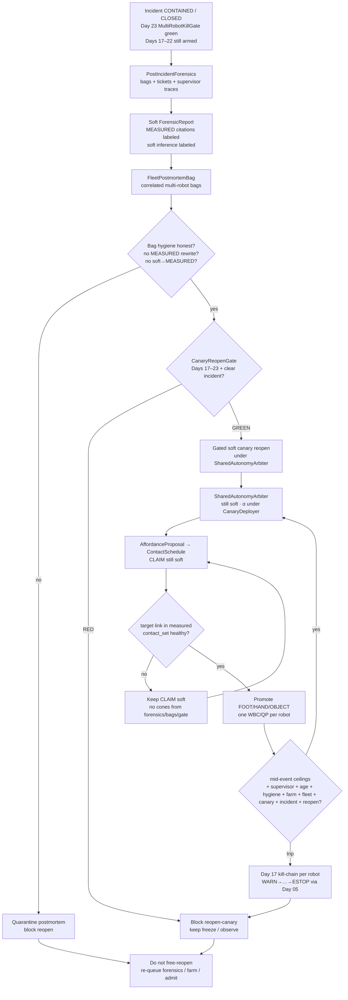
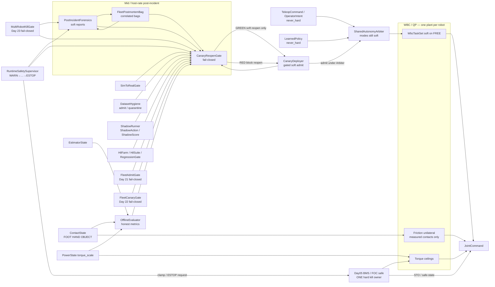
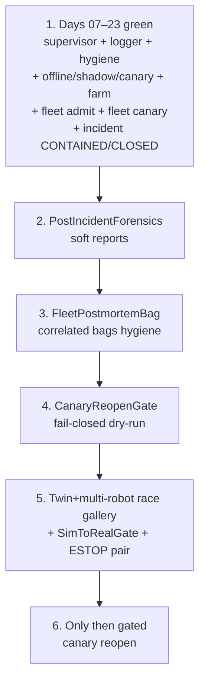

# Day 24 — Post-incident forensics / fleet postmortem bags / reopen canary under supervisor + logging + canary + HIL + fleet + fleet-canary + incident gates


[Day 23](/lessons/day-23-fleet-incident-response) owned `IncidentCoordinator` / `FleetRollbackOrchestrator` / `MultiRobotKillGate` — soft `IncidentTicket` classification; coordinated per-robot soft-admit rollback / freeze stagger; `MultiRobotKillGate` fails closed on unpaired ESTOP / farm RED ignored mid-incident / OVERRIDE-as-bypass / cross-robot honesty strip / rollback without MEASURE/Day05 / canary admit during active incident / dual-write `torque_scale` for kill / ticket→MEASURED. [Day 22](/lessons/day-22-fleet-canary-orchestration) owned `FleetCanaryOrchestrator` / `MultiSiteRanker` / `FleetCanaryGate`. [Day 21](/lessons/day-21-fleet-continual-learning) owned `FleetLogHub` / `TicketLogSync` / `OnlineContinualLearner` / `FleetAdmitGate`. [Day 20](/lessons/day-20-hil-regression-farm) owned `HilFarm` / `HilSuite` / `RegressionGate`. [Day 19](/lessons/day-19-offline-eval-shadow-canary) owned `OfflineEvaluator` / `ShadowRunner` / `CanaryDeployer`. [Day 18](/lessons/day-18-teleop-policy-logging-replay) owned `EpisodeLogger` / `ReplayHarness` / `DatasetHygiene`. [Day 17](/lessons/day-17-runtime-safety-supervisor) owned `RuntimeSafetySupervisor` — kill-chain WARN→…→ESTOP; hard clamp / ESTOP only through Day 05. [Day 16](/lessons/day-16-teleop-shared-autonomy) owned `SharedAutonomyArbiter`. [Day 15](/lessons/day-15-closed-loop-learned-policies)–[Day 14](/lessons/day-14-learned-residuals-scene-graphs) owned closed-loop soft policies and residuals. [Day 13](/lessons/day-13-support-affordances)–[Day 11](/lessons/day-11-hand-support-loco-manipulation) owned affordances and measured hand support. [Day 09](/lessons/day-09-push-recovery)–[Day 08](/lessons/day-08-stepping-locomotion) owned recovery and gait. [Day 07](/lessons/day-07-wbc-balance)–[Day 05](/lessons/day-05-power-bms) owned the feasible program, estimate, and sag honesty.

Today owns **`PostIncidentForensics` / `FleetPostmortemBag` / `CanaryReopenGate`**: how a post-incident forensics host reconstructs what happened from Day 18/21 bags + Day 23 tickets + Day 17 supervisor traces at mid / host rate — honesty about what is MEASURED vs soft inference, never rewriting MEASURED channels; how a fleet postmortem bag layer correlates multi-robot bags for forensic replay with schema continuity to Day 18 `EpisodeLogger` / Day 21 `FleetLogHub` — soft ticket↔bag metadata only, never soft→MEASURED in bags; and how a fail-closed `CanaryReopenGate` (reopen-canary honesty gate) is the gated path to reopen soft canary admit after incident + forensics + rollback settled — requiring re-pass of OfflineEvaluator + DatasetHygiene + RuntimeSafetySupervisor + SimToRealGate + HilFarm/RegressionGate + FleetCanaryGate + clear incident gates (Days 17–23), refusing incomplete forensics, ticket still open, farm RED, unpaired ESTOP, OVERRIDE mid-reopen, dual-write `torque_scale`, skip MEASURE because forensics looked clean, honesty-stripped postmortem, forensics treated as free plant — still no plant that writes `JointCommand`, attaches cones, dual-writes `torque_scale`, clears supervisor stage, skips MEASURE, or treats `OPERATOR_OVERRIDE` as a fleet-wide reopen bypass.

## The reopen path is not a kill plant with better charts

A “post-incident reopen” stack that greens by rewriting MEASURED bag channels, promoting soft forensic inference into MEASURED contact, dual-writing `torque_scale` “for reopen,” treating OVERRIDE as hard bypass mid-reopen, skipping MEASURE because the forensics dashboard looked clean, ignoring farm RED because the postmortem slide looked thorough, reopening canary while a ticket is still OPEN / ROLLING_BACK, silently unpaired ESTOP across sites, or stripping honesty from postmortem exports is detector-as-constraint-truth wearing a forensics sticker. The forensics / bag / reopen path ticks at **mid / host** rate with `clock_domain` and `age_ms` — not µs / EtherCAT cyclic until jitter is measured and budgeted. Soft channels stay soft forever. Measured channels stay measured forever. Forensic reports are soft (with MEASURED citations labeled). Postmortem bag metadata is soft. Gate green is a soft-admit / reopen-canary blocker release — not contact membership and not Day 05 ESTOP ownership. Day 08 gait and Day 09 recovery still outrank soft holds. Day 05 still owns ceilings and hard kill latch **per robot**. Day 17 kill-chain still arms **per robot**. Day 18 hygiene still gates admit sets. Day 19 Offline / Shadow / Canary still bind per robot. Day 20 farm / suite / gate still bind. Day 21 FleetAdmitGate / hub / ticket / online still bind. Day 22 FleetCanaryOrchestrator / MultiSiteRanker / FleetCanaryGate still bind. Day 23 IncidentCoordinator / FleetRollbackOrchestrator / MultiRobotKillGate still bind — ticket must be CONTAINED / CLOSED before reopen. Days 14–23 `never_hard` still binds.

| Layer | Owns | Must not own |
|-------|------|--------------|
| PostIncidentForensics | Reconstruct from bags + tickets + supervisor traces; soft ForensicReport with MEASURED vs soft labels | Second plant; `JointCommand`; dual-write `torque_scale` “for forensics”; rewriting MEASURED bag channels; promoting inference→MEASURED |
| FleetPostmortemBag | Correlate multi-robot bags; soft ticket↔bag metadata; schema continuity Day 18/21 | Rewriting MEASURED channels; soft→MEASURED in bags; cone truth from postmortem |
| CanaryReopenGate | Fail-closed soft-admit / reopen-canary blocker | Writing `JointCommand` / cones; clearing stage; dual-writing ceilings; hard ESTOP ownership; reopen with open ticket |
| Day 23 MultiRobotKillGate / coord / rollback | Still required; ticket CONTAINED/CLOSED before reopen | Being stripped so reopen dashboard looks busy |
| Day 22 FleetCanaryGate / orch / rank | Still required; stagger may resume only after CanaryReopenGate GREEN | Being stripped so forensics greens look clean |
| Day 21 FleetAdmitGate / hub / ticket / online | Still required before free reopen | Being stripped for postmortem polish |
| Day 20 farm / suite / gate | Per-robot / per-bench regression still required | Being ignored because forensics “looked thorough” |
| Day 19 Offline / Shadow / Canary | Per-robot CanaryDeployer still owns local soft admit; reopen gates through CanaryReopenGate | Admitting canary with incomplete forensics / open ticket |
| Day 18 hygiene / logger | Per-robot admit set; postmortem bags remain honest | Being rewritten / soft→MEASURED in bags |
| Day 17 supervisor | Stage + monitors still armed **per robot** during reopen ticks | Being cleared by forensics, bags, or OVERRIDE |
| Day 16 arbiter / teleop / policy | Soft writers; reopen restores soft α under Arbiter only after gate GREEN | Bypassing kill-chain because “forensics cleared it” |
| Measured contact | Membership in hard `contact_set` (FOOT \| HAND \| OBJECT) | Soft forensic inference / postmortem green / WARN stage as cone truth |
| Gait (Day 08) | Intended DS/SS/swing clock vs measured feet | Losing the writer fight to a reopen soft hold |
| Recovery (Day 09) | Mid-disturbance abort / emergency step | Deadlock with reopen freeze — document preempt |
| Soft tasks | EE / grasp / posture on **FREE** limbs | Parallel “reopen plant” writing `JointCommand` |
| Sim-to-real gate | Twin+fleet race honesty before free canary reopen | Perfect-sim green fleet that always “reopens clean” |
| Honesty | Escalate / abort / block reopen when ceilings / age / contact / stage / hygiene / pairing / forensics incomplete fail | Heroic reopen that rode past brownout or a false-green twin |

**Core thesis:** a `PostIncidentForensics` host reconstructs honesty-aware soft reports from bags + tickets + supervisor traces — citing MEASURED channels as MEASURED and soft inference as soft, never rewriting MEASURED. A `FleetPostmortemBag` correlates multi-robot bags for forensic replay with Day 18/21 schema continuity — soft metadata only. A `CanaryReopenGate` fails closed when forensics incomplete, ticket still open, farm RED, unpaired ESTOP, OVERRIDE mid-reopen, dual-write `torque_scale`, skip MEASURE because forensics looked clean, honesty-stripped postmortem, forensics as free plant, or Days 17–23 greens regress. Soft stays soft. Measured stays measured. Day 05 owns ceilings and hard kill latch **per robot**. Day 17 kill-chain stays armed **per robot**. Day 18 labels refuse soft→MEASURED. Day 19 Offline / Shadow / Canary still bind. Day 20 HilFarm / RegressionGate still bind. Day 21 FleetAdmitGate still binds. Day 22 FleetCanaryGate still binds. Day 23 MultiRobotKillGate still binds. There is still **one** QP face and **one** hard torque ceiling / ESTOP owner **per robot**. The twin + multi-robot farm must inject post-incident races (incomplete forensics, reopen with open ticket, OVERRIDE mid-reopen, dual-write, farm RED ignored, unpaired ESTOP, rewrite MEASURED bags, soft→MEASURED in postmortem, skip Days 17–23 re-pass, forensics as free plant) before free canary reopen.



**Ownership rule:** one writer for *fleet soft post-incident forensics*, one writer for *fleet soft postmortem bag correlation*, one writer for *canary reopen fail-closed decision*, one writer for *fleet soft incident classification*, one writer for *fleet soft rollback*, one writer for *multi-robot kill fail-closed*, one writer for *per-robot canary admit / abort / rollback*, one writer for *fleet canary fail-closed*, one writer for *fleet admit fail-closed*, one writer for *farm schedule / pairing*, one writer for *suite version*, one writer for *regression gate*, one writer for *offline metric schema*, one writer for *shadow soft observe*, one writer for *hygiene quarantine*, one writer for *supervisor stage + soft inhibit*, one writer for *Day 05 torque ceilings / hard kill latch*, one writer for *teleop soft*, one writer for *live policy soft*, one writer for *arbiter soft blend*, one writer for *schedule intent*, one writer for *measured* `contact_set` **per robot**. When they disagree on constraints, **measured contact wins for cones**. When they disagree on torque ceilings or ESTOP, **Day 05 / supervisor hard path wins** — forensics, postmortem bags, reopen gate, coordinator, rollback, multi-robot kill gate, farm, canary, fleet canary, and `OPERATOR_OVERRIDE` included. Intent aborts, softens, retimes, blocks reopen, or waits — it does not promote OBJECT because a forensic report looked thorough or a postmortem dashboard looked busy. Day 08 gait and Day 09 recovery still outrank a stuck reopen hold; document freeze-vs-recovery preempt so the twin cannot invent a deadlock under reopen schedule.

## How today fits the Days 05–23 stack

| Day | What you already froze | What Day 24 reuses |
|-----|------------------------|--------------------|
| 05 | `torque_scale`, `POWER_GATED`, sag honesty, FOC safe | Reopen stack never dual-writes; forensics scores missed `POWER_GATED`; OVERRIDE cannot bypass mid-reopen; unpaired ESTOP fails gate; hard ESTOP still only Day 05 |
| 06 | `EstimatorState`, age / stale, contact modes | Forensics / bags preserve and score `age_ms`; stripping age is a false-green reopen race |
| 07 | Tasks vs hard friction / unilaterality | New contacts join the hard set only when measured — never from forensic inference / postmortem green |
| 08 | Gait modes vs measured `contact_set` | Reopen soft freeze must not steal swing constraints; document yield / retime |
| 09 | Mid-event abort / soften; `RecoveryCommand` | Recovery preempt vs reopen freeze ordering is a first-class twin fight |
| 10 | Soft EE / grasp; FREE vs CLAIM honesty | CLAIM without measure still forbidden under forensics / bags / gate |
| 11 | MEASURED_SUPPORT hands; LOCO_MANIP | Hands remain first-class; demote / reopen block cover HAND / OBJECT slots |
| 12 | `ContactSchedule` phases; OBJECT kind | Reopen block aborts schedule lifecycle — does not invent cones |
| 13 | Affordance soft CLAIM; conf gates CLAIM not cones | Forensic report may order demote priority; still never attaches cones |
| 14 | Residual / scene soft; `never_hard`; mid-rate `age_ms` | Residual disagree is a first-class forensics / gate fail signal |
| 15 | `LearnedPolicy` soft; `SimToRealGate`; closed-loop live ticks | Reopen restores soft policy siblings only after gate GREEN; forensics pass ≠ MEASURED |
| 16 | `SharedAutonomyArbiter`; teleop + policy co-equal soft | Reopen restores soft α into Arbiter only after CanaryReopenGate GREEN; OVERRIDE still cannot hard-bypass |
| 17 | `RuntimeSafetySupervisor`; kill-chain; hard kill via Day 05 only | Stage + monitors **must** stay armed on every reopen tick **per robot**; stage ≠ MEASURED; forensics does not own ESTOP |
| 18 | `EpisodeLogger` / `ReplayHarness` / `DatasetHygiene` | Postmortem bags stay honest; labels still refuse soft→MEASURED; **never rewrite MEASURED channels** |
| 19 | `OfflineEvaluator` / `ShadowRunner` / `CanaryDeployer` | Per-robot CanaryDeployer still owns local soft admit; CanaryReopenGate gates reopen; must re-pass Offline + Hygiene + Supervisor + SimToRealGate |
| 20 | `HilFarm` / `HilSuite` / `RegressionGate` | CanaryReopenGate requires farm green; farm RED → RED |
| 21 | `FleetLogHub` / `TicketLogSync` / `OnlineContinualLearner` / `FleetAdmitGate` | FleetPostmortemBag continues Day 21 schema; CanaryReopenGate requires FleetAdmitGate green |
| 22 | `FleetCanaryOrchestrator` / `MultiSiteRanker` / `FleetCanaryGate` | Stagger may resume only after CanaryReopenGate GREEN; FleetCanaryGate still required |
| 23 | `IncidentCoordinator` / `FleetRollbackOrchestrator` / `MultiRobotKillGate` | Ticket must be CONTAINED / CLOSED; MultiRobotKillGate still required; no reopen while OPEN / ROLLING_BACK |

Do not bolt a “reopen plant” that writes `JointCommand` or attaches cones beside the QP when forensics finishes or a postmortem bag looks clean. That is Day 10’s second-plant anti-pattern wearing a forensics sticker.

## Channel taxonomy (label honesty)

Every forensics / postmortem / reopen channel is labeled by what it may touch. Soft reports, bag metadata, and reopen-gate greens never promote into measured membership by rename — including for “just reopen.”

| Channel class | May exercise | Must never become / use as |
|---------------|--------------|----------------------------|
| Soft forensic report | `LABEL_FORENSICS` (timeline, MEASURED citations, soft inferences) | `MEASURED` contact membership / cones / $F_z \ge 0$ |
| Fleet postmortem bag metadata | `LABEL_SOFT_INTENT` (ticket↔bag link, correlation ids) | Cone truth; soft→MEASURED rename in bags; rewrite MEASURED channels |
| Supervisor-aware negatives | `LABEL_SUPERVISOR_STAGE`, `LABEL_NEGATIVE_KILL` | Cone truth; “green enough to free-reopen” without stage honesty |
| Measured contact fidelity | `LABEL_MEASURED_CONTACT` | Soft forensic inference / postmortem green with a louder name |
| Power honesty | `LABEL_POWER` | Infinite-torque GT; dual-writer “for reopen” |
| Estimate / residual honesty | `LABEL_ESTIMATE` + residual disagree | Age-stripped “clean” multi-robot state as sole GT |
| Gate honesty | `LABEL_GATE` | False-green after stripping fails / incomplete forensics |
| Aggregate CanaryReopenGate score | Weighted soft + measured + negatives + age + gate + power + pairing + forensics completeness | Reward / slide polish / “forensics looked clean” alone |

**Required PostIncidentForensics / FleetPostmortemBag / CanaryReopenGate coverage (all required before free canary reopen):**

1. PostIncidentForensics soft-only — reconstruct from bags + tickets + supervisor traces; label MEASURED citations vs soft inference; refuse rewrite of MEASURED channels; preserve `age_ms` / stage / `POWER_GATED` / residual disagree per robot.
2. FleetPostmortemBag mid/host — correlate multi-robot bags with Day 18/21 schema; soft ticket↔bag metadata only; forbid rewrite MEASURED / soft→MEASURED in bags / `JointCommand` / cones / dual-write.
3. CanaryReopenGate dry-run — require Days 17–23 greens + clear incident (ticket CONTAINED/CLOSED); refuse incomplete forensics, ticket still open, farm RED, unpaired ESTOP, OVERRIDE mid-reopen, dual-write `torque_scale`, skip MEASURE because forensics looked clean, honesty-stripped postmortem, forensics as free plant.
4. Inject Day 17–23 race gallery cases at multi-robot scale — prior races **plus** incomplete forensics, reopen with open ticket, OVERRIDE mid-reopen, rewrite MEASURED bags, soft→MEASURED in postmortem, skip Days 17–23 re-pass, forensics as free plant.
5. Physical ↔ digital ESTOP pairing **per robot** — unpaired → CanaryReopenGate RED.
6. Mid / host rate with `age_ms` — never inside µs / EtherCAT cyclic write path until jitter measured.

**Promotion / admit / reopen refusal rules (all required):**

1. Relabeling soft→MEASURED (or inference→cones, or postmortem-green→cones, or reopen-gate-green→ESTOP ownership) is a **hygiene / post-incident fault**, not a multi-robot option.
2. Rewriting MEASURED bag channels during postmortem is a **forensics / bag fault** — quarantine, never reopen.
3. `OPERATOR_OVERRIDE` during reopen remains soft; OVERRIDE-as-bypass mid-reopen stays quarantined and must not green CanaryReopenGate.
4. `never_hard: true` on forensics / bag / reopen soft channels — API and runtime refuse soft→hard promotion.
5. Forensics / bags / gate tick at mid / host rate with `age_ms` — never inside the current loop or EtherCAT cyclic write path until jitter is measured and budgeted.
6. **No canary reopen while incident OPEN / ROLLING_BACK or forensics INCOMPLETE** — CanaryDeployer / FleetCanaryOrchestrator must refuse new soft admits until CanaryReopenGate GREEN.

Quarantine, abort, block-reopen-canary, and keep-negatives are **success paths** when the forensics host hacked past honesty, the postmortem bag rewrote MEASURED, the farm harness lied under reopen schedule, the pack sagged, the twin showed a late kill, ESTOP was unpaired, someone tried to reopen with an open ticket, or someone tried to pretty-print honesty out of the multi-robot postmortem. A reopen dashboard that always looks green after export is ignoring Day 05–23 with prettier forensics badges.

## Ownership conflict: forensics vs bags vs reopen-gate vs incident vs fleet canary vs fleet admit vs farm vs offline vs soft vs measure vs gait vs recovery vs power

Post-incident reopen is where teams accidentally create a fifteenth writer on support constraints and a second writer on `torque_scale` / ESTOP “for reopen.” Freeze the split:

| Conflict | Winner | Forensics / bags / gate behavior |
|----------|--------|----------------------------------|
| Soft forensic inference vs measured contact | Measured contact | Soft stays soft; never promotes |
| Supervisor stage vs missing measure | Measured contact | Wait / demote / block reopen; stage never attaches cones |
| Postmortem soft refs vs cones | Soft-only bags | Reject cone attach; fault as post-incident-plant attempt |
| Forensics / bags vs `JointCommand` | Hard stack refusal | Forensics / bags reconstruct / correlate only; never write JointCommand |
| Forensics / bags vs dual-writer on `torque_scale` | Day 05 BMS owner only | Reject; CanaryReopenGate RED |
| Reopen skips MEASURE before PROMOTE | Measured contact + hygiene | Block; quarantine; twin race must catch |
| Missed `POWER_GATED` during reopen window | Power honesty + supervisor | Escalate / clamp; gate RED |
| Stale `age_ms` during reopen window | Age gate + supervisor | Fail; gate RED if stripped |
| Soft→MEASURED in postmortem bags | FleetPostmortemBag + hygiene | Reject; quarantine bag export |
| Rewrite MEASURED bag channels | FleetPostmortemBag + forensics | Reject; quarantine; gate RED |
| Incomplete forensics but reopen wants GREEN | PostIncidentForensics + CanaryReopenGate | Fail closed; no override |
| Ticket still OPEN / ROLLING_BACK | Day 23 MultiRobotKillGate + CanaryReopenGate | Fail closed; require CONTAINED/CLOSED |
| Farm RED but forensics “looked thorough” | RegressionGate + CanaryReopenGate | Fail closed; no override |
| FleetAdmitGate / FleetCanaryGate / MultiRobotKillGate RED but reopen wants all-clear | Days 21–23 gates + CanaryReopenGate | Fail closed; Days 17–23 required |
| OVERRIDE mid-reopen as bypass | Supervisor + Day 05 hard path | Soft freeze / hard path wins; gate RED |
| False-green OfflineEvaluator under reopen | OfflineEvaluator + CanaryReopenGate | Block reopen; twin race must fail closed |
| Clock skew dropping stage during reopen tick | Clock domain + supervisor | Prefer fail-safe gate RED |
| Shadow hard-write under reopen schedule | ShadowRunner + CanaryReopenGate | Block; fault as plant attempt |
| Residual disagree under forensics scope | Day 14 honesty + supervisor | Gate RED; do not clean away |
| Active `RecoveryCommand` vs reopen freeze | Documented preempt | Twin must show ordering; no silent deadlock |
| Gait swing / touchdown vs reopen soft hold | Measured feet + gait owner | Retime / pause CLAIM; never steal swing |
| Hygiene quarantine spike mid-reopen | DatasetHygiene + CanaryReopenGate | Gate RED; do not “ride it out” |
| Pretty postmortem cleaner (drop stage / negatives / residual) | Honesty refusal | Reject cleaner; keep raw honesty channels |
| Unpaired physical/digital ESTOP | Bring-up pairing + CanaryReopenGate | Gate RED; do not free-reopen |
| Training plant wants hard cones from forensics | Hard stack refusal | Reject at API; log post-incident-plant attempt |
| Skip MEASURE because forensics looked clean | Measured contact + CanaryReopenGate | Fail closed; honesty > forensics polish |
| Forensics claims hard ESTOP ownership | Day 05 BMS / FOC only | Reject; gate RED; per-robot latch only |
| Skip Days 17–23 re-pass because “incident handled” | CanaryReopenGate require | Fail closed; re-pass mandatory |



**Hard vs soft:** support constraints on **measured** FOOT / HAND / OBJECT stay hard. Soft EE and arbiter refs live only on FREE limbs. Forensic reports, postmortem bag metadata, and reopen-gate greens are softer still — they reconstruct and block, they do not feed cones and they do not own ESTOP. Hard kill / clamp is owned only by Day 05 **per robot**. If the QP goes infeasible under an expanded set during a reopen window, demote / abort / soften / block reopen — do not silently drop an object cone so the fleet “makes it safe.”

## Physical ↔ digital pairing for post-incident forensics and reopen

| Physical | Digital twin / backing |
|----------|------------------------|
| Same PostIncidentForensics honesty under changing support membership | No perfect-state forensics that strips age / stage / residual while hardware ages out |
| Live `age_ms` / `clock_domain` during reopen ticks | Twin must inject clock skew dropping stage in reopen window |
| Live kill-chain stage + monitors per robot | Twin must inject reopen that treats OVERRIDE as bypass; reject |
| Soft forensic report / postmortem / canary observe | Twin must inject forensics hard-write / cones / JointCommand; reject |
| `POWER_GATED` / `torque_scale` history per robot | Twin must inject dual-writer “for reopen” and missed `POWER_GATED` |
| Canary reopen under CanaryReopenGate | Twin must show reopen restores prior soft α only after GREEN; hard path unchanged; no reopen while ticket OPEN |
| Hygiene quarantine spike / honesty strip in postmortem | Twin must inject spike / strip → CanaryReopenGate RED |
| Soft→MEASURED / rewrite MEASURED in bags | Twin must inject; FleetPostmortemBag refuses; quarantine |
| Incomplete forensics ignored for reopen | Twin must inject; gate RED |
| Ticket still OPEN but reopen attempted | Twin must inject; gate RED |
| Farm RED ignored because forensics “thorough” | Twin must inject; gate RED |
| Skip MEASURE because forensics looked clean | Twin must inject; gate RED |
| Skip Days 17–23 re-pass | Twin must inject; gate RED |
| Physical + digital ESTOP pairing per robot | Unpaired → gate RED; free reopen forbidden |
| Mid-rate forensics / bags / gate + jitter | Cannot beat hardware cadence or hide age faults; no net inside cyclic write path |
| `SimToRealGate` | Explicit RED/YELLOW/GREEN; block free canary reopen until GREEN with race gallery |

If the twin always greens canary reopen with full packs while hardware sees late trips, false greens, OVERRIDE spam, stripped age, dual-writers, honesty-stripped postmortems, unpaired ESTOP, and reopen with open tickets, you will “reopen” forever on theater and never ship a CLAIM that survives a tired bus or a race you only passed in multi-robot slides.

## Mid-event / mid-reopen honesty

Shared-autonomy mid-rate paths are where teams “keep the canary reopen green just until the demo finishes.” Do not.

| Signal mid-CLAIM / mid-reopen | Required behavior |
|-------------------------------|-------------------|
| `INPUT_STALE` / confidence cliff on estimate or contact | Abort / inhibit soft admit α; advance supervisor; do not strip age for forensic score |
| Shadow dropout / host stall / rate miss under reopen | Log; inhibit shadow CLAIM; do not promote on last-known shadow action; may gate RED |
| Honesty strip / postmortem cleaner | Fail FleetPostmortemBag export; gate RED; do not reopen |
| Operator dropout / stick disconnect under canary blend during reopen | Inhibit teleop; do **not** promote on last-known EE delta; reopen still yields |
| Forensics / bags fighting `INHIBIT_SOFT` / OVERRIDE spam | Soft freeze wins; OVERRIDE cannot clear stage or force past Day 05; gate RED |
| Policy / canary / forensics reward-hack past WARN into hard writes | Escalate stage; reject; abort / quarantine — keep as negative |
| Residual / graph inconsistency (Day 14) under forensics scope | Preserve residual disagree; demote or never promote; gate RED |
| Domain shift / SimToRealGate red | Soften / re-gate; freeze free reopen; do not export as green |
| `POWER_GATED` / falling `torque_scale` | Escalate to clamp; gate RED; quarantine if ignored |
| Contact flicker / wrench disagree | Demote that slot; abort soft admit on that CLAIM |
| Foot `contact_set` collapses mid-handoff | Yield to Day 09 recovery; document freeze vs recovery preempt under reopen |
| QP infeasible under expanded cones | Demote newest promote and/or drop soft EE — do not drop unilaterality to “fit the reopen” |
| Late kill (trip after promote under reopen) | Demote + Day 05 clamp / ESTOP; **rollback** soft admit α; keep as `LABEL_NEGATIVE_KILL`; gate RED |
| Hygiene quarantine spike mid-reopen | Gate RED; do not ride it out |
| Soft→MEASURED / rewrite MEASURED in bags | Reject; quarantine bag export |
| Incomplete forensics | Refuse reopen; gate RED |
| Ticket still OPEN / ROLLING_BACK | Refuse reopen; gate RED |
| Farm RED ignored mid-reopen | Refuse; gate RED |
| False trip | Hysteresis / confirm; do not disable kill-chain; log for twin gallery |
| Dual-writer attempt on `torque_scale` (forensics or bag harness) | Reject non-BMS writer; gate RED; quarantine |
| Forensics / bags attempting cones / JointCommand | Reject at PostIncidentForensics / FleetPostmortemBag API; fault as plant attempt |
| Age / stage stripped by postmortem exporter | Fail reopen green; hygiene quarantine; twin race must catch |
| Recovery asserts during reopen freeze | Follow documented preempt; no deadlock |
| Gait swing / touchdown commit | Retime or pause CLAIM; never steal swing constraints |
| Reopen skips MEASURE before PROMOTE | Gate RED; quarantine; twin race must catch |
| Physical ESTOP without digital latch (or reverse) | Fail bring-up — pairing required; gate RED |
| Forensics looked clean → skip honesty / Days 17–23 re-pass | Fail closed; honesty > forensics polish |
| FleetCanaryGate / FleetAdmitGate / MultiRobotKillGate RED ignored because forensics “handled” | Fail closed; CanaryReopenGate requires Days 21–23 greens |

Abort, demote, clamp, ESTOP, quarantine, block-reopen-canary, and keep-negatives are **success paths** when the forensics host, the postmortem bag layer, the farm harness, the shadow, the canary, the pack, the exporter, the pairing, the honesty strip, or the race lied mid-CLAIM.

## Shared API: PostIncidentForensics / FleetPostmortemBag / CanaryReopenGate above Day 23 shapes

Keep Day 02 / 04 wire honesty. Cyclic commands still carry `BusHeader`. Extend Day 23 incident / Day 22 fleet-canary / Day 21 fleet / Day 20 farm / Day 19 Offline / Shadow / Canary / Day 18 hygiene / Day 17 supervisor / Day 16 arbiter / Day 15 policy / Day 14 residual / Day 13 `AffordanceProposal` / Day 12 `ContactSchedule` / Day 05 power — do not invent a parallel “reopen bus” or second plant:

```text
BusHeader:
  t_mono
  seq
  clock_domain         # HOST | MID | … — never claim CYCLIC for forensics/bags/gate until jitter measured
  age_ms
  producer_id

# Soft post-incident forensics — never MEASURED; never rewrite MEASURED
PostIncidentForensics ⊇ BusHeader:
  fleet_id
  schema_version
  never_hard: true
  report_kind: LABEL_FORENSICS
  incident_ref                 # Day 23 IncidentTicket id
  status                       # INCOMPLETE | COMPLETE | QUARANTINED
  timeline[]:
    t_mono
    source                     # BAG | TICKET | SUPERVISOR | CANARY | FARM | HUB
    channel_class              # MEASURED | SOFT_INFERENCE
    citation                   # bag_id / ticket_id / stage / residual / POWER_GATED
  measured_citations[]:        # must remain MEASURED forever
    channel                    # ContactState | EstimatorState | PowerState | …
    bag_offset
    refuse_rewrite: true
  soft_inferences[]:           # labeled soft — never promote
    claim
    confidence
    never_hard: true
  refuse_rewrite_measured: true
  refuse_inference_to_measured: true
  preserve_age_ms: true
  preserve_stage: true
  preserve_residual_disagree: true
  preserve_POWER_GATED: true
  refuse_honesty_strip: true
  tick_rate_hint_hz             # mid / host
  age_ms

# Soft multi-robot postmortem bags — schema continuity Day 18/21
FleetPostmortemBag ⊇ BusHeader:
  fleet_id
  never_hard: true
  incident_ref
  forensics_ref
  schema_version               # same family as Day 18 EpisodeLogger / Day 21 FleetLogHub
  robots[]:
    robot_id
    site_id
    bag_id
    episode_logger_ref         # Day 18 — bags do NOT replace
    ticket_link?               # soft metadata only (Day 21 TicketLogSync style)
  correlation:
    cross_robot_sync_ids[]
    clock_domain_honesty: true
  forbid:
    rewrite_measured_channels: true
    soft_to_measured_in_bags: true
    joint_command: true
    attach_cones: true
    dual_write_torque_scale: true
    clear_supervisor_stage: true
  require:
    dataset_hygiene_honest: true
    fleet_log_hub_schema_match: true
  age_ms

# Fail-closed soft-admit / reopen-canary blocker
CanaryReopenGate ⊇ BusHeader:
  fleet_id
  fail_closed: true
  soft_admit_blocker_only: true
  never_hard: true
  status               # RED | YELLOW | GREEN
  require:
    supervisor_armed: true                 # Day 17
    hygiene_honest: true                   # Day 18
    offline_shadow_canary_green: true      # Day 19
    regression_gate_green: true            # Day 20
    fleet_admit_gate_green: true           # Day 21
    fleet_canary_gate_green: true          # Day 22
    multi_robot_kill_gate_green: true      # Day 23
    incident_contained_or_closed: true     # Day 23 ticket
    forensics_complete: true               # Day 24
    postmortem_bag_hygiene_honest: true    # Day 24
    sim_to_real_gate_green: true
    estop_pairing_per_robot: true
    day05_binding_per_robot: true
  refuse_on[]:
    forensics_incomplete
    ticket_still_open
    farm_RED
    unpaired_estop
    OVERRIDE_mid_reopen
    dual_write_torque_scale
    skip_MEASURE_because_forensics_looked_clean
    honesty_stripped_postmortem
    rewrite_measured_bags
    soft_to_measured_in_bags
    skip_days_17_23_repass
    clock_skew_dropping_stage
    shadow_hard_write
    false_green_offline
    hygiene_quarantine_spike
    residual_disagree_stripped
    forensics_as_free_plant
  forbid:
    joint_command: true
    attach_cones: true
    dual_write_torque_scale: true
    clear_supervisor_stage: true
    claim_hard_estop_ownership: true
  operator_override_cannot_bypass_day05: true
  block_free_canary_reopen_until_green: true
  age_ms

# Day 19 CanaryDeployer — extended, not replaced
CanaryDeployer ⊇ BusHeader:
  # … Day 19 + Day 23 fields …
  canary_reopen_gate_ref?
  block_until_canary_reopen_gate_green: true
  refuse_admit_while_forensics_incomplete: true
  refuse_admit_while_incident_open: true
  still_soft: true
  never_hard: true
  # still: OfflineEvaluator + DatasetHygiene + RuntimeSafetySupervisor + SimToRealGate
  # still: no JointCommand / cones / dual-write / clear-stage / skip-MEASURE

# Day 22 FleetCanaryOrchestrator — resume only after reopen gate
FleetCanaryOrchestrator ⊇ BusHeader:
  # … Day 22 + Day 23 fields …
  resume_stagger_only_after_canary_reopen_gate_green: true

# Day 22 FleetCanaryGate — still required
FleetCanaryGate ⊇ BusHeader:
  # … Day 22 + Day 23 fields …
  block_reopen_until_canary_reopen_gate_green: true

# Day 23 MultiRobotKillGate — still required; ticket clear before reopen
MultiRobotKillGate ⊇ BusHeader:
  # … Day 23 fields …
  # ticket CONTAINED/CLOSED required by CanaryReopenGate

# Day 21 FleetAdmitGate — still required
FleetAdmitGate ⊇ BusHeader:
  # … Day 21 fields …
  block_canary_reopen_until_green: true

# Day 20 RegressionGate — still required
RegressionGate ⊇ BusHeader:
  # … Day 20 fields …
  # farm RED ⇒ CanaryReopenGate RED even if forensics “looked thorough”

# Day 15 SimToRealGate — extended checks
SimToRealGate ⊇ BusHeader:
  status               # RED | YELLOW | GREEN
  checks[]:
    # … Day 14–23 checks …
    post_incident_forensics_incomplete
    post_incident_ticket_still_open
    post_incident_OVERRIDE_mid_reopen
    post_incident_dual_writes_torque_scale
    post_incident_skips_MEASURE_because_forensics
    post_incident_unpaired_estop
    post_incident_rewrite_measured_bags
    post_incident_soft_to_measured_in_bags
    post_incident_honesty_stripped_postmortem
    post_incident_skip_days_17_23_repass
    post_incident_forensics_as_free_plant
  age_ms
  block_free_canary_reopen_until_green: true
  block_free_fleet_incident_until_green: true
  block_free_fleet_canary_until_green: true
  block_free_canary_until_green: true

# Day 05 hard path — ONE owner per robot (reopen stack never dual-write / never claim ESTOP)
PowerState / BmsCommand ⊇ BusHeader:
  torque_scale
  POWER_GATED
  clamp_request_src?   # SUPERVISOR | BMS | ...
  estop_latch
  clear_requires_human: true
  phys_digital_paired: true
  # PostIncidentForensics / FleetPostmortemBag / CanaryReopenGate
  # NEVER appear as clamp_request_src owners of hard ESTOP

# Soft perception / schedule — Day 13–23 + reopen demote / block
AffordanceProposal ⊇ BusHeader
ContactSchedule ⊇ BusHeader

ManipulationCommand / WbcTaskSet / JointCommand
  # Day 16–23 shapes unchanged — forensics/bags/gate never write JointCommand
  # as-if-measured or attach cones; CEIL / ESTOP come from Day 05 only
```

Higher layers publish teleop commands, policy actions, arbiter blends, shadow scores, canary soft admits, farm schedules, suite results, fleet bags, ticket links, online soft updates, multi-site ranks, fleet canary stagger schedules, incident tickets, rollback schedules, forensic reports, postmortem bag correlations, residual corrections, affordance candidates, schedule intent, supervisor soft intents, offline-scored honesty, fleet-admit soft-admit decisions, fleet-canary-gate soft-admit decisions, multi-robot-kill-gate soft-admit / reopen-canary decisions, and **canary-reopen-gate** soft-admit / reopen-canary decisions. Measured `ContactState` owns support membership. Day 05 owns torque ceilings and ESTOP latch **per robot**. Gait and recovery keep their writers. Nobody re-implements FOC, AHRS, or friction cones inside the PostIncidentForensics, the FleetPostmortemBag, or the CanaryReopenGate.

## Bring-up sequence (before free canary reopen)

Days 07–23 green (stance, step, recovery, FREE-hand reach, measured hand SUPPORT / loco-manip, scripted multi-contact / OBJECT handoffs, gated affordance CLAIM, residual / scene soft feeds, closed-loop policy with `SimToRealGate` green, teleop / blend / OVERRIDE mid-arbitration honesty, supervisor race gallery green with kill-chain armed, logger / replay / hygiene race gallery green, offline / shadow / canary race gallery green, HIL farm race gallery green with continuous farm gates, fleet hub / ticket / online / FleetAdmitGate race gallery green, fleet canary / multi-site rank / FleetCanaryGate race gallery green, fleet incident / rollback / MultiRobotKillGate race gallery green with incident CONTAINED/CLOSED). Then:



1. **Days 07–23 green + incident settled** — teleop / policy / arbiter / residual / affordance / supervisor / logger / hygiene / offline / shadow / canary / farm / fleet admit / fleet canary / incident paths still behave; `never_hard` still enforced; OVERRIDE still cannot attach cones or skip MEASURE; hard kill still only through Day 05; continuous farm + FleetAdmitGate + FleetCanaryGate + MultiRobotKillGate green; ticket CONTAINED/CLOSED.
2. **PostIncidentForensics (soft reports)** — reconstruct from bags + tickets + supervisor traces; confirm MEASURED citations labeled; confirm soft inference labeled; confirm refuse rewrite MEASURED; confirm refuse inference→MEASURED; confirm honesty strip fails export.
3. **FleetPostmortemBag (correlated bags hygiene)** — correlate multi-robot bags with Day 18/21 schema; soft ticket↔bag metadata; confirm forbid rewrite MEASURED / soft→MEASURED / `JointCommand` / cones / dual-write; confirm ESTOP pairing per robot; confirm Day 05 binding unchanged.
4. **CanaryReopenGate fail-closed dry-run** — require Days 17–23 greens + forensics COMPLETE + ticket CONTAINED/CLOSED; inject incomplete forensics, ticket still open, dual-write, OVERRIDE mid-reopen, farm RED, unpaired ESTOP, rewrite MEASURED bags, soft→MEASURED in bags, skip Days 17–23 re-pass, skip MEASURE because forensics looked clean; confirm RED blocks reopen; confirm OVERRIDE cannot force past Day 05.
5. **Twin+multi-robot race gallery + SimToRealGate + ESTOP pair** — twin+robots inject incomplete forensics, open-ticket reopen, OVERRIDE mid-reopen, dual-write `torque_scale`, rewrite MEASURED bags, soft→MEASURED in postmortem, honesty-stripped postmortem, unpaired ESTOP, skip Days 17–23 re-pass, forensics treated as free plant; confirm escalate / reject / gate RED; `SimToRealGate` must go GREEN before free canary reopen.
6. **Then** run gated canary reopen with supervisor + logger + hygiene + offline / shadow / canary + farm + FleetAdmitGate + FleetCanaryGate + MultiRobotKillGate gates green — never replace cones, FOC, `torque_scale` ownership, gait, recovery, measured `ContactState`, Day 17 kill-chain, Day 18 label taxonomy, Day 19 Offline / Shadow / Canary, Day 20 HilFarm / RegressionGate, Day 21 FleetAdmitGate, Day 22 FleetCanaryGate, or Day 23 MultiRobotKillGate contracts. Fleet change management / staged policy promotion / cross-site config honesty under the same gates waits for Day 25+.

Skip to “ship free canary reopen because the forensics looked clean” and hardware’s first multi-robot rail grasp trip after reopen becomes an unplanned tip / brownout experiment with better postmortem charts.

## Failure gallery

| Symptom | Likely cause |
|---------|--------------|
| Promotes on air from forensic inference / postmortem green | Soft→MEASURED promotion; cones without `contact_set` |
| Twin reopen green, hardware late / yellow | Age / stage stripped; SimToRealGate green without race gallery |
| Reopen rides past brownout | Missed `POWER_GATED`; clamp path not in refuse_on |
| OVERRIDE forces past Day 05 mid-reopen | OVERRIDE misdocumented as hard ownership; gate bypass |
| Forensics / bags write JointCommand / cones | PostIncidentForensics / FleetPostmortemBag-as-second-plant; `never_hard` not enforced |
| Dual-writer fights on `torque_scale` during reopen | Forensics / harness bypassed BMS API; ceilings thrash |
| Reopen greens on reward / slide polish alone | Supervisor-aware negatives / age / gate / power / pairing / forensics completeness missing |
| Pretty exporter drops residual disagree / stage for postmortem | Honesty cleaner anti-pattern; CanaryReopenGate refusal missing |
| MEASURED bag channels silently rewritten | FleetPostmortemBag refuse_rewrite_measured missing |
| Soft→MEASURED silently merged into bags | FleetPostmortemBag refuse soft_to_measured_in_bags missing |
| Incomplete forensics ignored for reopen | CanaryReopenGate refuse forensics_incomplete missing |
| Ticket still OPEN but reopen greens | CanaryReopenGate require incident_contained_or_closed missing |
| Farm RED ignored mid-reopen | CanaryReopenGate refuse farm_RED missing |
| False-green OfflineEvaluator under reopen | Gate checks not in reopen path; twin race skipped |
| Clock skew reopen window without stage | `clock_domain` / stage preservation missing |
| Hygiene quarantine spike ignored mid-reopen | refuse_on spike missing; “ride it out” anti-pattern |
| Stale `age_ms` kept GREEN in reopen | Age gate missing; last-known green trusted |
| Policy / canary / forensics reward-hack past WARN trained as success | Escalate / abort / quarantine / gate RED missing |
| Shadow hard-write under reopen schedule treated as noise | First-class plant-attempt fault missing |
| Recovery deadlocks with reopen freeze | Preempt ordering undocumented; twin never injected the fight |
| Virtual ESTOP only / physical unpaired under reopen | Bring-up pairing skipped; gate did not RED |
| Second plant for “safe” brace from forensics | Parallel optimizer writing `JointCommand` on ESTOP edge |
| Forensics / bags / gate net inside current / EtherCAT cyclic | Jitter never measured; standing principle violated |
| QP infeasible → silent cone drop under reopen demote | Demote/abort/block path missing; “make it feasible” anti-pattern |
| Gait swing stolen during reopen freeze | Freeze did not yield / retime to Day 08 commit |
| FleetCanaryGate / FleetAdmitGate / MultiRobotKillGate RED ignored because forensics “handled” | CanaryReopenGate require Days 21–23 greens missing |
| Continuous reopen only on sticky perfect sims | No incomplete-forensics / open-ticket / OVERRIDE-mid-reopen / dual-write / unpaired-ESTOP / rewrite-MEASURED / soft→MEASURED / skip-repass injects; gate never red |
| Forensics treated as free plant / hard ESTOP owner | CanaryReopenGate / PostIncidentForensics contract broken; still_soft / day05_binding missing |
| Skip MEASURE because forensics looked clean | CanaryReopenGate refuse missing; honesty > forensics polish violated |
| Skip Days 17–23 re-pass | CanaryReopenGate refuse skip_days_17_23_repass missing |

## What to freeze this week

Extend [frames](/frames) and your control / eval / deploy / HIL / fleet / canary / incident / forensics config with:

- `PostIncidentForensics` fields: `fleet_id`, `schema_version`, `incident_ref`, `status` INCOMPLETE \| COMPLETE \| QUARANTINED, `timeline[]` with source / channel_class MEASURED \| SOFT_INFERENCE / citation, `measured_citations[]` with `refuse_rewrite`, `soft_inferences[]` with `never_hard`, `refuse_rewrite_measured`, `refuse_inference_to_measured`, preserve age/stage/residual/`POWER_GATED`, refuse honesty strip, mid/host `tick_rate_hint_hz`, `age_ms`, `never_hard: true`
- `FleetPostmortemBag` fields: `incident_ref`, `forensics_ref`, `schema_version` (Day 18/21 family), `robots[]` with `bag_id` / `episode_logger_ref` / soft `ticket_link?`, `correlation.cross_robot_sync_ids[]`, forbid rewrite MEASURED / soft→MEASURED / hard writes, require hygiene honest + FleetLogHub schema match, mid/host, `never_hard: true`
- `CanaryReopenGate` fields: `fail_closed: true`, `soft_admit_blocker_only: true`, require Days 17–23 greens + forensics COMPLETE + ticket CONTAINED/CLOSED + ESTOP pairing + Day 05 binding, refuse_on incomplete forensics / ticket_still_open / farm_RED / unpaired ESTOP / OVERRIDE mid-reopen / dual-write / skip-MEASURE-because-forensics / honesty-stripped postmortem / rewrite MEASURED bags / soft→MEASURED in bags / skip Days 17–23 re-pass / clock skew / shadow hard-write / false-green / hygiene spike / residual stripped / forensics-as-free-plant, **forbid** hard writes + claim_hard_estop_ownership, `operator_override_cannot_bypass_day05: true`, `block_free_canary_reopen_until_green: true`
- Day 19 `CanaryDeployer` extension: `canary_reopen_gate_ref?`, `block_until_canary_reopen_gate_green: true`, `refuse_admit_while_forensics_incomplete: true` beside existing Offline + Hygiene + Supervisor + SimToRealGate + farm + FleetAdmitGate + FleetCanaryGate + MultiRobotKillGate gates
- Day 22 `FleetCanaryOrchestrator` extension: `resume_stagger_only_after_canary_reopen_gate_green: true`
- Day 22 `FleetCanaryGate` extension: `block_reopen_until_canary_reopen_gate_green: true`
- Day 21 `FleetAdmitGate` extension: `block_canary_reopen_until_green: true`
- Day 15 `SimToRealGate` extension: post-incident race checks listed above
- Explicit rule: teleop score / policy reward / blend score / shadow score / canary weight / suite pass / farm green / ticket severity / learn weight / fleet green / site rank / fleet canary green / incident ticket / rollback green / kill-gate green / **forensic report** / postmortem green / reopen-gate green / supervisor stage $\neq$ MEASURED; soft channels never write `JointCommand`, friction cones, FOC $i_q$, or `ContactState` on forensics, bags, or gate; soft channels never own hard ESTOP latch; soft channels never rewrite MEASURED bag channels
- Explicit rule: Day 17 supervisor + Day 18 logger / hygiene + Day 19 Offline / Shadow / Canary + Day 20 farm + Day 21 FleetAdmitGate + Day 22 FleetCanaryGate + Day 23 MultiRobotKillGate stay armed during reopen; hard kill still only through Day 05 **per robot**; `OPERATOR_OVERRIDE` cannot bypass kill-chain hard stages, BMS, gait, or recovery — including to force reopen “all-clear”
- Explicit rule: **no canary reopen while incident OPEN / ROLLING_BACK or forensics INCOMPLETE**
- Who owns **fleet soft post-incident forensics** vs **fleet soft postmortem bags** vs **canary reopen fail-closed** vs **fleet soft incident classification** vs **fleet soft rollback** vs **multi-robot kill fail-closed** vs **per-robot canary admit** vs **fleet canary fail-closed** vs **fleet admit fail-closed** vs **farm schedule** vs **suite version** vs **regression gate** vs **offline metric schema** vs **shadow soft observe** vs **hygiene quarantine** vs **supervisor stage** vs **Day 05 hard kill latch** vs **teleop soft** vs **policy soft** vs **arbiter soft blend** vs **schedule intent** vs **measured** `contact_set` vs **gait** vs **recovery** (disagree on cones → measured wins; disagree on ceilings / ESTOP → Day 05 / supervisor hard path wins)
- Documented recovery preempt vs reopen freeze ordering
- Rate / jitter budget: forensics / bags / gate at mid / host rates with `age_ms`; forbidden inside µs / EtherCAT cyclic until jitter measured; no nets reconstructing cones in µs loops
- Twin+multi-robot hooks: incomplete forensics, open-ticket reopen, OVERRIDE mid-reopen, dual-write `torque_scale`, rewrite MEASURED bags, soft→MEASURED in postmortem, honesty-stripped postmortem, unpaired ESTOP, skip Days 17–23 re-pass, forensics as free plant — same as hardware; `SimToRealGate` blocks free canary reopen until GREEN
- Bring-up gate: no free canary reopen until steps 1–5 above are green

The lesson is not “ship free canary reopen until the forensics looks clean.” It is **make post-incident reconstruction and gated reopen the same contact-rich program in silicon, on every robot / site, and in the twin**: a `PostIncidentForensics` host that reconstructs honesty-aware soft reports without rewriting MEASURED or becoming MEASURED, a `FleetPostmortemBag` that correlates multi-robot bags with Day 18/21 schema without soft→MEASURED, a `CanaryReopenGate` that fails closed when forensics incomplete, tickets still open, races, honesty strips, unpaired ESTOP, or hygiene regress, measured FOOT/HAND/OBJECT still owning the hard support set, one estimate, honest power ceilings, Day 17 kill-chain still armed **per robot**, Day 18 labels still refusing soft→MEASURED, Day 19 Offline / Shadow / Canary still binding, Day 20 HilFarm / RegressionGate still binding, Day 21 FleetAdmitGate still binding, Day 22 FleetCanaryGate still binding, Day 23 MultiRobotKillGate still binding, schedules that wait for measurement and yield to gait/recovery, soft tasks only where soft belongs, forensics / bags / gate ticks outside µs loops until jitter is honest, Days 14–23 `never_hard` still binding, and abort / quarantine / gate-RED / SimToRealGate paths that stay honest when the forensics host, the postmortem bag layer, the farm harness, the exporter, the pairing, the honesty strip, the race, or the sim lies mid-CLAIM.

## Next

**Day 25+** — Fleet change management / staged policy promotion / cross-site config honesty under supervisor + logging + canary + HIL + fleet + fleet-canary + incident + forensics/reopen gates: after CanaryReopenGate greens a reopen, promote soft policy / config changes across sites only when Days 17–24 greens hold — still no plant that bypasses MEASURE or Day 05 ceilings.
