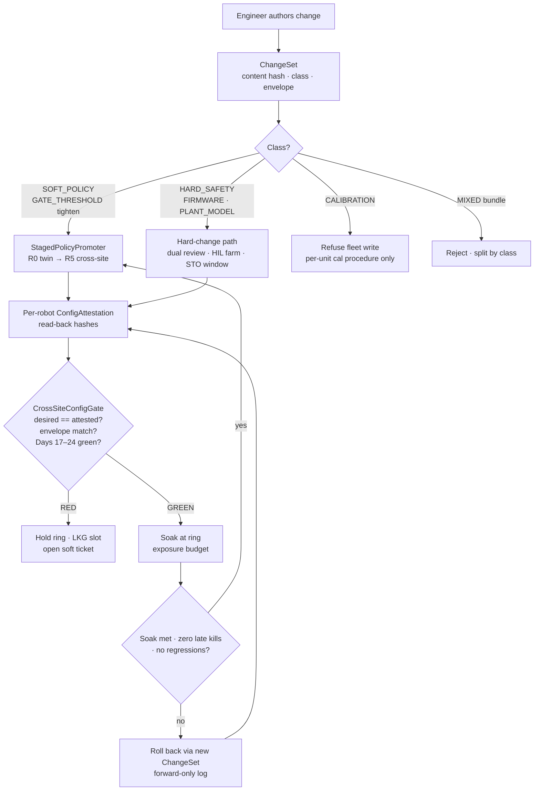
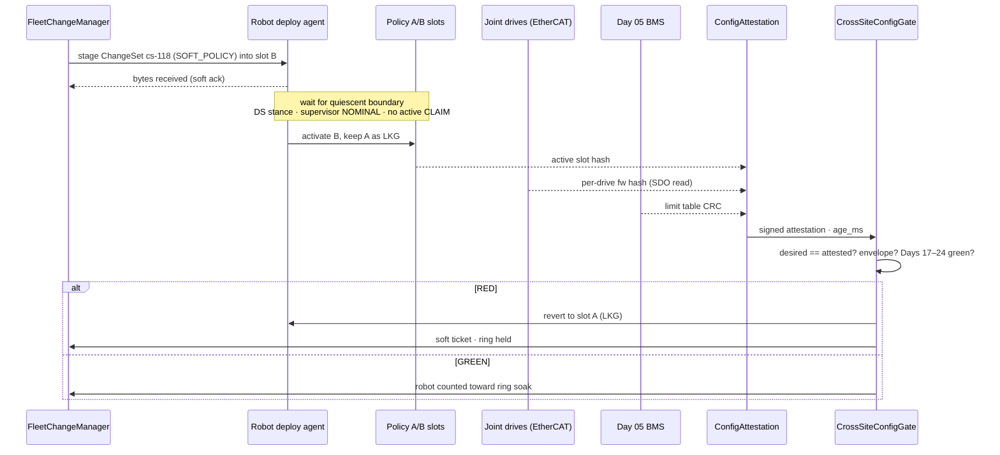
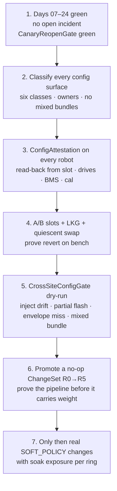

# Day 25 — Fleet change management / staged policy promotion / cross-site config honesty under supervisor + logging + canary + HIL + fleet + fleet-canary + incident + forensics/reopen gates

![FleetChangeManager / StagedPolicyPromoter / CrossSiteConfigGate: every change to a humanoid fleet is a content-addressed ChangeSet classified by what it can touch (HARD_SAFETY, CALIBRATION, PLANT_MODEL, FIRMWARE, SOFT_POLICY, GATE_THRESHOLD); soft changes climb promotion rings R0 twin → R1 HIL bench → R2 one robot → R3 site cohort → R4 site → R5 cross-site with soak exposure at each ring; each robot attests what it is actually running by reading hashes back from drives, BMS and the policy slot; CrossSiteConfigGate fails closed on desired≠attested drift, compatibility-envelope mismatch, mixed-class bundles, or any Day 17–24 gate RED; soft channels dashed; measured / Day 05 solid](/images/day25-fleet-change-management.png)

[Day 24](/lessons/day-24-post-incident-forensics) owned `PostIncidentForensics` / `FleetPostmortemBag` / `CanaryReopenGate`: honest reconstruction after an incident and a fail-closed path to reopen canary admits. [Day 23](/lessons/day-23-fleet-incident-response) owned `IncidentCoordinator` / `FleetRollbackOrchestrator` / `MultiRobotKillGate`. [Day 22](/lessons/day-22-fleet-canary-orchestration) owned `FleetCanaryOrchestrator` / `MultiSiteRanker` / `FleetCanaryGate`. [Day 21](/lessons/day-21-fleet-continual-learning) owned `FleetLogHub` / `TicketLogSync` / `OnlineContinualLearner` / `FleetAdmitGate`. [Day 20](/lessons/day-20-hil-regression-farm) owned `HilFarm` / `HilSuite` / `RegressionGate`. [Day 19](/lessons/day-19-offline-eval-shadow-canary) owned `OfflineEvaluator` / `ShadowRunner` / `CanaryDeployer`. [Day 18](/lessons/day-18-teleop-policy-logging-replay) owned logging, replay, and hygiene. [Day 17](/lessons/day-17-runtime-safety-supervisor) owned the kill-chain. [Day 05](/lessons/day-05-power-bms) owns `torque_scale`, `POWER_GATED`, and the hard kill latch **per robot**, forever.

Today owns **`FleetChangeManager` / `StagedPolicyPromoter` / `CrossSiteConfigGate`**, plus the small but load-bearing **`ConfigAttestation`** each robot publishes. The question changes from "is this policy good?" (Days 19–22) and "what went wrong?" (Days 23–24) to a quieter, more dangerous one: **what is every robot actually running right now, and how did it get there?**

## Why change management is a physical problem, not a DevOps chore

On a web fleet, "config" is a YAML file and a bad push costs latency. On a humanoid fleet, a config change can move the zero of a hip encoder by 0.6°, swap a motor torque constant, shift the IMU extrinsic, loosen a BMS undervoltage threshold, or hand a policy trained against last month's mass model to a robot with a heavier battery pack. None of those *look* like policy changes. All of them change what the QP believes about physics.

Two facts make this hard:

1. **Robots are not identical.** Two units off the same line differ in joint zero offsets, encoder eccentricity, gear backlash, motor $K_t$ spread (often ±5–8%), F/T sensor gains, IMU mounting rotation, and cable routing that changes thermal behavior. That per-unit truth is **CALIBRATION**, and it was *measured* on that unit. A fleet push must never overwrite it with a fleet average.
2. **The deploy tool's belief is not the robot's state.** The deploy server thinks robot 17 is on policy `p-41` with drive firmware `fw-3.2.1`. The robot may have failed the swap and booted the last-known-good slot, or a technician may have reflashed one ankle drive on the bench. **Config honesty** means the robot *reads back* what it's running from the drives, the BMS, and the policy slot, and attests it. Desired state is soft. Attested state is measured.

So we split the world the same way Days 05–24 did: some config is soft and can be promoted gradually; some is hard and must never ride in a soft bundle; some is per-unit measured truth that a fleet tool must never write at all.

| Layer | Owns | Must not own |
|-------|------|--------------|
| `FleetChangeManager` | Content-addressed `ChangeSet`s; class labels; compatibility envelope; forward-only change log; LKG pointer per robot | Writing `JointCommand`; editing CALIBRATION; bundling HARD_SAFETY with SOFT_POLICY; "hotfix" pushes outside the log |
| `StagedPolicyPromoter` | Ring schedule R0→R5; soak exposure accounting; per-ring promote / hold / roll back decisions (soft) | Skipping a ring because the last one "looked great"; promoting during an open incident; owning ESTOP |
| `ConfigAttestation` (per robot) | Read-back hashes from policy slot, drive firmware, BMS limits, calibration file, URDF; signed, with `age_ms` | Echoing the deploy server's desired state; being inferred instead of read |
| `CrossSiteConfigGate` | Fail-closed: desired vs attested drift, envelope mismatch, mixed-class bundle, Days 17–24 RED | Clearing supervisor stage; loosening Day 05 ceilings; "force" flag that skips attestation |
| Day 05 BMS / FOC | `torque_scale`, `POWER_GATED`, HARD_SAFETY parameter values, ESTOP latch | Accepting a HARD_SAFETY change from the policy pipeline |
| Days 17–24 gates | Still required at every ring | Being bypassed because "it's just a config change" |

**Core thesis:** every change is a typed, hashed `ChangeSet`. Its **class** decides which pipeline it may ride. SOFT_POLICY and tightening GATE_THRESHOLD changes climb rings with soak exposure. HARD_SAFETY, FIRMWARE, and PLANT_MODEL changes go through their own slower, HIL-heavy path and never travel inside a policy bundle. CALIBRATION is per-unit measured truth and is never fleet-written. A robot is "on" a change only when its own `ConfigAttestation` says so. `CrossSiteConfigGate` fails closed whenever desired and attested disagree.



## The six change classes

The class is the single most important field in a `ChangeSet`. It's assigned by *what the change can physically affect*, not by which team wrote it or which file it lives in.

| Class | Examples | Who may write it | Pipeline | Swap condition |
|-------|----------|------------------|----------|----------------|
| `SOFT_POLICY` | Policy weights, observation normalization stats, arbiter α caps, residual net, affordance thresholds | `FleetChangeManager` | Rings R0→R5 | Quiescent boundary (below) |
| `GATE_THRESHOLD` (tighten) | Lower soft α cap, stricter `age_ms` limit, more conservative hygiene quarantine | `FleetChangeManager` | Rings, faster soak allowed | Quiescent boundary |
| `GATE_THRESHOLD` (loosen) | Raise α cap, relax stale timeout, widen SimToRealGate yellow band | Treated as **HARD_SAFETY** | Hard-change path | STO window |
| `HARD_SAFETY` | Torque ceilings, BMS UV/OC/OT thresholds, ESTOP debounce, kill-chain stage timings, joint position limits | Day 05 owner + safety reviewer | Hard-change path, HIL mandatory | Robot in STO / safe-state, human present |
| `FIRMWARE` | Drive FOC firmware, BMS firmware, EtherCAT PDO map, IMU firmware | Firmware owner | Hard-change path, bench flash first | STO, drives re-enumerated, attestation re-read |
| `PLANT_MODEL` | URDF mass/inertia, link lengths, actuator gear ratios, contact geometry | Model owner | Twin re-validation + HIL, then rings | STO; invalidates policy envelopes that reference it |
| `CALIBRATION` | Joint zero offsets, encoder eccentricity tables, $K_t$ per motor, IMU extrinsic, F/T gain | **Per-unit calibration procedure only** | Never fleet-pushed | Measured on that unit, signed by the rig |

Two rules fall out of the table and do most of the work:

- **Loosening anything is hard.** Tightening a gate can only make the robot more conservative, so it may ride the soft rings. Loosening one removes a margin someone earned in HIL; it rides the hard path with review.
- **No mixed bundles.** A `ChangeSet` has exactly one class. "New policy plus slightly higher torque ceiling so it can do the new move" is two changes, and the second one goes through the Day 05 owner. A mixed bundle is rejected at authoring, not caught at the gate.

## The compatibility envelope: a policy is trained against a body

A learned policy isn't portable across arbitrary hardware. It was trained and validated against a specific plant model, a calibration *family*, a firmware ABI (units, PDO layout, filter cutoffs inside the drive), and an observation pipeline. Write that down as the policy's **envelope** and refuse to install it anywhere the envelope doesn't match:

```text
CompatibilityEnvelope:
  plant_model_hash        # URDF + mass/inertia the policy was validated on
  calibration_family      # e.g. "cal-v4" procedure; per-unit values may differ, procedure may not
  drive_fw_abi            # semantic ABI: units, PDO map, internal filter cutoffs
  bms_fw_abi
  obs_pipeline_hash       # normalization stats + feature order
  sensor_set              # which F/T, IMU, encoders the policy reads
  payload_range_kg        # battery / end-effector payload it was validated for
  hard_safety_profile     # the Day 05 ceilings it was tested UNDER (must be ≥ as strict on robot)
```

The last line matters more than it looks. A policy validated under a 70% torque ceiling has never seen what happens at 85%. If a site loosened its ceiling (through the hard path, legitimately), policies validated under the old profile are outside their envelope there until re-validated. The envelope check is in `CrossSiteConfigGate`, and a mismatch is RED, not a warning.

## Config honesty: attestation is measured, desired is soft

This is the "cross-site config honesty" part, and it's the same idea as measured `ContactState` vs soft `CLAIM` from Days 10–13, applied to the robot's own software and parameters.

| Signal | Class | Who produces it | Trust |
|--------|-------|-----------------|-------|
| Desired config (what the server pushed) | Soft | `FleetChangeManager` | Intent only |
| Deploy tool "success" ack | Soft | Deploy agent on robot computer | Says the bytes arrived, not that they're running |
| Policy slot hash (active A/B slot) | Measured | Robot computer reads the loaded artifact | Trusted with `age_ms` |
| Drive firmware hash / version | Measured | Each drive reports over EtherCAT SDO | Trusted per drive; one drive mismatched is a mismatch |
| BMS limit table hash | Measured | BMS reports its live parameter CRC | Trusted; this is how you catch a loosened UV threshold |
| Calibration file hash + rig signature | Measured | Robot reads the file it actually loaded at boot | Trusted; proves no fleet tool overwrote it |
| Plant model hash | Measured | Controller reports the URDF it built the QP from | Trusted |

`ConfigAttestation` is published at host rate (say 1 Hz, with `age_ms`) and on every boot, slot swap, and drive re-enumeration. A robot whose attestation is stale is treated exactly like a stale estimate on Day 06: you don't promote on last-known-good.



### Where a swap is allowed to happen

A policy swap mid-step is a discontinuity in the writer feeding Day 16's arbiter. Even a better policy has a different internal state (recurrent memory, action filter history), so the first few ticks after a swap are the least trustworthy ticks it will ever produce. Define a **quiescent boundary** and swap only there:

- Gait mode is double support (Day 08), not swing or impact settle.
- No active `RecoveryCommand` (Day 09), no measured HAND/OBJECT support being added or removed (Days 11–12).
- Supervisor stage `NOMINAL` (Day 17), not WARN or higher.
- `POWER_GATED` false, `torque_scale` at its steady value (Day 05).
- Arbiter blends the new policy in from α = 0 over a ramp, under the Day 19 canary α cap, rather than stepping to full authority.

HARD_SAFETY, FIRMWARE, and PLANT_MODEL changes never swap live. They need the robot in STO / safe-state with a human present, followed by drive re-enumeration and a fresh attestation before anything re-arms.

## Staged promotion rings and how long to soak

Rings are the change-management version of Day 22's stagger, applied to *every* soft change, not only new policies.

| Ring | Scope | Purpose | Exit criteria (all required) |
|------|-------|---------|------------------------------|
| R0 | Twin + Day 20 farm suites | Catch obvious regressions and envelope errors | Farm GREEN; race gallery GREEN; SimToRealGate GREEN |
| R1 | HIL bench rigs (real drives, real BMS) | Catch firmware ABI, timing, and thermal surprises | Attested on every bench; zero kills; jitter within budget |
| R2 | One robot, supervised | First real body, real floor | Soak exposure met (below); zero late kills; no hygiene spike |
| R3 | Site cohort (10–20% of one site) | Unit-to-unit spread at one site | Soak met per robot; attestation drift = 0 |
| R4 | Whole site | Site-specific floors, payloads, operators | Soak met; Day 22 FleetCanaryGate GREEN |
| R5 | Cross-site, staggered | Cross-site config honesty | Each site passes R3–R4 on its own; envelopes match per site |

**How much soak is enough?** Use exposure, not calendar time. If a ring sees zero late kills in $n$ robot-hours, the one-sided 95% upper bound on the late-kill rate is approximately

$$
\lambda_{95} \approx \frac{3}{n}
$$

(the "rule of three": $-\ln(0.05) \approx 3$). To claim fewer than one late kill per 100 robot-hours with 95% confidence and zero observed events, a ring needs about **300 robot-hours** of honest exposure, counted only from attested robots, in conditions the envelope covers. Ten robots for 30 hours each counts; one robot left idle on a stand for 300 hours doesn't, because idle hours aren't exposure to the behavior you changed. That's why `StagedPolicyPromoter` counts exposure from Day 18 bags (time in modes the change touches), not wall-clock time.

A single late kill resets the ring and goes to the Day 23/24 incident and forensics path. Promotion isn't something you can retry until it passes.

## Ownership conflicts

| Conflict | Winner | Change-management behavior |
|----------|--------|----------------------------|
| Desired config vs attested config | Attested | Robot counts as "not on the change"; gate RED until they match |
| Fleet push vs per-unit CALIBRATION | Calibration | Reject the write; fault as a fleet-overwrite attempt |
| SOFT_POLICY bundle contains a HARD_SAFETY delta | Hard-change path | Reject at authoring; split by class |
| Gate loosen marked as "threshold tweak" | Hard-change path | Reclassify as HARD_SAFETY; dual review |
| Ring soak not met but "metrics look great" | `StagedPolicyPromoter` | Hold; exposure is the criterion, not dashboards |
| Promotion during incident OPEN / ROLLING_BACK | Day 23 + Day 24 gates | Freeze all rings fleet-wide |
| `CanaryReopenGate` RED at a site | Day 24 | That site's rings frozen; other sites unaffected unless shared envelope |
| Envelope mismatch (plant / fw ABI / safety profile) | `CrossSiteConfigGate` | RED for that robot; never "close enough" |
| Swap requested mid-swing or mid-recovery | Day 08 gait / Day 09 recovery | Defer to quiescent boundary |
| `OPERATOR_OVERRIDE` "force promote" | Nobody | No such flag exists; OVERRIDE stays soft (Day 16) |
| Rollback by editing history | Forward-only log | Rollback is a new `ChangeSet` pointing at LKG content |
| One drive on old firmware after a partial flash | Attestation | Robot is mismatched; whole robot held, not "mostly upgraded" |
| Stale attestation (`age_ms` over limit) | Age gate | Treated as unknown; not counted toward soak |

## Shared API

Keep Day 02/04 wire honesty: everything carries `BusHeader`, and nothing in today's layer runs in the cyclic path. Extend Day 19–24 shapes rather than inventing a parallel "deploy bus."

```text
BusHeader:
  t_mono
  seq
  clock_domain         # HOST — change management never claims CYCLIC
  age_ms
  producer_id

ChangeSet:
  changeset_id         # content hash of payload + metadata
  class                # SOFT_POLICY | GATE_THRESHOLD_TIGHTEN | HARD_SAFETY | FIRMWARE | PLANT_MODEL
                       # (CALIBRATION is not a valid ChangeSet class)
  payload_ref          # artifact hash (weights / table / image)
  envelope: CompatibilityEnvelope
  parent_changeset_id  # forward-only lineage
  is_rollback_to?      # LKG changeset_id when this is a rollback
  author
  reviewers[]          # ≥2 including Day 05 owner when class ∈ {HARD_SAFETY, FIRMWARE}
  evidence:
    farm_run_ref       # Day 20
    offline_eval_ref   # Day 19
    sim_to_real_ref    # Day 15
  never_hard: true     # for SOFT_POLICY / GATE_THRESHOLD_TIGHTEN
  forbid:
    mixed_class: true
    write_calibration: true
    joint_command: true
    dual_write_torque_scale: true

ConfigAttestation ⊇ BusHeader:     # MEASURED — read back, never echoed
  robot_id
  site_id
  boot_id
  policy_slot_active   # A | B
  policy_hash
  obs_pipeline_hash
  plant_model_hash
  calibration_hash
  calibration_rig_sig
  drive_fw[]:          # one entry per drive, read over SDO
    joint
    fw_hash
  bms_fw_hash
  bms_limit_crc
  hard_safety_profile_hash
  signed_by            # robot key, not deploy server
  age_ms

StagedPolicyPromoter ⊇ BusHeader:
  changeset_id
  ring                 # R0..R5
  cohort[]             # robot_ids at this ring
  exposure_robot_hours # counted from Day 18 bags in affected modes, attested robots only
  required_exposure    # e.g. 3 / target_rate
  late_kills           # any > 0 resets ring → Day 23 path
  decision             # HOLD | PROMOTE | ROLLBACK (soft)
  quiescent_swap_only: true
  alpha_ramp_from_zero: true
  never_hard: true

CrossSiteConfigGate ⊇ BusHeader:
  fail_closed: true
  soft_admit_blocker_only: true
  status               # RED | YELLOW | GREEN
  require:
    desired_equals_attested: true
    attestation_fresh: true
    envelope_match: true
    single_class_changeset: true
    calibration_untouched: true
    supervisor_armed: true                 # Day 17
    hygiene_honest: true                   # Day 18
    offline_shadow_canary_green: true      # Day 19
    regression_gate_green: true            # Day 20
    fleet_admit_gate_green: true           # Day 21
    fleet_canary_gate_green: true          # Day 22
    no_open_incident: true                 # Day 23
    canary_reopen_gate_green: true         # Day 24
    estop_pairing_per_robot: true
    day05_binding_per_robot: true
  refuse_on[]:
    attestation_drift
    partial_firmware_flash
    envelope_mismatch
    mixed_class_bundle
    loosen_marked_as_tighten
    calibration_overwrite
    ring_skip
    soak_not_met
    promote_during_incident
    live_swap_outside_quiescent
    stale_attestation
  forbid:
    joint_command: true
    attach_cones: true
    dual_write_torque_scale: true
    clear_supervisor_stage: true
    force_flag: true

# Day 19 CanaryDeployer — extended
CanaryDeployer ⊇ BusHeader:
  # … Days 19–24 fields …
  require_cross_site_config_gate_green: true
  admit_only_attested_changeset: true

# Day 05 — unchanged owner, now with attestable limits
PowerState / BmsCommand ⊇ BusHeader:
  torque_scale
  POWER_GATED
  estop_latch
  limit_table_crc      # read back into ConfigAttestation
  accepts_changes_from: HARD_SAFETY path only
```

## Physical ↔ digital pairing

| Physical | Digital twin / backing |
|----------|------------------------|
| Per-unit calibration measured on a rig | Twin instantiates each robot with *its* calibration hash, not a fleet nominal |
| Drive firmware read back over SDO | Twin drive models versioned by the same fw ABI; mismatch fails R0 |
| BMS limit table CRC | Twin BMS loads the attested table; loosened table can't hide in sim |
| A/B policy slots with LKG | Twin exercises swap + revert, including a failed swap that boots A |
| Quiescent-boundary swap | Twin injects swap requests mid-swing, mid-recovery, at WARN; all must defer |
| Partial flash (one ankle drive old) | Twin injects; attestation must flag the robot mismatched |
| Heavier battery pack at one site | Envelope `payload_range_kg` check; twin re-validates before R5 to that site |
| Clock skew between site and fleet server | Attestation `age_ms` from robot clock domain; stale → not counted |

If the twin always runs every robot on nominal calibration and the deploy server's idea of firmware, it will promote changes that are only valid on a robot that doesn't exist.

## Bring-up sequence (before free fleet change promotion)



1. **Days 07–24 green, no open incident, `CanaryReopenGate` GREEN.** Change management sits on top of everything else; it doesn't replace any of it.
2. **Classify every config surface.** Walk the robot: every file, every drive parameter, every BMS table, every gate threshold gets a class and an owner. Anything you can't classify is HARD_SAFETY until proven otherwise.
3. **Attestation on every robot.** Read hashes back from the real sources. Verify by deliberately flashing one bench drive to an old firmware and confirming attestation catches it.
4. **A/B slots, LKG, quiescent swap.** On the bench, request swaps during swing, recovery, and WARN; confirm deferral. Corrupt slot B and confirm the robot boots A and attests A.
5. **`CrossSiteConfigGate` dry-run.** Inject attestation drift, partial flash, envelope mismatch, mixed-class bundle, a loosen disguised as a tighten, a calibration overwrite, a ring skip, and promotion during an open incident. Every one must go RED.
6. **Promote a no-op `ChangeSet` (new hash, identical behavior) through R0→R5.** This proves the plumbing, attestation, and soak accounting with nothing at stake.
7. **Then** real soft changes, one class at a time, with exposure-based soak.

Day 05 ceilings, measured `ContactState`, Day 17 kill-chain, and Days 18–24 gates keep binding throughout.

## Failure gallery

| Symptom | Likely cause |
|---------|--------------|
| Dashboard says 100% of fleet on `p-41`, one robot behaves like `p-39` | Desired state reported instead of attested; failed swap booted LKG silently |
| New policy fine at site A, wobbly at site B | Envelope missing `payload_range_kg` or calibration family; site B has different packs |
| Hip drifts 0.5° after a fleet update | Fleet push overwrote per-unit CALIBRATION with a nominal file |
| Robot browns out under a move it used to handle | BMS UV threshold loosened inside a "policy bundle"; mixed-class bundle allowed |
| Twitch right after an update, then fine | Swap outside quiescent boundary; no α ramp from zero |
| One robot intermittently faults after firmware rollout | Partial flash; one drive on old fw; robot counted as upgraded |
| Ring promoted after a weekend with "zero incidents" | Wall-clock soak with idle robots; exposure not counted from bags |
| Rollback made things worse | Rollback edited history and lost the LKG artifact; not a forward-only `ChangeSet` |
| Gate "warns" on envelope mismatch and promotes anyway | Envelope check advisory instead of fail-closed |
| Promotion continued during an incident | Rings not frozen on Day 23 ticket OPEN |

## What to freeze this week

Extend [frames](/frames) and your deploy config with:

- The six change classes and their owners, with the rule that **loosening is HARD_SAFETY** and **CALIBRATION is never a fleet `ChangeSet`**.
- `ChangeSet` with content hash, single class, `CompatibilityEnvelope`, forward-only lineage, rollback-as-new-changeset, and reviewer requirements per class.
- `ConfigAttestation` read back from the policy slot, every drive (SDO), BMS limit CRC, calibration file + rig signature, plant model; signed by the robot; host rate with `age_ms`.
- A/B policy slots with LKG; quiescent-boundary swap rules (DS stance, no recovery, no support change, supervisor NOMINAL, not `POWER_GATED`); α ramp from zero under the Day 19 cap.
- `StagedPolicyPromoter` rings R0→R5 with exposure-based soak ($\lambda_{95} \approx 3/n$), late kill resets the ring and opens the Day 23 path.
- `CrossSiteConfigGate` fail-closed on drift, stale attestation, partial flash, envelope mismatch, mixed class, calibration overwrite, ring skip, soak not met, promote during incident, live swap outside quiescent; no force flag.
- Explicit rule: the deploy server's desired state is soft; only attestation counts. Soft channels still never write `JointCommand`, cones, `ContactState`, or `torque_scale`. Day 05 still owns ceilings and ESTOP **per robot**.

The lesson isn't "ship changes carefully." It's that **a fleet's configuration is part of the physical plant**. Every robot has its own measured body, every change has a class that decides what it may touch, and the only honest answer to "what is robot 17 running?" comes from robot 17 reading its own drives, BMS, and policy slot back to you.

## Next

**Day 26+** — Actuator wear, calibration drift, and predictive maintenance: how the per-unit CALIBRATION and drive health you attested today drift over thousands of hours (backlash growth, $K_t$ loss from magnet heating, encoder contamination, F/T zero creep), how to detect it from Day 18 bags without confusing it with policy regressions, and how a maintenance-triggered recalibration becomes a measured, per-unit event that re-checks every policy envelope it touches.
