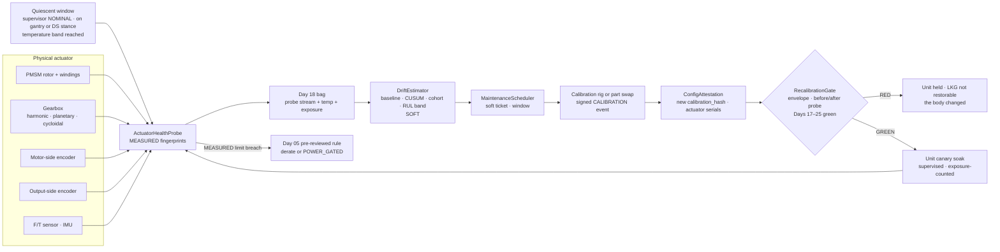
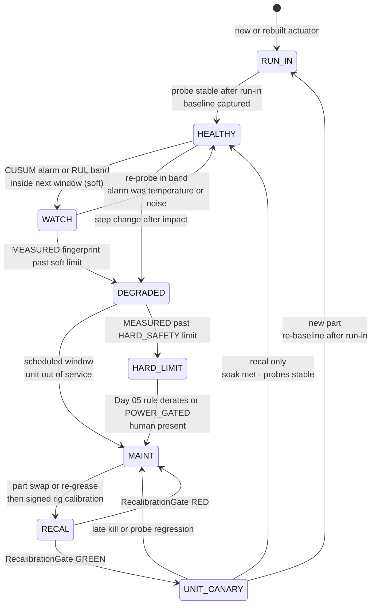
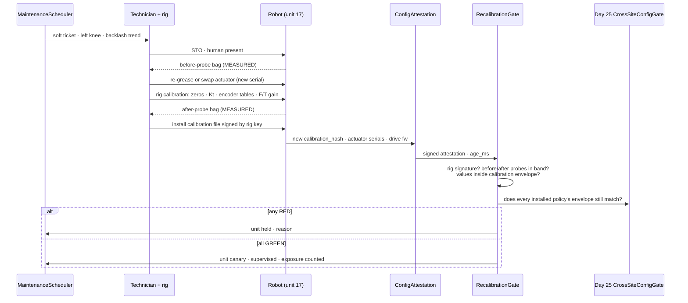
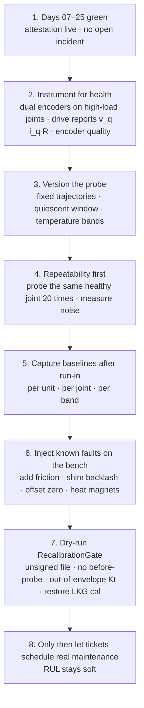

# Day 26 — Actuator wear / calibration drift / predictive maintenance as measured per-unit events under supervisor + logging + canary + HIL + fleet + fleet-canary + incident + forensics/reopen + change-management gates

![ActuatorHealthProbe / DriftEstimator / MaintenanceScheduler / RecalibrationGate: a fixed, policy-independent health probe runs on each actuator in a quiescent window and produces MEASURED per-unit fingerprints (friction from ± velocity sweeps, backlash from dual-encoder reversal, flux linkage from back-EMF, winding resistance from DC injection, F/T and IMU zero at known load); DriftEstimator trends them against exposure with a prediction band (soft); MaintenanceScheduler opens soft tickets; a recalibration on a signed rig is a measured CALIBRATION event that changes ConfigAttestation; RecalibrationGate fails closed on envelope mismatch, unsigned or unprobed recal, DEGRADED data feeding the online learner, or any Day 17–25 gate RED; the unit re-enters service through a per-unit canary soak; soft channels dashed; measured / Day 05 solid](/images/day26-actuator-wear-predictive-maintenance.png)

[Day 25](/lessons/day-25-fleet-change-management) owned `FleetChangeManager` / `StagedPolicyPromoter` / `ConfigAttestation` / `CrossSiteConfigGate`: every change is a typed, hashed `ChangeSet`, and a robot is "on" a change only when it reads that change back from its own drives, BMS, and policy slot. [Day 24](/lessons/day-24-post-incident-forensics) owned forensics and the reopen gate. [Day 23](/lessons/day-23-fleet-incident-response) owned incident response. [Days 19–22](/lessons/day-19-offline-eval-shadow-canary) owned eval, canary, the HIL farm, fleet logging, and fleet canary. [Day 17](/lessons/day-17-runtime-safety-supervisor) owned the kill-chain. [Day 05](/lessons/day-05-power-bms) owns `torque_scale`, `POWER_GATED`, thermal derate, and the hard kill latch **per robot**, forever.

Day 25 left one class of change out of the fleet pipeline on purpose: **CALIBRATION**, the per-unit measured truth about each body. Today is about why that truth doesn't stay true. Gearboxes wear, grease ages, magnets lose flux when they run hot, encoders get dirty or knocked, and strain gauges creep. The robot you calibrated at hour 0 is a slightly different robot at hour 3,000, and nobody pushed a `ChangeSet`.

Today owns **`ActuatorHealthProbe` / `DriftEstimator` / `MaintenanceScheduler` / `RecalibrationGate`**. The question is: **how do you notice the body changing, tell that apart from the policy changing, and turn "fix it" into a measured, per-unit event that every gate downstream can check?**

## Why wear is the hardest drift to see

Every other drift in this curriculum had a name attached. A policy change has a `changeset_id`. A firmware flash shows up in attestation. An incident has a ticket. Wear has none of that. It arrives slowly, it's different on every unit, and the controller hides it from you.

That last point is the trap. Day 07's whole-body controller, Day 14's learned residuals, and Day 21's online learner are all built to *compensate* for model error. When a knee's friction rises 30%, integral action and the residual net quietly add torque until tracking looks fine again. The robot still walks. The dashboards stay green. What changed is that the knee now spends more of its thermal budget on friction, has less torque headroom before Day 05 derates it, and is closer to a gearbox that fails during a push recovery instead of on a bench.

So the first rule of today: **you can't measure wear from task behavior, because task behavior is what the stack is designed to hold constant.** You measure it with a probe the policy doesn't touch.

| Layer | Owns | Must not own |
|-------|------|--------------|
| `ActuatorHealthProbe` (per unit, per joint) | Fixed probe trajectories in a quiescent window; MEASURED fingerprints (friction, backlash, flux linkage, winding R, encoder quality, F/T and IMU zero) with temperature band and `age_ms` | Running inside a task; being driven by the policy; writing calibration |
| `DriftEstimator` | Per-unit baselines; trend vs exposure; CUSUM/EWMA alarms; cohort comparison; remaining-life prediction with a band (soft) | Labeling its predictions MEASURED; inferring wear from in-task tracking error alone |
| `MaintenanceScheduler` | Soft `MaintenanceTicket`s; maintenance windows; part-swap and recal requests; health state per unit | Writing `torque_scale`; closing incident tickets; pushing calibration |
| Calibration rig + procedure | New per-unit CALIBRATION, signed by the rig, with before/after probes | Fleet-wide writes; "nominal" files |
| `RecalibrationGate` | Fail-closed re-admission: signed recal, envelope check, unit canary soak, Days 17–25 GREEN | Clearing supervisor stage; loosening Day 05 ceilings; a "known good, skip soak" flag |
| Day 05 BMS / FOC | Measured winding-temperature derate; pre-reviewed HARD_SAFETY limits that trip on MEASURED probe values | Taking a derate request from the soft health layer |

**Core thesis:** wear is measured by a fixed probe, per unit, per joint, in a known thermal state, and trended against exposure rather than calendar time. Trends and remaining-life numbers are soft and can only schedule work. A recalibration or part swap is a measured CALIBRATION event signed by a rig; it changes the robot's attestation, so the Day 25 envelope check re-runs for every policy on that unit, and the unit comes back through its own canary soak. Policy compensation is never allowed to hide wear, and data from degraded units never trains the fleet.



## What actually wears, and what it looks like in signals

Each failure mode has a physical cause, a signal you can measure without the policy in the loop, and a consequence the stack will try to hide.

| Component | Physical mechanism | Probe signal | What the stack hides it as |
|-----------|-------------------|--------------|----------------------------|
| Gearbox (planetary, cycloidal) | Tooth and pin wear grow backlash; lubricant shear and contamination raise friction | Dual-encoder reversal width; ± velocity sweep friction | Slightly lower tracking gain; more residual torque |
| Harmonic drive | Near-zero backlash, but flexspline fatigue, wave-generator bearing wear, and grease breakdown raise friction and lost motion; torsional stiffness changes | Dual-encoder deflection vs torque; friction sweep | Stiffness looks lower to the QP; more oscillation in stance |
| Motor magnets | NdFeB remanence drops reversibly about 0.1%/°C while hot, and irreversibly if pushed past its rated temperature or demagnetizing current | Flux linkage $\lambda_m$ from back-EMF | Needs more current for the same torque; heats faster |
| Windings | Insulation ages with heat (roughly halving life per ~10 °C hotter); turn-to-turn shorts in late life | Winding resistance $R$ at a known temperature; phase imbalance | Early Day 05 thermal derate; asymmetric current |
| Bearings | Raceway pitting, preload loss | Friction ripple at a fixed spatial frequency; vibration | Noise in torque estimate |
| Encoders | Magnetic: magnet shift or eccentricity after impact; optical: contamination | Signal amplitude / AGC reported by the chip; dual-encoder mismatch at known pose; kinematic closure | Joint zero error the estimator absorbs as base tilt |
| F/T sensor | Strain-gauge zero creep with temperature and overload history | Tare offset when the foot or hand is unloaded at a known pose | Wrong CoP; Day 06 contact confidence drifts |
| IMU | Gyro and accel bias drift, mount loosening | Bias at standstill vs estimator bias state; vibration spectrum | Estimator spends its bias budget; slow lean |
| Harness / cables | Flex fatigue at joints | Intermittent comm CRC errors and resets correlated with joint angle | Sporadic drive faults blamed on firmware |

## The probe: measure the actuator, not the behavior

An `ActuatorHealthProbe` is a short, fixed routine that runs per joint in a **quiescent window**, the same idea as Day 25's swap boundary but stricter: robot on a gantry or in double-support stance with the probed limb unloaded, supervisor `NOMINAL`, not `POWER_GATED`, and the joint warmed into a known **temperature band**. Grease viscosity changes a lot between a cold start and a warm joint, so a probe taken at the wrong temperature produces a "drift" that is just the weather.

The probe trajectory is versioned like any other artifact and never changes casually. If you change the probe, you've changed the ruler, and every baseline has to be re-established.

### Friction from a ± velocity sweep (gravity cancels)

Move the joint at a constant velocity $+v$ through a pose, then at $-v$ back through the same pose. At the same position, gravity and the plant-model terms are identical in both passes, while friction flips sign. With the joint torque estimated from current, $\tau = N\,\eta\,K_t\,i_q$:

$$
\tau_f(v) = \frac{\tau(+v) - \tau(-v)}{2} \approx \tau_c + b\,|v|
$$

Repeat at a few speeds and fit Coulomb friction $\tau_c$ and viscous coefficient $b$. Because gravity cancels, this measurement doesn't depend on the URDF being right, which matters: you don't want a PLANT_MODEL change to look like a wear event.

### Backlash and lost motion from two encoders

With a motor-side encoder and an output-side encoder, the transmission error is

$$
\Delta\theta = \frac{\theta_{motor}}{N} - \theta_{output}
$$

Reverse slowly under a small load and plot $\Delta\theta$ against commanded torque. The width of the loop at zero torque is backlash plus lost motion; the slope away from zero is torsional compliance. Planetary and cycloidal reducers show backlash growth; harmonic drives mostly show stiffness and hysteresis changes. A robot with only one encoder per joint can't measure this directly, which is a strong argument for dual encoders on the high-load joints (hips, knees, ankles).

### Torque constant from back-EMF, and winding temperature from resistance

The torque constant and the back-EMF constant come from the same magnet flux linkage $\lambda_m$. With $i_d = 0$ and steady current, the FOC q-axis voltage equation reduces to

$$
v_q \approx R\,i_q + \omega_e\,\lambda_m
\quad\Rightarrow\quad
\hat\lambda_m = \frac{v_q - R\,i_q}{\omega_e},
\qquad K_t = \tfrac{3}{2}\,p\,\lambda_m
$$

where $p$ is the pole-pair count and $\omega_e = p\,\omega_m$ (amplitude-invariant dq convention). Run it on a lifted limb at constant speed and you get $\lambda_m$ without any load cell. Measure $R$ first with a short DC injection at standstill; copper resistance rises about 0.39% per °C, so $R$ also tells you winding temperature:

$$
T_w \approx T_0 + \frac{R/R_0 - 1}{0.00393}
$$

Compare $\lambda_m$ only within a temperature band, because the reversible loss is real and not wear. An *irreversible* drop, still there after the motor cools back into band, is the signal that matters.

### Zero offsets: F/T tare, IMU bias, kinematic closure

- **F/T tare:** when the foot is in the air at a known pose, the sensor should read only the weight of the sole below it, rotated into the sensor frame. The residual is the zero offset. Trend it against temperature and overload count.
- **IMU bias:** at standstill on the gantry, gyro output should be Earth rate (effectively zero at this precision). Compare to the Day 06 estimator's bias state; a growing gap means the estimator is absorbing something.
- **Kinematic closure:** stand both feet flat on a calibrated plate. Forward kinematics from each foot to the pelvis must agree. A joint zero error shows up as a closure tilt you can attribute to a specific joint by solving a small least-squares problem over the leg chain.

All of these are **MEASURED**, per unit, per joint, carried in Day 18 bags with `BusHeader`, temperature band, and the exposure counter at probe time.

## Trend against exposure, not calendar

Wear depends on what the joint did, not how many days passed. Count exposure from Day 18 bags the same way Day 25 counted soak: torque-weighted operating time in the modes that load the joint.

Gearbox makers give you the shape of that weighting. A common reducer life model is

$$
L \approx L_n \left(\frac{T_r}{T_{av}}\right)^{3} \frac{n_r}{n_{av}},
\qquad
T_{av} = \left(\frac{\sum_i n_i\,t_i\,|T_i|^{3}}{\sum_i n_i\,t_i}\right)^{1/3}
$$

with rated torque $T_r$, rated input speed $n_r$, rated life $L_n$ from the catalog, and the sums over duty segments $i$ at speed $n_i$, duration $t_i$, torque $T_i$. The cube is the important part: **an hour of hard push recovery costs far more life than an hour of slow walking.** Two robots with the same calendar age can be at very different points in their gearbox life, which is why per-unit exposure accounting comes from bags, not from a fleet spreadsheet.

`DriftEstimator` does three things with probe history:

1. **Per-unit baseline.** Take the baseline *after run-in*. New gearboxes and fresh grease often show friction dropping over the first tens of hours; a baseline taken on day one makes healthy run-in look like improvement, and real wear later looks smaller than it is.
2. **Change detection.** For each fingerprint, compute a standardized residual against the unit's own baseline in the same temperature band and run a one-sided CUSUM:

$$
S_k = \max\!\left(0,\; S_{k-1} + z_k - \kappa\right), \qquad \text{alarm if } S_k > h
$$

   CUSUM is good at catching a small, persistent shift that a single-threshold check would miss for weeks.
3. **Cohort comparison.** Compare the unit to other units of the same joint type at similar exposure. A knee drifting while its cohort is flat is a unit problem. Every knee drifting at once after the same week is a probe problem, a grease batch, or a site environment, and that difference changes the ticket.

**Remaining useful life (RUL)** is a trend fit of a fingerprint against exposure, extrapolated to its limit, with a prediction band. It's useful for scheduling and nothing else. `MaintenanceScheduler` schedules on the **early edge** of the band: if the pessimistic crossing falls before the next maintenance window, the joint goes on that window's list. RUL is SOFT. It never writes `torque_scale`, never changes a gate, and never appears in a bag as MEASURED.

### Wear-out vs infant mortality: when scheduled replacement helps

Fleet failure history per part is the input to one more soft decision. Fit time-to-failure (in exposure) to a Weibull distribution, $F(t) = 1 - e^{-(t/\eta)^{\beta}}$. If $\beta > 1$, failures rise with use (wear-out), and replacing parts on schedule before the knee of the curve lowers risk. If $\beta < 1$, failures concentrate early (bad batches, assembly errors), and replacing a healthy old part with a new one *raises* risk. Getting this wrong turns predictive maintenance into a way of injecting infant-mortality failures across the fleet.

## Wear vs policy regression: who changed?

When behavior degrades, the first question in Day 23's incident path is "what changed?" Day 25's attestation answers half of it. The probe answers the other half.

| Probe fingerprint | Attested `ChangeSet` changed? | Cohort | Most likely cause | Route |
|-------------------|-------------------------------|--------|-------------------|-------|
| Drifted | No | Flat | This unit's actuator is wearing | `MaintenanceScheduler` ticket for that joint |
| Drifted | No | Same drift across cohort | Probe change, grease batch, site environment | Investigate the probe and supply chain before touching robots |
| Drifted | Yes (FIRMWARE or PLANT_MODEL) | Same units that got the change | The ruler moved: e.g. drive firmware changed current scaling | Day 25 hard-path review; re-baseline, don't recal |
| Stable | Yes (SOFT_POLICY) | n/a | Policy regression | Day 22–24 rollback / forensics path |
| Stable | No | n/a, but task metrics bad | Environment or task distribution shift | Day 19 offline eval; not a hardware ticket |
| Step change after an impact | No | n/a | Encoder zero shift, F/T overload, bent link | Immediate probe + kinematic closure; supervisor hold if outside limits |

The one row to never accept: **"tracking got worse, so the joint must be worn."** Tracking error is a property of the whole loop, including the policy. Wear is a property of the actuator, and you only get to claim it with a probe.

## Health states and how a unit moves through them



Two things in this diagram matter more than they look:

- **DEGRADED is a data-quarantine state.** Day 21's `OnlineContinualLearner` must not train on bags from a DEGRADED joint. Otherwise the fleet policy learns to compensate for one worn knee, and every healthy robot inherits a habit tuned for a broken one. Day 18 hygiene gets a new quarantine reason: `actuator_degraded`.
- **HARD_LIMIT is not a soft decision.** The limit values (say, maximum backlash on an ankle, minimum $\lambda_m$ on a hip motor) are HARD_SAFETY parameters owned by Day 05 and changed only through Day 25's hard path. The trigger is a MEASURED probe value. The soft health layer never derates anything; it just can't stop Day 05 from doing so.

## Recalibration is a measured per-unit event

Day 25 said CALIBRATION is never a fleet `ChangeSet`. Today says what it *is*: a measured event on one unit, with evidence before and after.



The details that make this honest:

- **Before and after probes are mandatory.** The before-probe is forensic evidence that the drift was real (Day 24 style). The after-probe proves the fix worked under the same probe version and temperature band. A recal without both is just a new file.
- **A part swap is more than calibration.** A new actuator brings a new serial, possibly different drive firmware, and sometimes a different mass. That's CALIBRATION plus whatever FIRMWARE and PLANT_MODEL deltas it implies, and each goes through its own Day 25 path. Attestation must carry actuator serial numbers per joint so the swap is visible.
- **The calibration envelope is checked, not assumed.** Every policy carries a `calibration_family` and validated ranges (Day 25's `CompatibilityEnvelope`). If the new $K_t$ is 7% below nominal and the policy was validated for ±5%, that policy is out of envelope **on this unit** until the HIL farm re-validates it. This is where wear and change management meet.
- **No restoring last-known-good.** After a physical repair, the old calibration describes a body that no longer exists. Rolling it back is a calibration overwrite, and `RecalibrationGate` treats it that way.

### How long a unit canary needs

The unit returns at the supervised one-robot scope (Day 25's R2), with the Day 19 α cap and probes repeated at increasing exposure. Day 25's rule of three still applies: with zero late kills over $n$ robot-hours, the 95% upper bound on the late-kill rate is about $3/n$. One robot can't build a fleet-grade claim quickly, so the claim is narrower: *this unit is no worse than its cohort, and its probes are stable.* For a new part, you also wait for run-in to finish before capturing the baseline that future drift will be measured against.

## Ownership conflicts

| Conflict | Winner | Behavior |
|----------|--------|----------|
| Tracking error says "worn," probe says stable | Probe | Not a hardware ticket; route to policy or environment |
| Probe drifted but taken out of temperature band | Temperature band | Discard; re-probe in band |
| RUL prediction vs MEASURED probe | MEASURED probe | RUL can schedule; only MEASURED can trip limits |
| Health layer wants to derate a joint | Day 05 | Soft layer may request; only Day 05's pre-reviewed rule acts on MEASURED values |
| Online learner wants DEGRADED unit's bags | Day 18 hygiene | Quarantine `actuator_degraded`; never trains fleet |
| Learned residual growing to cover friction | Probe + supervisor | Residual magnitude is a soft health hint; does not replace the probe |
| Recal file without rig signature | `RecalibrationGate` | RED; unit held |
| Restore old calibration after a repair | `RecalibrationGate` | RED; calibration overwrite |
| New calibration outside a policy's envelope | Day 25 `CrossSiteConfigGate` | That policy RED on this unit; HIL re-validation required |
| Probe version changed fleet-wide | Day 25 hard path | Treated as a ruler change; all baselines re-established; no drift alarms across the version boundary |
| Maintenance ticket opened during an open incident | Day 23 | Ticket waits for the incident; forensics (Day 24) may consume its probes |
| Scheduled replacement for a part with β less than 1 | Weibull evidence | Don't replace healthy parts on schedule; inspect instead |
| "Known good tech, skip unit canary" | Nobody | No such flag; every recal re-enters through soak |

## Shared API

Same wire discipline as Days 02/04: everything carries `BusHeader`, the probe runs only in a quiescent window, and nothing here runs in the cyclic path except the probe trajectory itself, which is an ordinary supervised joint command from a fixed, versioned generator.

```text
BusHeader:
  t_mono
  seq
  clock_domain         # HOST for estimator/scheduler; probe samples carry CYCLIC timestamps from the drive
  age_ms
  producer_id

ActuatorHealthProbe ⊇ BusHeader:     # MEASURED, per unit, per joint
  robot_id
  joint
  actuator_serial
  probe_version        # the ruler; changing it re-baselines
  quiescent: true      # supervisor NOMINAL · not POWER_GATED · limb unloaded or gantry
  temp_band            # e.g. WARM_35_45C
  winding_temp_c       # from R
  exposure_hours       # torque-weighted, from Day 18 bags
  fingerprint:
    tau_coulomb_nm
    viscous_nm_per_rad_s
    backlash_rad
    torsional_stiffness_nm_per_rad
    lambda_m_wb
    winding_r_ohm
    phase_imbalance
    encoder_signal_quality
    ft_tare[6]
    imu_gyro_bias[3]
    closure_residual_rad
  bag_ref
  never_writes_calibration: true

DriftEstimator ⊇ BusHeader:          # SOFT
  robot_id
  joint
  baseline_ref         # captured after run-in, same probe_version
  cusum[]              # per fingerprint
  cohort_percentile
  rul_hours_band       # [pessimistic, median, optimistic], exposure hours
  label: SOFT
  forbid:
    label_measured: true
    infer_from_tracking_only: true

MaintenanceTicket ⊇ BusHeader:       # SOFT
  ticket_id
  robot_id
  joint
  reason               # CUSUM | RUL_BAND | STEP_AFTER_IMPACT | HARD_LIMIT
  health_state         # RUN_IN | HEALTHY | WATCH | DEGRADED | HARD_LIMIT | MAINT | RECAL | UNIT_CANARY
  window
  quarantine_hygiene: actuator_degraded
  forbid:
    write_torque_scale: true
    close_incident_ticket: true
    fleet_calibration_push: true

CalibrationEvent ⊇ BusHeader:        # MEASURED, per unit
  robot_id
  joints[]
  actuator_serials_before[]
  actuator_serials_after[]
  before_probe_refs[]
  after_probe_refs[]
  calibration_hash
  calibration_family
  rig_id
  rig_sig
  implies_changesets[] # FIRMWARE / PLANT_MODEL deltas from a part swap, via Day 25

RecalibrationGate ⊇ BusHeader:
  fail_closed: true
  soft_admit_blocker_only: true
  status               # RED | YELLOW | GREEN
  require:
    rig_signed: true
    before_after_probes_same_version_and_band: true
    after_probe_within_limits: true
    attestation_fresh_and_matches_event: true
    actuator_serials_attested: true
    policy_envelopes_match_on_unit: true     # Day 25
    supervisor_armed: true                   # Day 17
    hygiene_honest: true                     # Day 18
    offline_shadow_canary_green: true        # Day 19
    regression_gate_green_for_unit: true     # Day 20
    fleet_admit_gate_green: true             # Day 21
    fleet_canary_gate_green: true            # Day 22
    no_open_incident_on_unit: true           # Day 23
    canary_reopen_gate_green: true           # Day 24
    cross_site_config_gate_green: true       # Day 25
    estop_pairing: true
    day05_binding: true
  refuse_on[]:
    unsigned_calibration
    missing_before_or_after_probe
    probe_out_of_temp_band
    calibration_overwrite_or_restore
    envelope_mismatch
    serial_not_attested
    degraded_data_in_training
    rul_labeled_measured
    skip_unit_canary
    baseline_before_run_in
  forbid:
    joint_command: true          # beyond the fixed probe generator
    dual_write_torque_scale: true
    clear_supervisor_stage: true
    force_flag: true

# Day 25 ConfigAttestation — extended
ConfigAttestation ⊇ BusHeader:
  # … Day 25 fields …
  actuator_serial[]    # per joint
  probe_version
  last_calibration_event_id

# Day 05 — unchanged owner
PowerState / BmsCommand ⊇ BusHeader:
  torque_scale
  POWER_GATED
  thermal_derate_from_measured_winding_temp
  hard_limits_on_measured_probe:   # HARD_SAFETY values, changed only via Day 25 hard path
    max_backlash_rad[joint]
    min_lambda_m_wb[joint]
    max_winding_r_rise[joint]
  accepts_requests_from_health_layer: false
```

## Physical ↔ digital pairing

| Physical | Digital twin / backing |
|----------|------------------------|
| Each actuator's friction, backlash, stiffness, $\lambda_m$ from its latest probe | Twin instantiates every unit with its own fingerprint, not catalog nominal |
| Gearbox life consumed by torque-cubed duty | Twin accumulates the same exposure from replayed bags; predicts which joints a new task will age fastest |
| Grease temperature dependence | Twin friction model is banded by temperature; probes compared only within band |
| Worn knee compensated by residual net | Twin injects friction growth and checks that the probe catches it while tracking stays green |
| Encoder zero shift after a fall | Twin injects a zero offset; kinematic closure must attribute it to the right joint |
| Part swap with a slightly heavier actuator | Twin updates mass; Day 25 PLANT_MODEL path re-validates envelopes |
| Run-in friction drop on a new gearbox | Twin models run-in; baseline capture waits for it |
| Policy validated for ±5% $K_t$ | HIL farm (Day 20) runs the policy at the unit's measured $K_t$ before the unit canary |

If the twin stays at catalog nominal forever, the sim-to-real gap grows with fleet age, and Day 15's `SimToRealGate` slowly starts blaming the policy for what is really an aging body.

## Bring-up sequence (before trusting predictive maintenance)



1. **Days 07–25 green, attestation live.** Recalibration changes attestation; without Day 25 there's nothing to check it against.
2. **Instrument for health.** Dual encoders on hips, knees, and ankles if you can afford them. Make sure the drive reports $v_q$, $i_q$, measured $R$, and encoder signal quality, not just position and torque.
3. **Version the probe.** Fixed trajectories, a defined quiescent window, and temperature bands. Write down what "warm" means for each joint.
4. **Measure repeatability before drift.** Probe the same healthy joint twenty times across a day. The spread is your noise floor; any drift alarm smaller than it is fiction.
5. **Capture baselines after run-in,** per unit, per joint, per temperature band.
6. **Inject known faults on the bench.** Add friction (a brake drag or thicker grease), shim a reducer to add backlash, offset an encoder zero, run a motor hot. Each probe must move in the expected direction by roughly the expected amount, and the drift-vs-policy table must route each case correctly.
7. **Dry-run `RecalibrationGate`.** Unsigned calibration, missing before-probe, out-of-envelope $K_t$, restored old calibration after a swap, serial not attested, degraded bags in the online learner's input. Every one must go RED.
8. **Then** let tickets schedule real maintenance, with RUL kept soft and HARD_LIMIT left to Day 05.

## Failure gallery

| Symptom | Likely cause |
|---------|--------------|
| Knee fails during push recovery with no warning; tracking was fine for weeks | Wear inferred from task metrics; residual net and integral action hid rising friction; no probe |
| Every robot "drifts" on Monday mornings | Probes taken cold; no temperature band |
| Friction "improved" over the first month, then alarms came late | Baseline captured before run-in |
| Drift alarms fleet-wide the day after a drive firmware update | Firmware changed current scaling; the ruler moved; not re-baselined via Day 25 hard path |
| Healthy robots develop a limp after an online-learning update | DEGRADED unit's bags trained the fleet policy; no `actuator_degraded` quarantine |
| New actuator installed, robot unstable for a day | Old calibration restored after the swap; or policy out of envelope for new $K_t$ |
| Scheduled bearing replacements increased failures | Weibull β less than 1 for that part; replacement injected infant mortality |
| Slow lean that the estimator "handles" | Joint zero shift after a fall absorbed as base tilt; no kinematic closure check |
| Sporadic drive faults blamed on firmware | Harness flex fatigue; CRC errors correlate with joint angle |
| RUL number shown as fact on a dashboard and used to delay a repair | RUL labeled MEASURED; scheduler used the optimistic edge of the band |

## What to freeze this week

Extend [frames](/frames) and your maintenance config with:

- A versioned `ActuatorHealthProbe` per joint type: quiescent window, temperature bands, ± velocity friction sweep, dual-encoder reversal, back-EMF $\lambda_m$, DC-injection $R$, F/T tare, IMU bias, kinematic closure. Probe version changes go through Day 25's hard path and re-baseline everything.
- Exposure accounting from Day 18 bags, torque-cubed weighted for reducers, per unit, per joint.
- `DriftEstimator` with post-run-in baselines, CUSUM per fingerprint, cohort comparison, and RUL bands that are explicitly SOFT.
- Health states RUN_IN → HEALTHY → WATCH → DEGRADED → (HARD_LIMIT) → MAINT → RECAL → UNIT_CANARY, with `actuator_degraded` as a Day 18 hygiene quarantine reason.
- `CalibrationEvent` as a measured, rig-signed, per-unit event with before/after probes and actuator serials; never a fleet `ChangeSet`, never a restore of old calibration after a repair.
- `RecalibrationGate` fail-closed on everything in its refuse list, plus Days 17–25 green and policy envelopes re-checked on the unit.
- HARD_SAFETY limits on MEASURED probe values owned by Day 05. The health layer requests; it never derates.

The lesson isn't "do maintenance." It's that **the body is a slowly moving part of the plant, and the control stack is built to hide that movement from you.** You get to see it only with a fixed probe the policy can't touch, measured per unit in a known thermal state, and you get to fix it only through a signed, before-and-after calibration event that every downstream gate checks again.

## Next

**Day 27+** — Thermal budgets and duty-cycle scheduling: winding, gearbox, battery, and compute thermal models as measured constraints; how much torque headroom each joint really has over the next ten minutes; scheduling tasks against thermal headroom without letting a soft planner touch Day 05's derate; and how the twin predicts a thermal derate before the robot hits one mid-task.
