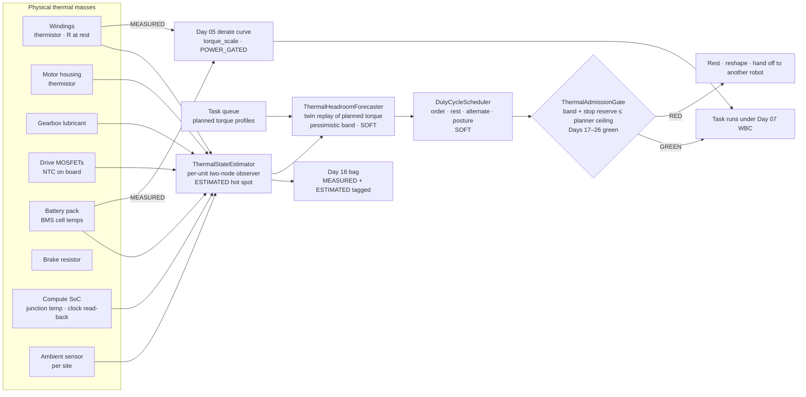
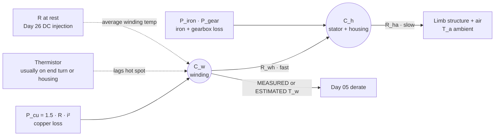
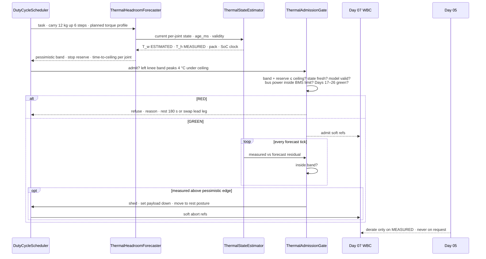
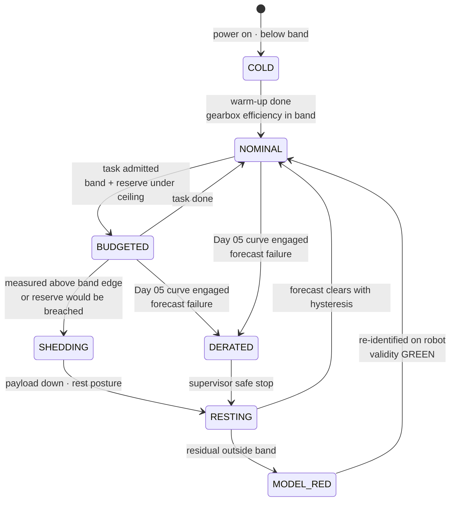
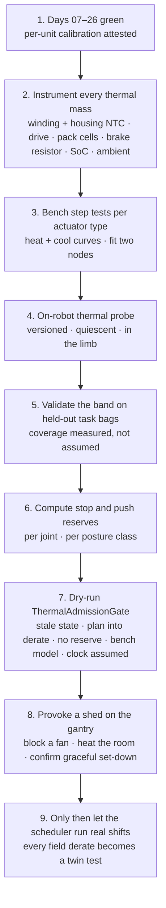

# Day 27 — Thermal budgets / duty-cycle scheduling as measured constraints under supervisor + logging + canary + HIL + fleet + fleet-canary + incident + forensics/reopen + change-management + maintenance gates

![ThermalStateEstimator / ThermalHeadroomForecaster / DutyCycleScheduler / ThermalAdmissionGate: per-joint winding and housing temperatures, gearbox lubricant, battery pack, drive and compute temperatures are MEASURED (thermistors, winding resistance, BMS cells, SoC sensors, clock read-back) and fused by a per-unit two-node thermal observer; the twin forecasts a pessimistic temperature band over the task horizon (soft); the scheduler orders tasks, inserts rests, swaps limbs and picks cheaper postures (soft); ThermalAdmissionGate fails closed unless the pessimistic forecast plus a safe-stop reserve stays below the planner ceiling, which sits under Day 05's derate start; Day 05 alone owns derate, torque_scale and POWER_GATED; soft channels dashed, measured / Day 05 solid](/images/day27-thermal-budgets-duty-cycle.png)

[Day 26](/lessons/day-26-actuator-wear-predictive-maintenance) owned `ActuatorHealthProbe` / `DriftEstimator` / `MaintenanceScheduler` / `RecalibrationGate`: wear is measured by a fixed probe per joint, in a known **temperature band**, and fixed only by a signed per-unit calibration event. [Day 25](/lessons/day-25-fleet-change-management) owned typed `ChangeSet`s and attestation. [Days 17–24](/lessons/day-17-runtime-safety-supervisor) owned the kill-chain, logging, eval, canary, the HIL farm, the fleet, incidents, and forensics. [Day 05](/lessons/day-05-power-bms) owns `torque_scale`, `POWER_GATED`, thermal derate, and the hard kill latch **per robot**, forever.

Day 26 kept saying "in a known temperature band" and Day 05 kept saying "thermal derate." Today is about the thing in between: heat is the budget every joint is spending all the time, and it runs out on a schedule you can predict. A humanoid almost never fails a task because a motor can't make the torque. It fails because the motor *could* make it thirty seconds ago and now Day 05 has scaled it down, halfway through carrying a box up a step.

Today owns **`ThermalStateEstimator` / `ThermalHeadroomForecaster` / `DutyCycleScheduler` / `ThermalAdmissionGate`**. The question is: **how much torque does each joint really have over the next ten minutes, how do you plan work against that without the planner ever touching Day 05's derate, and how does the twin see a derate coming before the robot walks into one?**

## Why heat is a budget, not a limit

A torque limit is a number. A thermal limit is an integral. The same knee can deliver a large torque for two seconds, a moderate torque for two minutes, and only its continuous rating forever, and which of those it can do *right now* depends on everything it did in the last ten minutes.

Three properties make heat dangerous in a humanoid specifically:

- **Gravity never turns off.** An arm resting on a table costs nothing. A humanoid standing still with bent knees is pushing continuous current through its knee and hip motors just to not fall. Standing is work.
- **The stack hides it, again.** Exactly like Day 26's wear, the whole-body controller just asks for more current when a joint gets weaker, and the robot looks fine until Day 05 steps in.
- **The thing that saves you also needs heat.** Push recovery (Day 09), an emergency step, or a controlled sit-down is the highest-torque motion the robot ever makes. If the budget is spent when the push arrives, the safe reaction isn't available.

So the first rule of today: **plan against a forecast of heat, keep a reserve for stopping, and treat Day 05's derate as a floor you never plan to touch, not a ceiling you plan up to.**

| Layer | Owns | Must not own |
|-------|------|--------------|
| Sensors + drives + BMS + SoC | MEASURED temperatures: winding thermistor, housing, winding resistance at rest, gearbox, drive MOSFETs, pack cells, brake resistor, SoC junction, ambient; read-back clock frequency | Deciding what work happens |
| `ThermalStateEstimator` (per unit, per joint) | ESTIMATED hot-spot temperature from a per-unit two-node model fused with MEASURED sensors; model-validity residual | Labeling its estimate MEASURED; acting on derate |
| `ThermalHeadroomForecaster` (twin) | SOFT pessimistic / median temperature bands over the task horizon; time-to-planner-ceiling; safe-stop reserve per joint | Writing `torque_scale`; being trusted without a validity check |
| `DutyCycleScheduler` | SOFT task order, rest insertion, limb alternation, posture preference, payload splitting, graceful shedding | Running a task the gate refused; loosening any Day 05 threshold |
| `ThermalAdmissionGate` | Fail-closed admission and mid-task shed trigger: forecast + reserve under planner ceiling; Days 17–26 green | Clearing supervisor stage; a "it'll be fine, just this once" flag |
| Day 05 BMS / FOC / drive firmware | Measured-temperature derate curves, current limits vs pack temperature and SOC, chopper and drive self-protection, `POWER_GATED` | Taking derate requests from the soft layer |

**Core thesis:** every thermal mass in the robot (windings, housings, gearboxes, drive electronics, battery pack, brake resistor, compute) is a measured state with a per-unit model. The twin forecasts each one over the planned task with a pessimistic band. The scheduler is only allowed to plan inside a **planner ceiling** that sits below Day 05's derate start by a margin plus the heat a safe stop would cost from that state. Forecasts are soft and can only refuse or reshape work. Day 05's derate stays exactly where Day 05 put it, and if the robot ever reaches it, that's a forecast failure to investigate, not a normal operating point.



## Where the heat goes: the thermal network of one joint

Copper loss in a PMSM, in the amplitude-invariant dq frame Day 02 used, is

$$
P_{cu} = \tfrac{3}{2}\,R(T_w)\left(i_d^{2} + i_q^{2}\right),
\qquad
R(T_w) = R_0\left(1 + \alpha\,(T_w - T_0)\right),\quad \alpha \approx 0.00393\ \mathrm{K}^{-1}
$$

That heat lands in the windings first, then crosses into the stator and housing, then into the limb structure and air. The simplest model that behaves correctly is two nodes:

$$
C_w\,\dot T_w = P_{cu} - \frac{T_w - T_h}{R_{wh}},
\qquad
C_h\,\dot T_h = \frac{T_w - T_h}{R_{wh}} + P_{iron} + P_{gear} - \frac{T_h - T_a}{R_{ha}}
$$

The two nodes have very different time constants. The winding node ($R_{wh} C_w$) responds in seconds to tens of seconds. The housing node ($R_{ha} C_h$) responds over many minutes. That split is the whole story of peak vs continuous torque: a short burst heats the copper before the housing has noticed, and a long task fills the housing so that every later burst starts from a higher floor.



Things the model makes obvious:

- **The thermistor isn't the hot spot.** A sensor on the end turn or the housing lags the hottest copper by seconds to tens of seconds. That's why `ThermalStateEstimator` exists: it runs the two-node model forward from measured current, corrects it with the thermistor, and re-anchors it with the Day 26 winding-resistance measurement whenever the joint is at rest. Its output is labeled **ESTIMATED**, never MEASURED.
- **Resistance rises with temperature, so heat makes more heat.** At constant current, $P_{cu}$ grows as the winding warms. With a single lumped resistance $R_{th}$ to ambient, a steady state exists only if $\tfrac{3}{2}\,R_0\,\alpha\, i^2 R_{th} \lt 1$. Real motors stay well inside that, but the effect means a joint that sits near its limit heats faster than a linear model predicts.
- **Hot magnets weaken.** Day 26 noted NdFeB loses roughly 0.1% of its flux per °C while hot. Lower flux means lower $K_t$, which means more current for the same torque, which means more heat. Forecasts must use $K_t$ at the predicted magnet temperature, not at the cold nameplate.
- **Wear is heat.** Day 26's rising friction is torque the motor spends without doing work. A worn knee runs hotter on the same task. Thermal model parameters are per unit and get re-identified after any Day 26 recalibration or part swap.
- **Mounting changes everything.** $R_{ha}$ on a bench fixture is not $R_{ha}$ inside a carbon-fiber thigh with a cover on. You identify it in the limb, on the robot.

## Headroom: how much torque over the next H seconds

Here's the planning question in closed form. Take a single lumped node (conservative only if you use the *winding* time constant, more on that below) with thermal resistance $R_{th}$, time constant $\tau = R_{th} C$, ambient $T_a$, current temperature $T_0$, and a ceiling $T_{ceil}$. Holding constant loss $P$ for $H$ seconds gives

$$
T(H) = T_a + P R_{th} + \left(T_0 - T_a - P R_{th}\right) e^{-H/\tau}
$$

Solve for the largest loss that keeps $T(H) \le T_{ceil}$:

$$
P_{max}(H) = \frac{T_{ceil} - T_a - (T_0 - T_a)\, e^{-H/\tau}}{R_{th}\left(1 - e^{-H/\tau}\right)},
\qquad
i_{max}(H) = \sqrt{\frac{P_{max}(H)}{\tfrac{3}{2}\,R(T_{ceil})}}
$$

and the available joint torque is $\tau_{avail} = N\,\eta\,K_t(T_{magnet})\,i_{max}$, still capped by the drive's peak current and the motor's saturation. As $H \to \infty$ this becomes the continuous rating $(T_{ceil} - T_a)/R_{th}$. As $H \to 0$ it's limited only by the peak current.

**A worked example with made-up but plausible numbers** (not a specific motor): $T_a = 30$ °C, planner ceiling $T_{ceil} = 100$ °C, $R_{th} = 1.0$ K/W, $\tau = 240$ s, phase resistance 0.10 Ω at 25 °C (so about 0.13 Ω at 100 °C).

| Starting state | Horizon | $P_{max}$ | $i_{max}$ | Torque vs cold 60 s |
|----------------|---------|-----------|-----------|---------------------|
| Cold, $T_0 = 30$ °C | 60 s | ≈ 316 W | ≈ 40 A | 100% |
| Warm, $T_0 = 70$ °C | 60 s | ≈ 176 W | ≈ 30 A | ≈ 75% |
| Any | continuous | 70 W | ≈ 19 A | ≈ 47% |

Same joint, same minute of work, a quarter less torque because of what it did earlier. That number is what the scheduler needs, per joint, before it starts a task.

Two cautions about this formula:

1. **Use the right time constant for the horizon.** If you lump winding and housing into one node with the slow housing $\tau$, short-horizon headroom comes out far too optimistic, because the real copper heats much faster. The forecaster runs the two-node model; the closed form is for intuition and quick sanity checks.
2. **RMS torque only works when the cycle is short.** The classic duty-cycle rule, $\tau_{rms} = \sqrt{\tfrac{1}{T}\int_0^T \tau^2\,dt} \le \tau_{cont}$, is valid only when the cycle period is much shorter than the *winding* time constant. A gait cycle of about a second qualifies. A "lift for 40 s, rest for 40 s" pattern doesn't: the peak inside each lift matters, and RMS will hide it.

## The other thermal masses

Joints get the attention, but four other budgets end tasks just as often.

| Mass | Heat source | Time constant (typical order) | Measured by | Owner when it trips |
|------|-------------|-------------------------------|-------------|---------------------|
| Gearbox lubricant | $(1 - \eta)\,P_{mech}$; efficiency drops when cold, so cold starts cost more motor current | Many minutes | Thermistor on housing; friction probe band (Day 26) | Day 05 rule on MEASURED gearbox temp |
| Drive MOSFETs | Conduction $i^2 R_{ds(on)}$ plus switching loss, rising with PWM frequency and bus voltage | Milliseconds to seconds | NTC on the drive board | Drive firmware self-protection (hard, local) |
| Battery pack | $I^2 R_{int}$ plus a smaller reversible term; cells near the pack center run hottest | Tens of minutes | BMS cell thermistors | Day 05 BMS current-limit tables vs temperature and SOC |
| Brake resistor | Regenerated energy the pack can't accept (full SOC, cold pack) during descents and sit-downs | Seconds to minutes | Resistor thermistor; chopper duty | Day 05 chopper protection |
| Compute SoC | Inference and perception load; fan or heat-pipe health; ambient | Seconds to minutes | Junction temps; **read-back** clock frequency | Day 15 policy deadline / Day 17 supervisor fallback |

Two of those deserve a sentence each:

- **The brake resistor is the surprise.** A robot that charged to 100% and then walks down stairs regenerates energy the BMS won't accept. It goes into the brake resistor. A long descent at full charge can trip chopper protection, and the robot loses the ability to brake its joints regeneratively at exactly the wrong moment. The forecaster models regen energy against pack acceptance, not just joint heat.
- **Compute heat is a timing constraint.** When the SoC throttles, the clock drops and a compute-bound policy's inference latency rises roughly in proportion: a 30% clock cut is about a 1.4× slower step. Day 15 measured the policy's latency budget; Day 17's supervisor falls back when it's missed. The forecaster treats the **read-back** clock as MEASURED and forecasts deadline misses before they happen. Never assume the clock you configured is the clock you got.

All of these share one bus. The sum of joint electrical power, compute, and losses has to fit inside the BMS's current limit, which Day 05 lowers when the pack is hot or the SOC is low. A plan that fits every joint's thermal budget can still fail the pack's.

## The planner ceiling and the safe-stop reserve

Day 05 defines a derate curve per joint: full torque below $T_{derate}$, linearly reduced `torque_scale` to zero at $T_{max}$. That curve is HARD_SAFETY, changed only through Day 25's hard path. The soft layer never moves it and never asks Day 05 to apply it.

The scheduler plans against a lower number. Let $\hat T^{+}_w(t)$ be the forecaster's **pessimistic** band edge for the hot spot at time $t$ in the task, and let $\Delta T_{stop}(t)$ be the temperature rise the twin predicts for a controlled stop (sit, kneel, or stance-and-hold, whatever the supervisor's safe-stop is from that posture) starting at $t$. The admission rule is

$$
\max_{t \,\in\, [0,\,H]} \Big( \hat T^{+}_w(t) + \Delta T_{stop}(t) \Big) \;\le\; T_{ceil} = T_{derate} - m
$$

for every joint, with a margin $m$ that covers estimator error on that unit. In words: **at every moment of the task, the robot must still be able to stop safely without entering derate.** Push recovery and the emergency step from Day 09 get the same treatment as a separate reserve on the joints they load (hips, knees, ankles).

The scheduler then has a short list of honest moves when a task doesn't fit:

- **Rest.** Insert a cool-down in a low-torque posture. The forecaster says how long, from the housing time constant.
- **Pick a cheaper posture.** Holding torque at the knee scales roughly with body weight times the horizontal offset between knee and center of mass. A straighter stance or a supported lean (Day 13 affordances) can cut it a lot. Posture is a soft reference into Day 07's WBC; the QP still owns feasibility.
- **Alternate limbs.** Switch the carrying arm, lead with the cooler leg on stairs.
- **Split the payload,** or slow the motion. Time spent accelerating is where peak current goes.
- **Hand the task to another robot.** The fleet layer (Day 21) can see which unit has headroom.
- **Refuse.** Better at admission than mid-carry.

What the scheduler may not do: raise `torque_scale`, shift $T_{derate}$, disable the stop reserve, or retry a refused task with a more optimistic band.

## Admission and graceful shedding mid-task



The mid-task check matters as much as admission. If measured temperatures climb above the pessimistic band edge, the model is wrong right now, maybe a fan is clogged, the room is hotter than the ambient sensor says, or Day 26 wear has added friction. The gate triggers a **graceful shed**: set the payload down, move to a rest posture, and let the supervisor know. That shed itself was budgeted, because the stop reserve was in the admission check. A thermal residual outside the band is also a Day 18 bag event and flips the unit's model validity to RED until it's re-identified.

## Thermal states of a joint



Two details:

- **COLD is its own state.** Day 26 said friction depends on grease temperature. A cold harmonic drive is less efficient, so the motor draws more current for the same output. Plenty of headroom, worse efficiency, and probes taken now are out of band. Some robots run a short warm-up routine before admitting hard tasks.
- **Hysteresis on the way back.** Re-admission waits until the forecast clears by a margin, or the robot oscillates between working and resting every few seconds.

## Identifying the per-unit thermal model

You can't forecast what you haven't identified, and catalog values won't do.

1. **Bench step test per actuator type.** Locked rotor or a dynamometer, several constant current levels, log thermistor and resistance-derived winding temperature during heating and cooling. Fit $C_w$, $R_{wh}$, $C_h$, $R_{ha}$ by least squares. The cooling curve after power-off isolates the housing time constant cleanly.
2. **Re-identify in the limb, on the robot.** Run a fixed thermal probe (versioned, like Day 26's probe) in a quiescent window: a known current profile on a lifted limb, then a cool-down. $R_{ha}$ and sometimes $C_h$ change a lot once the motor is mounted inside a cover.
3. **Per unit, re-done after a Day 26 recal or part swap.** A new actuator is a new thermal model. The thermal parameters go in the `CalibrationEvent` and the attestation hash.
4. **Validate before trusting.** Replay real task bags through the twin with the identified model and compare predicted against measured temperature. The pessimistic band must contain the measured trace at the coverage you claim (say, 95% of samples) on held-out tasks. That's what `model_validity: GREEN` means.

The ambient sensor is part of the model. A site that runs 8 °C hotter in summer (Day 25's per-site config) shrinks every joint's continuous rating by the same 8 °C of headroom.

## Ownership conflicts

| Conflict | Winner | Behavior |
|----------|--------|----------|
| Forecast says fine, measured temperature above pessimistic edge | Measured | Graceful shed; model validity RED |
| Thermistor reads lower than estimated hot spot | Estimated hot spot for planning; MEASURED for Day 05 | Plan on the hotter number; Day 05 acts on its own measured inputs per its rule |
| Scheduler wants a task the gate refused | `ThermalAdmissionGate` | Refused; scheduler may reshape or rest, not retry with a looser band |
| Planner wants to "use up" headroom to the derate line | Day 05 + gate | Ceiling sits below derate by margin plus stop reserve |
| Task needs the stop reserve to fit | Stop reserve | Task refused or split; the reserve is never spent on work |
| Soft layer asks Day 05 to derate early "to be safe" | Day 05 | Not accepted; the soft layer sheds work instead |
| Forecast labeled MEASURED in a bag | Day 18 hygiene | Quarantine; forecasts are SOFT |
| Configured clock vs read-back clock | Read-back clock | Latency forecast uses what the SoC actually runs at |
| Joints fit, pack doesn't | BMS limit (Day 05) | Task refused or slowed; per-joint fit isn't enough |
| Thermal model from bench, robot is the field unit | On-robot identification | Bench model only seeds the fit |
| Part swapped, old thermal model kept | Day 26 `RecalibrationGate` | RED until the new unit's thermal model is identified and attested |
| Thermal threshold change pushed as SOFT_POLICY | Day 25 | Derate thresholds are HARD_SAFETY; mixed-class change refused |
| Shed during an open incident | Day 23 | Incident coordinator decides; shed still allowed as a safe action |

## Shared API

Same wire discipline as Days 02/04: everything carries `BusHeader`. The estimator runs on the host at a modest rate; nothing here enters the cyclic current loop. Drive firmware and BMS self-protection stay local and hard.

```text
BusHeader:
  t_mono
  seq
  clock_domain         # CYCLIC for drive temps/currents; HOST for estimator/forecast
  age_ms
  producer_id

ThermalMeasurement ⊇ BusHeader:          # MEASURED
  robot_id
  source               # WINDING_NTC | HOUSING_NTC | WINDING_R_AT_REST | GEARBOX_NTC
                       # | DRIVE_NTC | PACK_CELL | BRAKE_RES | SOC_JUNCTION | AMBIENT
  location             # joint or pack/cell id
  temp_c
  soc_clock_mhz_readback   # SOC_JUNCTION only
  bag_ref

ThermalState ⊇ BusHeader:                # ESTIMATED, per unit, per joint
  robot_id
  joint
  thermal_model_ref    # per-unit params; in CalibrationEvent + attestation
  t_winding_hot_c      # ESTIMATED
  t_housing_c          # MEASURED-anchored
  t_gearbox_c
  kt_at_magnet_temp
  residual_c           # measured minus predicted, last window
  model_validity       # GREEN | YELLOW | RED
  label: ESTIMATED

ThermalForecast ⊇ BusHeader:             # SOFT
  task_id
  horizon_s
  per_joint[]:
    band_c[]           # [median, pessimistic] over horizon
    stop_reserve_c[]   # ΔT_stop(t) from twin
    time_to_ceiling_s
  pack_band_c[]
  bus_power_peak_w
  regen_into_brake_j
  soc_latency_forecast_ms
  label: SOFT
  forbid:
    label_measured: true
    write_torque_scale: true

DutyCyclePlan ⊇ BusHeader:               # SOFT
  task_order[]
  rests[]              # duration · posture
  limb_assignment
  posture_refs         # soft refs into Day 07 WBC
  handoff_robot_id     # optional, via Day 21
  forbid:
    raise_torque_scale: true
    move_derate_thresholds: true
    spend_stop_reserve: true

ThermalAdmissionGate ⊇ BusHeader:
  fail_closed: true
  soft_admit_blocker_only: true
  status               # RED | YELLOW | GREEN
  require:
    state_fresh: true                          # age_ms under bound
    model_validity_green: true
    ambient_measured: true
    band_plus_reserve_under_ceiling: true      # every joint, every t
    pack_and_bus_inside_bms_limits: true       # Day 05
    brake_resistor_inside_budget: true
    soc_latency_inside_deadline: true          # Day 15
    supervisor_armed: true                     # Day 17
    hygiene_honest: true                       # Day 18
    offline_shadow_canary_green: true          # Day 19
    regression_gate_green_for_unit: true       # Day 20
    fleet_admit_gate_green: true               # Day 21
    fleet_canary_gate_green: true              # Day 22
    no_open_incident_on_unit: true             # Day 23
    canary_reopen_gate_green: true             # Day 24
    cross_site_config_gate_green: true         # Day 25
    recalibration_gate_green: true             # Day 26
    estop_pairing: true
    day05_binding: true
  refuse_on[]:
    stale_thermal_state
    model_validity_red
    forecast_labeled_measured
    plan_into_derate
    stop_reserve_missing
    pack_limit_exceeded
    configured_clock_assumed
    bench_model_on_field_unit
    thermal_threshold_as_soft_policy
  shed_on[]:
    measured_above_pessimistic_edge
    reserve_would_be_breached
    soc_deadline_miss_forecast
  forbid:
    joint_command: true
    dual_write_torque_scale: true
    clear_supervisor_stage: true
    force_flag: true

# Day 26 CalibrationEvent — extended
CalibrationEvent ⊇ BusHeader:
  # … Day 26 fields …
  thermal_model_ref
  thermal_probe_version

# Day 05 — unchanged owner
PowerState / BmsCommand ⊇ BusHeader:
  torque_scale
  POWER_GATED
  derate_curve[joint]:     # HARD_SAFETY, Day 25 hard path only
    t_derate_c
    t_max_c
  pack_current_limit(temp, soc)
  chopper_protection
  accepts_requests_from_soft_layer: false
```

## Physical ↔ digital pairing

| Physical | Digital twin / backing |
|----------|------------------------|
| Per-joint winding and housing thermal masses, mounted in the limb | Two-node model per unit, identified on the robot, carried in calibration and attestation |
| Thermistor lag behind the copper hot spot | Observer runs from measured current; re-anchored by winding R at rest |
| $K_t$ falling as magnets heat | Forecast uses $K_t$ at predicted magnet temperature |
| Friction from Day 26 wear | Same friction fingerprint feeds the loss model; worn joints forecast hotter |
| Standing in a crouch | Twin computes holding torque per posture; scheduler compares postures |
| Stairs down at full charge | Twin integrates regen energy vs pack acceptance; forecasts brake resistor heat |
| SoC throttling in a hot room | Twin forecasts clock and inference latency from read-back history and ambient |
| Pack heating over a shift | Pack model forecasts BMS current-limit changes before they bind |
| Safe-stop and push-recovery maneuvers | Twin pre-computes their per-joint temperature cost from every posture class |
| A real derate happening | Bag event; replayed through the twin; if the twin didn't predict it, the model is RED |

If the twin can't predict a derate that the robot actually hit, it can't schedule around the next one either. Every Day 05 derate in the field is a test case for the forecaster.

## Bring-up sequence (before trusting thermal scheduling)



1. **Days 07–26 green.** Thermal parameters ride in Day 26's calibration events; without that path there's nowhere honest to put them.
2. **Instrument every thermal mass.** A winding thermistor per joint is the minimum. Add housing and gearbox sensors on the high-load joints, and make sure the SoC reports its actual clock.
3. **Bench step tests** per actuator type to seed the model.
4. **On-robot thermal probe** to re-fit the mounted values, per unit.
5. **Validate the band** against real task bags it didn't train on. Write down the coverage you measured.
6. **Compute reserves** for the safe stop and for push recovery from each posture class.
7. **Dry-run the gate.** Stale state, a plan that touches derate, a missing reserve, a bench model on a field unit, an assumed clock, a pack limit exceeded. Every one must go RED.
8. **Provoke a shed on the gantry.** Block a cooling path or heat the room until measured temperatures leave the band, and confirm the robot sets the payload down and rests without Day 05 ever engaging.
9. **Then** let the scheduler plan real shifts, and treat every field derate as a failed forecast to replay.

## Failure gallery

| Symptom | Likely cause |
|---------|--------------|
| Robot drops a box on the fourth trip up the stairs, never on the first | Housing heat accumulated across trips; scheduler planned from cold headroom |
| Short lifts look fine in the forecast but the knee derates | One-node model with housing time constant; copper hot spot heats much faster |
| Push recovery fails late in a shift | No stop or push reserve; budget spent on work |
| Derates on summer afternoons at one site only | Ambient not measured, or fleet-wide default ambient |
| Forecast wrong on one robot after a repair | Old thermal model kept after part swap; not re-identified |
| Brake resistor trips walking downstairs after charging | Regen at full SOC not modeled; pack couldn't accept energy |
| Policy fallback events cluster in a warm room | SoC throttled; latency forecast used configured clock |
| Robot oscillates between work and rest every few seconds | No hysteresis on re-admission |
| Every joint fits but robot browns out on a combined move | Per-joint budgets checked, bus and pack limit not |
| Worn joint derates first, every time | Day 26 friction not fed into the loss model |
| A dashboard shows "time to derate" as fact and someone extends a task on it | Forecast labeled MEASURED; scheduler used the median, not the pessimistic edge |

## What to freeze this week

Extend [frames](/frames) and your thermal config with:

- A two-node thermal model per joint per unit, identified on the robot with a versioned thermal probe, carried in Day 26's `CalibrationEvent` and Day 25's attestation.
- `ThermalStateEstimator` output labeled ESTIMATED, re-anchored by measured winding resistance at rest, with a measured-vs-predicted residual and a validity state.
- Models for gearbox, drive, pack, brake resistor, and SoC, each with its measured source and owner when it trips.
- A planner ceiling per joint below Day 05's derate start, and a safe-stop plus push-recovery reserve per posture class that the scheduler can never spend.
- `ThermalAdmissionGate` fail-closed on its refuse list, with graceful shedding when measured temperature leaves the pessimistic band.
- Day 05's derate curves as HARD_SAFETY, changed only through Day 25's hard path, never accepting requests from the soft layer.
- Every field derate captured in a Day 18 bag and replayed through the twin as a forecaster regression test.

The lesson isn't "don't let motors overheat." Drive firmware and Day 05 already make sure they don't. It's that **heat is the slowest-moving state in the robot and the one that decides whether the next task, and the next push, is still possible.** You see it with measured sensors and a per-unit model, you plan against its pessimistic forecast with a stop reserve held back, and you leave the derate line exactly where Day 05 drew it.

## Next

**Day 28+** — Energy budgets and battery mission planning: state of charge and state of health as measured constraints, return-to-dock reserves, charge scheduling across the fleet, cold-pack and fast-charge limits, and battery swap as a measured per-unit event under the same gates.
