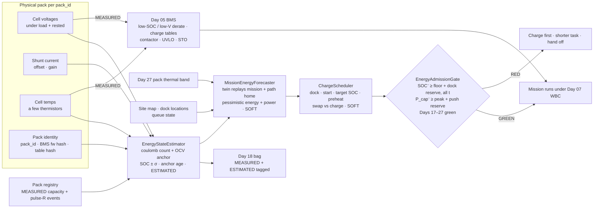
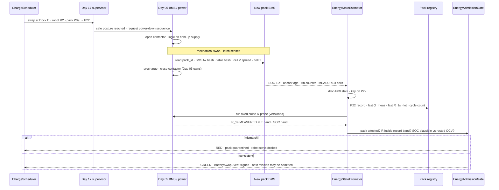
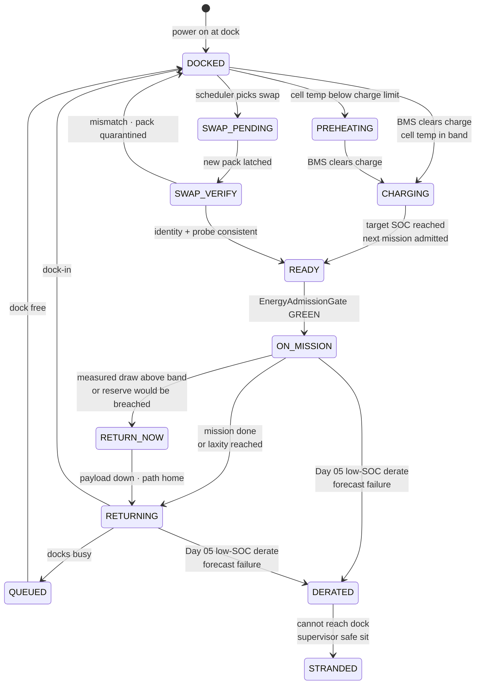
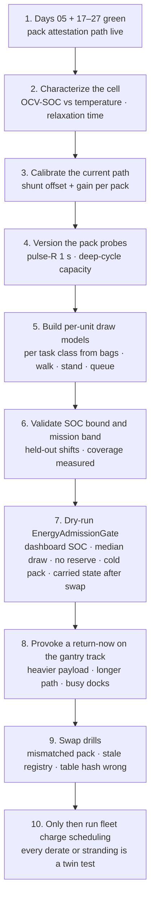

# Day 28 — Energy budgets / battery mission planning as measured constraints under supervisor + logging + canary + HIL + fleet + fleet-canary + incident + forensics/reopen + change-management + maintenance + thermal gates

![EnergyStateEstimator / MissionEnergyForecaster / ChargeScheduler / EnergyAdmissionGate: cell voltages, shunt current, cell temperatures, rested OCV, pulse resistance and measured capacity between rested anchors are MEASURED; SOC and SOH are ESTIMATED from them with an explicit uncertainty that grows since the last anchor; the twin forecasts a pessimistic energy and power band over the mission plus a return-to-dock reserve that depends on where the robot will be (soft); the charge scheduler picks dock, start time, target SOC and preheat under a site power cap (soft); EnergyAdmissionGate fails closed unless the pessimistic SOC stays above the planner floor plus the dock reserve at every point and the pessimistic power capability still funds push recovery; Day 05 alone owns low-SOC derate, charge-current tables, contactor, UVLO and STO; a battery swap is a measured per-unit event keyed by pack_id](/images/day28-energy-budgets-mission-planning.png)

[Day 27](/lessons/day-27-thermal-budgets-duty-cycle) owned `ThermalStateEstimator` / `ThermalHeadroomForecaster` / `DutyCycleScheduler` / `ThermalAdmissionGate`: heat is a budget, forecast pessimistically, with a safe-stop reserve, under a planner ceiling that sits below Day 05's derate. [Day 26](/lessons/day-26-actuator-wear-predictive-maintenance) owned per-unit probes and signed `CalibrationEvent`s. [Day 25](/lessons/day-25-fleet-change-management) owned typed `ChangeSet`s and attestation. [Days 17–24](/lessons/day-17-runtime-safety-supervisor) owned the kill-chain, logging, eval, canary, the HIL farm, the fleet, incidents, and forensics. [Day 05](/lessons/day-05-power-bms) owns the pack, the BMS, `torque_scale`, low-SOC and low-voltage derate, charge-current limits, the contactor, UVLO, and STO **per robot**, forever.

Day 05 had a line in its failure gallery: *"SOC UI fine, robot dies under load."* Day 27 had another: *"Brake resistor trips walking downstairs after charging."* Both are the same lesson from different ends. The battery isn't a fuel gauge. It's two budgets at once, **energy** (how long) and **power** (how hard), both shrinking with temperature and age, and the number everyone looks at, SOC, isn't measured at all.

Today owns **`EnergyStateEstimator` / `MissionEnergyForecaster` / `ChargeScheduler` / `EnergyAdmissionGate`**, plus a `BatterySwapEvent`. The question is: **how much work can this robot still do, from where it stands, and still get home, still survive a push, and still be charged in time for the next job, and how do you schedule a whole fleet's charging around the answer without the planner ever touching Day 05?**

## SOC is an estimate. Plan like it.

Nothing on the pack measures state of charge. A BMS measures four kinds of things directly:

- **Cell voltages**, each cell or parallel group, under load and at rest.
- **Pack current**, through a shunt or Hall sensor, with an offset and a gain error.
- **Cell and busbar temperatures**, at a handful of thermistors, not every cell.
- **Time**, so it can integrate current.

Everything else is inferred. SOC comes from coulomb counting anchored by open-circuit voltage at rest. SOH comes from capacity measured between two rested anchors and resistance measured by a current pulse. "Remaining runtime" is a forecast built on top of both.

So the honest labels are:

| Quantity | Label | Where it comes from | How it goes wrong |
|----------|-------|---------------------|-------------------|
| Cell voltage, pack current, cell temperature | MEASURED | ADC on the BMS, stamped with `BusHeader` | Sensor offset; a thermistor that isn't on the hottest cell |
| Rested OCV | MEASURED (with a rest-duration tag) | Voltage after the pack has relaxed | Read too early, it's still polarized |
| Pulse resistance $R_{1s}$ | MEASURED (with SOC and temperature band) | $\Delta V / \Delta I$ over a fixed current step | Compared across different temperatures |
| Capacity $Q_{meas}$ | MEASURED event (rare) | Ah between two rested OCV anchors far apart | Anchors too close together, or one not rested |
| SOC | ESTIMATED, with $\sigma$ and anchor age | Coulomb count + OCV correction (often an EKF) | Drift since the last anchor; stale capacity |
| SOH (capacity and resistance) | ESTIMATED from the last MEASURED events | Trend over capacity and pulse-R events | Never re-measured; fleet default |
| Mission energy, dock reserve, charge time | SOFT | Twin forecast | Median used instead of pessimistic edge |

The first rule of today: **SOC is planned on as a pessimistic lower bound with a known age, never as the number on the dashboard.** The constraints the gate enforces are written on things that can be checked against measurements: rested-OCV anchors, measured capacity, measured pulse resistance, and the Day 05 voltage floor.

| Layer | Owns | Must not own |
|-------|------|--------------|
| Cells + BMS front end + charger handshake | MEASURED cell V, pack I, cell T, rested OCV, pulse R, contactor state, pack identity read-back | Deciding what work happens |
| Day 05 BMS / power firmware | Protection, low-SOC and low-voltage derate, charge-current limit tables vs temperature and SOC, contactor and precharge, UVLO, STO, `POWER_GATED` | Taking requests from the soft layer |
| `EnergyStateEstimator` (per pack, per robot) | ESTIMATED SOC with $\sigma$ and anchor age; ESTIMATED SOH from MEASURED capacity and resistance events; power capability; validity | Labeling SOC MEASURED; carrying state across a pack swap |
| `MissionEnergyForecaster` (twin) | SOFT pessimistic energy and power bands over the mission; return-to-dock reserve along the planned path; charge-time forecast | Writing `torque_scale` or charge current; being trusted without validated coverage |
| `ChargeScheduler` | SOFT dock assignment, start time, target SOC, preheat, swap vs charge, fleet staggering under the site power cap | Raising a charge-current limit; charging a pack the BMS hasn't cleared |
| `EnergyAdmissionGate` | Fail-closed admission and mid-mission return trigger; Days 17–27 green | Clearing supervisor stage; a "just finish this tote" flag |

**Core thesis:** every robot carries two shrinking budgets, energy and power, that are both functions of SOC, temperature, and SOH. The estimator turns measured voltages and currents into an SOC with an honest error bar and an SOH tied to the last measured capacity and resistance events. The twin forecasts the mission and the trip home with a pessimistic band. The scheduler may only plan work that keeps the pessimistic SOC above a **planner floor** (above Day 05's low-SOC derate) plus the **return-to-dock reserve** for where the robot will be, while the pessimistic **power capability** still covers push recovery. Charging is a scheduled, measured, per-pack event; so is a swap. Day 05 keeps every protection, derate, and charge-current table exactly where Day 05 put it.



## What the estimator can and can't know

### Coulomb counting drifts, and capacity errors are the big one

Between anchors, SOC is integrated current:

$$
\widehat{SOC}(t) = SOC_{anchor} - \frac{1}{Q}\int_{t_a}^{t} \eta\, I(\tau)\, d\tau
$$

with $Q$ the capacity the estimator *believes* the pack has right now. Two error terms grow from the anchor:

$$
\delta SOC(t) \;\approx\; \underbrace{\frac{I_{off}\,(t - t_a)}{Q}}_{\text{sensor offset}} \;+\; \underbrace{\frac{A_h(t)}{Q}\cdot\frac{\delta Q}{Q}}_{\text{stale capacity}}
$$

where $A_h(t)$ is the charge removed since the anchor. With illustrative numbers, a 27 Ah pack and a 0.15 A shunt offset over a 3 h shift: 0.45 Ah, about **1.7 SOC points**. Annoying, not fatal.

Now the stale-capacity term. The registry says SOH is 95% of a 30 Ah nameplate (28.5 Ah), but the pack has really faded to 27 Ah. After removing 20 Ah from full, the estimator reports $1 - 20/28.5 \approx 29.8\%$. The pack is actually at $1 - 20/27 \approx 25.9\%$. **Four points of SOC, all of it on the wrong side, exactly when the robot is deciding whether it can make it home.** That's why SOH has to be measured, per pack, on a schedule, and why the estimator's $\sigma$ includes how old the last capacity measurement is.

### OCV anchors need rest, and some chemistries barely have them

At rest the terminal voltage relaxes to OCV, which maps to SOC through a curve measured per cell type and temperature. Two catches:

- **Relaxation takes time.** A few minutes gets you most of the way on NMC; a fully trustworthy anchor can need tens of minutes. The anchor carries its rest duration, and the estimator weights it accordingly. A humanoid standing still isn't at rest: it's drawing holding current (Day 27 again: standing is work). Real anchors happen docked, seated, or powered down.
- **Flat curves are weak anchors.** LFP's OCV curve is nearly flat from roughly 30% to 90%. A 5 mV error there can be many SOC points. LFP packs anchor near the ends (full charge, deep discharge) and lean harder on coulomb counting in between. NMC has more slope and anchors better mid-range. The estimator's anchor weight is a function of the local slope $dOCV/dSOC$.

So the estimator publishes $SOC$, $\sigma_{SOC}$, and **anchor age**, and the planner uses

$$
SOC^{-} = \widehat{SOC} - k\,\sigma_{SOC}
$$

with $k$ chosen so the bound holds at the coverage you validated (say 95%) on held-out shift bags where the truth was recovered from a later rested anchor.

### SOH is two numbers, and the humanoid cares about the second one

- **Capacity SOH** $SOH_Q = Q_{meas}/Q_{nom}$. Measured between two rested anchors:

$$
Q_{meas} = \frac{\int_{t_1}^{t_2} \eta\, I\, dt}{SOC_{ocv}(t_1) - SOC_{ocv}(t_2)},
\qquad
\frac{\delta Q}{Q} \approx \frac{\sqrt{2}\;\delta SOC_{ocv}}{\Delta SOC}
$$

With a 2-point OCV error and anchors 50 points apart, that's about 5.7%. With anchors 80 points apart, about 3.5%. So a capacity measurement only counts when the swing is large, which in practice means a scheduled deep cycle on the dock, not a guess from a normal shift.

- **Resistance SOH** $SOH_R = R_{meas}/R_{nom}$, measured as $\Delta V/\Delta I$ over a fixed current step (say 1 s) in a known temperature and SOC band. This is Day 26's probe idea applied to the pack: fixed, versioned, policy-independent.

A wheeled robot cares mostly about capacity. A humanoid cares at least as much about resistance, because resistance decides whether the pack can deliver a push-recovery peak late in a shift on a cold morning.

## Two budgets: energy and power

With a simple Thevenin model, the terminal voltage under discharge current $I$ is

$$
V_t = OCV(SOC, T) - I\, R(SOC, T, SOH)
$$

Day 05 sets a soft voltage floor $V_{min}$ where derate begins. The most power the pack can deliver without crossing that floor is

$$
I_{max} = \frac{OCV - V_{min}}{R},
\qquad
P_{cap} = V_{min}\, \frac{OCV - V_{min}}{R}
$$

**Energy** above a SOC floor is

$$
E_{avail} = Q \int_{SOC_{floor}}^{SOC} OCV(s)\, ds \;-\; E_{loss,I^2R}
$$

The two budgets fail differently. Illustrative 14s Li-ion pack, $V_{min} = 44$ V, pulse resistance 75 mΩ warm (already aged, $SOH_R = 1.25$), about 2.5× that at 0 °C:

| State | OCV | $R$ | $I_{max}$ | $P_{cap}$ |
|-------|-----|-----|-----------|-----------|
| 25 °C, SOC 20% | 49.7 V | 75 mΩ | ≈ 76 A | ≈ 3.3 kW |
| 0 °C, SOC 20% | 49.7 V | 190 mΩ | ≈ 30 A | ≈ 1.3 kW |
| 0 °C, SOC 60% | 53.9 V | 190 mΩ | ≈ 52 A | ≈ 2.3 kW |

If push recovery or an emergency step needs a 2.5 kW bus peak on top of compute, the cold pack can't fund it **even at 60% SOC**, with plenty of energy left. Energy is fine; power isn't. That's Day 05's "SOC UI fine, robot dies under load," now as a number the gate can check.

So the gate checks both, and the power check holds back a reserve exactly like Day 27's thermal stop reserve:

$$
\max_{t\,\in\,[0,H]} \Big( \hat P^{+}_{bus}(t) + P_{push} \Big) \;\le\; P^{-}_{cap}\big(SOC^{-}(t),\, T^{-}_{pack}(t),\, SOH_R^{+}\big)
$$

using the pessimistic side of every input: lower SOC, the colder end of Day 27's pack temperature band, and the higher resistance estimate.

## Return-to-dock reserve: the budget depends on where you'll be

A wheeled robot's reserve is "enough to drive home." A humanoid's reserve has more parts, and they change along the mission:

$$
R^{+}_{dock}(x) = \underbrace{E^{+}_{path}(x \to dock)}_{\text{walk home, p95}} + \underbrace{P_{stand}\, t^{+}_{queue}}_{\text{wait for a free dock}} + \underbrace{E_{detour}}_{\text{blocked path}} + \underbrace{E_{stop}}_{\text{safe sit / dock-in}}
$$

The queue term is the one people forget. A humanoid waiting for a dock is standing, and standing costs a couple of hundred watts (holding torque plus compute). Ten minutes in a queue is a real fraction of the reserve. If the robot can't sit to wait, $P_{stand}$ is what it pays.

The admission rule, with $E^{-}_{avail}(t) = E^{-}_{avail}(0) - E^{+}_{mission}(0, t)$, is

$$
\min_{t\,\in\,[0,H]} \Big( E^{-}_{avail}(t) - R^{+}_{dock}\big(x(t)\big) \Big) \;\ge\; 0
$$

where $E^{-}_{avail}$ is measured from the **planner floor** $SOC_{floor}$, which sits above Day 05's low-SOC derate start by a margin. In words: **at every point in the mission, from wherever the robot is, it must still be able to walk home, wait its turn, and dock, without ever entering Day 05's low-SOC derate.** The farthest point of a mission, not the end, is usually where this binds.

**A worked example with illustrative numbers.** Pack 27 Ah measured, about 13.5 Wh per SOC point near the low end. Estimator says 45%, $k\sigma = 5$ points (anchor is 3 h old), so $SOC^{-} = 40\%$. Planner floor 20%, Day 05 derate starts at 15%. Dock 120 m away.

| Item | Pessimistic (gate) | Naive (dashboard) |
|------|--------------------|-------------------|
| Available energy | (40 − 20) × 13.5 ≈ 270 Wh | (45 − 15) × 13.5 ≈ 405 Wh |
| Walk home, 120 s at p95 560 W | ≈ 19 Wh | — |
| Queue, up to 10 min standing at 200 W | ≈ 33 Wh | — |
| Detour (50% of path) + dock-in | ≈ 11 Wh | — |
| **Dock reserve** | **≈ 63 Wh** | 0 |
| Task A, 20 min tote picking (p95 340 W vs median 280 W) | 113 + 63 = 176 Wh → **GREEN** | 93 Wh, fine |
| Task B, 40 min (p95 vs median) | 227 + 63 = 290 Wh → **RED** | 187 Wh, "fine" |

Task B looks comfortable on the dashboard with more than 200 Wh to spare. Under honest bounds it doesn't fit, and the difference is three things the dashboard ignores: estimator uncertainty, the p95 draw, and the trip home with a queue at the end.

Where the p95 comes from matters. It's per task class, **per unit**, from Day 18 bags of that robot doing that task, because a robot with Day 26 wear or a Day 27 hot room draws more than the fleet median for the same task.

## Cold packs and fast-charge limits

Charging is where the BMS is most protective and where soft schedulers most want to cheat. All of this is Day 05's, HARD_SAFETY, changed only through Day 25's hard path:

| Pack condition (illustrative) | BMS charge limit | Why |
|-------------------------------|------------------|-----|
| Cell temp below 0 °C | **0 A** (no charge) | Lithium plating on the graphite anode; permanent capacity loss and a safety risk |
| 0–10 °C | ≈ 0.2–0.3C | Plating risk still elevated |
| 10–45 °C, SOC below ≈ 80% | up to ≈ 1C (pack-dependent) | Constant-current phase |
| Any temp, SOC above ≈ 80% | Tapering (constant voltage) | Cell near max voltage; current falls as it fills |
| Above ≈ 45 °C | Reduced or 0 A | Accelerated aging, thermal risk |

From that, charge time is a forecast the scheduler can compute but never shorten:

$$
t_{charge}(SOC_a \to SOC_b) \;\approx\; \frac{Q\,(\min(SOC_b, 0.8) - SOC_a)}{I_{cc}(T)} \;+\; t_{taper}(SOC_b)
$$

With the 27 Ah pack going from 20% to 80%: about 36 min at 1C, about **2 h** at 0.3C on a 5 °C pack. The 80% to 100% taper adds roughly another 40 min for 20 points.

What follows for the soft layer:

- **Preheat is a scheduling decision, not a limit change.** A pack that arrives at the dock at 2 °C can't charge. The `ChargeScheduler` can request dock-side heating or (on packs that support it) self-heating before charging, and the forecaster accounts for the heating time and energy. The BMS still decides when current flows, on MEASURED cell temperatures.
- **Discharge warms the pack; charge from cold doesn't wait for it.** A robot coming off a cold loading dock after hard work may have a warm pack that charges fast, while one that sat idle won't. Day 27's pack thermal band feeds the charge-time forecast directly.
- **Target SOC is chosen per mission.** Topping up to 100% costs a long taper, leaves the pack sitting at high voltage (faster calendar aging, especially warm), and cuts regen acceptance, which is Day 27's brake-resistor problem on the first descent. Charge to 100% only when the first mission needs it, and start that mission with a reserve for the brake resistor.
- **Fast charge heats the pack.** A pack leaving a 1C charge is warmer. That's fine for the next mission's power capability and bad for its thermal headroom; Day 27's gate sees the same number.

What the soft layer may never do: request a higher charge current, charge below the BMS's temperature limit "because it's only for a few minutes," change the CV voltage, or label a forecast charge time as MEASURED.

## Fleet charge scheduling

One robot's energy plan is arithmetic. A fleet's is a scheduling problem with three hard constraints: a limited number of docks, a **site power cap** (the breaker feeding the charging area), and the coverage the operation needs on the floor.

The soft objective is to keep enough robots working while every robot stays inside its own admission rule. A good-enough heuristic is **least laxity first**. For each robot,

$$
\ell_i = \frac{E^{-}_{avail,i} - R^{+}_{dock,i}}{\hat P^{+}_{work,i}} \;-\; t^{+}_{queue,i}
$$

is how long it can keep working before it *must* head home, given the current queue. Dock the smallest-laxity robot first, subject to

$$
\sum_{i\,\in\,charging} P_{charge,i}(t) \;\le\; P_{site},
\qquad
\lvert charging(t) \rvert \le N_{docks}
$$

Two things fall out of that:

- **Fleet sizing depends on the charge-rate table.** If a robot works $t_w$ and then spends $t_c + t_{travel}$ charging and walking, availability is $a = t_w / (t_w + t_c + t_{travel})$, and keeping $k$ robots on the floor needs $N \ge k / a$. With 2.7 h of work from 80% to 20% at about 300 W, 36 min of 1C charge, and 10 min of travel and queue: $a \approx 0.78$, so **13 robots for 10 on the floor**. Same site in winter with a 0.3C cold-pack limit: $a \approx 0.55$, so **19 robots**. The charge table is a fleet-sizing input, not a footnote.
- **Synchronized depletion is a failure mode.** If every robot starts the shift at 80% and works the same tasks, they all hit their reserve within minutes of each other and the queue term explodes. The scheduler deliberately staggers: different starting SOCs, short opportunity charges during lulls, some robots charged to 90% for long jobs and some to 60% for short ones.

```mermaid
gantt
  title Dock plan for one shift slice (illustrative, 3 docks, site cap allows 3 at 1C)
  dateFormat HH:mm
  axisFormat %H:%M
  section Dock A
  R3 charge 22 to 80 pct           :a1, 10:00, 36m
  R6 opportunity top-up            :a2, after a1, 15m
  R1 charge 25 to 90 pct for long job :a3, after a2, 50m
  section Dock B
  R5 preheat cold pack             :b1, 10:05, 20m
  R5 charge at 0.3C then 1C        :b2, after b1, 55m
  section Dock C
  R2 swap and pack probe           :c1, 10:10, 5m
  R4 charge 30 to 70 pct           :c2, after c1, 30m
  Deep-cycle capacity test pack P17 :c3, after c2, 40m
```



Three details in that plan that the gate cares about:

- R5's preheat is scheduled time. A cold robot doesn't get to jump the queue because "it's only 2 °C."
- The capacity test on Dock C is how SOH stays measured. Scheduling it during a lull, rather than never, is the scheduler's job.
- A robot only leaves a dock when the gate admits its **next** mission with its new SOC, not when a timer runs out.

## Battery swap as a measured per-unit event

Many humanoids swap packs instead of (or as well as) charging in place. A swap makes the energy budget fast to restore. It also breaks every assumption the estimator had, because the robot just got a different battery.

The core idea: **energy state lives with the pack, not the robot.** The pack's own BMS carries its SOC, its coulomb count, its measured capacity and resistance history. The robot's `EnergyStateEstimator` is keyed by `pack_id`. On a swap it throws its state away and re-anchors from the new pack, then verifies what the new pack claims.



What makes it a measured event rather than a hopeful one:

- **Identity is read back, not assumed.** The robot reads `pack_id`, BMS firmware hash, and the pack-type protection table hash from the new pack, the same attestation idea as Day 25. A pack whose tables don't match the robot's approved pack types never closes its contactor.
- **A quick probe checks the pack's story.** A short versioned pulse-resistance probe compares $R_{1s}$ against the registry's band for that pack at that temperature. A rested-OCV check (the pack was sitting in a charger) compares against its reported SOC. Disagreement means the pack's BMS, the registry, or the pack itself is wrong; any of those is RED.
- **The event is signed and bagged.** `BatterySwapEvent` records both pack IDs, the probe results, and who did the swap (robot self-swap station, technician), so Day 24 forensics can tie any later brownout to the exact pack.
- **Packs are fleet assets with their own lifecycle.** A pack has a cycle count, Ah throughput, max-temperature exposure, SOH history, and a manufacturing lot. Packs can be quarantined independently of robots, and a lot-level issue (one lot's resistance rising faster) is a Day 26-style cohort alarm across every robot that has carried a pack from that lot.

Swap also changes fleet sizing: with a 5-minute swap plus the same 10 min of travel, and packs charging off-robot, availability in the example above rises to about 0.92, so 11 robots for 10 on the floor. The cost moves from robots to packs: you now need enough packs, charging slots, and site power to keep a pool charged, and the packs' charge tables (cold limits included) still apply on the shelf.

## Energy states of a robot



Like Day 27, reaching DERATED in the field is a forecast failure, not a normal state. STRANDED is an incident (Day 23) with a bag (Day 18) and a twin replay (Day 24): which input was wrong, the SOC bound, the p95 draw, the queue time, or the path?

## Ownership conflicts

| Conflict | Winner | Behavior |
|----------|--------|----------|
| Dashboard SOC says enough, pessimistic bound doesn't | Pessimistic bound | Task refused or shortened |
| Estimator SOC disagrees with a fresh rested OCV | Rested OCV (MEASURED) | Re-anchor; record the error for coverage |
| Registry SOH vs a newer measured capacity event | Newer MEASURED event | SOH updated; old forecasts invalidated |
| Energy fits, power capability doesn't (cold or aged pack) | Power check | Refused, or preheat / charge first |
| Mission fits only by spending the dock reserve | Dock reserve | Refused or split; reserve is never spent on work |
| Scheduler wants a faster charge on a cold pack | Day 05 charge table | Not accepted; scheduler preheats or waits |
| Soft layer asks Day 05 to "allow 5% more depth this once" | Day 05 | Not accepted; robot returns |
| Robot keeps old coulomb count after a swap | `pack_id` keying | State dropped; RED until re-anchored from the new pack |
| New pack's table hash doesn't match approved pack types | Day 05 + Day 25 | Contactor stays open; pack quarantined |
| Charge to 100% before a descent-heavy mission | Day 27 brake-resistor budget | Lower target SOC or a regen reserve in the plan |
| Fleet median draw used for a worn unit | Per-unit p95 from its own bags | Forecast re-run on the unit's history |
| Low-SOC threshold change pushed as SOFT_POLICY | Day 25 | Low-SOC derate and charge tables are HARD_SAFETY; mixed-class refused |
| Return-now during an open incident | Day 23 | Incident coordinator decides routing; returning to a safe state still allowed |

## Shared API

Same wire discipline as Days 02/04: everything carries `BusHeader`. The estimator runs on the host and on the pack's BMS; nothing here enters the cyclic current loop. Protection stays local and hard.

```text
BusHeader:
  t_mono
  seq
  clock_domain         # CYCLIC for BMS samples; HOST for estimator/forecast
  age_ms
  producer_id

PackMeasurement ⊇ BusHeader:             # MEASURED
  pack_id
  v_cell[]             # per series group
  i_pack               # shunt; offset_cal_ref
  t_cell[]             # thermistor locations
  contactor_state
  bag_ref

RestedOcvAnchor ⊇ BusHeader:             # MEASURED event
  pack_id
  ocv_v
  rest_s               # how long the pack relaxed
  t_cell_c
  ocv_curve_ref        # per chemistry + temperature

PackProbeEvent ⊇ BusHeader:              # MEASURED event (Day 26 style)
  pack_id
  kind                 # PULSE_R_1S | CAPACITY_DEEP_CYCLE
  probe_version
  r_1s_mohm            # PULSE_R_1S
  q_meas_ah            # CAPACITY_DEEP_CYCLE
  delta_soc_ocv        # capacity only counts if large
  soc_band
  t_band_c

EnergyState ⊇ BusHeader:                 # ESTIMATED, keyed by pack_id
  robot_id
  pack_id
  soc
  sigma_soc
  anchor_age_s
  soh_q                # from last CAPACITY event
  soh_r                # from last PULSE_R event
  p_cap_w              # at current SOC, T, SOH_R
  validity             # GREEN | YELLOW | RED
  label: ESTIMATED

MissionEnergyForecast ⊇ BusHeader:       # SOFT
  mission_id
  horizon_s
  e_mission_wh[]       # [median, p95] cumulative over horizon
  dock_reserve_wh[]    # R_dock(x(t)) along the planned path
  p_bus_peak_w[]
  p_cap_lower_w[]      # with Day 27 pack temp band, cold edge
  push_reserve_w
  t_queue_p95_s
  charge_time_forecast_s
  label: SOFT
  forbid:
    label_measured: true
    write_torque_scale: true
    write_charge_current: true

ChargePlan ⊇ BusHeader:                  # SOFT
  robot_id
  dock_id
  start_t
  preheat_s
  target_soc
  swap_instead: bool
  capacity_test: bool
  site_power_w
  forbid:
    raise_charge_current: true
    charge_below_bms_temp_limit: true
    change_cv_voltage: true

BatterySwapEvent ⊇ BusHeader:            # MEASURED, signed
  robot_id
  pack_out_id
  pack_in_id
  pack_in_bms_fw_hash
  pack_in_table_hash
  pulse_r_probe_ref
  ocv_cross_check_ref
  performed_by         # SELF_SWAP_STATION | TECHNICIAN
  signature

EnergyAdmissionGate ⊇ BusHeader:
  fail_closed: true
  soft_admit_blocker_only: true
  status               # RED | YELLOW | GREEN
  require:
    energy_state_fresh: true                   # age_ms under bound
    anchor_age_under_bound: true
    soh_measured_within_window: true
    pack_attested: true                        # pack_id + hashes read back
    soc_lower_above_floor_plus_reserve: true   # every t along the path
    p_cap_lower_covers_peak_plus_push: true
    charge_plan_inside_bms_tables: true        # Day 05
    thermal_admission_gate_green: true         # Day 27
    supervisor_armed: true                     # Day 17
    hygiene_honest: true                       # Day 18
    offline_shadow_canary_green: true          # Day 19
    regression_gate_green_for_unit: true       # Day 20
    fleet_admit_gate_green: true               # Day 21
    fleet_canary_gate_green: true              # Day 22
    no_open_incident_on_unit: true             # Day 23
    canary_reopen_gate_green: true             # Day 24
    cross_site_config_gate_green: true         # Day 25
    recalibration_gate_green: true             # Day 26
    estop_pairing: true
    day05_binding: true
  refuse_on[]:
    stale_energy_state
    soc_labeled_measured
    dashboard_soc_used
    median_draw_used
    dock_reserve_missing
    queue_time_ignored
    plan_into_low_soc_derate
    power_capability_insufficient
    state_carried_across_swap
    pack_unattested
    fleet_default_soh
    battery_threshold_as_soft_policy
  return_on[]:
    measured_draw_above_p95_band
    reserve_would_be_breached
    soc_reanchor_drop_below_bound
  forbid:
    joint_command: true
    dual_write_torque_scale: true
    clear_supervisor_stage: true
    force_flag: true

# Day 05 — unchanged owner
BmsState / PowerState ⊇ BusHeader:
  soc, soh             # published by the BMS, consumed as ESTIMATED
  low_soc_derate:      # HARD_SAFETY, Day 25 hard path only
    soc_start
    v_soft_floor
  charge_current_limit(t_cell, soc)
  contactor / precharge
  UVLO · STO · POWER_GATED
  accepts_requests_from_soft_layer: false
```

## Physical ↔ digital pairing

| Physical | Digital twin / backing |
|----------|------------------------|
| Cell voltages, shunt current, a few cell thermistors | Estimator inputs, MEASURED, bagged with `BusHeader` |
| Polarization relaxing after load | Anchor weighted by rest duration; standing isn't rest |
| OCV-SOC curve per chemistry and temperature (flat for LFP) | Anchor weight from local $dOCV/dSOC$ |
| Capacity fade | Measured deep-cycle events per pack; SOH with an age |
| Resistance growth and cold | Pulse-R probe per pack; $P_{cap}$ at the pessimistic temperature |
| Walking, standing, carrying, waiting | Per-unit, per-task-class power distributions from the robot's own bags |
| Site layout, docks, queue | Path energy to the nearest free dock; queue-time p95 from fleet history |
| BMS charge tables (cold, taper, hot) | Charge-time forecast that respects them exactly |
| Pack heating during discharge and fast charge | Day 27 pack thermal band feeds power and charge forecasts |
| Regen on descents at high SOC | Twin integrates regen vs acceptance; target SOC chosen per mission |
| A pack swapped into a robot | Estimator re-keyed on `pack_id`; registry history joined; probe verifies |
| A robot stranded or derated in the field | Bag + twin replay: which pessimistic bound failed |

If the twin can't reproduce a stranded robot's last hour from its bag, it can't schedule the next one away from that outcome.

## Bring-up sequence (before trusting energy scheduling)



1. **Days 05 and 17–27 green.** Day 05's low-SOC derate and charge tables are already characterized; Day 27's pack thermal band exists.
2. **Characterize the cell.** OCV-SOC at several temperatures, and how long relaxation really takes for your chemistry.
3. **Calibrate the current path** per pack. Offset matters more than you'd think over a long shift.
4. **Version the probes.** A pulse-R probe and a deep-cycle capacity procedure with fixed bands, like Day 26's actuator probes.
5. **Per-unit draw models** per task class, from the robot's own bags, including standing and queuing.
6. **Validate the bounds.** Replay held-out shifts; the SOC lower bound and the mission p95 band must cover the truth at the rate you claim.
7. **Dry-run the gate.** Dashboard SOC, median draw, missing dock reserve, ignored queue, cold pack failing the power check, state carried across a swap, fleet-default SOH. Every one must go RED.
8. **Provoke a return-now.** Heavier payload, longer path, all docks busy; confirm the robot sets down and heads home before Day 05 ever derates.
9. **Swap drills.** Wrong pack type, stale registry record, pulse-R outside band. Contactor stays open or the pack is quarantined.
10. **Then** let the scheduler run the fleet, and treat every field derate or stranding as a failed forecast to replay.

## Failure gallery

| Symptom | Likely cause |
|---------|--------------|
| Robot derates on the way back from the far end of the floor, never near the dock | Reserve checked at mission end, not at the farthest point; $R_{dock}(x)$ ignored |
| Robots strand on busy afternoons only | Queue time missing from the reserve; synchronized depletion |
| SOC "drops" 5 points when the robot docks and rests | Stale capacity or long-unanchored coulomb count corrected by rested OCV |
| One robot always runs out first on the same task | Fleet median draw used; that unit has Day 26 wear or a different pack |
| Push recovery fails on cold mornings with half a battery | Power capability not checked; cold resistance; energy-only planning |
| Winter fleet can't cover the shift with the same robots | Cold-pack charge limits not in fleet sizing |
| Brownout right after a swap | Robot carried the old pack's SOC; new pack was nearly empty |
| LFP robots show wild SOC jumps mid-shift | OCV anchoring in the flat region weighted as if it were steep |
| Pack capacity drops fast across one lot | No lot-level cohort trend; packs not tracked as assets |
| Brake resistor trips on the first stair descent of the day | Charged to 100% with no regen reserve (Day 27) |
| A dashboard "minutes remaining" is used to extend a task | Forecast labeled MEASURED; median used, not p95 |

## What to freeze this week

Extend [frames](/frames) and your power config with:

- `EnergyStateEstimator` keyed by `pack_id`, publishing SOC with $\sigma$ and anchor age, labeled ESTIMATED; SOH tied to the last MEASURED capacity and pulse-R events.
- Versioned pack probes (pulse-R, deep-cycle capacity) with fixed SOC and temperature bands, results in a pack registry.
- A planner floor above Day 05's low-SOC derate, a position-dependent return-to-dock reserve that includes queue time, and a push-recovery power reserve that work can never spend.
- Per-unit, per-task-class draw distributions from the robot's own bags; the gate plans on p95.
- Day 05's charge-current tables (cold, taper, hot) as HARD_SAFETY inputs to every charge-time forecast; preheat is scheduled time.
- `BatterySwapEvent` as a signed, measured event: identity read back, probe run, state re-keyed, mismatches quarantined.
- Every derate or stranding captured in a Day 18 bag and replayed through the twin as an energy-forecaster regression test.

The lesson isn't "keep the battery charged." It's that **the battery is two budgets, energy and power, that you can't measure directly and that shrink with cold and age.** You see them through measured voltages, currents, rested anchors, and probes; you plan on pessimistic bounds that always leave enough to walk home, wait, and survive a push; and you let Day 05 decide, alone, when the pack stops giving or taking current.

## Next

**[Day 29](/lessons/day-29-human-proximity-safety)** — Human-proximity safety: speed-and-separation monitoring and power-and-force limiting as measured constraints (perception-measured separation vs predicted human motion, stopping-distance budgets that depend on Day 27 thermal and Day 28 power state, contact-force limits by body region) under the same gates.
