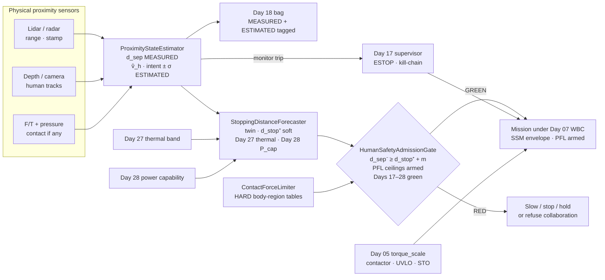
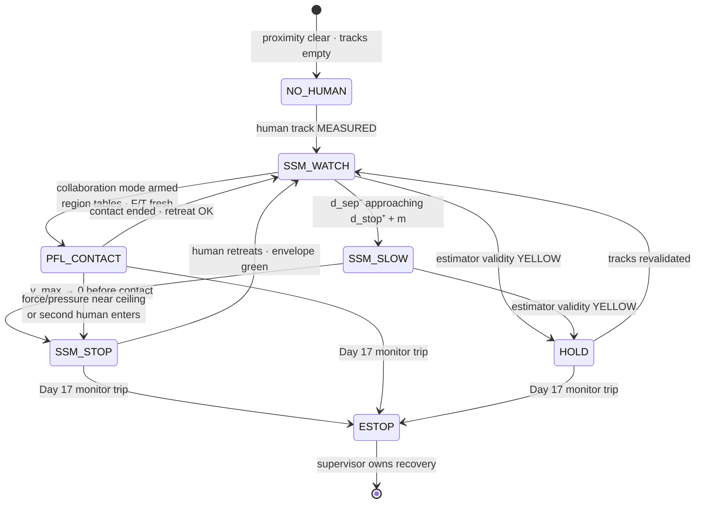
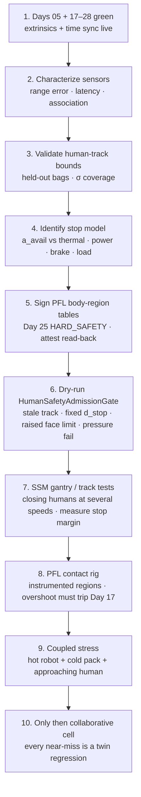

# Day 29 — Human-proximity safety: ProximityStateEstimator / StoppingDistanceForecaster / ContactForceLimiter / HumanSafetyAdmissionGate as measured constraints under supervisor + logging + canary + HIL + fleet + fleet-canary + incident + forensics/reopen + change-management + maintenance + thermal + energy gates

![ProximityStateEstimator / StoppingDistanceForecaster / ContactForceLimiter / HumanSafetyAdmissionGate: lidar, radar, depth and camera tracks with BusHeader stamps are MEASURED separation; human velocity and intent are ESTIMATED with an explicit σ; StoppingDistanceForecaster is a soft twin whose pessimistic stop distance shrinks with Day 27 thermal headroom and Day 28 pack power capability (you cannot claim a stop you cannot physically deliver); ContactForceLimiter holds HARD ISO/TS 15066-style body-region force, pressure and energy ceilings the soft planner never raises; SSM reduces speed or stops before contact when separation would breach stopping distance; PFL limits instantaneous power and contact force when collaboration allows contact; HumanSafetyAdmissionGate fails closed unless Days 17–28 are green, the SSM envelope is green and PFL ceilings are armed; Day 17 owns ESTOP/kill-chain forever and Day 05 owns torque_scale forever — today's gates never write those](/images/day29-human-proximity-safety.png)

[Day 28](/lessons/day-28-energy-budgets-mission-planning) owned `EnergyStateEstimator` / `MissionEnergyForecaster` / `ChargeScheduler` / `EnergyAdmissionGate`: energy and power as two shrinking budgets, planned on pessimistic SOC and pack capability, with a return-to-dock reserve. [Day 27](/lessons/day-27-thermal-budgets-duty-cycle) owned thermal headroom and duty-cycle ceilings below Day 05's derate. [Day 17](/lessons/day-17-runtime-safety-supervisor) owns the kill-chain, ESTOP, and stage transitions **forever**. [Day 05](/lessons/day-05-power-bms) owns `torque_scale`, contactor, UVLO, and STO **forever**.

Day 17's supervisor already stops the robot when a monitor trips. What it has not owned — and what every collaborative humanoid eventually needs — is the continuous envelope that keeps a moving mass of metal from meeting a moving human at the wrong speed, or from pressing too hard when contact is the point. "Slow down near people" is not a policy. It is a measured inequality that depends on how far the human is, how fast both parties are closing, and whether the robot can still stop given today's heat and today's pack.

Today owns **`ProximityStateEstimator` / `StoppingDistanceForecaster` / `ContactForceLimiter` / `HumanSafetyAdmissionGate`**. The question is: **how close is this human, how hard can this robot still stop, what contact force is allowed on which body region if contact happens anyway, and how do you admit work under those ceilings without ever writing Day 17's ESTOP or Day 05's `torque_scale`?**

## Separation is measured. Human motion is estimated. Stopping distance is soft.

Nothing fusion-y about the first number. A lidar return, a radar range, a depth pixel on a tracked human, stamped with `BusHeader`, is a **MEASURED** separation (or a MEASURED track that yields one). What the human will do in the next 300 ms — accelerate toward the tote, step sideways, freeze — is **ESTIMATED**, with a σ that grows with occlusion, age of the last observation, and the cheapness of your motion model. How far the robot needs to stop from its current speed is neither measured nor a constant: it is a **SOFT** twin forecast that depends on speed, effective mass along the closing direction, friction/brake mode, Day 27 winding and gearbox headroom, and Day 28 pack power capability.

So the honest labels are:

| Quantity | Label | Where it comes from | How it goes wrong |
|----------|-------|---------------------|-------------------|
| Range, depth, lidar/radar return, F/T sample, pressure pad | MEASURED | Sensor front-end, `BusHeader`-stamped | Occlusion; misassociation; stale stamp; uncalibrated extrinsic |
| Human track position (fused) | MEASURED (with track-age tag) | Association of recent returns | Ghost track; ID swap between two people |
| Human velocity / acceleration / intent | ESTIMATED, with $\sigma$ | Filter or learned predictor on the track | Assumes constant velocity through a doorway |
| Robot stopping distance $d^{+}_{stop}$ | SOFT | Twin: speed, mass, brake mode, Day 27 thermal, Day 28 $P^{-}_{cap}$ | Median used; thermal headroom ignored; cold pack ignored |
| SSM speed envelope | SOFT bound over MEASURED inputs | $d^{-}_{sep}$ vs $d^{+}_{stop}$ + margin | Envelope written as if the robot could always stop in $X$ m |
| Body-region force / pressure / energy limits | HARD (MEASURED ceilings) | Signed PFL tables (ISO/TS 15066-style), Day 25 hard path | Soft planner "temporarily" raises face limit for a demo |
| Contact force / pressure during contact | MEASURED | Wrist F/T, palm/skin pressure, joint torque observers | Uncompensated gravity; wrong contact frame |

The first rule of today: **plan SSM on a pessimistic separation and a pessimistic stopping distance, and treat every body-region force ceiling as HARD.** The gate never admits work that would require a stop the robot cannot physically deliver, or a contact force the tables forbid.

| Layer | Owns | Must not own |
|-------|------|--------------|
| Lidar / radar / depth / camera / F/T / pressure | MEASURED ranges, tracks, forces, pressures, stamps | Deciding whether contact is allowed |
| `ProximityStateEstimator` (per robot) | Fused MEASURED $d_{sep}$; ESTIMATED $\hat v_h$, intent with $\sigma$; track validity | Labeling predicted human motion MEASURED; writing speed commands |
| `StoppingDistanceForecaster` (twin) | SOFT pessimistic $d^{+}_{stop}(v, m, \mu, T^{-}, P^{-}_{cap}, \text{brake})$ | Writing `torque_scale` or ESTOP; being trusted without validated coverage |
| `ContactForceLimiter` / PFL tables | HARD body-region force, pressure, energy, instantaneous-power ceilings | Soft raises; site-specific "demo mode" ceilings |
| `HumanSafetyAdmissionGate` | Fail-closed admission; SSM envelope; PFL armed; Days 17–28 green | Clearing supervisor stage; dual-writing ESTOP or `torque_scale` |
| Day 17 supervisor | Kill-chain, ESTOP, stage, monitor trips | Being replaced by an SSM "soft stop" |
| Day 05 power / BMS | `torque_scale`, contactor, UVLO, STO | Taking soft requests to raise torque for "just this reach" |

**Core thesis:** a collaborative humanoid carries two proximity budgets at once. **SSM** says: stay far enough, or slow enough, that your measured separation always covers your pessimistic stopping distance plus margin — and that stopping distance shrinks when Day 27 says the windings are hot or Day 28 says the pack cannot fund a hard brake. **PFL** says: when contact is allowed or unavoidable, the instantaneous power and the force/pressure/energy into each body region stay under HARD tables the soft planner may only lower, never raise. The twin forecasts approach risk. The gate fails closed. Day 17 and Day 05 keep every kill and every torque scale exactly where they put them.



## The SSM inequality

Speed-and-separation monitoring is one inequality, written carefully:

$$
d^{-}_{sep}(t) \;\ge\; d^{+}_{stop}\big(v_r(t),\, m_{\mathrm{eff}},\, \mu,\, T^{-},\, P^{-}_{cap},\, \mathrm{brake}\big) \;+\; m_{\mathrm{margin}} \;+\; d^{+}_{human}(H)
$$

where

- $d^{-}_{sep}$ is the **pessimistic** measured separation to the nearest relevant human track (measured range minus a fusion margin tied to calibration and track age),
- $d^{+}_{stop}$ is the **pessimistic** distance the robot needs to reach a safe speed (often zero) along the closing direction,
- $d^{+}_{human}$ is how far the human might close the gap over the reaction and stopping horizon $H$, from the ESTIMATED human velocity upper bound,
- $m_{\mathrm{margin}}$ is a validated residual (sensor latency, brake delay, association risk).

The human term is where people cheat. A constant-velocity predictor with $\hat v_h^{+}$ at the upper $\sigma$ band is the minimum honesty:

$$
d^{+}_{human}(H) \approx \big(\hat v_h + k\,\sigma_{v}\big)\, H \;+\; \tfrac{1}{2}\big(\hat a_h + k\,\sigma_{a}\big)\, H^{2}
$$

with $H$ at least reaction time plus the twin's stop time. If your predictor is learned, the gate still consumes a **validated upper bound**, not the network's median. Label the network SOFT; never MEASURED.

### Stopping distance is not a constant — thermal and power own part of it

A naive stop model is $d_{stop} \approx v^{2}/(2a)$ with some fixed deceleration. A humanoid's available $a$ is not fixed. Along the closing direction it depends on:

- **Friction / brake mode** — regenerative vs friction brake vs sit-to-stop; regen acceptance collapses at high SOC (Day 27's brake-resistor problem again).
- **Day 27 thermal headroom** — a hot winding or gearbox that is already near its planner ceiling cannot fund a peak braking torque for long; $a^{+}_{avail}$ falls with $P^{-}_{thermal}(H)$.
- **Day 28 pack power capability** — a cold or aged pack with low $P^{-}_{cap}$ cannot absorb or supply the bus transient a hard stop needs; the twin must use the same pessimistic power band EnergyAdmissionGate already trusts.
- **Effective mass** — a humanoid carrying a tote, or with a high CoM during a reach, has a larger $m_{\mathrm{eff}}$ along some axes than the empty standing model.

So the twin publishes

$$
d^{+}_{stop}(t) = \frac{v_r(t)^{2}}{2\, a^{-}_{avail}(t)} \;+\; v_r(t)\, t_{\mathrm{delay}} \;+\; d_{\mathrm{posture}}
$$

with

$$
a^{-}_{avail}(t) = \min\Big( a_{\mu},\; a\big(P^{-}_{thermal}\big),\; a\big(P^{-}_{cap}\big),\; a_{\mathrm{brake\,mode}} \Big)
$$

**Illustrative numbers.** Robot closing at $0.8\,\mathrm{m/s}$, empty-body $a_{\mu} = 1.2\,\mathrm{m/s}^{2}$, delay $80\,\mathrm{ms}$:

| Condition | $a^{-}_{avail}$ | $d^{+}_{stop}$ (incl. delay) | Notes |
|-----------|-----------------|------------------------------|-------|
| Cool windings, warm pack, regen OK | 1.2 m/s² | ≈ 0.33 m | Nominal |
| Day 27 near thermal ceiling | 0.6 m/s² | ≈ 0.60 m | Same speed, almost 2× stop distance |
| Day 28 cold pack, poor regen | 0.45 m/s² | ≈ 0.78 m | Energy was "fine"; power wasn't |
| Hot + cold + tote ($m_{\mathrm{eff}}$↑) | 0.35 m/s² | ≈ 1.0 m | Envelope must shrink *before* the reach |

If your SSM table still says "stop distance = 0.4 m at 0.8 m/s" while the twin says 1.0 m, the gate is lying. That is Day 28's "SOC UI fine, robot dies under load," translated into proximity: **you cannot claim a stop you cannot physically do.**

### The speed envelope is derived, not authored

Given $d^{-}_{sep}$ and the twin, the maximum admissible speed along the closing direction is

$$
v^{-}_{max}(d) = \max\Big(0,\; \sqrt{2\, a^{-}_{avail}\,\big(d^{-}_{sep} - m_{\mathrm{margin}} - d^{+}_{human}\big)} \;-\; \ldots\Big)
$$

(with the delay term folded into the margin in practice). SSM does not "pick a careful speed." It computes the speed at which the inequality still holds, and the motion stack may only request at or below that. When $v^{-}_{max}$ hits zero, the robot stops *before* contact — still under Day 17's supervisor, not instead of it.

## PFL: contact is allowed only under HARD body-region ceilings

Collaborative work sometimes *requires* contact: handing a tool, steadying a part, a guided push. Power-and-force limiting is the other half of ISO/TS 15066-style collaborative operation. When contact is in the plan (or becomes unavoidable), the robot must keep:

- **Instantaneous mechanical power** into the contact below a limit,
- **Contact force** below a body-region ceiling,
- **Contact pressure** below a body-region ceiling (same force on a small knuckle is worse),
- **Transferred energy** over the contact event below a body-region energy ceiling (quasi-static vs transient regimes differ).

Illustrative order-of-magnitude ceilings (your signed tables win; these are teaching numbers, not a substitute for the standard or your risk assessment):

| Body region | Quasi-static force (order) | Pressure (order) | Notes |
|-------------|----------------------------|------------------|-------|
| Face / skull / neck | ~65–110 N | ~60–110 N/cm² | Tightest; often collaboration-forbidden for unconstrained contact |
| Torso / back / shoulders | ~140–210 N | region tables | Collaborative contact possible under budget |
| Arms / hands / legs | higher transient bands | region tables | Still HARD; MEASURED via wrist F/T + palm pressure when available |

Three honesty rules:

1. **The soft planner may only lower a request.** It never raises a face ceiling for a demo, never swaps "torso" for "hand" because the tracker lost the head, never disables pressure because the pad is broken — that last case is RED, not "force-only mode."
2. **Ceilings are HARD_SAFETY under Day 25.** Changing a body-region table is a typed `ChangeSet` on the hard path, attested read-back, soaked through rings — not a SOFT_POLICY push.
3. **MEASURED contact force is what the limiter closes on.** Gravity-compensated F/T in the contact frame, pressure pads if present, torque observers as secondary. A commanded "gentle" impedance that was never validated against measured force is SOFT theater.

During PFL-limited contact, SSM's separation inequality is partially relaxed *by mode* (you are in contact on purpose), but the stop-and-retreat path must still be fundable under Day 27/28, and Day 17 still owns ESTOP if a monitor trips (force overshoot, pressure spike, track loss on a second human entering).

### Instantaneous power, not only peak force

Force ceilings catch crushing. Energy and power ceilings catch the slap and the shove. A low force applied through a fast-moving mass can still dump joules into tissue. The limiter therefore tracks something like

$$
P_{\mathrm{mech}}(t) = \big| \mathbf{F}_{c}(t)\cdot \mathbf{v}_{c}(t) \big|,
\qquad
E_{\mathrm{event}} = \int_{t_0}^{t} P_{\mathrm{mech}}(\tau)\, d\tau
$$

in the contact frame, and trips when either $P_{\mathrm{mech}}$ or $E_{\mathrm{event}}$ crosses the region table — even if force alone is still under $F_{max}$. Transient (dynamic) contacts often allow higher peak force for a shorter energy budget; quasi-static leans allow lower force for longer. Your tables encode both regimes; the gate must know which regime the contact is in (approach speed is a good prior), and when unsure, use the tighter pair.

This is also where Day 27/28 re-enter PFL: if the robot cannot *retreat* quickly after a near-ceiling contact because thermal or power headroom is gone, the collaborative mode should never have been entered. Admission looks forward; monitors look sideways; both need the same physical budgets.


## Two modes, one gate



SSM-only sites spend most of their life in `SSM_WATCH` / `SSM_SLOW` / `SSM_STOP`. Collaborative cells add `PFL_CONTACT` under an armed mode bit that itself is HARD (attested). Losing pressure sensing while in PFL_CONTACT is not a soft degrade to "impedance only" — it is leave contact and re-enter SSM_STOP until sensing is green.

## A worked SSM example

Same honesty as Day 28's dock-reserve table: pick numbers you can argue with, then watch the dashboard lie.

Robot walking an aisle at $v_r = 0.75\,\mathrm{m/s}$. Nearest human track: measured range $2.1\,\mathrm{m}$, track age $40\,\mathrm{ms}$, extrinsic calibration residual $0.05\,\mathrm{m}$. Human filter: $\hat v_h = 0.9\,\mathrm{m/s}$ closing, $\sigma_v = 0.25\,\mathrm{m/s}$, $k = 2$. Reaction+stop horizon $H = 0.9\,\mathrm{s}$. Margin $m = 0.15\,\mathrm{m}$ (latency + association).

$$
d^{-}_{sep} = 2.1 - 0.05 - 0.02 \approx 2.03\,\mathrm{m}
$$

$$
d^{+}_{human} = (0.9 + 2\cdot 0.25)\,0.9 \approx 1.26\,\mathrm{m}
$$

| Robot condition | $a^{-}_{avail}$ | $d^{+}_{stop}$ | RHS $= d^{+}_{stop}+m+d^{+}_{human}$ | Verdict at $0.75\,\mathrm{m/s}$ |
|-----------------|-----------------|----------------|--------------------------------------|----------------------------------|
| Cool, warm pack | 1.1 m/s² | ≈ 0.32 m | ≈ 1.73 m | **GREEN** ($2.03 > 1.73$) |
| Day 27 near ceiling | 0.55 m/s² | ≈ 0.57 m | ≈ 1.98 m | **YELLOW** — slow immediately |
| Hot + Day 28 cold pack | 0.35 m/s² | ≈ 0.86 m | ≈ 2.27 m | **RED** — stop; same aisle, same human |

The dashboard still shows "human at 2.1 m, plenty of room." Under honest bounds the cold, hot robot does **not** have room at walking speed. That is the whole lesson of coupling Days 27–28 into $d^{+}_{stop}$: the proximity envelope is a function of the machine's present physical truth, not a map layer painted once at commissioning.

If the motion stack had already committed to $0.75\,\mathrm{m/s}$, the gate's job mid-mission is the same as EnergyAdmissionGate's return-now: shrink $v^{-}_{max}$ continuously as $a^{-}_{avail}$ falls, and hit STOP before the inequality flips the wrong way. Logging $a^{-}_{avail}$, $d^{+}_{stop}$, and $d^{-}_{sep}$ on every cycle is what makes Day 24 able to replay a near-miss.

## Perception association and multi-human honesty

A single neat track is a lab convenience. Floors have two pickers, a supervisor with a tablet, a tote that looks like legs at 15 m, and a reflective vest that lidar loves more than skin.

Rules that keep the estimator honest:

- **Every confirmed human track enters the envelope**, not only the nearest. The binding constraint is $\min_i \big(d^{-}_{sep,i} - d^{+}_{stop} - m - d^{+}_{human,i}\big)$. Nearest-in-range is often nearest-in-time-to-breach, but a farther human sprinting in can win.
- **ID swaps are validity events.** When association confidence drops (crossing paths, occlusion exit), mark both tracks YELLOW, widen $\sigma_v$, and if collaboration was active, drop to SSM_STOP until revalidated. A swapped ID that silently carries the wrong velocity bound is how you "stop for the wrong person."
- **Unknown occupancy fails closed.** A corridor with a stale last return, a camera blinded by sun, or a radar facet that disappeared behind a rack is not "probably empty." It is a volume the twin treats as occupied at walking-human density until sensing recovers — which in practice means slow or hold, not "continue, confidence 0.4."
- **Crowd density is a separate soft forecast feeding the same gate.** When track count in a cell exceeds a site limit, or when occupancy grids say the aisle is saturated, the scheduler (soft) refuses to send another robot into that cell; the gate (hard fail-closed) still checks each track. Density does not replace SSM; it prevents you from needing SSM for eight people at once.

Crowds also change $d^{+}_{human}$: people in a dense aisle have less room to dodge, so the human upper bound should not assume free sidestep. Your validated coverage sets should include dense-aisle bags, not only single-actor lab walks.

## Contact frames and region classification

PFL is only as good as knowing *which body region* is about to be hit. A wrist F/T reading of 80 N into a palm is a different sentence from 80 N into a temple.

- **Region estimate is ESTIMATED from geometry + perception**, tagged as such, even when force is MEASURED. The gate applies the ceiling of the *most restrictive plausible region* in the contact uncertainty set — not the optimistic one.
- **Unstructured contact (bump while walking) defaults to the strictest active ceiling** until classification is confident. That feels conservative; it is the point.
- **Tool and object handoffs** need an explicit contact plan: expected region (usually hand/arm), expected wrench band, timeout, and a retreat trajectory that SSM can still fund under Day 27/28. Handoff without a region plan is how face-adjacent mistakes happen when the human leans in.

Day 30 will own zoning and attested workspaces that make "which humans, which regions, which modes" a site configuration problem rather than a per-cycle guess. Today still needs the per-cycle honesty even inside a perfect zone.


## Ownership conflicts

| Conflict | Winner | Behavior |
|----------|--------|----------|
| Dashboard "people nearby" vs fused $d^{-}_{sep}$ | Fused MEASURED separation | Envelope from estimator, not UI |
| Median human velocity vs upper $\sigma$ bound | Upper bound | Gate plans on $\hat v_h + k\sigma$ |
| Fixed stop-distance table vs twin with thermal/power | Twin $d^{+}_{stop}$ | Table alone is insufficient |
| Soft wants higher face force for a demo | PFL HARD table | Not accepted; ChangeSet or refuse |
| Pressure pad failed, continue on F/T only in PFL | Gate | RED for PFL_CONTACT; retreat to SSM |
| SSM soft stop vs Day 17 ESTOP on force spike | Day 17 | Kill-chain wins; soft stop is not a substitute |
| Soft asks Day 05 to raise `torque_scale` for a "careful push" | Day 05 | Not accepted |
| Track ID swap between two humans | Validity YELLOW/RED | Hold or stop until revalidated |
| Occlusion corridor, last range 400 ms stale | Age bound | Treat as unknown occupancy; fail closed |
| Collaboration mode bit not attested | Day 25 + gate | PFL_CONTACT refused |
| Hot robot, SSM still using cool-day $a$ | Day 27 band in twin | $d^{+}_{stop}$ grows; envelope shrinks |
| Cold pack, same | Day 28 $P^{-}_{cap}$ in twin | Same |
| Multi-human: nearest only | Gate | All tracks in envelope; nearest is necessary, not sufficient |
| Open incident on unit | Day 23 | Collaboration refused; supervisor routing |

## Shared API

Same wire discipline as Days 02/04: everything carries `BusHeader`. Proximity estimation and the twin run on the host; nothing here enters the cyclic current loop. Force limiting that must be fast sits beside the motion stack with HARD caps; Day 17 monitors remain independent.

```text
BusHeader:
  t_mono
  seq
  clock_domain         # SENSOR for ranges; HOST for estimator/forecast
  age_ms
  producer_id

ProximityMeasurement ⊇ BusHeader:        # MEASURED
  sensor_id            # lidar | radar | depth | camera
  kind                 # RANGE | TRACK | OCCUPANCY
  frame_id
  range_m              # or track pose
  track_id             # if associated
  bag_ref

ContactMeasurement ⊇ BusHeader:          # MEASURED
  wrench_ft            # gravity-compensated, contact frame
  pressure_ncm2[]      # if pads present
  contact_region_est   # from kinematics + perception (tagged)
  validity

HumanTrackState ⊇ BusHeader:             # mixed
  track_id
  p_meas               # MEASURED fused position
  v_hat                # ESTIMATED
  sigma_v
  intent_label         # ESTIMATED / SOFT
  age_ms
  occlusion: bool
  label_position: MEASURED
  label_velocity: ESTIMATED

StoppingDistanceForecast ⊇ BusHeader:    # SOFT
  v_r
  a_avail_lower        # min(μ, thermal, power, brake mode)
  d_stop_upper
  d_human_upper
  margin_m
  thermal_ref          # Day 27 band id
  energy_ref           # Day 28 P_cap band id
  label: SOFT
  forbid:
    label_measured: true
    write_torque_scale: true
    write_estop: true

PflBodyRegionTable ⊇ BusHeader:          # HARD, attested
  table_version
  region[]:
    name               # FACE | SKULL | NECK | TORSO | ARM | HAND | LEG | ...
    f_max_n
    p_max_ncm2
    e_max_j
    p_mech_max_w
  change_class: HARD_SAFETY
  attestation_hash

SsmEnvelope ⊇ BusHeader:                 # SOFT bound
  d_sep_lower
  v_max_closing
  mode                 # WATCH | SLOW | STOP
  tracks_considered
  label: SOFT

HumanSafetyAdmissionGate ⊇ BusHeader:
  fail_closed: true
  soft_admit_blocker_only: true
  status               # RED | YELLOW | GREEN
  require:
    proximity_state_fresh: true
    track_validity_green: true
    ssm_inequality_holds: true          # or mode STOP with v=0
    stopping_forecast_fresh: true
    thermal_band_in_forecast: true      # Day 27
    power_band_in_forecast: true        # Day 28
    pfl_tables_attested: true
    pfl_ceilings_armed: true
    contact_sensing_green_if_pfl: true
    collaboration_mode_attested: true   # if PFL_CONTACT
    energy_admission_gate_green: true   # Day 28
    thermal_admission_gate_green: true  # Day 27
    supervisor_armed: true              # Day 17
    hygiene_honest: true                # Day 18
    offline_shadow_canary_green: true   # Day 19
    regression_gate_green_for_unit: true # Day 20
    fleet_admit_gate_green: true        # Day 21
    fleet_canary_gate_green: true       # Day 22
    no_open_incident_on_unit: true      # Day 23
    canary_reopen_gate_green: true      # Day 24
    cross_site_config_gate_green: true  # Day 25
    recalibration_gate_green: true      # Day 26
    estop_pairing: true
    day05_binding: true
  refuse_on[]:
    stale_proximity
    human_velocity_labeled_measured
    fixed_stop_distance_without_twin
    thermal_ignored_in_d_stop
    power_ignored_in_d_stop
    pfl_ceiling_raised_by_soft
    pressure_failed_still_in_pfl
    collaboration_mode_unattested
    dual_write_torque_scale
    soft_stop_replacing_estop
  forbid:
    joint_command: true
    dual_write_torque_scale: true
    clear_supervisor_stage: true
    write_estop: true
    force_flag: true

# Unchanged owners
SupervisorState (Day 17): ESTOP · kill-chain · stage · monitors
BmsState / PowerState (Day 05): torque_scale · contactor · UVLO · STO
  accepts_requests_from_soft_layer: false
```

## Physical ↔ digital pairing

| Physical | Digital twin / backing |
|----------|------------------------|
| Lidar/radar ranges, depth pixels, camera boxes | MEASURED inputs, stamped, bagged |
| Occlusion, glare, dust, glass | Validity and age bounds; unknown occupancy fails closed |
| Human walking, reaching, freezing, ID swaps | ESTIMATED velocity/intent with $\sigma$; association hygiene |
| Robot mass, tote, posture, friction, brake mode | $m_{\mathrm{eff}}$, $a_{\mu}$, brake mode into $d^{+}_{stop}$ |
| Hot windings / gearbox (Day 27) | Twin lowers $a^{-}_{avail}$; envelope shrinks |
| Cold or weak pack (Day 28) | Twin lowers $a^{-}_{avail}$ via $P^{-}_{cap}$ |
| Wrist F/T, palm pressure, skin sensors | MEASURED contact wrench/pressure for PFL close loop |
| Body-region anatomy near contact | Region classification + HARD tables; wrong region is unsafe |
| Second human entering a collaborative cell | All tracks in SSM; PFL_CONTACT may drop to STOP |
| ESTOP button / supervisor monitor | Day 17 path, independent of SSM soft stop |
| Site "slow near aisle" signs | Not a substitute for the measured inequality |

If the twin cannot reproduce a near-miss bag — measured separation, commanded speed, thermal and power bands, and the stop that almost wasn't enough — it cannot set the next envelope.

## Bring-up sequence (before trusting proximity admission)



1. **Days 05 and 17–28 green.** Extrinsics and time sync (Day 04) are already honest; thermal and energy gates exist.
2. **Characterize sensors.** Range error vs distance and angle, end-to-end latency, association failure modes (ID swap, ghosting).
3. **Validate track bounds.** Held-out bags with motion-capture or surveyed paths; $\hat v_h + k\sigma$ must cover truth at the claimed rate.
4. **Identify the stop model.** Measure $a^{-}_{avail}$ across thermal bands, pack bands, brake modes, and payloads; freeze the twin inputs.
5. **Sign PFL tables.** Body-region ceilings as HARD_SAFETY `ChangeSet`s; attestation read-back on every robot.
6. **Dry-run the gate.** Stale track, human velocity labeled MEASURED, fixed stop distance without thermal/power, soft-raised face limit, pressure failed while staying in PFL_CONTACT, collaboration mode unattested. Every one RED.
7. **SSM tests on a gantry or surveyed floor.** Closing human (or calibrated target) at several speeds; record stop margin vs twin prediction.
8. **PFL contact rig.** Instrumented pads for face/torso/hand analogues; commanded contact must respect ceilings; deliberate overshoot must trip Day 17, not "try harder."
9. **Coupled stress.** Hot robot (Day 27) and cold pack (Day 28) with an approaching human — confirm $d^{+}_{stop}$ grew and the envelope shrank *before* the near-miss.
10. **Then** open the collaborative cell, and treat every near-miss as a failed forecast to replay (Day 18 bag + Day 24 forensics).

## Failure gallery

| Symptom | Likely cause |
|---------|--------------|
| Robot "stops in time" in cool morning tests, clips a hip after lunch | $d^{+}_{stop}$ ignored Day 27 thermal; fixed stop table |
| Same aisle, winter near-miss with half battery | Day 28 $P^{-}_{cap}$ not in stop twin; regen/brake starved |
| Soft stop commanded, human still hit, ESTOP late | SSM treated as substitute for Day 17 monitors |
| Face contact during "hand" handoff | Region misclassification; tracker lost head; table not checked |
| Pressure pad fault, robot continues "gently" | PFL_CONTACT not dropped; soft degrade forbidden |
| Two people, robot tracks one, backs into the other | Envelope on nearest only; multi-human not gated |
| Ghost slowdowns in empty aisle | Association ghosts; validity not tied to confirmations |
| Demo mode with raised force limits | HARD table bypassed; Day 25 path skipped |
| Latency spike, stop starts late | `age_ms` not in $d^{-}_{sep}$ / margin; wall clock mixed with mono |
| Collaborative mode bit set in software only | Not attested; gate should have refused PFL_CONTACT |
| Near-miss bag cannot be replayed | Human velocity not logged as ESTIMATED with $\sigma$; twin starved |
| Operator overrides to "keep walking, they're far" | Dashboard distance vs fused $d^{-}_{sep}$; gate bypass |

## What to freeze this week

Extend [frames](/frames) and your safety config with:

- `ProximityStateEstimator` publishing MEASURED $d_{sep}$ / tracks and ESTIMATED human velocity/intent with $\sigma$ and age; never label predictions MEASURED.
- `StoppingDistanceForecaster` as a soft twin whose $d^{+}_{stop}$ consumes Day 27 thermal and Day 28 power bands, brake mode, and $m_{\mathrm{eff}}$; fixed tables alone are not enough.
- The SSM inequality $d^{-}_{sep} \ge d^{+}_{stop} + m + d^{+}_{human}$ as the speed-envelope source; $v_{max}$ is derived, not authored.
- `ContactForceLimiter` with signed, attested ISO/TS 15066-style body-region force/pressure/energy/power ceilings; soft may only lower requests.
- `HumanSafetyAdmissionGate` fail-closed on proximity freshness, SSM green (or STOP), PFL armed when collaborating, Days 17–28 green; **no dual-write of ESTOP or `torque_scale`.**
- Collaboration mode as an attested HARD bit; pressure or F/T loss drops PFL_CONTACT to stop/hold.
- Every near-miss in a Day 18 bag, replayed through the twin as a proximity-forecaster regression (Day 20/24).

The lesson isn't "be careful around people." It's that **proximity safety is two measured-constraint systems — SSM and PFL — whose honesty depends on the same thermal and energy truth you already built, and whose ceilings the soft stack may never raise.** Separation is measured; human motion is estimated; stopping distance is a twin forecast; body-region force limits are HARD; Day 17 still owns the kill-chain; Day 05 still owns torque.

## Next

**Day 30+** — Collaborative workspace zoning / safeguarded-space attestation: measured zone boundaries and occupancy as HARD attested geometry, multi-human crowd-density limits feeding SSM envelopes, tool/object handoff under PFL ceilings, and cross-site zone-config honesty under the same gates (supervisor + logging + canary + HIL + fleet + fleet-canary + incident + forensics/reopen + change-management + maintenance + thermal + energy + proximity).
