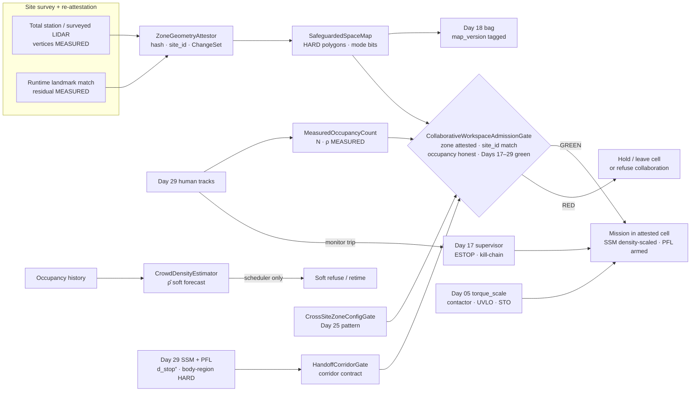
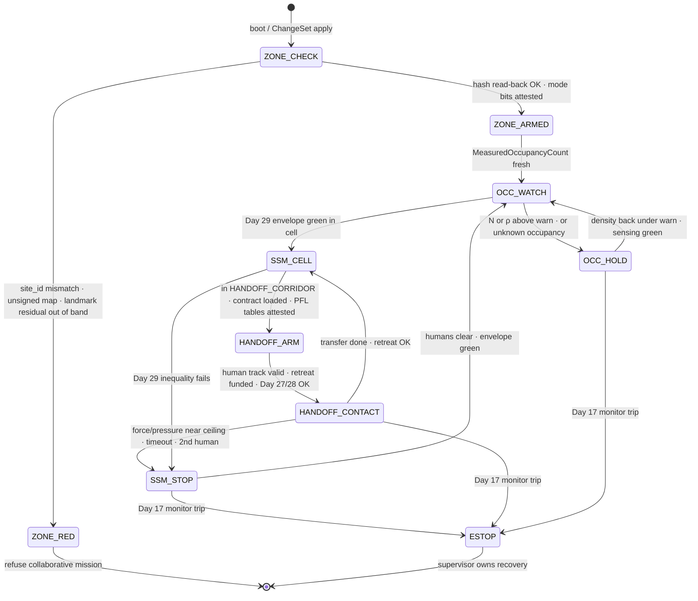
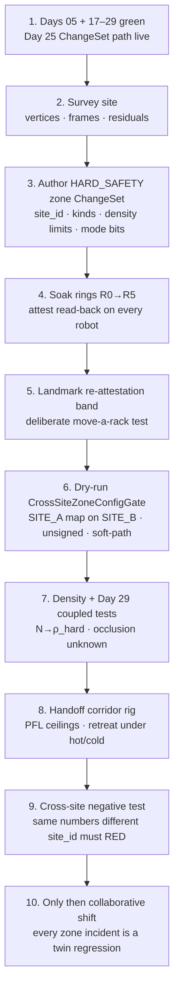

# Day 30 — Collaborative workspace zoning / safeguarded-space attestation: ZoneGeometryAttestor / SafeguardedSpaceMap / CrowdDensityEstimator vs MeasuredOccupancyCount / HandoffCorridorGate / CrossSiteZoneConfigGate / CollaborativeWorkspaceAdmissionGate as measured constraints under supervisor + logging + canary + HIL + fleet + fleet-canary + incident + forensics/reopen + change-management + maintenance + thermal + energy + proximity gates

![ZoneGeometryAttestor / SafeguardedSpaceMap / CrowdDensityEstimator vs MeasuredOccupancyCount / HandoffCorridorGate / CrossSiteZoneConfigGate / CollaborativeWorkspaceAdmissionGate: surveyed safeguarded-space polygons and volumes are HARD attested geometry with MEASURED LIDAR/vision read-back, not soft planner paint; MeasuredOccupancyCount is MEASURED human count in a cell while CrowdDensityEstimator is a soft forecast that may only shrink scheduler admits; density feeds Day 29 SSM so envelopes shrink before the aisle saturates; HandoffCorridorGate arms Day 29 PFL body-region ceilings and an SSM-funded retreat during tool/object transfer; CrossSiteZoneConfigGate applies Day 25 ConfigAttestation so a SITE_A zone file cannot silently run on SITE_B; CollaborativeWorkspaceAdmissionGate fails closed unless Days 17–29 are green, zone attestation matches site_id, occupancy is honest, and handoff corridors are armed; Day 17 owns ESTOP/kill-chain forever and Day 05 owns torque_scale forever — today's gates never write those](/images/day30-collaborative-workspace-zoning.png)

[Day 29](/lessons/day-29-human-proximity-safety) owned `ProximityStateEstimator` / `StoppingDistanceForecaster` / `ContactForceLimiter` / `HumanSafetyAdmissionGate`: MEASURED separation vs ESTIMATED human motion, a stop-distance twin that shrinks with Day 27 thermal and Day 28 power, SSM envelopes, and HARD ISO/TS 15066-style PFL body-region ceilings. [Day 25](/lessons/day-25-fleet-change-management) owned `ConfigAttestation` / `CrossSiteConfigGate`: content-addressed ChangeSets with attested read-back so site A config does not silently become site B's truth. [Day 17](/lessons/day-17-runtime-safety-supervisor) owns the kill-chain, ESTOP, and stage transitions **forever**. [Day 05](/lessons/day-05-power-bms) owns `torque_scale`, contactor, UVLO, and STO **forever**.

Day 29 made proximity honest *per cycle*. What it did not own — and what every multi-site collaborative cell eventually needs — is the **place** those cycles happen in: which polygons are collaborative, which volumes are exclusion, which corridors may host a handoff, how many humans are already in the cell, and whether the zone file on this robot actually belongs to *this* site. "Stay in the green zone" is not a map layer painted once at commissioning. It is attested geometry with a measured read-back, density that feeds SSM, handoff under PFL, and a Day 25 honesty check on every zone ChangeSet.

Today owns **`ZoneGeometryAttestor` / `SafeguardedSpaceMap` / `CrowdDensityEstimator` vs `MeasuredOccupancyCount` / `HandoffCorridorGate` / `CrossSiteZoneConfigGate` / `CollaborativeWorkspaceAdmissionGate`**. The question is: **what space is this robot allowed to treat as collaborative, how many humans are actually in it, can a handoff stay under Day 29 ceilings with a funded retreat, and how do you refuse a zone map that belongs to another building — without ever writing Day 17's ESTOP or Day 05's `torque_scale`?**

## Zone geometry is measured read-back. Density forecast is soft. Handoff is Day 29 under a corridor contract.

A surveyed polygon on a commissioning tablet is not yet a zone. Vertices from a total station or a carefully walked LIDAR survey, frozen into a content-addressed `ChangeSet`, signed as HARD_SAFETY, soaked through Day 25 rings, and **read back** from the robot's attested config store — that is a zone. A weekly vision/LIDAR re-attestation that the physical landmarks still match the polygon hash is MEASURED evidence the geometry has not silently moved (rack relocated, temporary fence, new tote wall). A planner "preferred corridor" polyline the motion stack likes is SOFT paint: useful for routing, never a substitute for the attested safeguarded-space boundary.

Occupancy splits the same way Day 28 split energy and power. **How many confirmed human tracks are in this cell right now** is MEASURED (`MeasuredOccupancyCount`). **How crowded the aisle will be in four minutes** is ESTIMATED / SOFT (`CrowdDensityEstimator`). The soft forecast may refuse to *send* another robot; the gate still checks the measured count and every Day 29 track. Density does not replace SSM — it keeps you from needing SSM for eight people at once.

So the honest labels are:

| Quantity | Label | Where it comes from | How it goes wrong |
|----------|-------|---------------------|-------------------|
| Surveyed zone vertices / volumes | MEASURED (at survey) → HARD after attest | Total station, surveyed LIDAR, signed map | Vertices from a screenshot; no `site_id` |
| Runtime LIDAR/vision landmark match | MEASURED re-attestation | Feature match vs frozen map hash | Drift ignored; "map still looks fine" |
| Active `SafeguardedSpaceMap` on robot | HARD attested config | Day 25 read-back of zone ChangeSet | Soft copy from SITE_A onto SITE_B |
| Collaborative / exclusion / handoff mode bits | HARD | Attested per-polygon attributes | Software-only mode flag |
| Confirmed human count in cell | MEASURED | Associated tracks with validity green | Ghosts counted; occluded humans ignored |
| Crowd density forecast $\hat\rho(t{+}H)$ | SOFT | Occupancy history, schedule, calendar | Forecast labeled MEASURED; gate trusts it alone |
| Handoff expected region / wrench band | HARD plan + MEASURED contact | Corridor contract + Day 29 PFL | Face-adjacent lean with "hand" table |
| Preferred planner corridor | SOFT | Motion / task planner | Used as if it were safeguarded geometry |
| SSM envelope inside a zone | SOFT bound over MEASURED inputs | Day 29 inequality, now density-scaled | Cool-day $d^{+}_{stop}$ inside a hot crowded cell |

The first rule of today: **admit collaborative work only inside attested geometry, on measured occupancy, under Day 29 SSM/PFL that already know Day 27/28 headroom, with a zone config whose `site_id` matches the robot's site.** Soft density and soft corridors may only shrink or refuse — they never author HARD space.

| Layer | Owns | Must not own |
|-------|------|--------------|
| Survey / LIDAR / vision landmarks | MEASURED vertices, re-attestation residuals, stamps | Deciding collaborative mode is "close enough" |
| `ZoneGeometryAttestor` | Hash match of active map vs signed ChangeSet; landmark residual band | Accepting unsigned maps; cross-site silent apply |
| `SafeguardedSpaceMap` | HARD polygons/volumes + mode bits per `site_id` | Soft preferred paths; demo overrides |
| `MeasuredOccupancyCount` | MEASURED $N$ / $\rho$ in cell from valid tracks | Labeling forecast count MEASURED |
| `CrowdDensityEstimator` | SOFT $\hat\rho(t{+}H)$ for scheduling | Writing SSM tables; raising density limits |
| `HandoffCorridorGate` | Corridor contract + Day 29 PFL/SSM during transfer | Raising body-region ceilings; skipping retreat fund |
| `CrossSiteZoneConfigGate` | Fail-closed on `site_id` / hash / unsigned ChangeSet | "Temporary" map borrow from another site |
| `CollaborativeWorkspaceAdmissionGate` | Composed fail-closed admit: Days 17–29 + zone + occupancy + handoff | Clearing supervisor stage; dual-writing ESTOP / `torque_scale` |
| Day 29 proximity | SSM inequality, PFL ceilings, stop twin | Being replaced by a zone label alone |
| Day 25 change management | HARD_SAFETY zone ChangeSets, soak rings | Soft policy path for geometry |
| Day 17 / Day 05 | Kill-chain / `torque_scale` | Being written by zoning soft layer |

**Core thesis:** a collaborative humanoid does not "know the floor plan." It carries an **attested safeguarded-space map** whose geometry is MEASURED at survey and re-attested at runtime, an **occupancy count** that is MEASURED while density *forecasts* stay soft, a **handoff corridor** that is Day 29 PFL+SSM under a typed contract, and a **cross-site gate** that fails closed when the map's `site_id` is not this building. Zones shrink what Day 29 must handle; they never replace it. Soft never writes Day 17, Day 05, or Day 25 HARD_SAFETY ChangeSets.



## Attested geometry, not planner paint

A safeguarded space in the ISO collaborative sense is a typed region with an allowed interaction mode. For today, each polygon or volume in `SafeguardedSpaceMap` carries at least:

- `site_id`, `map_version`, `changeset_hash` (Day 25 content address)
- `kind`: `COLLABORATIVE` | `EXCLUSION` | `HANDOFF_CORRIDOR` | `TRANSIT` | …
- `mode_bit`: collaborative SSM/PFL allowed or not (HARD, attested)
- `density_limit_hard` / `density_limit_warn` (humans per m² or absolute $N$)
- `vertex[]` or mesh reference in a surveyed frame, with survey residual and date

**Read-back is the point.** On boot and on every zone ChangeSet apply, `ZoneGeometryAttestor` requires:

$$
\mathrm{attested\_hash} = H(\mathrm{site\_id},\, \mathrm{map\_version},\, \mathrm{vertices},\, \mathrm{mode\_bits},\, \ldots)
$$

to equal the signed ChangeSet hash, and `site_id` to equal the robot's attested site identity (badge, garage config, Day 25 site binding — same honesty as pack_id on Day 28). A file that verifies cryptographically but carries `SITE_A` while the robot is bound to `SITE_B` is **RED**, not "close enough."

Runtime re-attestation is MEASURED, not ceremonial. Pick stable landmarks (column bases, dock fiducials, surveyed reflectors). LIDAR/vision reports a residual. If the residual leaves the validated band — rack moved, temporary fence, construction — the map is YELLOW/RED until a new HARD_SAFETY ChangeSet is surveyed and soaked. Soft SLAM "the floor moved a bit" does not rewrite HARD vertices.

### Density feeds Day 29 SSM — it does not replace it

Day 29 already said: every confirmed track enters the envelope; unknown occupancy fails closed; crowd density is a soft forecast feeding the same gate. Today makes that concrete.

Let $N$ be `MeasuredOccupancyCount` in the cell (valid tracks only). Let $A$ be the attested free area of the collaborative polygon. Then

$$
\rho = N / A
$$

is MEASURED density *now*. The soft estimator publishes $\hat\rho(t{+}H)$ for the scheduler. The gate's hard checks:

1. If $N$ or $\rho$ exceeds `density_limit_hard` → RED for new admits; robots already inside slow/hold under Day 29.
2. Day 29's $d^{+}_{human}$ and association risk **grow** with $\rho$ (less room to dodge; more ID-swap chance). Validated coverage must include dense-aisle bags.
3. Soft $\hat\rho$ may only cause the scheduler to refuse or retime; it never raises `density_limit_hard`, never labels itself MEASURED, never bypasses track-level SSM.

Illustrative teaching numbers (your risk assessment wins):

| Cell state | $N$ | $\rho$ | SSM effect | Admit |
|------------|-----|--------|------------|-------|
| Empty collaborative | 0 | 0 | Nominal $d^{+}_{human}$ | GREEN if zone attested |
| One picker | 1 | low | Day 29 as Day 29 | GREEN under envelope |
| Near warn density | at warn | $\rho_{\mathrm{warn}}$ | Widen $\sigma_v$; shrink $v^{-}_{max}$ | YELLOW — no new robots |
| At hard density | at hard | $\rho_{\mathrm{hard}}$ | Treat as saturated; hold/leave | RED for collaboration admit |
| Occluded volume, stale returns | unknown | — | Unknown occupancy = occupied | Fail closed |

The dashboard that says "zone clear" while three tracks are valid and one corridor is occluded is lying the same way Day 28's SOC UI lied under load.

## Handoff corridors: Day 29 PFL under a typed contract

Tool and object handoffs are where collaborative cells earn their keep — and where face-adjacent mistakes happen when the human leans in. A handoff corridor is not "the space between robot and person." It is an attested `HANDOFF_CORRIDOR` polygon (or volume) plus a **corridor contract** `HandoffCorridorGate` consumes:

- Expected contact region (usually HAND/ARM) — gate applies the *most restrictive plausible* region under uncertainty (Day 29 rule)
- Expected wrench / pressure / energy band below HARD PFL tables
- Timeout and abort → drop to SSM_STOP
- Retreat trajectory whose $d^{+}_{stop}$ is fundable under **current** Day 27 thermal and Day 28 $P^{-}_{cap}$
- Second-human rule: any new valid track entering the corridor or cell drops contact and re-enters SSM

During the transfer, Day 29 PFL ceilings are armed and MEASURED F/T (and pressure if present) close the loop. SSM's separation inequality is mode-relaxed *for the planned contact*, but the retreat must still be fundable, and Day 17 still owns ESTOP on force overshoot, pressure spike, or track loss.

**Soft may time the handoff.** Soft may prefer a corridor. Soft may **not** raise a face ceiling, disable pressure because the pad is broken, or skip the retreat fund check because "the human is ready." Broken pressure in a handoff is RED for PFL_CONTACT — leave contact, SSM_STOP, fix sensing.



## Cross-site zone-config honesty

Day 25 taught the pattern; today applies it to floors.

A zone map is a HARD_SAFETY `ChangeSet`. It climbs the same rings (twin → … → cross-site) with exposure-based soak. `CrossSiteZoneConfigGate` fails closed when any of:

- `desired_hash ≠ attested_readback` on the robot
- `site_id` on the map ≠ robot's bound site
- ChangeSet unsigned, wrong class (SOFT_POLICY path used for geometry), or mixed-class bundle that sneaks geometry beside a soft policy bump
- Landmark re-attestation residual out of band after apply
- Days 17–29 (and prior fleet gates) RED on the unit

**Silent copy is an incident, not a deploy.** Copying SITE_A's beautiful collaborative polygon onto SITE_B because "the aisles look similar" is how a robot treats a pedestrian cut-through as a handoff corridor. The gate does not care that the mesh is pretty. It cares that the hash and `site_id` match *this* building's surveyed truth.

Illustrative failure: SITE_A dock fiducials at (12.0, 4.0); SITE_B dock at (12.0, 4.0) in a different frame origin. Same numbers, different world. Without `site_id` binding, attestation of the file contents can pass while the robot is wrong by a building. Bind site identity the way Day 28 binds `pack_id` after a swap — read it back, do not trust the filename.

## A worked zoning + density + handoff example

Collaborative cell $A = 12\,\mathrm{m}^{2}$, `density_limit_warn = 0.25\,\mathrm{m}^{-2}$ ($N=3$), `density_limit_hard = 0.42\,\mathrm{m}^{-2}$ ($N=5$). Robot enters attested COLLABORATIVE polygon; map hash matches; `site_id = SITE_A`.

| Step | MEASURED / HARD | Soft | Verdict |
|------|-----------------|------|---------|
| Boot attest | hash OK, site_id OK | — | Zone armed |
| $N=2$ tracks valid | $\rho\approx 0.17$ | $\hat\rho(+3\,\mathrm{min})=0.30$ | Gate GREEN; scheduler may refuse *another* robot |
| Human approaches for wrench handoff | In HANDOFF_CORRIDOR; F/T fresh | Preferred approach angle | HandoffCorridorGate checks retreat under Day 27/28 |
| Day 27 near thermal ceiling | $a^{-}_{avail}$ down → $d^{+}_{stop}$ up (Day 29 twin) | Soft still wants handoff now | If retreat unfunded → RED; wait or abort |
| $N$ jumps to 5 (two more enter) | At hard density | — | Drop handoff to SSM_STOP; no new admits |
| Operator copies SITE_B map "temporarily" | site_id mismatch | "aisles look the same" | CrossSiteZoneConfigGate RED |

Same honesty as Day 29's aisle table: the UI can say "in zone, handoff ready" while thermal headroom, density, or site binding say no.

## Ownership conflicts

| Conflict | Winner | Behavior |
|----------|--------|----------|
| Planner preferred corridor vs attested polygon | Attested `SafeguardedSpaceMap` | Soft path may route inside HARD geometry only |
| Soft density forecast vs MeasuredOccupancyCount | MEASURED $N$ / $\rho$ | Forecast schedules; gate counts tracks |
| Dashboard "zone clear" vs occluded volume | Unknown occupancy fail-closed | Treat as occupied until sensing green |
| SITE_A map file on SITE_B robot | CrossSiteZoneConfigGate | RED; no collaborative admit |
| Unsigned / soft-path zone ChangeSet | Day 25 + gate | RED; HARD_SAFETY path required |
| Landmark residual out of band | ZoneGeometryAttestor | YELLOW/RED until new survey ChangeSet |
| Soft raises handoff face ceiling for demo | Day 29 PFL HARD table | Not accepted |
| Pressure failed mid-handoff | HandoffCorridorGate | Leave PFL_CONTACT → SSM_STOP |
| Day 29 SSM green but zone unattested | CWAG | RED — proximity alone is not zoning |
| Zone attested but Day 29 RED | CWAG | RED — zoning alone is not proximity |
| Soft asks Day 05 to raise `torque_scale` for a firm handoff | Day 05 | Not accepted |
| SSM soft stop vs Day 17 ESTOP on force spike | Day 17 | Kill-chain wins |
| Open incident on unit | Day 23 | Collaboration refused |
| Hot robot, handoff retreat uses cool-day $a$ | Day 27 in Day 29 twin | Retreat unfunded → refuse handoff |

## Shared API

Same wire discipline as Days 02/04: everything carries `BusHeader`. Zoning and attestation run on the host; nothing here enters the cyclic current loop. Day 29 monitors and Day 17 remain independent.

```text
BusHeader:
  t_mono
  seq
  clock_domain         # SENSOR for landmarks/tracks; HOST for gates
  age_ms
  producer_id

ZoneVertexSurvey ⊇ BusHeader:            # MEASURED at survey
  site_id
  frame_id               # surveyed world frame
  xyz[]
  survey_residual_m
  survey_time
  bag_ref

LandmarkReattest ⊇ BusHeader:            # MEASURED runtime
  landmark_id
  residual_m
  map_version
  validity

SafeguardedSpaceMap ⊇ BusHeader:         # HARD attested
  site_id
  map_version
  changeset_hash
  polygon[]:
    id
    kind                 # COLLABORATIVE | EXCLUSION | HANDOFF_CORRIDOR | TRANSIT
    mode_bit             # collab SSM/PFL allowed
    density_limit_warn
    density_limit_hard
    vertices_ref
  change_class: HARD_SAFETY
  attestation_hash

ZoneGeometryAttestor ⊇ BusHeader:
  desired_hash
  attested_readback
  site_id_match: bool
  landmark_band_green: bool
  status                 # RED | YELLOW | GREEN

MeasuredOccupancyCount ⊇ BusHeader:      # MEASURED
  cell_id
  n_humans               # validity-green tracks only
  rho
  unknown_occupancy: bool
  label: MEASURED

CrowdDensityForecast ⊇ BusHeader:        # SOFT
  cell_id
  rho_hat
  horizon_s
  label: SOFT
  forbid:
    label_measured: true
    raise_density_limit: true
    write_ssm_tables: true

HandoffCorridorContract ⊇ BusHeader:
  corridor_id
  expected_region        # HAND | ARM | ...
  wrench_band
  timeout_ms
  retreat_trajectory_ref
  require_pfl_armed: true
  require_retreat_funded: true   # Day 29 twin + Day 27/28

HandoffCorridorGate ⊇ BusHeader:
  status
  require:
    in_handoff_polygon: true
    pfl_tables_attested: true
    contact_sensing_green: true
    retreat_funded: true
    second_human_clear: true
  refuse_on[]:
    pressure_failed
    region_uncertainty_uses_loose_ceiling
    retreat_unfunded_thermal_or_power
    timeout

CrossSiteZoneConfigGate ⊇ BusHeader:
  fail_closed: true
  require:
    site_id_match: true
    hash_match: true
    change_class_hard_safety: true
    signed_changeset: true
    landmark_reattest_green: true
  refuse_on[]:
    site_a_map_on_site_b
    soft_policy_path_for_geometry
    unsigned_map
    mixed_class_sneak

CollaborativeWorkspaceAdmissionGate ⊇ BusHeader:
  fail_closed: true
  soft_admit_blocker_only: true
  status               # RED | YELLOW | GREEN
  require:
    zone_geometry_attested: true
    cross_site_zone_config_green: true
    occupancy_fresh: true
    density_under_hard_limit: true
    unknown_occupancy_clear: true
    human_safety_admission_green: true  # Day 29
    handoff_gate_green_if_handoff: true
    energy_admission_gate_green: true   # Day 28
    thermal_admission_gate_green: true  # Day 27
    supervisor_armed: true              # Day 17
    hygiene_honest: true                # Day 18
    offline_shadow_canary_green: true   # Day 19
    regression_gate_green_for_unit: true # Day 20
    fleet_admit_gate_green: true        # Day 21
    fleet_canary_gate_green: true       # Day 22
    no_open_incident_on_unit: true      # Day 23
    canary_reopen_gate_green: true      # Day 24
    cross_site_config_gate_green: true  # Day 25 (general)
    recalibration_gate_green: true      # Day 26
    estop_pairing: true
    day05_binding: true
  refuse_on[]:
    planner_paint_as_zone
    density_forecast_labeled_measured
    site_id_mismatch
    unsigned_zone_changeset
    handoff_without_retreat_fund
    pfl_ceiling_raised_by_soft
    dual_write_torque_scale
    soft_stop_replacing_estop
  forbid:
    joint_command: true
    dual_write_torque_scale: true
    clear_supervisor_stage: true
    write_estop: true
    force_flag: true
    write_hard_safety_changeset: true

# Unchanged owners
SupervisorState (Day 17): ESTOP · kill-chain · stage · monitors
BmsState / PowerState (Day 05): torque_scale · contactor · UVLO · STO
  accepts_requests_from_soft_layer: false
HumanSafetyAdmissionGate (Day 29): SSM · PFL · stop twin
ConfigAttestation / CrossSiteConfigGate (Day 25): ChangeSet honesty
```

## Physical ↔ digital pairing

| Physical | Digital twin / backing |
|----------|------------------------|
| Surveyed columns, docks, fences, aisle paint | HARD vertices in `SafeguardedSpaceMap` |
| Rack moved / temporary barrier | Landmark residual out of band → re-survey ChangeSet |
| Humans in cell right now | `MeasuredOccupancyCount` from Day 29 tracks |
| Shift change, lunch rush | Soft `CrowdDensityEstimator` for scheduling only |
| Tool/object handoff lean-in | Handoff corridor contract + PFL region honesty |
| Hot windings / weak pack during retreat | Day 27/28 → Day 29 $d^{+}_{stop}$ → refuse unfunded handoff |
| Second person entering handoff | Drop PFL_CONTACT → SSM_STOP |
| USB stick with "the" zone map from another site | CrossSiteZoneConfigGate RED on `site_id` |
| ESTOP / supervisor monitor | Day 17 path, independent of zone labels |
| Site safety poster "collaborative area" | Not a substitute for attested geometry |

If the twin cannot replay a near-miss with `map_version`, measured $N$, Day 29 $d^{-}_{sep}$ / $d^{+}_{stop}$, and whether the handoff retreat was fundable, it cannot set the next zone admit.

## Bring-up sequence (before trusting workspace admission)



1. **Days 05 and 17–29 green.** Day 25 promotion path exists; proximity admission already honest.
2. **Survey the site.** Vertices in a surveyed frame; residuals recorded; landmarks chosen for re-attestation.
3. **Author the zone ChangeSet.** HARD_SAFETY: `site_id`, polygon kinds, mode bits, density limits — not a soft config bump.
4. **Soak and attest.** Rings as Day 25; every robot read-back must match before collaborative mode arms.
5. **Validate landmark bands.** Move a rack on purpose; residual must trip YELLOW/RED; silent accept is a failed test.
6. **Dry-run cross-site refusal.** SITE_A map on SITE_B, unsigned file, geometry via SOFT_POLICY path — every one RED.
7. **Couple density to Day 29.** Fill the cell to warn/hard; confirm $v^{-}_{max}$ shrinks and admits stop; occlude a volume and confirm fail-closed.
8. **Handoff rig.** Instrumented hand/arm analogues; retreat under Day 27 hot + Day 28 cold; second-human interrupt.
9. **Negative cross-site.** Identical numeric vertices, wrong `site_id` — must RED (frame coincidence trap).
10. **Then** run a collaborative shift; every zoning incident is a Day 18 bag + Day 24 forensic + twin regression.

## Failure gallery

| Symptom | Likely cause |
|---------|--------------|
| Robot collaborative in the wrong aisle after "map update" | Soft-path zone apply; no attest read-back |
| SITE_B near-miss with SITE_A polygons | CrossSiteZoneConfigGate bypassed; filename trusted |
| Handoff clips chin, tables say hand | Region uncertainty used optimistic ceiling |
| Dense aisle, SSM still single-actor bounds | $\rho$ not widening $d^{+}_{human}$ / $\sigma$ |
| Soft forecast said clear, three people inside | Gate trusted SOFT $\hat\rho$ over MEASURED $N$ |
| Occlusion, robot keeps walking "in zone" | Unknown occupancy not fail-closed |
| Retreat after handoff too slow, thermal trip | Day 27 not in retreat fund check |
| Pressure pad dead, "gentle impedance" continues | HandoffCorridorGate not dropped to SSM_STOP |
| Landmark drift for weeks, no re-survey | Re-attestation residual ignored |
| Zone ChangeSet bundled with soft policy bump | Mixed-class sneak; Day 25 should refuse |
| Operator overrides "we're certified for this floor" | Poster ≠ attested hash |
| Near-miss bag missing map_version | Twin cannot regress zoning |

## What to freeze this week

Extend [frames](/frames) and your safety config with:

- `ZoneGeometryAttestor` / `SafeguardedSpaceMap`: surveyed polygons/volumes as HARD attested geometry with MEASURED landmark re-attestation; never planner paint alone.
- `MeasuredOccupancyCount` (MEASURED) vs `CrowdDensityEstimator` (SOFT): density forecast may only shrink scheduler admits; the gate counts valid tracks and fails closed on unknown occupancy.
- Density-scaled Day 29 SSM: $\rho$ widens human bounds and association risk; `density_limit_hard` is HARD.
- `HandoffCorridorGate`: typed corridor contract under Day 29 PFL + SSM-funded retreat (Day 27/28 in $d^{+}_{stop}$); second human or sensing loss aborts to SSM_STOP.
- `CrossSiteZoneConfigGate`: Day 25 ConfigAttestation pattern on zone maps — `site_id` + hash + HARD_SAFETY ChangeSet; silent cross-site copy is RED.
- `CollaborativeWorkspaceAdmissionGate` fail-closed on zone attest, occupancy honesty, handoff contract when needed, Days 17–29 green; **no dual-write of ESTOP or `torque_scale`.**
- Every zoning/handoff incident in a Day 18 bag, replayed as a workspace-forecaster regression (Day 20/24).

The lesson isn't "paint a green zone on the floor plan." It's that **collaborative space is attested geometry plus measured occupancy plus Day 29 ceilings under a corridor contract, with cross-site hash honesty so one building's map cannot silently become another's.** Soft density and soft corridors may refuse work; they never author HARD space; Day 17 still owns the kill-chain; Day 05 still owns torque.

## Next

**Day 31+** — Shared-control / teleop arbitration under attested zones: operator intent and autonomy co-writing under CollaborativeWorkspaceAdmissionGate, with zone- and proximity-aware authority transfer, gesture/intent admission that cannot raise PFL ceilings or bypass CrossSiteZoneConfigGate, under the same gates (supervisor + logging + canary + HIL + fleet + fleet-canary + incident + forensics/reopen + change-management + maintenance + thermal + energy + proximity + zone attestation).
